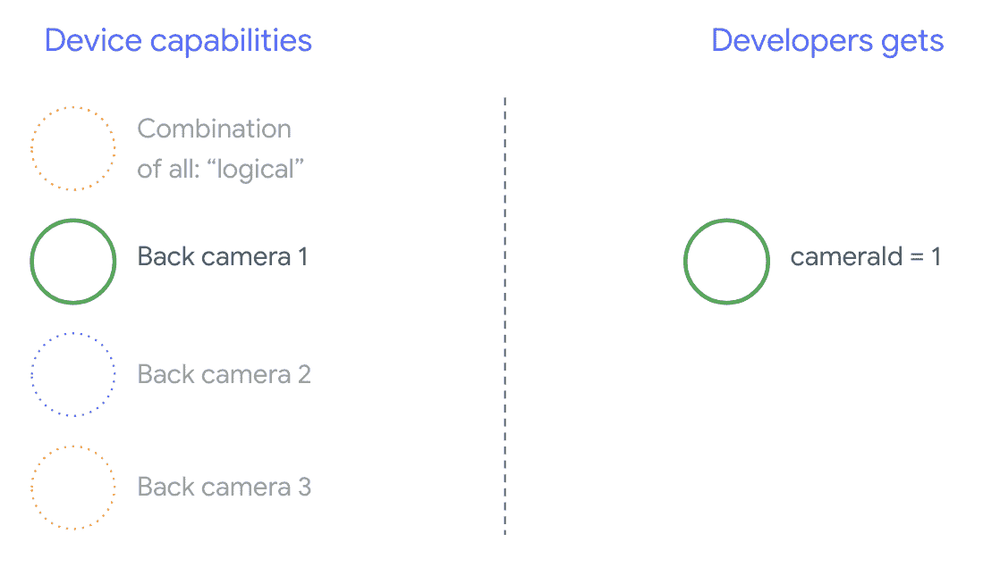
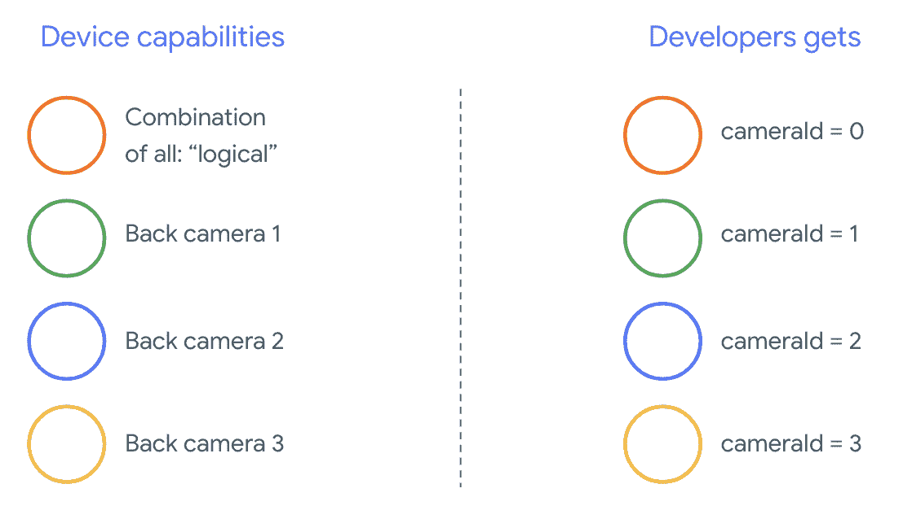
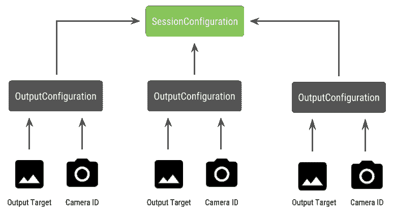

# 充分利用新的多摄像头 API

> 原文：<https://medium.com/androiddevelopers/getting-the-most-from-the-new-multi-camera-api-5155fb3d77d9?source=collection_archive---------1----------------------->

这篇博客文章补充了我们的 [Android 开发者峰会 2018 谈话](https://youtu.be/u38wOv2a_dA)，该谈话是与 Android 相机项目经理 Vinit Modi 和合作伙伴开发者关系团队的 Emilie Roberts 合作完成的。查看我们之前的系列博文，包括[相机枚举](/androiddevelopers/camera-enumeration-on-android-9a053b910cb5)、[相机捕捉会话以及同时使用多个相机流的请求](/androiddevelopers/understanding-android-camera-capture-sessions-and-requests-4e54d9150295)和[。](/androiddevelopers/using-multiple-camera-streams-simultaneously-bf9488a29482)

# 多摄像机用例

多摄像头是随着 [Android Pie](https://developer.android.com/about/versions/pie/android-9.0#camera) 推出的，自几个月前推出以来，我们现在看到市场上出现了支持 API 的设备，如谷歌 Pixel 3 和华为 Mate 20 系列。许多多摄像机用例与特定的硬件配置紧密相关；换句话说，并非所有的用例都与每种设备兼容——这使得多摄像头功能成为模块动态交付的绝佳候选。一些典型的使用案例包括:

*   变焦:根据裁剪区域或所需的焦距在相机之间切换
*   深度:使用多个相机构建深度图
*   散景:使用推断的深度信息来模拟类似 DSLR 的窄聚焦范围

# 逻辑和物理摄像机

要理解多摄像头 API，首先要理解逻辑摄像头和物理摄像头的区别；这个概念最好用一个例子来说明。例如，我们可以将一个有三个后置摄像头而没有前置摄像头的设备作为参考。在这个例子中，三个背部摄像机中的每一个都被认为是一个*物理摄像机*。一个*逻辑摄像机*则是两个或更多物理摄像机的组合。逻辑相机的输出可以是来自底层物理相机之一的流，或者同时来自多个底层物理相机的融合流；无论哪种方式都由摄像机 HAL 处理。

许多手机制造商还开发他们的第一方相机应用程序(通常预装在他们的设备上)。为了利用硬件的所有功能，他们有时会使用私有或隐藏的 API，或者从驱动程序实现中获得其他应用程序无权访问的特殊待遇。一些设备甚至通过提供来自不同物理摄像机的融合帧流来实现逻辑摄像机的概念，但同样，这仅可用于某些特权应用。通常，只有一个物理摄像机会暴露在框架中。在 Android Pie 之前，第三方开发者的情况如下图所示:

Camera capabilities typically only available to privileged applications

从 Android Pie 开始，一些事情发生了变化。首先，[私有 API 不再适用于安卓应用。其次，随着框架中包含](https://developer.android.com/about/versions/pie/restrictions-non-sdk-interfaces)[多摄像头支持](https://source.android.com/devices/camera/multi-camera)，Android 一直[强烈建议](https://source.android.com/compatibility/android-cdd#7_5_4_camera_api_behavior)手机制造商为所有面向同一方向的物理摄像头暴露一个逻辑摄像头。因此，这是第三方开发者在运行 Android Pie 和更高版本的设备上应该看到的内容:

Full developer access to all camera devices starting in Android P

值得注意的是，逻辑相机提供什么完全取决于相机 HAL 的 OEM 实现。例如，像 Pixel 3 这样的设备以这样一种方式实现其逻辑相机，即它将基于所请求的焦距和裁剪区域来选择其物理相机之一。

# 多摄像头 API

新的 API 增加了以下新的常量、类和方法:

*   `CameraMetadata.REQUEST_AVAILABLE_CAPABILITIES_LOGICAL_MULTI_CAMERA`
*   `CameraCharacteristics.getPhysicalCameraIds()`
*   `CameraCharacteristics.getAvailablePhysicalCameraRequestKeys()`
*   `CameraDevice.createCaptureSession(SessionConfiguration config)`
*   `CameraCharactersitics.LOGICAL_MULTI_CAMERA_SENSOR_SYNC_TYPE`
*   `OutputConfiguration` & `SessionConfiguration`

由于对 Android CDD 的改变，多摄像头 API 也带来了开发者的一些期望。双摄像头设备在 Android Pie 之前就已经存在，但同时打开多个摄像头需要反复试验；Android 上的多摄像头现在给了我们一套规则，告诉我们什么时候可以打开一对物理摄像头，只要它们是同一个逻辑摄像头的一部分。

如上所述，我们可以预计，在大多数情况下，使用 Android Pie 的新设备将会暴露所有物理摄像头(除了更奇特的传感器类型，如红外摄像头)以及更容易使用的逻辑摄像头。此外，非常关键的是，我们可以预期，对于保证工作的每个流组合，属于逻辑摄像机的一个流可以被来自底层物理摄像机的两个流**替换。让我们用一个例子更详细地介绍一下。**

# 多个流同时

在我们的上一篇博文中，我们详细介绍了在一台相机中同时使用多个视频流的[规则。完全相同的规则适用于多台摄像机，值得注意的是在](/androiddevelopers/using-multiple-camera-streams-simultaneously-bf9488a29482)[文档](https://developer.android.com/reference/android/hardware/camera2/CameraMetadata#REQUEST_AVAILABLE_CAPABILITIES_LOGICAL_MULTI_CAMERA)中有所解释:

> 对于每个保证的流组合，逻辑摄像机支持用相同大小和格式的两个物理流替换一个逻辑 [YUV_420_888](https://developer.android.com/reference/android/graphics/ImageFormat.html#YUV_420_888) 或原始流，每个物理流来自单独的物理摄像机，假设两个物理摄像机都支持该大小和格式。

换句话说，YUV 或 RAW 类型的每个流可以用两个相同类型和大小的流来替换。例如，对于单摄像头设备，我们可以从以下保证配置的摄像头流开始:

*   流 1: YUV 类型，来自逻辑摄像机的最大大小` id = 0 '

然后，支持多摄像头的设备将允许我们创建一个会话，用两个物理流替换逻辑 YUV 流:

*   流 1: YUV 类型，来自物理相机的最大尺寸` id = 1 '
*   流 2: YUV 类型，来自物理相机的最大尺寸` id = 2 '

诀窍在于，当且仅当这两个相机是逻辑相机分组的一部分时，我们可以用两个等效的流来替换 YUV 或 RAW 流，即列在[camera characteristics . getphysicalcameraids()](https://developer.android.com/reference/android/hardware/camera2/CameraCharacteristics#getPhysicalCameraIds())下。

另一件要考虑的事情是，该框架提供的保证仅仅是同时从多个物理相机获取帧所需的最低要求。我们可以期待在大多数设备中支持额外的流，有时甚至允许我们独立打开多个物理相机设备。不幸的是，由于这不是框架的硬性保证，这样做将需要我们通过反复试验来执行每个设备的测试和调优。

# 使用多个物理摄像机创建会话

当我们在支持多相机的设备中与物理相机交互时，我们应该打开单个 [CameraDevice](https://developer.android.com/reference/android/hardware/camera2/CameraDevice) (逻辑相机)并在单个会话中与之交互，这必须使用自 SDK 级别 28 起可用的 API[camera device . createcapturesession(session configuration config)](https://developer.android.com/reference/android/hardware/camera2/CameraDevice#createCaptureSession(android.hardware.camera2.params.SessionConfiguration))来创建。然后，[会话配置](https://developer.android.com/reference/android/hardware/camera2/params/SessionConfiguration)将有多个[输出配置](https://developer.android.com/reference/android/hardware/camera2/params/OutputConfiguration)，每个配置将有一组输出目标，以及可选的所需物理摄像机 ID。

SessionConfiguration and OutputConfiguration model

稍后，当我们分派一个捕获请求时，该请求将有一个与之相关联的输出目标。该框架将基于该请求附加了什么输出目标来确定该请求将被发送到哪个物理(或逻辑)摄像机。如果输出目标对应于作为[输出配置](https://developer.android.com/reference/android/hardware/camera2/params/OutputConfiguration)连同物理摄像机 ID 一起发送的输出目标之一，则该物理摄像机将接收并处理该请求。

# 使用一对物理摄像机

多摄像头的摄像头 API 中最重要的面向开发人员的新增功能之一是识别逻辑摄像头并找到其背后的物理摄像头的能力。现在，我们知道可以同时打开物理摄像机(同样，通过打开逻辑摄像机，并作为同一个会话的一部分)，并且合并流的规则也很清楚，我们可以定义一个函数来帮助我们识别可用于替换其中一个逻辑摄像机流的潜在物理摄像机对:

物理摄像机的状态处理由逻辑摄像机控制。因此，要打开我们的“双摄像头”，我们只需打开与我们感兴趣的物理摄像头相对应的逻辑摄像头:

到目前为止，除了选择打开哪个摄像机之外，与我们过去打开任何其他摄像机所做的相比，没有什么不同。现在是时候使用新的[会话配置](https://developer.android.com/reference/android/hardware/camera2/params/SessionConfiguration) API 创建一个捕获会话了，这样我们可以告诉框架将某些目标与特定的物理摄像机 id 相关联:

在这一点上，我们可以回头参考一下[的文档](https://developer.android.com/reference/android/hardware/camera2/CameraDevice.html#createCaptureSession%28android.hardware.camera2.params.SessionConfiguration%29)或者我们[以前的博客文章](/androiddevelopers/using-multiple-camera-streams-simultaneously-bf9488a29482)来了解支持哪些流的组合。我们只需要记住，这些是针对单个逻辑摄像机上的多个流的，并且兼容性扩展到使用相同的配置，并用来自属于同一逻辑摄像机的两个物理摄像机的两个流来替换其中一个流。

随着[摄像机会话](https://developer.android.com/reference/android/hardware/camera2/CameraCaptureSession)准备就绪，剩下要做的就是发送我们想要的[捕获请求](https://developer.android.com/reference/android/hardware/camera2/CaptureRequest)。捕获请求的每个目标将从其关联的物理摄像机(如果有的话)接收数据，或者退回到逻辑摄像机。

# 缩放示例用例

为了将所有这些联系到最初讨论的用例之一，让我们看看如何在我们的相机应用程序中实现一项功能，以便用户可以在不同的物理相机之间切换，以体验不同的视野，有效地捕捉不同的“缩放级别”。

Example of swapping cameras for zoom level use-case (from [Pixel 3 Ad](https://www.youtube.com/watch?v=gJtJFEH1Cis))

首先，我们必须选择一对我们希望允许用户在其间切换的物理摄像机。为了获得最佳效果，我们可以搜索分别提供最小和最大可用焦距的一对相机。这样，我们选择一个能够聚焦在最短距离上的摄像设备和另一个能够聚焦在最远距离上的摄像设备:

一个明智的架构是有两个[表面视图](https://developer.android.com/reference/android/view/SurfaceView)，每个流一个，在用户交互时交换，这样在任何给定时间只有一个可见。在下面的代码片段中，我们演示了如何打开逻辑摄像机、配置摄像机输出、创建摄像机会话和启动两个预览流；利用之前定义的功能:

现在我们需要做的就是为用户提供一个 UI 来在两个界面之间切换，比如一个按钮或者双击`SurfaceView`；如果我们想变得有趣，我们可以尝试执行某种形式的场景分析，并在两个流之间自动切换。

# 透镜畸变

所有的镜头都会产生一定程度的失真。在 Android 中，我们可以使用 [CameraCharacteristics 查询镜头造成的失真。镜头失真](https://developer.android.com/reference/android/hardware/camera2/CameraCharacteristics#LENS_DISTORTION)(取代了现在已经废弃的[相机特性。镜头 _ 径向 _ 扭曲](https://developer.android.com/reference/android/hardware/camera2/CameraCharacteristics#LENS_RADIAL_DISTORTION)。对于逻辑相机，有理由期望失真最小，我们的应用程序可以或多或少地使用来自相机的帧。然而，对于实体相机，我们应该期待潜在的非常不同的镜头配置——尤其是在广角镜头上。

一些设备可以通过[捕获请求实现自动失真校正。失真 _ 校正 _ 模式](https://developer.android.com/reference/android/hardware/camera2/CaptureRequest#DISTORTION_CORRECTION_MODE)。知道大多数设备的失真校正默认是打开的是很好的。文档中有一些更详细的信息:

> 快速/高质量都意味着将应用相机设备确定失真校正。HIGH_QUALITY 模式表示相机设备将使用最高质量的校正算法，即使它会降低捕获速率。快速意味着相机设备在应用校正时不会降低捕获速率。如果任何校正都会降低捕获速率，则 FAST 可能与 OFF 相同[…]该校正仅适用于 YUV、JPEG 或 DEPTH16 等已处理的输出[…]在支持此控件的设备上，此控件将默认打开。

如果我们想以最高的质量拍摄一张静态照片，那么我们应该尝试将校正模式设置为 HIGH_QUALITY(如果它可用的话)。下面是我们应该如何设置我们的捕获请求:

请记住，在此模式下设置捕捉请求会对相机产生的帧速率产生潜在影响，这就是为什么我们只在静态图像捕捉中设置失真校正。

# 待续

唷！我们讨论了一系列与新的多摄像头 API 相关的内容:

*   潜在的使用案例
*   逻辑摄像机与物理摄像机
*   多摄像头 API 概述
*   打开多个摄像机流的扩展规则
*   如何为一对物理摄像机设置摄像机流
*   示例“变焦”用例交换摄像机
*   校正镜头失真

请注意，我们还没有介绍帧同步和计算深度图。这是一个值得在自己的博客上发表的话题🙂