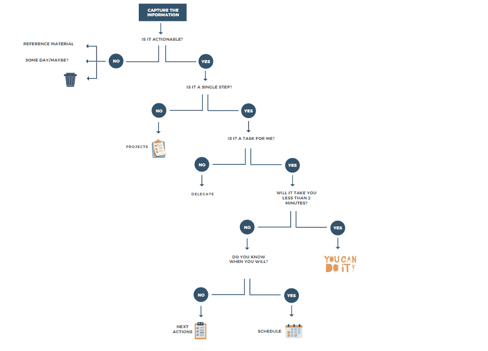

# 把事情做完，这是一种有助于自我组织的技巧

> 原文：<https://medium.com/globant/getting-things-done-a-technique-that-helps-to-self-organize-1c8d8bf2282b?source=collection_archive---------1----------------------->

马。洛雷托·阿里亚加达/罗伯特·科赫

在过去的一年里，考虑到工作方式的变化，找到有效的组织方法变得很有必要，比如个人看板、子弹日记、完成任务(GTD)等等。

我们在家里工作并不新鲜，工作已经侵入了我们的日常空间，并与日常事务混为一体。在这种情况下，我们需要找到一种合适的方法来帮助我们不感到超载，分清主次，并且不忘记我们应该做什么。

一年前，我们听到有人在说“把事情做好”，觉得很有意思。我们上了正式课程，然后付诸实践。

# **一点理论，这个 GTD 从何而来？**

把事情做完是大卫·艾伦开发的一种管理活动的方法。GTD 的基本原则是，一个人需要将待办事项放在一个特定的地方，从而将自己的思想从待办事项中解放出来。GTD 有 5 个基本步骤:捕捉、清理、组织、反思和运行。

除此之外，为了澄清，GTD 推荐这 5 个主要列表，然而，随着系统的发展，更多的列表会出现。没有一个清单会永远有效。

1.  收件箱。
2.  下一步行动。
3.  等候名单。
4.  项目列表。
5.  某天/也许会列出。

# **捕获**

应用 GTD 的第一步叫做精神清扫，包括给自己时间清空一切。我们怎么做呢？捕捉信息。

你可以找到最合适的方式来捕捉信息。有些人使用笔记本、一些应用程序、便利贴等，然而，最重要的是以某种方式获取信息，并且它是你的可靠来源。

*“如果你有什么想法，就把它写下来，或者用某种具体的方式记录下来。你如何捕捉这些想法并不重要，只要你把它们从你的脑海中赶走，让它们都容易被你获得，你的回顾*。(大卫·艾伦)

**危险**:相信自己必须立刻做好每一件事。尝试找到完美的工具来开始。

# **清除掉**

这是 GTD 的一个战略步骤，你决定一个项目是一个项目，下一个行动，还是参考。在这一步，你可以问自己接下来的问题:这是可行的吗？是单步吗？对我来说是任务吗？例如，如果您需要进行一项活动，并且该活动包括多个子任务，则该活动可以被归类为一个项目。如果活动只是一项任务，这是一个单独的步骤。

两分钟规则很棒，因为如果你有一项任务，而这项任务不到两分钟，GTD 说，立即去做。

建议澄清:

1.  尽可能经常地处理你的收件箱。
2.  一次处理一件事。
3.  两分钟规则是你最好的朋友，不要跳过它。
4.  为澄清任务留出时间。
5.  时间盒可以帮助你限制在单个任务中用于澄清的时间。
6.  保持项目列表的更新。
7.  委派任务。

**危险**:没有花时间彻底澄清。

# **组织**

当我们明确了主题，这个组织阶段就出现了。我们将每个主题放在各自的列表中(见图表)，然后给你的建议是将日期添加到你的日历列表中，以便不忘记承诺的日期，将项目委托给其他人，将参考资料归档，并经常对你的任务进行排序。这类似于整理你的工作空间，如果你没有整理好你的工作空间，你会开始丢失一些东西。

**危险**:我们的工作没有设定最后期限。

# **反映**

这一步对 GTD 来说是最重要的，我们为此专门开辟了一个空间。每周回顾是一个做回顾的机会，是时候思考过去的一周，反思什么进展顺利，什么不顺利，并为未来一周制定计划。

在开始的时候，这是相当困难的，需要练习，我们也在不断地检查我们的系统。如果没有，调整、改变、添加或删除那些让你感到困惑或没有给你增加价值的清单。

危险:不要让我们的系统随着时间而进化

# **运行**

在 GTD 方法中，你使用**四个标准**来决定下一步做什么:**上下文**、**可用时间**、**可用能量、**和**优先级**。

这时你可以用 GTD 方法工作，一般的建议是你需要*保持简单。*

**

# ***每周回顾:一个贯彻 GTD 的行为***

*在我的经验中，**每周回顾**是 GTD 方法论的核心实践。*

*它有助于:*

*-逐步组织和完善整个系统；*

*-把我所有的输入归零，*

*-阐明我需要用全局眼光做的事情。*

*我该怎么做？我有一份清单。我每周五下午 3 点复习这个每周清单。对于清单上的每一项，我都会:*

*-捕捉所有的“输入”(文件、电子邮件、Whatsapp)，同时将所有的想法从我的大脑中清除。*

*-检查“下一步行动”列表、所有“项目”列表、我上周和下周的日历以及我的“等待”列表；试着找出每张单子上的下一步该做什么。*

*-查看我的“将来某一天”清单，以防有什么相关的事情，现在就做，或者干脆扔掉。*

*-对我的系统进行一些改进(添加标签、简化列表、丢弃不相关的内容等等)。*

***危险**:你要做的第一件事就是每周执行**每周回顾**:选择一天，在你的日程中添加一个提醒，然后去做；不管你是否检查了整个清单。不要期待完美的**每周评论**。一个*好的*一个就够了。不要跳过它。即使你只检查了清单的 10%,也要这样做。*

*最后，GTD 是一种方法论，它已经有几年的历史，并且在不同的博客和论坛上分享了经验教训，所以我们对它并不陌生。只是因为需要找到一种组织任务的方法，才让我们去研究 GTD，去理解它，并且能够更好地应用它。开始的时候非常困难，正如我们已经提到的，这需要毅力和不跳过基本步骤。GTD 会帮助我们吗？答案是肯定的，我们邀请您尝试一下，看看您能与我们分享哪些经验。每个人都是不同的，没有单一的方法，但通过遵循提示和图表，有可能做出有效的实施。*

*你可以在[https://gettingthingsdone.com/](https://gettingthingsdone.com/)找到更多信息*