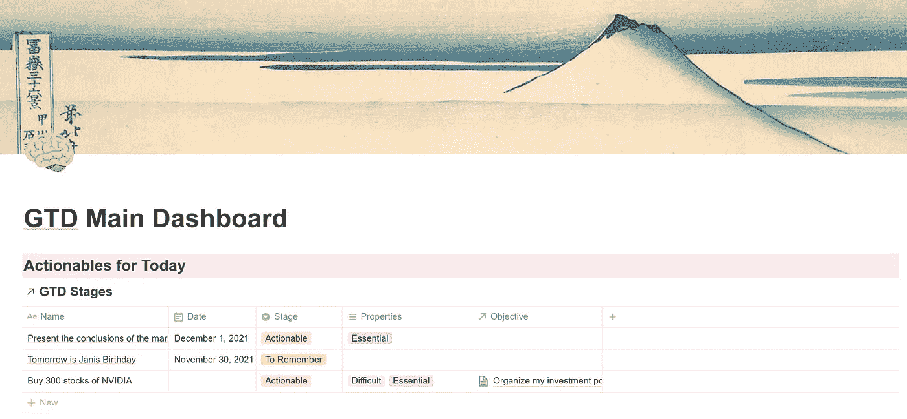

# 以 DevOps 的思维方式做事。所以仪表板

> 原文：<https://medium.com/globant/getting-things-done-for-a-devops-mindset-in-a-notion-so-dashboard-2b0a099d2042?source=collection_archive---------1----------------------->

在这篇文章中，我将揭露一个关于 GTD 的特殊观点，以及这种方法如何与 DevOps 心态相匹配。

# 什么是 GTD？

GTD 是“把事情做完”的首字母缩写，这是一种曾经更有效率的技术。GTD 是由他的作者大卫·艾伦在 2001 年出版的《完成工作:无压力生产力的艺术》一书中介绍的。

我们的大脑在解决问题和想象事物方面非常出色，但在记忆和记忆方面却是一个糟糕的工具。如果你的大脑中有你的议程，你需要知道你的大脑是紧张的，人类的大脑不能组织和维持一个任务纲要；我们不是电脑。你需要解压缩你的大脑来获得快乐，然后你需要对那些占据你大脑的任务做些什么，以便在不丢失它们的同时忘记它们。

> 有了 GTD，你可以组织你的生活，专注于推动你完成目标的重要任务。

GTD 可以帮助你发现机会，并抛弃那些无关紧要、耗费你时间的任务。你可以用这个技巧来获得空闲时间，以便把它投入到重要的任务中，并把你的日程安排在相关的任务上。

# DevOps 是什么？

DevOps 是一种信息技术实践，它寻求公司中开发和运行软件的不同领域之间的协作。像网飞、Instagram 和谷歌这样的大公司在开发软件时都会使用某种形式的 DevOps。

在 DevOps 中，我们认为技术是用来用自动化任务取代手工任务的，因此我们节省了空闲时间，并将这些时间用于创新。这是我们的心态，也是指导我们行动的文化的一部分。

作为任何现代 IT 专业人员，我们的工作生活充满了任务，我们需要组织一天，以改善我们的工作。

> **GTD 是开发人员心态的完美方法**

## “管道”

DevOps 中的主要技术元素是*管道*。流水线只是软件构建的一系列*阶段*，通常每个阶段可以应用一个或多个任务。

例如，当构建软件时，我们在管道中实现各种类型的阶段:

*   构建软件:由开发人员编码后，软件被构建，然后一个新的工件(可执行文件)存在。
*   测试软件:我们对新软件执行各种类型的测试，每个测试可以是流水线中的不同阶段。
*   部署:我们将新软件移动到它将被执行的地方。可能在云中，也可能在数据中心的服务器中。

显然，这是一种简化，我们的管道通常是有许多阶段的复杂过程。

我们使用各种工具来执行管道，在这种情况下(GTD ),工具是仪表板。

> 管道是执行不同任务的一系列阶段。我们可以打个比方，将流水线概念应用于 GTD 方法。

# 我的 GTD 管道

我用一种特殊的方法来做 GTD，但是精髓就在那里。我的 GTD 仪表板是在*概念中实现的，所以*，我将在下一篇文章中详细教你如何做。

这个仪表板告诉我今天要做什么，记住我的事情，告诉我明天的任务，告诉我需要改进或分类的任务。

> C 靠在我的仪表板上驱使我去实现我的目标

## **我有“*阶段”*和“目标”作为我的模型的两个重要部分**

*   目标:我把任何我想完成的想法登记为目标。例如，目标不能是“变得富有”，而是更准确的说法，比如“组织我的投资组合，以便在科技、食品行业和旅游业之间进行多元化投资”。发现完成每个目标所需的任务是很重要的。
*   *阶段*:各项任务的情况。每个阶段都决定了你必须完成的任务。

## **任务的阶段**

*   *未分类/收件箱*:这是任何任务或想法的起点，我想到的一切都应该从这个阶段开始。收件箱就像一个盒子，所有的任务都在里面等待被组织和分类。
*   *可执行的*:在这个阶段，具体的任务属于，我必须在今天或者在预先确定的日期完成。
*   *也许有一天*:那些需要细化的任务，我不知道什么时候开始，甚至可能我从来没有开始过那些任务。这些任务不是我主要目标的重要部分，但我需要在未来的某一天做这些任务。
*   *记住*:只是一个记住我一些东西的任务。这是不可操作的，因为没有行动来完成。“记住今天是詹妮斯的生日”可能是该任务的*记住*阶段，但“记住给詹妮斯买礼物”不是，这是该任务的*可操作*阶段，“给詹妮斯买礼物”应该是正确的阶段。
*   *只是一个想法*:处于构思阶段而没有完全成型的任务。也许我不知道如何或何时完成这些任务，也许这个任务会在我人生的第一个新目标中转变。
*   *垃圾桶*:这个阶段的一个任务被丢弃，我需要删除它。
*   *完成*:已经做好的任务。

> **您可以在阶段**之间自由移动任务**，但通常它们在流水线中遵循一个逻辑顺序**

**流动的“管道”，我周期性的做什么。**

1.  我查看我的收件箱，对所有的任务进行分类，这是一个核心活动，解释如下。例如，你可以一周做一次。
2.  我做我必须做的那些*可操作*的任务，我选择一个任务并完成它，当完成时，我将它发送到*完成*阶段。我每天都这样做。显然，如果我不完成*可操作的*任务，这一切都没有意义。
3.  我记得与*相关的事情记得*阶段，然后我就把任务送到*完成了*。当我想起某件事时，如果需要的话，我可以在*收件箱*中写一个新的相关任务。
4.  我会思考*只是一个想法*阶段的任务:我能利用这些任务做些什么吗？也许，我应该把它们中的一些转换成目标，还是继续作为想法？
5.  我在*也许有一天*阶段分析任务。我问自己是否准备好对每一封邮件做些什么，如果是，我会将它发送到*收件箱*阶段。

**任务的分类处于** *未分类/收件箱* **阶段**

所有浮现在我脑海中的任务都进入*未分类*(或*收件箱*)阶段，以便立即忘记它们，释放对我记忆任何任务产生的压力。

一周一到两次，我会留出时间对这一阶段的任务进行分类，将每一项任务推进到一个新的阶段。

> 我的目标是每次完成这个分类后清空收件箱。

有不同的方法来对任务进行分类，例如[艾森豪威尔矩阵](https://en.wikipedia.org/wiki/Time_management#The_Eisenhower_Method)。但是 GTD 每一个都遵循一条简单的道路，我把它改造成适合我的东西，你也可以做同样的事情。

## **未分类阶段如何分类**

在这个阶段，我对每个任务都遵循以下规则:

1.  我问自己这个任务是否可行。也就是说，如果我具备了完成任务所需的所有要素，如果是这样，那么我就把它推进到可操作阶段。
2.  如果任务是可行的，但我今天没有足够的时间(或任何其他元素)来完成它，那么我会指定一个到期日，以便将它安排在我应该有时间的一天。或者，任务已经有了截止日期。
3.  我不能完成任务是因为我没有足够的资源(或精力)或者我的一天很拥挤，或者为了完成我的目标它可能不重要，然后，我把它移到“*也许有一天”*阶段。这样，我就不会因为需要完成但不是现在的任务而紧张，然后，我可以把它委托给“明天的自己”。重要的是不要滥用这个阶段。
4.  这项任务是简单的任务，还是为了实现全球目标的一系列任务的一部分？如果是这样，我会将它添加到现有的“目标”中，或者在我的仪表板中创建一个新的目标(有人称之为“项目”)，我会将该任务作为该目标的一部分进行分配(稍后将详细介绍目标)。我做所有这些分析是为了将任务分类，不管它是不是目标的一部分，都没关系。
5.  任务如此之短，以至于对其进行分类并遵循管道的工作比执行任务的工作更大，然后，我只需完成任务并将其移动到 *Done* 阶段。
6.  我可以委派任务吗？如果是这样，那么我委托它，将任务分配给一个*记忆阶段*并调度它。我的目标是记住去完成委派的任务。

> 显然，如果你有一个仪表盘，显示你需要完成每项任务的精确时刻和阶段，所有这些都是有意义的

## 目标

**完成我的目标是遵循这种方法的原因，这是我发现成功、生活进步和更快乐的方法。**

以前，我会在半夜醒来，想着一项任务或第二天不想忘记的事情。现在，我将一天的组织工作委托给仪表板。我相信我的仪表板会告诉我需要做些什么来完成我的目标。

我按顺序组织每个目标和完成目标需要完成的任务。我认为有些目标比其他目标更重要，例如，保持健康比你的爱好更重要。

> 发现和组织目标是思考我想要什么样的生活的时刻。

仪表板必须按顺序向我显示目标，以及我必须完成的任务和每个任务的阶段。只要看着仪表板上的任务，我就知道我在追求哪个目标。

## 任务属性

有时，为每个任务分配属性以进行分类是很有用的。我只使用两种类型的属性:

*   困难:困难或容易，为了衡量我需要投入到任务中的努力和精力。
*   重要性:必要的或不必要的。当你对任务进行分类时，知道它有多重要是很有用的。很明显，重要的还是早点关闭比较好。

## 后续步骤

如前所述，我在*idea . so*的仪表板中实现了这个管道。这是一个很棒的工具，但你也可以用你知道的任何其他工具来做，例如，人们在类似 Excel 的工具中开发仪表板，或者在 *Google Docs* 或 *Todoist* 、 *Evernote* 中的工具组合中开发仪表板。

也许你想自动化一些任务，[想法。所以](https://www.notion.so/)没有自动化作为其工具的一部分，但你可以使用 Integromat.com 或类似的工具[来完成。](https://www.integromat.com/)

在下一篇文章中，我将向您展示如何在*概念中开发仪表板。*

# 参考

 [## 完成任务-维基百科

### 《把事情做完》( GTD)是大卫·艾伦开发的一个个人效率系统，出版在一本关于…

en.wikipedia.org](https://en.wikipedia.org/wiki/Getting_Things_Done) 

一个视频系列，向您展示如何在 idea . so 中创建仪表板(西班牙语):

阿拉塔学院对 GTD 的解释(西班牙语)