# 了解 Oracle 自主区块链云服务—第 2 部分—使用 Chaincode 示例探索 OABCS

> 原文：<https://medium.com/oracledevs/getting-to-know-oracle-autonomous-blockchain-cloud-service-part-2-exploring-oabcs-using-b0513e248b4f?source=collection_archive---------1----------------------->

Oracle Autonomous block chain Cloud Service 包括 chaincode 示例，帮助您了解如何使用控制台来实施和管理您的网络的 chain code。OABCS 的示例链代码页包含两个示例:

**Example02 sample** 是一个简单的 chaincode 示例，代表拥有帐户余额的两方，以及查询余额和在双方之间转移资金的操作。

**弹珠示例**更加复杂，包括一个链码来创建弹珠，其中每个弹珠都有一个颜色和大小属性。您可以将弹球分配给所有者，并启用查询状态的操作，以及在所有者之间按名称或颜色交易弹球。

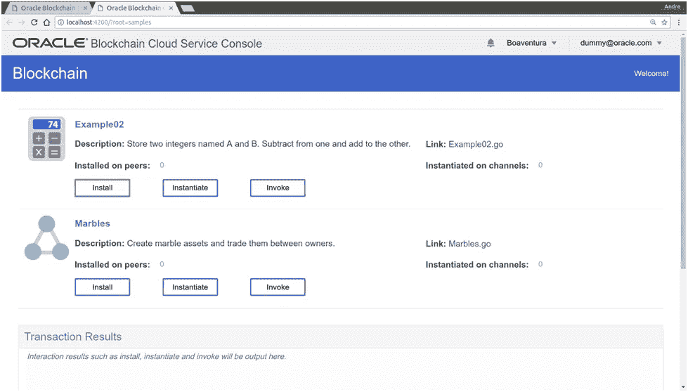

OBCS Console — Samples page

# OABCS 示例入门

您可以安装、实例化和调用 Oracle Autonomous block chain Cloud Service 中包含的示例链代码。使用以下步骤启动并运行示例链代码。

1.**进入区块链云服务控制台**http://<yourOABCSHostAddress>:<youroabsport>/

> **注意**:您的 **<和>** 以及 **<您的“活动”应该已经在您的 OABCS 实例的供应期间被创建。**请查看[**了解 Oracle 自主区块链云服务—第一部分**](/oracledevs/getting-to-know-oracle-autonomous-blockchain-cloud-service-working-with-provisioning-interface-fb3be5179daf) —使用供应接口了解更多详情。

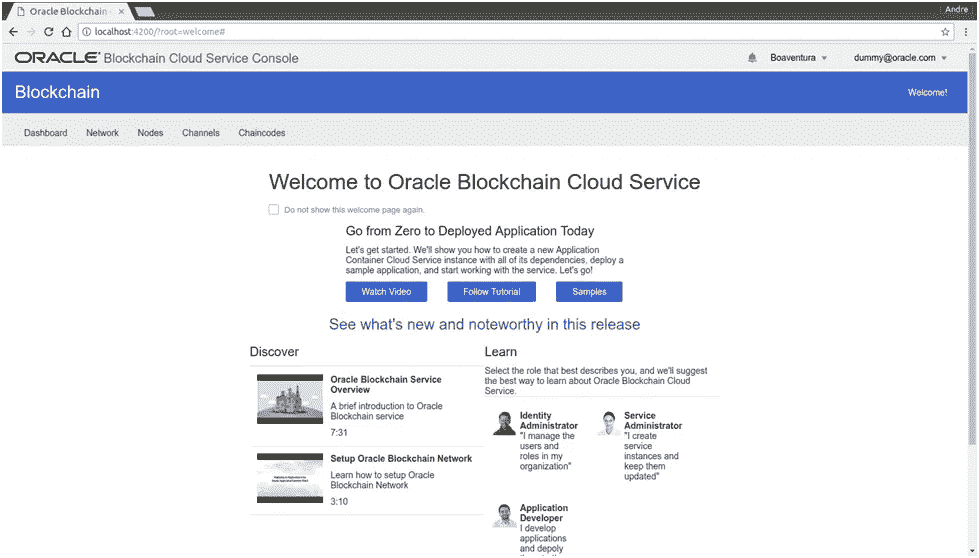

OBCS Console — Home page

2.**点击上面以红色突出显示的样品按钮**。区块链示例页面显示如下:

OBCS Console — Samples page

> **注**:您也可以通过访问以下网址找到示例页面**http://**<**yourOBCSHostAddress>:<youroabc sport>/？root=samples**

3.让我们从第一个样本开始(**例 02** )。因此，**为该示例单击相应的安装按钮**，这样您就可以选择要在其上安装示例链代码的对等点。将显示以下对话框:

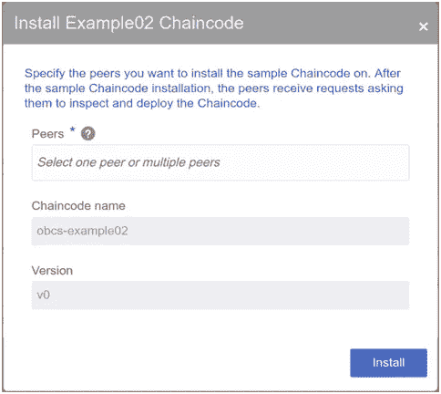

Installing Example02 Chaincode

4.在安装链码对话框中，**指定一个或多个对等体**来安装链码。保持链码名称和版本不变，然后**点击安装按钮**。

5.现在，您必须针对通道实例化您的链代码。因此，**点击链码的实例化按钮**。

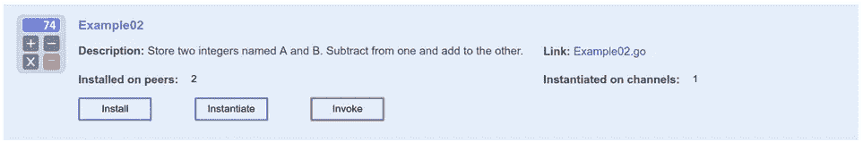

Instantiate Example02

将显示以下页面:

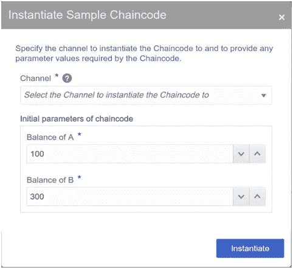

Instantiate Sample Chaincode

6.**选择您的频道名称**(在我的例子中是 **boaventuraorderer** ，或者任何其他名称，这取决于您在做第 2 课时向您的区块链网络提供的名称)，然后**单击“实例化”按钮。**保持链码的初始参数不变。

7.为了确认示例链代码被正确实例化，**转到 Channels 选项卡，并单击示例链代码绑定到的通道的名称**(本实验中的 **boaventuraorderer** )。更多详情见下图:

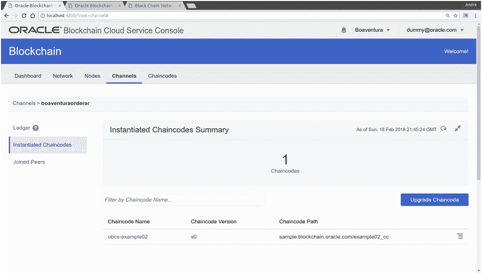

Verifying that Example02 was instantiated on Channels tab

8.此外，通过查看 samples 页面，您可以发现 **Example02** 已在通道上成功实例化。**因此，请访问样片页面:http://<yourOABCSHostAddress>:<youroabsport>/？root=samples** 按照下图查看以下信息，以确保示例在通道上正确实例化:

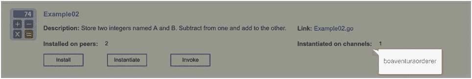

Verifying that Example02 was instantiated on samples page

9.此外，您可以使用分类帐区域来查找有关渠道上各个交易的信息。**分类帐摘要**表示发生了一次部署，如下图红色突出显示。

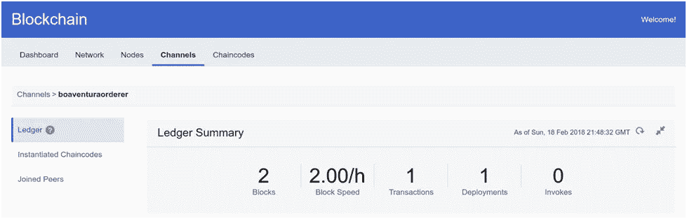

Verifying deployment on Ledger Summary

10.**在查询分类账表**中，定位表示实例化交易发生的块。**点击块**并确认在**交易表中，您看到“类型”栏中的“实例化”**。

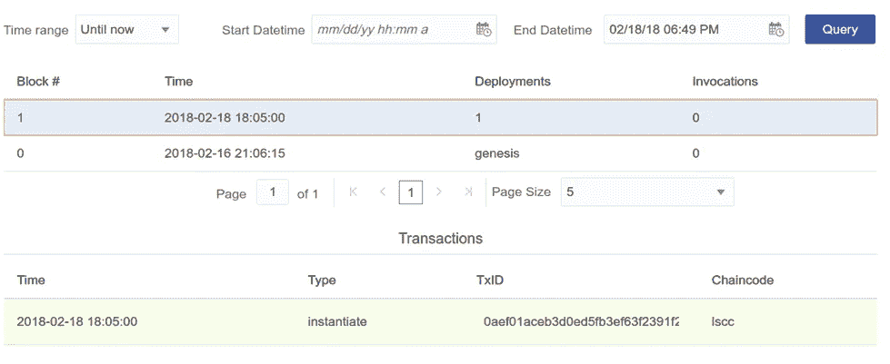

Verifying Deployment Transaction on Ledger Table

或者直接进入 Chaincodes 选项卡，找到安装在对等体上的 chain code ID**obcs-example 02(v 0)**并在 channel**boaventuraorderer**上实例化，如下图所示:

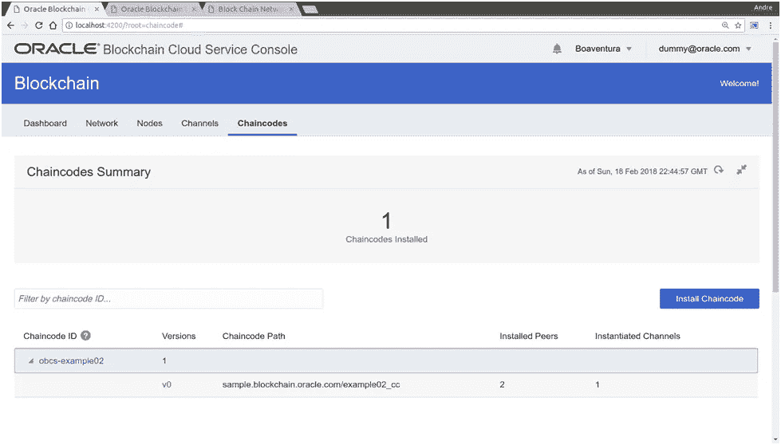

Verifying instantiation on Chaincodes Tab

> **注**:如果您在一个包含多个组织的网络上工作，并且已经在创建组织上实例化了链码，那么您不必在安装了相同链码的成员组织上实例化链码。在这种情况下，链码已经实例化并在成员组织上运行。为了方便起见，到目前为止，我们只提供了一个没有成员的创始人组织。稍后将进一步探讨更高级的场景，然后您将能够看到不同的拓扑结构，并探索如何设置一个具有多个组织的区块链网络。

11.在前面的所有步骤之后，如果到目前为止一切顺利，您应该准备好调用您的示例(Example02)。这样，**点击调用按钮**，如下图所示:

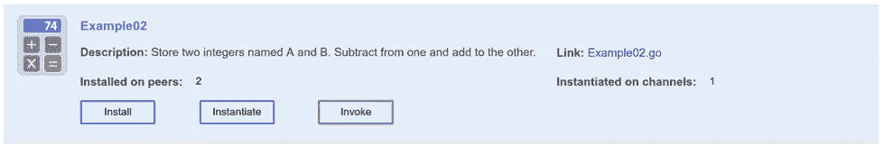

Invoking Example02 sample

12.将显示以下对话框:

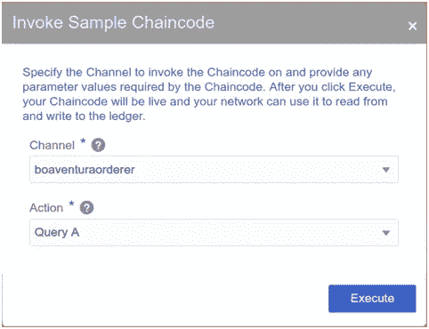

Invoke Sample Chaincode

13.在**调用链码**对话框中，**选择一个** **通道来运行(boaventuraorderer)** 上的事务。

14.在**动作字段**，**中指定一个动作来执行链码(查询 A)** 。

15.**点击执行**。交互结果显示返回值，API 详细信息字段显示从调用事务开始执行的所有区块链流程的详细日志。

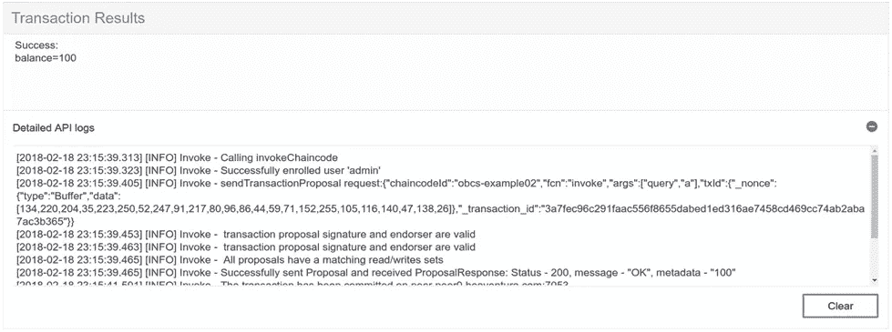

Transaction Results — Detailed API logs

为了确认成功调用了链码，请执行以下步骤:

16.**转到频道选项卡**。

17.找到并**点击安装了链码的频道(boaventuraorderer)** 。

18.然后，确认**分类帐窗格被选中**，在查询分类帐表中**定位到表示**发生调用的块号。**点击块**并确认在交易表中的类型栏中看到“invoke”。详情见下图:

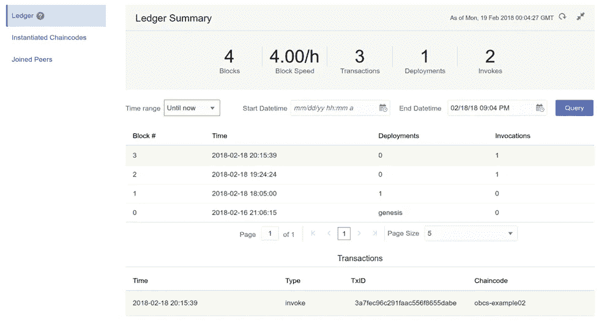

Ledger Transactions

19.或者，您可以转到样本页面并调用链码上的任何其他操作，如**“查询 B”、“从 A 转移到 B”、“从 B 转移到 C”、**，然后在分类帐窗格下的渠道选项卡中监控结果。

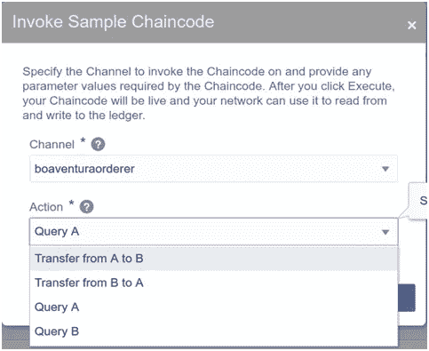

Invoking other Example02 actions

20.现在重复之前描述的相同步骤，**安装大理石样品**。

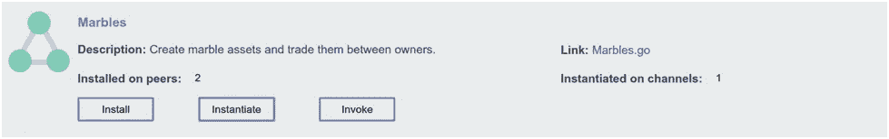

# 需要知道的事情

Chaincode 是运行区块链网络的代码，定义了交易期间写入的数据类型，提供了关于交易如何执行的逻辑，并验证了它们应该在什么条件下运行。Chaincode 通过应用程序提交的事务来初始化和管理分类帐状态。链码通常处理网络成员同意的业务逻辑，因此它有时也被称为“智能契约”。因此，您可以将链码视为在区块链之上运行的程序的术语，这些程序用于实现应用程序如何与分类帐交互的业务逻辑。当一个交易被提议时，它触发决定什么状态改变应该被应用到分类帐的链码。

此外，链码可以定义为定义 Hyperledger 结构中的一项或多项资产的软件，以及用于修改资产的交易指令。这些资产包括有形资产(房地产和硬件)和无形资产(合同和知识产权)。Hyperledger Fabric 提供了使用链码交易修改资产的能力。资产在 Hyperledger Fabric 中被表示为键值对的集合，状态变化被记录为通道分类帐中的事务。资产可以用二进制和/或 JSON 格式表示。

此外，它还负责建立存储在区块链账本上的对象类型，以及如何创建、修改、删除它们等。可以说，它负责维护分类账的“世界状态”。分类帐采用版本化的键/值映射的形式，其中键是字符串，值是二进制 blobs。该分类帐还维护与特定键相关联的值的完整历史，以便记录所有修改，并且如果用例需要，可通过链码检索。存储在分类帐中的值只能由 get 和 put 操作来操作，因此所有链码逻辑最终都必须导致或派生于对分类帐状态的一些系列的写和读。

【chaincode 看起来有多像

每个链代码实现一个 **Init** 方法和一个 **Invoke** 方法。第一个用于设置，第二个用于完成链码的主要工作。两种方法都接受一个 **ChaincodeStubInterface** 参数，该参数携带一个用于与分类帐交互和查询其他链码的客户端。

**ChaincodeStubInterface** 还保存了一个传递给 chaincode 的参数列表，这允许 chaincode 为不同的场景实现不同的行为。例如，单个链码可以实现多种功能。此外，stub 还提供了通过对 peer 的调用来访问历史、状态等的功能。

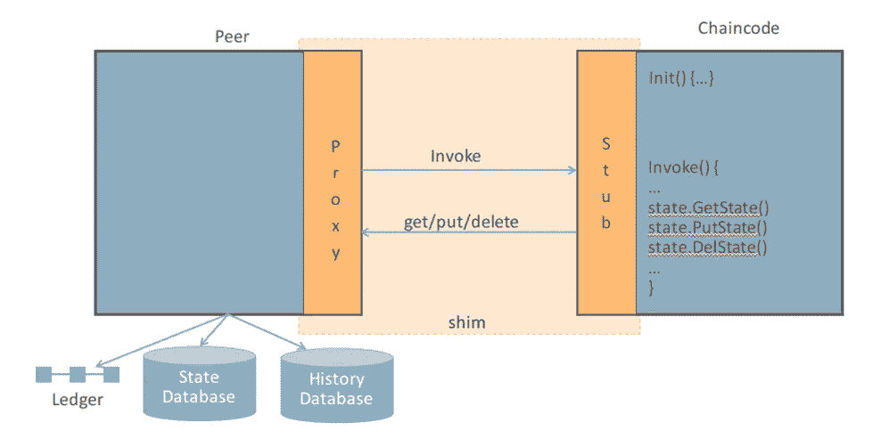

Peer Chaincode Relationship

下面你可以找到一个**链码存根接口函数**的列表(最常见的用粗体表示)

> GetArgs()[][]字节
> 
> GetStringArgs()[]字符串
> 
> **GetFunctionAndParameters()(string，[]string)**
> 
> GetArgsSlice()([]字节，错误)
> 
> GetTxID()字符串
> 
> InvokeChaincode(chain codename string，args [][]byte，channel string) pb。反应
> 
> **GetState(密钥字符串)([]字节，错误)**
> 
> **PutState(key string，value []byte)错误**
> 
> **DelState(密钥字符串)错误**
> 
> GetStateByRange(startKey，end key string)(statequeryeratorinterface，error)
> 
> GetStateByPartialCompositeKey(object type string，keys[]string)(statequeryeratorinterface，error)
> 
> CreateCompositeKey(对象类型字符串，属性[]字符串)(字符串，错误)
> 
> SplitCompositeKey(compositeKey 字符串)(字符串，[]字符串，错误)
> 
> GetQueryResult(查询字符串)(StateQueryIteratorInterface，错误)
> 
> **GetHistoryForKey(密钥字符串)(HistoryQueryIteratorInterface，错误)**
> 
> GetCreator()([]字节，错误)
> 
> get transient()(map[string][]byte，error)
> 
> get binding()([]字节，错误)
> 
> GetSignedProposal() (*pb。SignedProposal，错误)
> 
> GetTxTimestamp()(*时间戳。时间戳，错误)
> 
> **SetEvent(名称字符串，有效载荷[]字节)错误**

**特殊类型的链码(系统链码)**

有一种特殊的链码遵循不同的生命周期。系统链代码作为对等进程的一部分运行，而不是在单独的容器中运行。它用于实现低级别的分类帐功能，如背书系统、查询系统和验证系统。因为这些特性非常基本，所以实现它们的系统链码是在对等体启动时部署的(而不是像其他链码一样在以后动态添加)。

**查看示例 02 和弹珠链码**

现在，让我们回顾一下我们刚刚安装和实例化的例子中的 chaincode 源代码，以了解事情是如何完成的。因此，首先，您需要知道从哪里获取这些示例的源代码。可以在 http:// <youroabcshostaddress>: <youroabcsport>/？根=样本。让我们开始使用 Marbles.go 作为参考来理解链码结构。于是，**点击链接 Marbles.go** 如下图所示:</youroabcsport></youroabcshostaddress>

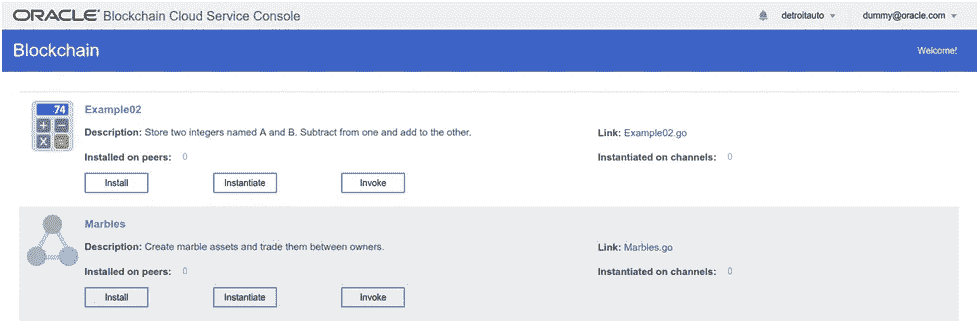

Marbles.go Link

或者，您可以通过访问以下链接**http://<yourOABCSHostAddress>:<youroabsport>/chain codes/marbles _ chain code . txt .**来访问 Marbles.go，因此，您应该会看到以下源代码:

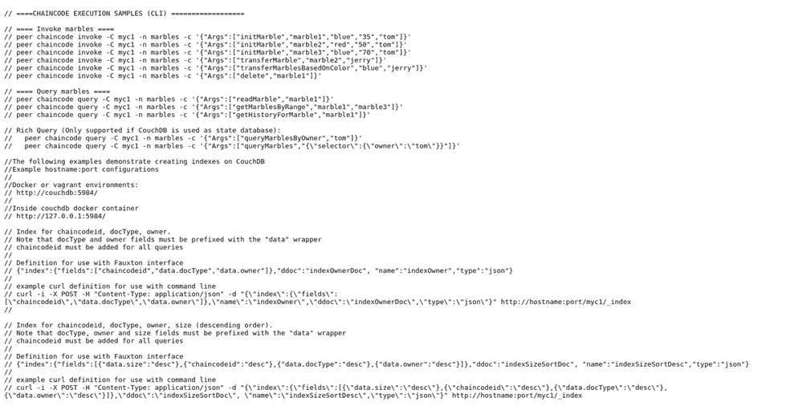

Marbles.go source code

可能最简单的方法是从上到下分解这个文件，依次解释每个重要的元素。因此，让我们首先从导入代码开始。

> 导入(
> 
> …
> 
> " github . com/hyperledger/fabric/core/chain code/shim "
> 
> " github . com/hyperledger/fabric/protos/peer "
> 
> )

这些是实现 chaincode 所需的包，shim 包是与分类帐交互的核心机制，并提供了用于生成 chaincode 响应的帮助方法。您从来没有真正直接接触过对等包，而是依赖于前面提到的 helper 方法。

现在，在 imports 部分之后，有一个名为“SimpleChaincode”的空结构定义和另一个名为“marble”的成员字段定义:

> 类型简单链码结构{
> 
> }
> 
> 大理石结构标牌
> 
> ObjectType 字符串` json:"docType " `
> 
> 名称字符串' json:"name " '
> 
> 颜色字符串' json:"color " '
> 
> Size int `json:"size " `
> 
> 所有者字符串' json:"owner " '
> 
> }

Go 是一种有点面向对象的语言，这个结构是实现

链码函数。如前所述，为了能够运行，Chaincode 必须实现两个特定的接口函数， **Init()和 Invoke()** 。这两个函数都需要一个**垫片。ChaincodeStubInterface** 作为单个参数，并返回一个**对等体。响应**。实现这个规定的接口就是将您的代码定义为“链码”的原因。

此外，这个链代码在 Init 定义之前有一个 main 方法，调用 shim。从 **SimpleChaincode** 对象的实例开始()。这用于在链码运行时启动链码。

> // ========================================
> 
> // Main
> 
> // ========================================
> 
> func main() {
> 
> 错误:= shim。开始(新(简单链码))
> 
> 如果 err！=零{
> 
> fmt。Printf("启动简单链码时出错:%s "，err)
> 
> }
> 
> }

现在我们来看链码特定函数的实现。请注意，这些函数通过定义中的'(t * SimpleChaincode)'与前面定义的 **SimpleChaincode** 对象相关联(如果来自更传统的基于类的语言，请将' t '视为' this ')。

> // Init 初始化链码
> 
> // ===========================
> 
> func(t * SimpleChaincode)Init(stub shim。ChaincodeStubInterface) pb。响应{
> 
> 返回垫片。成功(零)
> 
> }

**Init** 用于初始化链码，并进行任何初始分类帐设置。然而，每当链码升级时，它也会被调用，以允许对现有数据进行调整，从而适应新的数据结构或类似结构。如果没有迁移，Init 方法应该为空，就像这里一样，因为我们不想意外地覆盖分类帐中的数据。

> // Invoke —我们调用的入口点
> 
> // ========================================
> 
> func (t *SimpleChaincode)调用(存根填充程序。ChaincodeStubInterface) pb。响应{
> 
> 函数，参数:=存根。GetFunctionAndParameters()
> 
> fmt。Println("invoke 正在运行"+ function)
> 
> //处理不同的功能
> 
> if function = = " init marble " {//创建新的弹球
> 
> return t.initMarble(存根，参数)
> 
> } else if function = = " transfer marble " {//更改特定弹球的所有者
> 
> return t.transferMarble(存根，参数)
> 
> } else if function = = " transferMarblesBasedOnColor " {//转移某一颜色的所有弹珠
> 
> return t . transfermarblesbasedoncolor(存根，参数)
> 
> } else if function = = " delete " {//删除弹球
> 
> return t.delete(存根，参数)
> 
> } else if function = = " read marble " {//读取一个弹球
> 
> return t.readMarble(存根，参数)
> 
> } else if function = = " querymarblesboyowner " {//使用富查询为所有者 X 查找弹珠
> 
> return t.queryMarblesByOwner(存根，参数)
> 
> } else if function = = " query marbles " {//根据特定的丰富查询查找弹珠
> 
> return t.queryMarbles(存根，参数)
> 
> } else if function = = " getHistoryForMarble " {//获取弹球值的历史记录
> 
> return t.getHistoryForMarble(存根，参数)
> 
> } else if function = = " getMarblesByRange " {//基于范围查询获取弹珠
> 
> return t.getMarblesByRange(存根，参数)
> 
> }
> 
> fmt。Println("invoke 未找到 func:"+func)//错误
> 
> 返回垫片。错误(“收到未知函数调用”)
> 
> }

Invoke 是链代码的入口点，在每个事务中都被调用。shim 处理要调用的参数的绑定，并提供一个帮助器方法(GetFunctionAndParameters)来提取它们。通常，在提取函数之后，这将被用作 switch 语句的输入，以将控制传递给适当的函数，即来自 marble(其使用功能等效的链式‘if else’语句来代替开关):

> //处理不同的功能
> 
> if function = = " init marble " {//创建新的弹球
> 
> return t.initMarble(存根，参数)
> 
> }

> **注意** : GetFunctionAndParameters()只对字符串参数有效。如果使用其他对象类型，可以使用 GetArgs()并将参数作为字节数组处理。

现在，如果你看看你在本实验课前面调用 marbles chaincode 的方式，如下图所示

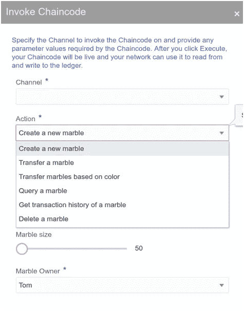

Marbles Chaincode actions available

您肯定会注意到有一个 go 函数来实现它。您可以在**调用**函数中找到它们的列表。此外，请在下面找到他们各自的声明供您参考。因此，如果您需要更改您的链码业务逻辑，请更改下面的函数，这些函数实现了更改分类帐中数据的规则。

> func(t * SimpleChaincode)**init marble**(stub shim。ChaincodeStubInterface，args []string) pb。反应
> 
> func(t * SimpleChaincode)**read marble**(stub shim。ChaincodeStubInterface，args []string) pb。反应
> 
> func (t *SimpleChaincode)删除(存根填充程序。ChaincodeStubInterface，args []string) pb。反应
> 
> func(t * SimpleChaincode)transfer marble(stub shim。ChaincodeStubInterface，args []string) pb。反应
> 
> func(t * SimpleChaincode)getMarblesByRange(存根 shim。ChaincodeStubInterface，args []string) pb。反应
> 
> func(t * SimpleChaincode)transferMarblesBasedOnColor(存根 shim。ChaincodeStubInterface，args []string) pb。反应
> 
> func(t * SimpleChaincode)querymarblesboyowner(存根 shim。ChaincodeStubInterface，args []string) pb。反应
> 
> func(t * SimpleChaincode)query marbles(存根填充程序。ChaincodeStubInterface，args []string) pb。反应
> 
> func getQueryResultForQueryString(存根填充程序。ChaincodeStubInterface，query string string)([]字节，错误)
> 
> func(t * SimpleChaincode)getHistoryForMarble(存根 shim。ChaincodeStubInterface，args []string) pb。反应

现在，您已经完成了对 chaincode 及其功能的介绍，并且对使用 chain codes(Hyperledger fabric 的一个关键组件)更加熟悉和自信，您可以转到下一篇文章，[通过 REST PROXY](/@aboavent.ab/getting-to-know-oracle-autonomous-blockchain-cloud-service-part-3-expose-and-run-deployed-d00bb1ea9cbc) 公开和运行部署的示例智能合同。

> *如果这篇文章有助于您了解区块链、Hyperledger Fabric & Oracle 自主区块链云服务，请为它鼓掌。请留下你的评论和反馈。这对帮助我继续写关于这类内容的新文章非常重要。*