# 了解 Oracle 自主区块链云服务——第 3 部分——通过 REST 代理公开和运行部署的示例智能合同

> 原文：<https://medium.com/oracledevs/getting-to-know-oracle-autonomous-blockchain-cloud-service-part-3-expose-and-run-deployed-d00bb1ea9cbc?source=collection_archive---------0----------------------->

在上一篇[文章](/@aboavent.ab/getting-to-know-oracle-autonomous-blockchain-cloud-service-part-2-exploring-oabcs-using-b0513e248b4f)中，您已经通过使用示例页面调用了针对通道(boaventuraorderer)安装和实例化的示例。然而，在现实世界中，您将作为 API 访问您的智能合约(链码)。这就是 REST 网关的用武之地。然后，在本文中，您将通过 OABCS REST 代理设置链代码作为 REST API 公开，然后使用 Oracle Autonomous block chain Cloud Service 中的一些关键 REST API 来调用智能合约。

# OABCS REST 代理入门

为了通过 REST 代理访问智能契约(OABCS 中的链码),您需要执行以下步骤:

1.**到**http://<yourOABCSHostAddress>:<youroabsport>/？根=节点

2.**高亮显示网关行**并点击该行右边的菜单图标，然后**选择编辑选项**

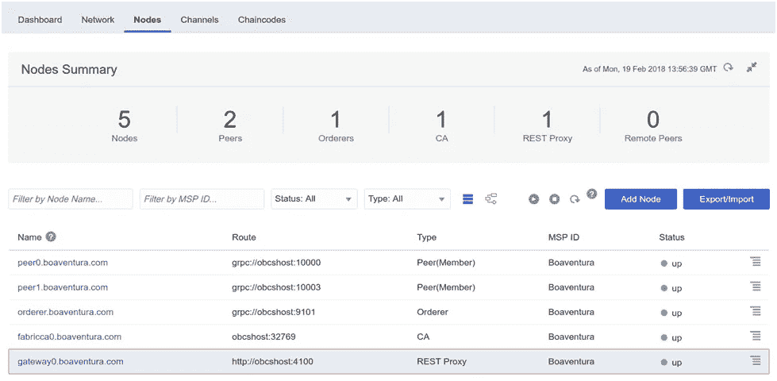

Exposing chaincode through the REST Proxy

3.**为渠道**boaventuralderer**选择 **Example02 和 Marbles** ，选择渠道上的哪个链码被公开**，以及链码的背书者，然后为每个样本分配**peer0.boaventura.com 和 peer1.boaventura.com**，如下图所示，然后**点击提交按钮**:

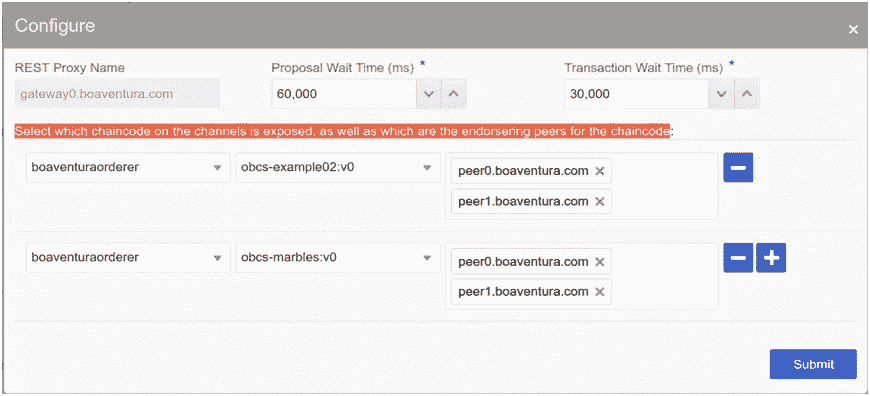

Configure REST Proxy

4.现在，您必须重新启动网关，这样您的更改才能生效。**如前所述选择您的网关行，然后点击此按钮重新启动它**

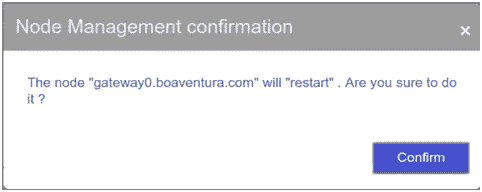

Restarting your REST proxy

既然您的链代码已经通过 REST Gateway 公开了，现在是我们通过调用示例 API 开始的时候了。您可以使用 curl、Postman 或任何能够执行 http 请求的工具来调用 rest APIs。我决定在 Postman 中实现所有的东西，因为它是一个快速敏捷的工具，可以完成这种 REST API 调用。那么，让我们来接触一下 OBCS REST API。然而，在开始调用 API 之前有一个概述是很重要的。以下是您将在本实验中使用的 REST APIs:

getVersion :用于检查你与网关的连接

http://<gatewayhostname>:<gatewayport>/bcsgw/rest/version</gatewayport></gatewayhostname>

**查询**:用于查询链码函数返回的信息

http://<gatewayhostname>:<gatewayport>/bcsgw/rest/v1/transaction/query</gatewayport></gatewayhostname>

**调用**:用于调用链代码中实现的函数

http://<gatewayhostname>:<gatewayport>/bcsgw/rest/v1/transaction/invocation</gatewayport></gatewayhostname>

**AsyncInvocation:** 使用该操作在异步模式下调用这些函数

http://<gatewayhostname>:<gatewayport>/BCS GW/rest/v1/transaction/async invocation</gatewayport></gatewayhostname>

**GetStatus** (异步事务的)

http://<gatewayhostname>:<gatewayport>/bcsgw/rest/v1/transaction？channel= <name>&txid=</name></gatewayport></gatewayhostname>

**等待状态**(返回交易列表)

http://<gatewayhostname>:<gatewayport>/BCS GW/rest/v1/transaction/wait status</gatewayport></gatewayhostname>

为了方便起见，我创建了两个文件，您可以导入到您的 Postman 环境中:**OBCS workshop . Postman _ environment . JSON**和 **Oracle 区块链云服务 workshop . Postman _ collection . JSON**。他们将 Example02 和 Marble 的所有示例 API 都实现为 postman 集合中的 REST 调用，可以在这里**找到它们。也就是说，在 Postman 中调用示例时，您将能够识别上面提到的所有 REST APIs。**

**因此，让我们执行以下操作来开始调用 API:**

****5。在你的环境中打开邮递员****

**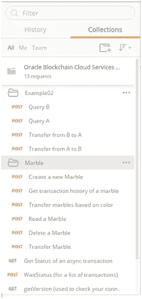**

**Postman Collection**

**6.在发送您的第一个请求之前，不要忘记通过更改您的 Postman 环境配置来更改主机名和端口以指向您的 <yourobcshostip>: <yourobcshostport>，如下图所示:</yourobcshostport></yourobcshostip>**

**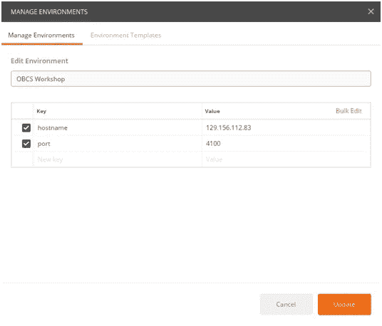**

**Postman Environment variables**

**7.现在，为了举例说明对**/BCS GW/rest/v1/transaction/query 的调用，**您可以调用任何返回响应的 API。对于这个示例，我将使用来自**示例 02** 示例的**查询 A** 和**查询 B** 。这是为了通过 POST REST API 调用对**查询**端点调用 chaincode 函数(用 GO 语言实现)而必须发送的有效载荷。**

**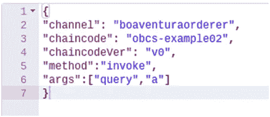**

**Example02 — Query A**

**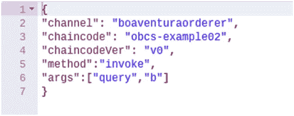**

**Example02 — Query B**

**基本上，您必须向请求主体提供以下内容:**

**频道: **boaventuraorderer****

**链码:**obcs-示例 02****

**链码版本: **v0** ，**

**方法(在 GO Lang 中实现的函数):**调用****

**传递给函数的参数。**

**8.现在让我们通过点击 Postman 中蓝色的 send 按钮来调用**查询操作。您应该会收到一个响应，其结果包含存储在“A”中的值。****

**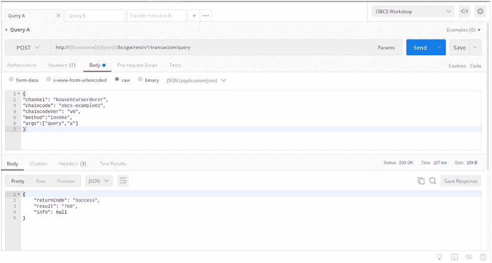**

**Calling Example 02 — Query A**

**或者，您可以使用 curl 调用相同的操作**

> **curl -X POST \**
> 
> **http://<yourobcshostip>:<yourobcshostport>/bcsgw/rest/v1/transaction/query \</yourobcshostport></yourobcshostip>**
> 
> **-H '缓存控制:无缓存' \**
> 
> **-H '内容类型:应用程序/json' \**
> 
> **-H ' postman-token:6416 BF B1-ea1e-0e 97-DD c8–71 A0 FD 5b 7605 ' \**
> 
> **-d {**
> 
> **《频道》:“boaventuraorderer”，**
> 
> **“chain code”:“obcs-example 02”，**
> 
> **" chaincodeVer": "v0 "，**
> 
> **“方法”:“调用”，**
> 
> **" args":["query "，" a"]**
> 
> **}’**

**9.对**查询 B** 重复相同的步骤，看看会得到什么。**

**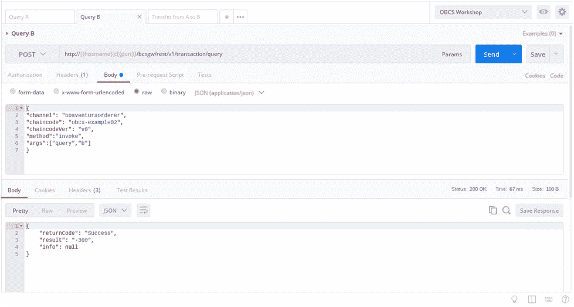**

**Calling Example 02 — Query B**

**同样，您可以像前面一样使用 curl 调用相同的操作**

> **curl -X POST \**
> 
> **http://<yourobcshostip>:<yourobcshostport>/bcsgw/rest/v1/transaction/query \</yourobcshostport></yourobcshostip>**
> 
> **-H '缓存控制:无缓存' \**
> 
> **-H '内容类型:应用程序/json' \**
> 
> **-H ' postman-token:6416 BF B1-ea1e-0e 97-DD c8–71 A0 FD 5b 7605 ' \**
> 
> **-d {**
> 
> **《频道》:“boaventuraorderer”，**
> 
> **“chain code”:“obcs-example 02”，**
> 
> **" chaincodeVer": "v0 "，**
> 
> **“方法”:“调用”，**
> 
> **" args":["query "，" a"]**
> 
> **}’**

**注意，在这两种情况下，您都在调用一个查询端点**/BCS GW/rest/v1/transaction/query**，如上面两张图片中用红色突出显示的。此外，还会返回一个结果，其中包含当前存储在变量 A 和 b 中的数据。**

**10.现在，让我们在另一个函数中尝试一下(**从 A 转移到 B** )。转到邮差收藏，打开一个新标签，然后点击发送按钮。**

**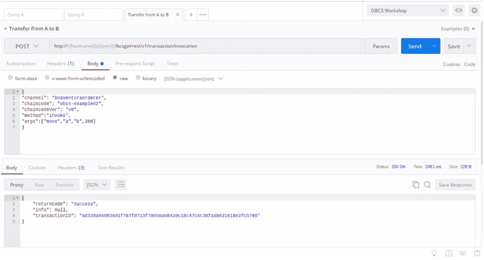**

**Calling Example 02 — Transfer from A to B**

**同样，您可以像前面一样使用 curl 调用相同的操作**

> **curl -X POST \**
> 
> **http://<yourobcshostip>:<yourobcshostport>/BCS GW/rest/v1/transaction/invocation \</yourobcshostport></yourobcshostip>**
> 
> **-H '缓存控制:无缓存' \**
> 
> **-H '内容类型:应用程序/json' \**
> 
> **-H '邮递员-令牌:70006 ff2–2 FAA-f9c 9–05a 3–3437 ddd4c 773 ' \**
> 
> **-d {**
> 
> **《频道》:“boaventuraorderer”，**
> 
> **“chain code”:“obcs-example 02”，**
> 
> **" chaincodeVer": "v0 "，**
> 
> **“方法”:“调用”，**
> 
> **" args":["move "，" a "，" b "，200]**
> 
> **}’**

**注意，在这个例子中，通过调用这个端点**/BCS GW/rest/v1/transaction/invocation**，您已经将 200 从 A 移动到 B。因为这是一个不返回任何结果数据的事务，所以我必须调用**调用端点**，这与我在上一步中调用查询端点的做法相反。此外，请注意，响应具有 **transactionID** ，并且没有结果字段。**

**此外，正如我们在上一个实验中所做的那样，您可以通过转到“ledger”窗格下的“Channel”选项卡来查找有关分类帐中任何交易的信息。你应该能在那边找到你最近的电话。**

**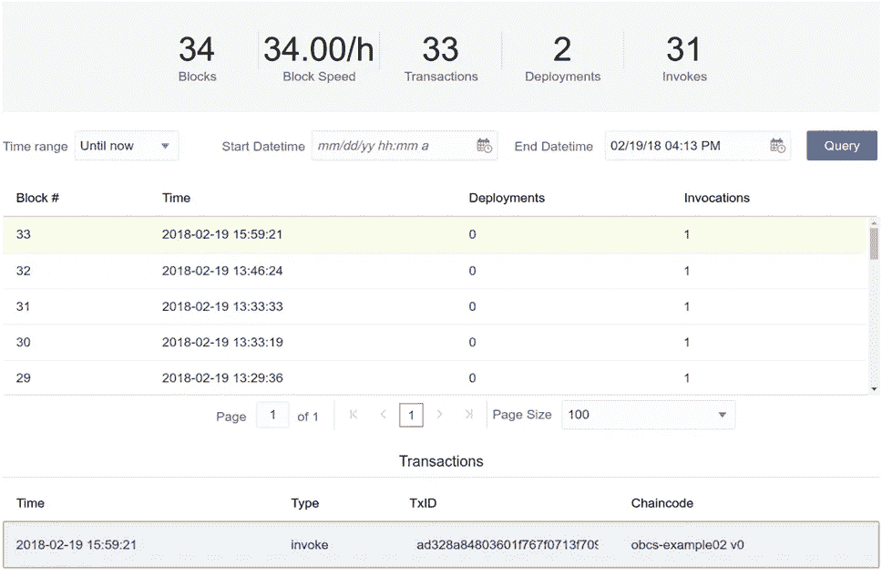**

**Browsing the ledger to find the just created transaction**

**11.现在执行**查询 A** 和**查询 B** 以确保数据确实如预期的那样发生了变化。**

**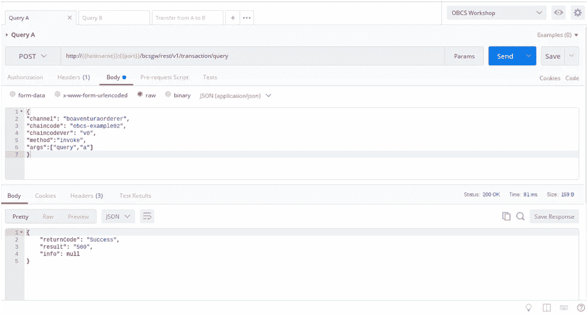**

**Running Query A operation**

****

**Running Query B operation**

**请注意，自从您调用函数从变量中移动值以来，A 的**值已经从 700 变为 500，B 的**值从-300 变为-100。这证实了我们的实验室已经按预期工作，因此现在轮到您自己探索和尝试 Postman 集合中提供的其他 API 了。好好享受吧！！**

> **如果这篇文章有助于您了解 Oracle 自主区块链云服务以及如何使用他们的 REST APIs 和 REST 代理，请**点击**。请留下你的评论和反馈。这对帮助我继续写关于这类内容的新文章非常重要。**