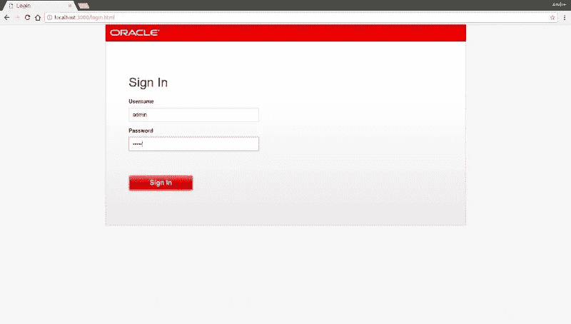
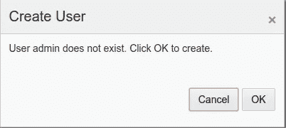
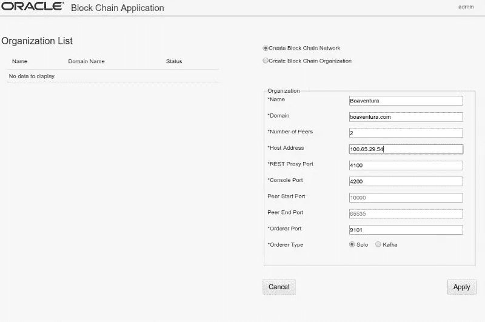
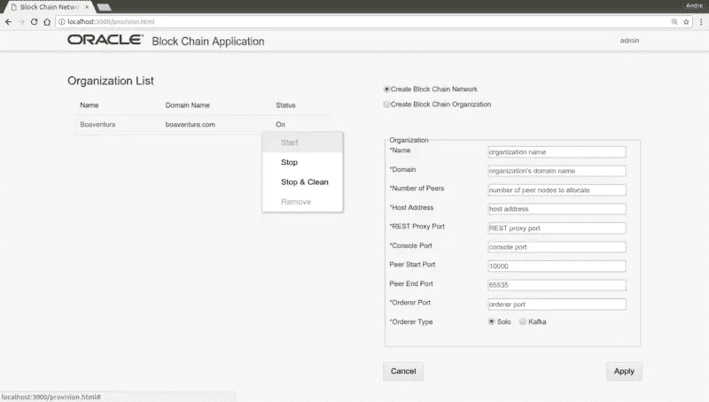
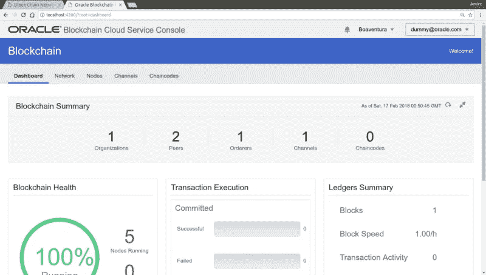
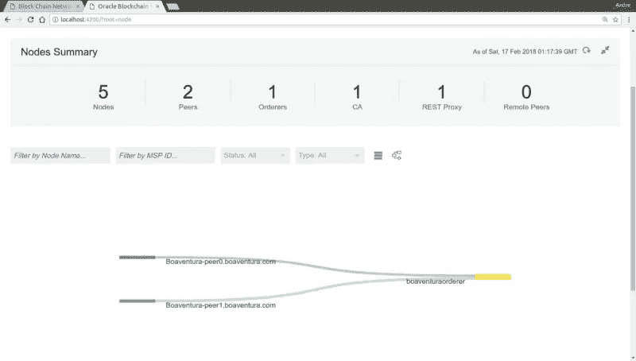
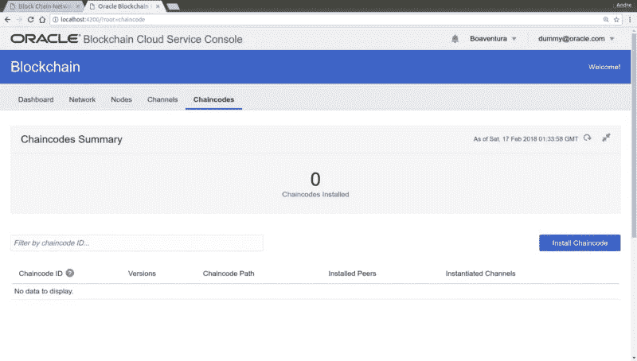

# 了解 Oracle 自主区块链云服务—第 1 部分—使用供应接口

> 原文：<https://medium.com/oracledevs/getting-to-know-oracle-autonomous-blockchain-cloud-service-working-with-provisioning-interface-fb3be5179daf?source=collection_archive---------1----------------------->

# 甲骨文的区块链战略

甲骨文知道，更广泛地采用区块链需要一个平台，因为许多正在出现的用例需要灵活性和敏捷性来探索，而不是为每个用例建立新的基础设施。此外，借助预集成的技术和预组装的基础架构服务，轻松配置和基于使用情况的消费可在几分钟内实现快速配置，这是寻求实施此类技术的客户和合作伙伴追求的其他特征。此外，常见企业级需求必须经过验证并可重复使用，例如:弹性、高可用性、可伸缩性、可支持性、管理、安全性等。此外，我们不能忘记提到，运营环境具有以自主方式进行监控的最佳实践、故障排除功能以及与开放银行平台、ERP、SaaS 应用程序等已知平台的通用集成，对于成功采用和实施区块链来说非常必要。

因此，甲骨文决定打造甲骨文自主区块链云服务(又名 OABCS)。它是 Oracle 全面的云平台(PaaS)产品组合的一部分，由世界上最具可扩展性的分布式事务处理平台提供商提供。因此，OABCS 是最全面和可扩展的分布式分类帐云平台，因为 Oracle 提供完全托管的云服务，客户无需担心弹性和扩展问题，因为我们在开源 Hyperledger fabric core 的基础上增加了弹性功能和企业级体验，通过内置连续分类帐状态备份、节点重启， 除其他功能外，自主恢复和监控使 Oracle Autonomous block chain Cloud Service 成为运行区块链业务的真正强大的平台，能够满足客户成功采用的任何必要条件，因为它为客户带来了所有功能，通过安全地扩展其业务应用程序和流程，同时加速整个生态系统的交易，来加速收入，创造新的收入流，并降低成本和风险。

也就是说，这种企业级区块链解决方案使客户能够更快地交付业务成果，通过在现有 ERP 或 SaaS 系统之间共享可信的实时信息来加快现有业务流程，从而推动创新，通过安全地自动化跨组织交易和提供可靠的信息共享来降低风险、复杂性和提高效率，并通过在 Oracle 云平台中提供具有丰富集成选项的 REST API 驱动的平台来加快上市时间，这允许在几分钟内开发区块链应用程序，而无需复杂的设置和配置。这些是 Oracle 自主区块链云服务为客户、开发人员和合作伙伴生态系统带来的一些主要优势，然而，通过利用这一强大的解决方案还可以实现更多优势。

# 目标

这是一个综合性的研讨会，旨在为您提供区块链、Hyperledger fabric 和 Oracle 自主区块链云服务的关键概念。这是一个由 3 节课组成的系列课程，通过单独的练习，您可以在云环境中亲身体验 Oracle Autonomous block chain Cloud service，了解如何在 Oracle PaaS 解决方案中使用和部署关键特性和功能。

完成所有实验课的第 1、2 和 3 部分后，以下是您的主要目标:

*   熟悉 Oracle 自主区块链云服务(OABCS)及其底层技术和独特优势
*   了解如何以及何时在企业中应用区块链
*   了解 OABCS 架构(Oracle 云、Hyperledger 结构、Oracle 增强功能)
*   熟悉 OABCS 的配置和管理
*   使用操作控制台执行管理任务和监控
*   了解如何在 OABCS 中开发和部署智能合约
*   了解如何利用 OABCS REST 代理与外部应用程序集成
*   创建和运营您自己的多组织区块链网络或联盟

# 使用 OABCS 预配 UI

第一步是从以下 URL 访问预配控制台 http:// <youroabcshostip>:3000</youroabcshostip>

Sign in to provision console

当提示登录时，输入用户 id 和密码的任意组合，因为在这个版本中没有启用身份验证。但是，如果您随后返回到 UI，请确保您使用最初创建 OABCS 环境时使用的相同凭据来访问您保存的配置，否则您将无法访问您之前可能已经完成的网络/组织配置。为方便起见，在本实验中，我们将以管理员/管理员身份登录。

Figure 1 — Creating user for the provision console

登录配置 UI 后，请注意下面屏幕截图中突出显示的两个选项:

Figure 2 — Provision Console first access

创建区块链网络:这将创建一个组织和运行一个完全成熟的区块链网络所需的所有组件，包括订购服务。您指定的组织将成为网络的创始成员。请注意，使用此选项时，您需要选择所需的订购服务类型:

*   Solo(单服务器强制默认订购者)
*   基于 Kafka 的(使用 Kafka 事件流的订购者集群，以在一个块中的交易顺序上达成一致。)请注意，对于 Kafka 订购服务，初始配置需要的时间稍长。

创建区块链组织:这将创建一个组织和区块链节点，如对等体、成员服务和 REST 代理，它们可用于加入由创始成员创建的区块链网络。

换句话说，你需要创建至少一个网络，其中将包括一个创始组织。然后，您可以选择创建一个或多个组织，代表单独的 OABCS 实例，它们可以加入创始成员的网络。新组织加入网络的过程将在第 5 课稍后介绍。

那么，让我们开始利用供应控制台创建我们的第一个区块链网络。

创建您的第一个区块链网络，如下表所示:

Table 1 — Building your first Blockchain Network

毕竟，您的 OABCS 供应控制台应该如下图所示:

Figure 3 — Creating your first Blockchain network

点击应用按钮创建您的网络:

Figure 4 — Organization List

因此，您应该看到您的组织列表如上图所示进行了更新。这提供了所有的区块链网络组件，包括成员服务、对等点、订购服务、REST 代理和 OABCS 控制台服务。完成此步骤后，您现在可以通过单击“组织列表”表中蓝色的组织名称来访问 OABCS 控制台(例如:本例中的 Boaventura)。

访问和控制区块链网络实例:

登录后，返回 OABCS 预配控制台时，您可以使用下图所示的表格，通过单击名称来访问任何以前创建的实例的管理控制台，或者通过右键单击实例所在的行并从菜单中选择它来启动/停止/删除实例。

Figure 5 — Controlling the Blockchain Instance

请注意，Stop 选项会关闭与该实例相关的所有容器，但是网络配置会保留下来，并且可以使用 Start 重新激活。“停止并清除”会关闭容器，并删除所有添加的频道和安装的链码。当您用 Start 重新启动它时，您需要重新创建通道，然后安装和实例化 chaincodes。最后，Remove 选项会完全删除该组织的配置(如果是创建组织，还会删除相关网络)。

Figure 6 — OABCS Console — Welcome Page

您刚刚通过创建第一个区块链网络(本实验中的 Boaventura)调配的 Oracle Autonomous block chain Cloud Service console 可帮助您为刚刚创建的区块链网络执行日常管理任务。当您提供区块链云服务实例时，您开始工作所需的所有功能都已添加到控制台中。您可以使用控制台执行诸如管理节点、配置网络通道和策略以及部署和实例化链码等任务。您还可以监控网络和排除网络故障，查看节点状态，查看分类帐块，以及查找和查看日志文件。网络中的每个组织都有自己的控制台，用于管理其组织和监控所属的区块链网络。您在网络中的角色(创始人或成员)决定了您可以在控制台中执行的任务。

“Dashboard”选项卡显示网络的运行状况(100%表示所有组件都已启动)、事务执行指标和摘要分类帐指标。您可以使用 Dashboard 选项卡来查看网络性能的概览。在仪表板选项卡上，您会发现:

*   显示网络上有多少不同组件的横幅。例如，有多少通道和链码。
*   特定时间范围内的事务执行和活动信息。
*   正在运行或已停止的节点的数量和百分比。
*   分类帐信息，如交易活动和调用。

Figure 7 — OABCS Console — Network tab

在“网络”选项卡中，您可以查看网络中的组织列表。设置 Blockchain Cloud Service 实例后首次使用“网络”选项卡时，您将看到您在设置过程中创建的组织。您可以使用“网络”选项卡来:

*   查找您网络中的组织名称、它们的成员服务提供商(MSP)id 和角色。
*   将组织添加到网络中。

查看网络结构的图形表示。

Figure 8 — OABCS Console — Network tab — Topology View

Figure 9 — OABCS Console — Nodes tab

“节点”选项卡列出了结构网络的所有组件，包括对等方、订购方、ca 和 REST 代理。它提供了启动/停止/重启节点、编辑节点属性和添加新节点的操作控制。在实例供应期间，创建了一个默认通道，所有对等体都被添加到该通道中。下面您可以找到网络中节点的拓扑视图。

Figure 10 — OABCS Console — Nodes tab — Topology View

Figure 11 — OABCS Console — Channels tab

信道是两个或多个特定网络成员之间通信的私有“子网”，用于进行私有和机密的交易。渠道由成员(组织)、每个成员的锚定对等点、共享分类帐、链码应用程序和订购服务节点定义。网络上的每个交易都在一个通道上执行，其中每一方都必须经过身份验证和授权才能在该通道上进行交易。加入通道的每个对等体都有自己的身份，该身份由成员资格服务提供商(MSP)提供，MSP 向其通道对等体和服务验证每个对等体。尽管对等方可以属于多个渠道，但有关交易、分类帐状态和渠道成员资格的信息仅限于每个渠道内的对等方。

通道分割和隔离对等体和分类帐数据，以在区块链网络上提供私人和机密的交易。

区块链成员组织定义和构建通道，以允许特定的对等方进行私人和机密的交易，而同一区块链网络上的其他成员无法看到或访问这些交易。每个通道包括对等体、共享分类帐、在通道上实例化的链码以及一个或多个订购服务节点。

Channels 选项卡列出了所有可用的渠道，并提供对每个渠道分类帐、对等方列表和已部署(实例化)链码列表的访问。它还提供了一个用新版本升级 Chaincode 的按钮。设置 Blockchain Cloud Service 实例后，首次使用 Channels 选项卡时，您将看到创建的默认频道，并且您网络中的所有对等点都添加到该频道中。使用“频道”选项卡可以:

*   添加新频道。
*   升级实例化的链码。
*   查看渠道的分类帐活动。

Figure 12 — OABCS Console — Chaincodes tab

请注意，OABCS 将智能合约称为链码。“链码”选项卡列出了网络上安装的链码。在设置区块链云服务实例后首次使用“链码”选项卡时，列表中不会显示链码，因为在设置过程中没有包含链码。您必须添加所需的链码。您可以使用“链码”选项卡来:

*   查找链码的版本。
*   查看哪些对等机安装了链码。
*   在对等体上安装链代码，并在通道上实例化它。
*   查看链码在哪个通道上被实例化。

# 结论

如果你已经做到了这一步，那么恭喜你！关于 OABCS 还有很多要解释的，但至少现在你对关键功能有了一个概念，这将允许你使用期待已久的 Oracle 区块链产品。

下一节(第 2 部分)将教您如何使用随产品提供的链码示例来探索 OABCS 操作。

> 如果这篇文章有助于您了解区块链、Hyperledger Fabric 和 Oracle 自主区块链云服务，请鼓掌。请留下你的评论和反馈。这对帮助我继续写关于这类内容的新文章非常重要。