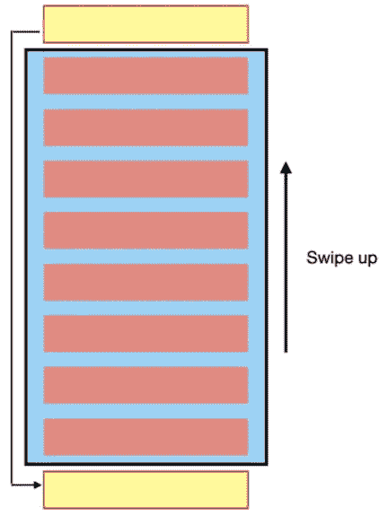
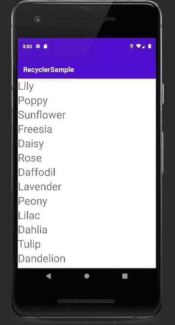
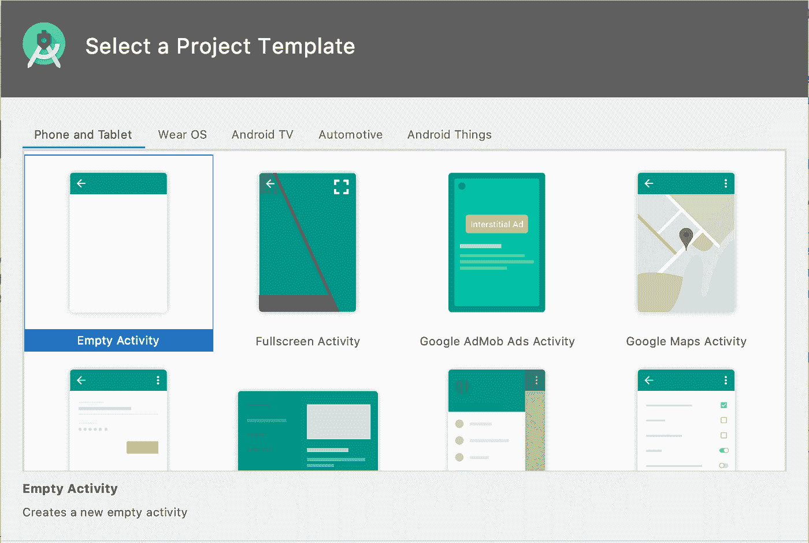
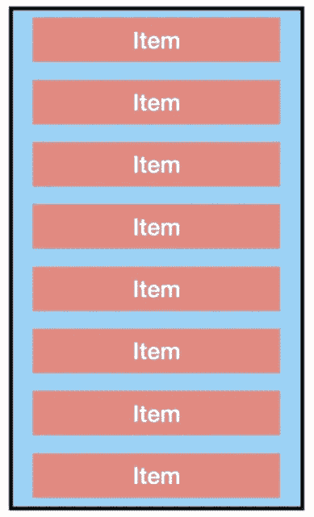
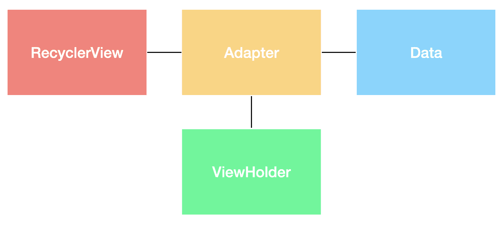

# 了解 RecyclerView

> 原文：<https://medium.com/androiddevelopers/getting-to-know-recyclerview-ea14f8514e6?source=collection_archive---------0----------------------->

是一个强大的 UI 小部件，允许你以灵活的方式显示数据列表。当我学习`RecyclerView`的时候，我发现有很多关于如何创建一个复杂的资源，但是没有多少关于创建一个简单的资源。虽然组成`RecyclerView`的各个部分一开始看起来令人困惑，但一旦你理解了它们，它们就相当简单了。

这篇博文介绍了创建一个简单的`RecyclerView`来显示不同种类的花的名字的步骤。在这个过程中，我还将分解一个`RecyclerView`需要的不同部分，这样你就可以在你自己的应用中尝试它。

# RecyclerView？什么？为什么？

一个`RecyclerView`是用来显示数据列表或网格的容器，比如文本或照片。

当列表滚动时，屏幕上实际上只显示少数视图。当视图滚动出屏幕时，`RecyclerView`重用它并用新数据填充它。这使得你的应用程序在时间和空间上都更有效，因为它回收现有的结构，而不是不断地创建新的结构。

The pink cells represent the cells displayed on screen and the yellow cell shows how a view that is scrolled off screen is recycled into a new view.

为什么要用`RecyclerView`？

*   `RecyclerView`使用`ViewHolder`模式，通过允许访问项目视图而无需频繁调用`findViewById()`来提高性能。
*   `RecyclerView`，使用`[LayoutManager](https://developer.android.com/reference/androidx/recyclerview/widget/RecyclerView.LayoutManager)s`，支持可垂直和水平滚动的列表、交错列表和网格。自定义`LayoutManagers`也可以创建。
*   `RecyclerView`提供默认项目动画和一种[定制它们的方式](https://developer.android.com/reference/android/support/v7/widget/RecyclerView.ItemAnimator.html)。

总的来说，`RecyclerView`是一个强大的工具，因为它允许灵活性和定制。

# 实现 RecyclerView

这篇博文将展示如何实现一个简单的`RecyclerView`来显示不同种类的花的名字。下面的代码将用 Kotlin 编写，但是`RecyclerView`也可以用 Java 编写。

首先，用 Android Studio 中的空活动模板创建一个项目。给它起一个有创意的名字，选择 Kotlin 作为项目的语言。

接下来，将`RecyclerView`的[最新依赖](https://developer.android.com/jetpack/androidx/releases/recyclerview)导入到 app 级`build.gradle`文件中。

# 回收查看数据

`RecyclerView`最重要的部分之一是显示的数据。在更复杂的应用程序中，数据将从数据库或网络中检索，但为了简单起见，该应用程序使用该应用程序中资源文件中的字符串。

在`strings.xml`文件中，用要显示的花创建一个字符串数组。

接下来，创建一个名为`Datasource`的类，并在上下文中使用它。创建一个名为`getFlowerList()`的函数，该函数返回花卉名称的数组。

在`MainActivity.onCreate()`中，创建一个名为`flowerList`的 val，并将其设置为等于`getFlowerList()`。

# RecyclerView 视图布局

接下来，将`activity_main`布局资源文件中的默认`TextView`替换为`RecyclerView`，并将`layoutManager`设置为`LinearLayoutManager`。使用`LinearLayoutManager`意味着数据以垂直或水平列表显示(默认为垂直)。

# 项目布局

上图显示了一个由显示数据的项目组成的`RecyclerView`。在这种情况下，组成`RecyclerView`的项目包含花的名称。

创建一个名为`flower_item`的新布局文件，它描述了列表中的项目应该如何显示。这个布局负责显示一个花名，所以只需要一个`TextView`。

# 分解适配器类

接下来是真正的肉`RecyclerView`、`[ViewHolder](https://developer.android.com/reference/androidx/recyclerview/widget/RecyclerView.ViewHolder)`和`[Adapter](https://developer.android.com/reference/androidx/recyclerview/widget/RecyclerView.Adapter)`级。一个`[ViewHolder](https://developer.android.com/reference/androidx/recyclerview/widget/RecyclerView.ViewHolder)`在`RecyclerView`中存储关于单个项目视图的信息。`RecyclerView`只创建需要在屏幕上显示的数量的`ViewHolders`,并在缓存中添加一些额外的。当用户滚动时,`ViewHolders`被“回收”(用新数据重新填充);现有项目在一端消失，新项目出现在另一端。`Adapter`类从数据源获取数据，并将其传递给`ViewHolder`，后者更新它持有的视图。下图显示了`RecyclerView`、`Adapter`、`ViewHolder`和数据如何协同工作。

## 创建适配器

创建一个名为`FlowerAdapter`的类，它接收要显示的数据列表。

## 创建视图保持器

创建一个名为`FlowerViewHolder`的内部类，它接受一个`itemView`。在`ViewHolder`中，创建一个 val 来表示`TextView`，并将其与单元格布局中的视图连接。

然后创建一个`bind()`函数，该函数连接花名的数据(字符串)和保存该数据的 UI(采用字符串的`flowerTextView`)。`bind()`函数获取传入的字符串，并将其指定为`flowerTextView`的文本。

## 扩展 RecyclerView。适配器

更新`FlowerAdapter`类签名以扩展`RecyclerView.Adapter`类并传入`FlowerViewHolder`。

重写`RecyclerView.Adapter`的类需要重写三个方法:`onCreateViewHolder()`、`onBindViewHolder()`和`getItemCount()`。

## 重写 onCreateViewHolder()

当`ViewHolder`被创建时，这个方法被调用。它为`RecyclerView`中的项目初始化并放大视图。该视图使用之前创建的显示文本的项目布局。

## 覆盖 onBindViewHolder()

用`ViewHolder`和一个“位置”调用`onBindViewHolder()`，它表示项目在被绑定的`flowerList`中的位置。这个位置可用于提取单元格的底层数据，并将其传递给`ViewHolder`以将数据绑定到该持有者的 UI。

## 覆盖 getItemCount()

`RecyclerView`显示一个列表，所以它需要知道列表中有多少项。由于`flowerList`是数据集，返回其大小。

## 完整的适配器代码

# 连接到主活动

布局、数据列表和适配器都创建好了！现在，只需将`RecyclerView`添加到`MainActivity`中，并将`Adapter`分配给它。

定义一个名为`recyclerView`的 val，并将其设置为等于`activity_main`中的`RecyclerView`容器。将`FlowerAdapter`指定为您的`recyclerView’s`适配器。

现在运行应用程序，看看它的运行情况:

# 后续步骤

完整的代码贴在[这里](https://github.com/android/views-widgets-samples/tree/master/RecyclerViewSimple)。

这个例子展示了如何实现基本的`RecyclerView`来显示简单的文本项。当然，`RecyclerView`也可以处理更有趣和复杂的项目，我已经在 [RecyclerView 系列](https://medium.com/androiddevelopers/tagged/recycler-view-series)中写过了。以下是一些其他资源:

*   [回收查看样本—科特林](https://github.com/android/views-widgets-samples/tree/master/RecyclerViewKotlin)
*   [RecyclerView 示例— Java](https://github.com/android/views-widgets-samples/tree/master/RecyclerView)
*   [回收查看文档](https://developer.android.com/reference/kotlin/androidx/recyclerview/widget/RecyclerView)
*   [用 RecyclerView 创建列表](https://developer.android.com/guide/topics/ui/layout/recyclerview)

请在评论中告诉我你有兴趣了解更多的话题！