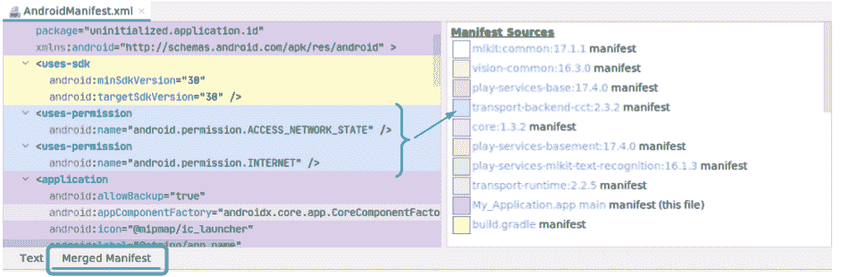

# 了解 SDK 依赖项的行为

> 原文：<https://medium.com/androiddevelopers/getting-to-know-the-behaviors-of-your-sdk-dependencies-f3dfed07a311?source=collection_archive---------2----------------------->

您可能在应用中使用了第三方 SDK 或库。毕竟，如果构建块随时可用并且可以节省您的时间，为什么要从头构建功能呢？作为应用程序开发人员，您应对应用程序中的整体用户体验和代码负责，包括任何第三方 SDK 提供的代码。

当您考虑 SDK 和库时，了解它们对数据的处理和使用非常重要，这样您可以更好地保护用户的隐私。

在这篇文章中，我将分享几个你可以在应用程序的不同开发阶段使用的工具——包括开发时间和发布后。(当然，这是对 SDK 文档的补充，鼓励您非常仔细地逐行阅读)。

**合并清单视图**

为了提供灵活性，Gradle 允许您为应用程序的构建变体、应用程序模块和库依赖项提供单独的清单声明。根据项目的需要，这些清单文件可以包含不同的默认 XML 元素和属性。当构建你的应用程序时，Gradle 将这个清单层次结构合并到你的应用程序的单个清单中。您可以通过[指定“合并规则”](https://developer.android.com/studio/build/manifest-merge)来控制值的合并方式。让我们看看如何使用这个工具来深入了解您的 SDK。

Android Studio 提供了一种检查最终合并清单的简单方法。您可以简单地点击清单编辑器窗口中的“合并清单”选项卡。通过 UI 中的色带，您能够识别不同清单元素的来源。这些源代码包括各种库依赖项。例如，下面的视图显示名为“transport-backend”的依赖项在应用程序中包含了一些权限。

示例合并清单视图。

特别是，这种增强的可见性可以帮助您发现由应用程序的依赖项引入的任何意外的运行时权限。这种见解非常有用，不仅因为运行时权限对话框可以改变应用程序的 UX，还因为它让您更加了解应用程序依赖项中的数据使用情况。如果合适的话，您应该向您的用户解释何时以及为什么访问是必要的。

如果您在合并的清单中看到任何意外的权限，请仔细查看有问题的库的文档(或联系开发人员),并确保您理解为什么需要它们。

对于您实际使用的服务，这种权限可能是可选的。为了数据最小化，你可以在你的应用程序模块的清单中使用一个“移除”[节点标记](https://developer.android.com/studio/build/manifest-merge#node_markers)来防止库的权限合并到你的应用程序中。

**模块依赖视图**

开发工具链中另一个有用的工具是 Gradle 的模块依赖支持。依赖图的一个常见用途是解决构建问题。依赖关系图还包括传递依赖关系信息，这有助于识别库带来的其他依赖关系。了解有关[查看模块依赖关系](https://developer.android.com/studio/build/dependencies.html#view-dependency-tree)的更多信息。

让我们来看看另一个工具，您可以使用它来更好地理解应用程序中的数据访问。

**数据访问审计**

你的应用程序的复杂性(和你的团队规模！)随着时间的推移而增加，在应用程序的开发阶段诊断 SDK 相关的私有数据访问并不总是简单的。

Android 11 引入了[数据访问审计](https://developer.android.com/guide/topics/data/audit-access)，有助于识别应用使用时哪些代码执行数据访问操作。该功能允许您将私人数据访问与应用程序中的特定业务用例相关联，例如“点咖啡”或“与朋友分享”。这有助于查明任何意外的数据访问操作，并识别哪个模块或用例执行了访问操作。

为了实现，创建一个上下文对象并将其与一个“属性标签”相关联，这对应于一个业务用例，比如“订购咖啡”。您可以在 OrderCoffeeActivity.onCreate()中完成这项工作。

您可以使用这个属性上下文作为后续框架 API 调用的上下文参数。

接下来，设置一个回调，当私有数据访问发生时将触发这个回调。在回调中，您可以引用属性标签，检索堆栈跟踪，或者与您的应用程序的分析解决方案集成以用于报告目的。

数据访问审计包括对同步和异步 API 调用的支持，并且在 Android 11 或更新的设备上可用。[了解更多](https://developer.android.com/guide/topics/data/audit-access)。

**总结**

合并的清单工具、Gradle 的模块依赖支持以及 Android 11 中引入的数据访问审计 API，旨在为您提供对应用程序和 SDK 依赖关系中的数据访问和行为的额外见解。这反过来允许你为你的用户提供更好的透明度。我们鼓励您将这些工具集成到您现有的工作流程中。

此外，如果您通过谷歌 Play 商店进行分发，请确保检查相关的[用户数据政策](https://support.google.com/googleplay/android-developer/answer/10144311)，并验证您的 SDK 使用是合规的。