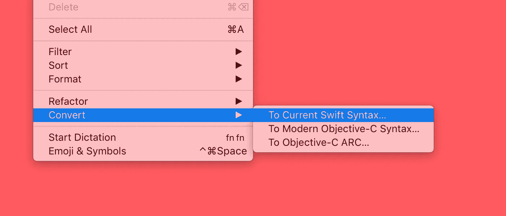

# 进入 Swift 3

> 原文：<https://medium.com/airbnb-engineering/getting-to-swift-3-at-airbnb-79a257d2b656?source=collection_archive---------2----------------------->

*由* [*【刘】*](https://twitter.com/chengyinliu)*[*【保罗】*](https://github.com/kompfner)*[*迈克尔*](https://twitter.com/michaelbachand)**

****

**自 Swift 语言诞生以来，Airbnb 就一直在使用它。我们已经看到了使用这种现代、安全、社区驱动的语言的诸多好处。**

**直到最近，我们代码库的很大一部分都在 Swift 2 中。我们刚刚完成了向 Swift 3 的迁移，正好赶上了支持 Swift 2 的 Xcode 的发布。**

**我们希望与社区分享我们的迁移方法、Swift 3 对我们应用的影响以及我们在此过程中获得的一些技术见解。**

# **“不中断开发”的方法**

**我们有几十个模块和几个用 Swift 编写的第三方库，包括几千个文件和几十万行代码。好像这个 Swift 代码库的规模还不足以成为一个挑战，Swift 2 和 Swift 3 模块不能相互导入的事实进一步复杂化了迁移过程。甚至导入 Swift 2 库的正确的 Swift 3 代码也不会编译。这种不兼容性使得并行代码转换变得困难。**

**为了确保我们能够逐步转换和验证我们的代码，我们首先创建了一个依赖图，对我们的 36 个 Swift 模块进行了拓扑排序。我们的升级计划如下:**

1.  **将 CocoaPods 升级到 1.1.0(以支持必要的 pod 升级)**
2.  **将第三方 pod 升级到 Swift 3 版本**
3.  **按照拓扑顺序转换我们自己的模块**

**通过与其他已经完成迁移的公司交谈，我们了解到冻结开发是一种常见的策略。如果可能的话，我们希望避免代码冻结，即使这意味着对那些进行移植的人来说增加了一些困难。由于转换工作不容易并行化，所有人都参与进来的方法将是低效的。此外，由于很难估计转换需要多长时间，我们希望确保我们可以在迁移期间继续发布新版本。**

**我们有三个人负责迁移。两个人专注于代码转换，第三个人专注于协调、与团队沟通和基准测试。**

**最后，包括准备工作，我们实际的项目时间表如下所示:**

*   **1 周:调查和准备(一人)**
*   **2.5 周:转化(两人)，分析转化的影响，与更大的团队沟通(一人)**
*   **2 周:QA 和 bug 修复(QA 团队+各种 iOS 功能所有者)**

# **Swift 3 的影响**

**虽然我们对 Swift 3 的新语言功能感到兴奋，但我们也想了解该更新将如何影响我们的最终用户和整体开发者体验。我们密切关注 Swift 3 对发布 IPA 大小和调试构建时间的影响，因为这是迄今为止我们最大的两个 Swift 痛点。不幸的是，在尝试了不同的优化设置后，Swift 3 在这两项指标上的得分仍然略有下降。**

## **发布 IPA 大小**

**在迁移到 Swift 3 之后，我们看到我们发布的 IPA 增加了 2.2MB。稍微挖掘一下就会发现，这几乎完全是由于 Swift 库的大小增加了(我们自己的二进制文件的大小几乎没有变化)。以下是我们发现的未压缩二进制文件大小增加的几个例子:**

*   **libswiftFoundation.dylib:涨幅 233.40% (3.8 MB)**
*   **libswiftCore.dylib:增长 11.76% (1.5 兆字节)**
*   **libswiftDispatch.dylib:上涨 344.61% (0.8 MB)**

**鉴于 Swift 3 的库(如 Foundation)的增强，这种变化是可以理解的。尽管如此，当备受期待的稳定的 Swift ABI 登陆时，应用程序应该不再需要遭受大小增加以从这些增强中受益。**

## **调试构建时间**

**迁移后，我们的调试构建时间慢了 4.6%，比之前的 6 分钟多了 16 秒。**

**我们试图在 Swift 2 和 Swift 3 之间比较每个函数的编译时间，但是无法得出具体的结论，因为配置文件如此不同。然而，我们确实发现了一个函数，由于迁移，它的编译时间增加到了 12 秒。幸运的是，我们能够将它按摩回来，但它向我们展示了检查转换后的代码是否有像这样的异常值的重要性。像 Xcode 的[Build Time Analyzer](https://github.com/RobertGummesson/BuildTimeAnalyzer-for-Xcode)这样的工具会有所帮助，或者你可以只[设置适当的 Swift 编译器标志并解析生成的构建日志](http://irace.me/swift-profiling)。**

## **运行时问题**

**不幸的是，即使您的代码在 Swift 3 中编译后，移植工作也没有完成。Xcode 代码转换工具不能保证相同的运行时行为。此外，正如我们将在后面讨论的，代码转换仍然涉及手工工作，并且存在一些问题。不幸的是，这可能意味着倒退。由于我们的单元测试覆盖率没有给我们足够的信心，我们不得不在新移植的应用上花费额外的 QA 周期。**

**对新迁移的应用程序的第一次 QA 检查发现了几十个相当明显的问题。负责迁移的 3 人团队迅速解决了绝大多数问题(在几个小时内)，主要是通过应用本文档稍后讨论的一些技术。在初步排除了低悬的、高度可见的回归之后，iOS 团队总体上剩下 15 个潜在的回归——其中 3 个是崩溃——需要在下一个应用版本发布之前进行调查。**

# **代码转换过程**

**我们从从`master`创建一个新的`swift-3`分支开始。如前所述，我们逐个模块地处理代码转换，从叶模块开始，沿着依赖树向上。只要有可能，我们就并行转换不同的模块。当我们不能时，我们坐在一起，大声说出我们正在做什么，以避免碰撞。**

**对于每个模块，流程大致如下:**

1.  **从`swift-3`分支创建一个新分支**
2.  **在模块上运行 Xcode 代码转换工具**
3.  **提交和推送更改**
4.  **建设**
5.  **手动修复大量构建错误**
6.  **提交和推送更改**
7.  **重建**
8.  **重复前面的 3 个步骤，直到完成**

**当手动更新代码时，我们坚持“进行最直接的代码转换”的原则这意味着我们的目标不是在转换过程中提高代码的安全性。我们这样做有两个原因。首先，由于团队正在 Swift 2 中积极开发，这个过程是一场与时间的赛跑。其次，我们希望将引入回归的风险降至最低。**

**幸运的是，我们在一段时间内承担了这个项目，因为假期，工作比较慢。这意味着我们可以安全地走几天，而不用将`swift-3`重置为`master`，也不会落后太多。无论何时我们做了 rebase，我们都使用`git rebase -Xours master`来尽可能多地保留`swift-3`，同时默认使用`master`中的代码来解决冲突。**

**一旦`swift-3`赶上了`master`，我们知道我们需要大约一天的时间来解决一些问题，然后才能舒服地合并它。不过，对于我们这样规模的 iOS 团队来说，`master`是一个移动的目标。因此，为了完成 Swift 3 迁移，我们强烈鼓励整个团队(不包括进行迁移的团队)在周六真正休假😄。**

# **值得一提的问题**

## **Objective-C 中的块参数**

**我们遇到的一个最常见的问题是，Xcode 没有自动给出修复建议，这与 Objective-C 和 Swift 之间的桥接块参数有关。考虑 Objective-C 头文件中的方法声明:**

**在 Swift 2.3 中，生成的接口是:**

**在 Swift 3 中，生成的接口是:**

**很多事情都变了，但最重要的是`completionBlock`中的参数从隐式展开的可选参数变成了可选参数。这可能会破坏它在块内的使用。**

**我们决定，Swift 3 最“字面”的翻译(不涉及 Objective-C 代码)是在程序块的顶部声明一个变量，该变量与参数同名，但被隐式展开:**

**这样做，而不是在使用参数时实际解开参数，是最不可能破坏块中其他地方的语义的。在上面的例子中，像`if let someReview = review { /* … */ }` 和`review ?? anotherReview`这样的后续语句将继续按预期工作。**

## **隐式展开选项赋值中的类型推断**

**另一个常见的(相关的)问题与 Swift 3 如何推断一个隐式展开的可选变量的类型有关。请考虑以下情况:**

**在 Swift 2.3 中，`result`被推断为`Int!`类型。在 Swift 3 中，它的类型是`Int?`。**

**由于 block 参数中列出的原因，最直接的解决方案是将变量声明为隐式取消包装的可选类型:**

**这个问题出现得比预期的更频繁，因为桥接的 Objective-C 初始化器隐式返回未包装的选项。**

## **单个函数的编译时爆炸**

**偶尔，在我们的代码转换工作中，编译器会停止几分钟。**

**我们的项目包含了一些需要大量复杂类型推理的函数。在正常情况下，编译这些代码只需要很少的时间。但是当它们包含编译错误时，它会使编译器陷入混乱。**

**当我们的进度被这种类型的问题阻碍时，我们使用 Xcode 的[构建时分析器来帮助我们发现瓶颈在哪里。然后，我们可以将精力集中在这个功能上，打开转换代码、重新构建和转换更多代码的快乐循环。](https://github.com/RobertGummesson/BuildTimeAnalyzer-for-Xcode)**

## **可选协议方法实现中的“未遂事件”**

**在 Swift 3 转换期间，可选协议方法很容易意外丢失。**

**在`UICollectionViewDataSource`上考虑这种方法:**

**假设您的类实现了`UICollectionViewDataSource`并声明了下面的方法:**

**你能看出不同之处吗？很艰难。但是他们在那里。你的类不用更新定义的签名就可以很好地编译，因为它是一个可选的协议方法。**

**幸运的是，在某些情况下，编译器警告可以帮助您，但不是所有情况。重要的是，要用可选的方法检查实现协议的任何类型——像大多数 UIKit 委托和数据源协议——并验证它们的正确性。搜索像“`func collectionView(collectionView:`”这样的文本(注意第一个参数标签，这是 Swift 2 延期的可靠标志)可以帮助您在代码库中找到违规者。**

## **具有默认方法实现的协议**

**协议可能具有通过协议扩展提供的默认方法实现。如果一个协议的方法签名在 Swift 2 和 Swift 3 之间发生了变化，验证它是否在任何地方都发生了变化是很重要的。如果*或者*协议扩展的实现*或者*你的类型的实现是正确的，编译器会很高兴地编译，但是成功的编译不能保证*和*的实现都是正确的。**

## **具有字符串原始值的枚举**

**在 Swift 3 中，命名约定规定 enum 用例为`lowerCamelCase`。Xcode 代码转换工具会自动对任何现有的枚举进行适当的更改。然而，它跳过了原始值类型为`String`的枚举。这样做有一个很好的理由——可以用与枚举用例名称匹配的`String`来初始化这些枚举之一。如果更改枚举事例名，就有可能破坏初始化。您可能想自己通过小写一些 enum 用例来“完成这项工作”，但是只有在您确信它不会破坏某处基于`String`的初始化时才这样做。**

## **第三方库 API 变化**

**像大多数应用程序一样，我们对第三方库有一些依赖。迁移需要更新任何用 Swift 编写的库。这应该是显而易见的，但值得一提的是:请仔细阅读发行说明，尤其是当您的依赖项经历了重大版本变更时(这很可能是在更改语言版本时)。它帮助我们发现了一些非显而易见的 API 变化，这是编译器无法帮助我们的。**

# **后续步骤**

**咻！我们的`master`分支在 Swift 3 中，Swift 2 中没有新的开发。所有与迁移相关的工作都完成了，对吗？**

**不完全是。如前所述，在代码转换过程中，我们只在 Swift 2 和 Swift 3 代码之间进行最“字面”的转换。这意味着我们并不总是利用 Swift 3 增加的安全性或其新的约定。**

**在持续的基础上，我们将寻找一些潜在的改进。**

## **更细粒度的访问控制**

**默认情况下，Xcode 代码转换工具将`private`访问控制修饰符转换为`fileprivate`，将`public`访问控制修饰符转换为`open`。这代表一种“文字”转换，保证代码将继续像以前一样工作。然而，这也让开发者错过了一个机会，去考虑新的`private`和`public`行为是否真的是更好的*工具。下一步是重新访问文字访问控制转换的实例，并检查我们是否可以利用 Swift 3 增强的表达能力来提供更细粒度的控制。***

## **Swift 3 方法命名**

**当手动转换代码时(当 Xcode 转换工具不够用时，或者当我们改变基础时)，我们经常采取“字面”的方法来改变方法名，以便调用点继续正确。以下面的 Swift 2.3 方法签名为例:**

**为了做出最小、最快的改变，使我们的代码在 Swift 3 中再次编译，我们将把它转换成:**

**然而，更“迅捷 3”的写法应该是:**

**下一步是找到采用命名快捷方式的实例，并更新方法签名以更好地遵循 Swift 3 惯例。**

## **隐式展开选项的安全使用**

**如前所述，我们处理新的可选(在 Swift 3 中)Objective-C 块参数的方法是，立即将它们分配给隐式展开的可选变量，这消除了更新块内大部分代码的需要。然而，我们*应该*在我们的块中做的是适当地处理参数成为`nil`的可能性。**

## **修复警告**

**为了快速结束代码转换过程，我们最终忽略了相当数量的编译器警告，这些警告并没有让我们觉得特别紧急。展望未来，我们必须意识到要降低我们的警告次数。**

# **结论**

**由于 Airbnb 是 Swift 的早期热心采用者，我们积累了大量 Swift 代码。起初，迁移到 Swift 3 的前景似乎令人生畏，不清楚我们将如何进行，也不清楚它将如何影响我们的应用程序。如果您还没有决定将您的代码转换到 Swift 3，我们希望我们的经验有助于揭开这个过程的神秘面纱。**

**最后，如果你有兴趣使用 Swift 3 等最新的移动技术来帮助任何地方的人们，[我们正在招聘！](https://www.airbnb.com/careers/departments/engineering)**

****

## **在 [airbnb.io](http://airbnb.io) 查看我们所有的开源项目，并在 Twitter 上关注我们:[@ Airbnb eng](https://twitter.com/AirbnbEng)+[@ Airbnb data](https://twitter.com/AirbnbData)**