# Git 和 GitHub 初学者教程

> 原文：<https://medium.com/quick-code/git-and-github-tutorial-for-beginners-b1ffd7f639f0?source=collection_archive---------0----------------------->


Git 是一个分布式版本控制系统，用于跟踪软件源代码中的变更。它帮助开发人员通过执行几个 git 命令就可以轻松提交对源代码所做的更改。每当开发人员对代码进行任何更改，并希望它们与项目的官方存储库合并时，他/她必须发出一个 pull 请求，最终将这些更改提交给存储库。

一次，成千上万的人将变更推送到同一个存储库中，跟踪所有这些变更是非常困难的。为此，我们需要一个版本控制系统。在这篇文章中，我们将讨论各种 git 命令，这些命令可以用来创建分支、检查状态、推动变更、更新项目等等。

为了做到这一切，我们将使用一个名为 GitHub 的网站，在那里我们可以托管我们的开源项目，并基于 git 版本控制系统。

在深入探讨之前，让我们先了解一下我们将在这篇博文中使用的所有 git 命令。

# Git 命令:

**git clone** :从 GitHub 克隆存储库

**git init** :初始化 git 仓库

**吉特加。**:向暂存区添加文件

**git 状态**:检查暂存区中的文件

**git commit -m "message"** :使用提交消息提交更改

**git checkout** :用于分支之间的切换

**git merge** :将自己的分支与主分支合并

**git 远程添加原点**:添加远程存储库

**git 推送**:将本地更改推送到远程服务器，即 GitHub 上

这里还有更多 git 命令可以使用。

# 学习 Git & GitHub 的推荐书籍

1.  Git:用 Git 学习版本控制:一步一步的终极初学者指南
2.  [Git 版本控制:协作软件开发的强大工具和技术](https://amzn.to/2CMQNVF)

# 在 GitHub 上使用 Git 命令

首先，要在 GitHub 中使用 git 命令，你需要一个 GitHub 帐户，如果你没有，你可以在这里创建一个。

创建帐户后，登录并点击右上角的“+”图标，选择“新建库”创建一个新的 GitHub 库。您将看到下面的屏幕，在这里您必须输入与您的存储库相关的详细信息，如存储库的名称、描述，选择您是要将您的存储库设为公共还是私有，最后，您可以选择是否使用 README.md 文件初始化您的存储库。之后，您可以为您的存储库选择一个许可证，然后创建存储库。

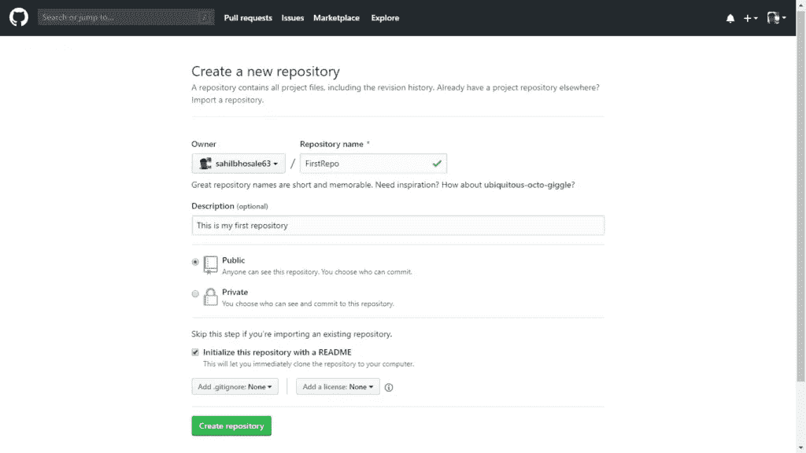

Creating a GitHub repository

既然已经创建了存储库，现在可以使用 git 向该存储库添加文件。您只能在存储库中看到一个 README.md 文件，您可以在其中编写与项目相关的文档。您可以根据需要多次修改该文件。

如果你想在 Windows 或 Mac 系统上运行 git 命令，那么你必须通过这个[链接](https://git-scm.com/download/)安装 Git。如果你使用的是 Linux，你可以在你的终端中运行这个命令:`sudo apt-get install git`(对于 Debian)或者`sudo yum install git`(对于 Fedora)。

在您可以对存储库进行更改或添加文件之前，您首先必须从 GitHub 克隆存储库到您的本地机器上，方法是在您的存储库页面上点击“克隆或下载”按钮，或者运行下面显示的命令。

```
git clone [https://github.com/sahilbhosale63/FirstRepo.git](https://github.com/sahilbhosale63/FirstRepo.git)
```

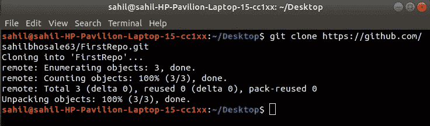

Cloning the GitHub repository

在这里，在“sahilbhosale63”处，您必须输入自己的用户名，在“FirstRepo.git”处，您必须添加自己的 GitHub 存储库名称。确保这里提到的存储库名称与您实际的存储库名称相匹配。如果不是这种情况，那么你会得到一个错误。

现在您的系统上已经有了本地可用的项目，您可以在本地对该项目进行更改，然后您可以按照下面的步骤将该项目推送到您的 GitHub 存储库中。

这些变化可以根据您想要做的事情的需要而变化，比如修复一个问题或者编写一些文档片段等等。无论您想做什么，用于将更改推送到远程服务器的命令都是一样的。

最初，从终端进入文件夹(在本例中是 FirstRepo ),然后必须初始化存储库。这是您最初将更改推送到远程服务器(即 GitHub 存储库)时必须要做的第一步。

```
git init
```

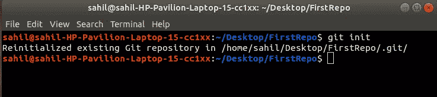

Initializing the git repository

之后，您必须告诉 git 您想要将哪些文件上传到 staging 区域，本地可用的所有文件，或者只有在其中进行了更改的文件。

要将文件夹中的所有文件添加到暂存区，您必须运行`git add .`，或者对特定文件使用`git add [file-name.txt]`

在本例中，我们将使用文本文件`gedit sample`创建一个名为“sample”的文件，并将该文件添加到暂存区。

```
git add sample
```

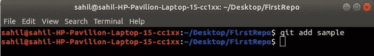

Adding file to the staging area

在你做任何事情之前，你必须使用下面的命令添加你的名字和电子邮件地址。

```
git config --global user.name 'Your Name' git config --global user.email 'youremail@domain.com'
```

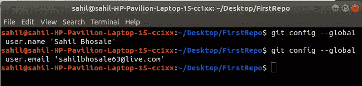

要检查临时区域中有什么，我们可以使用下面的命令。

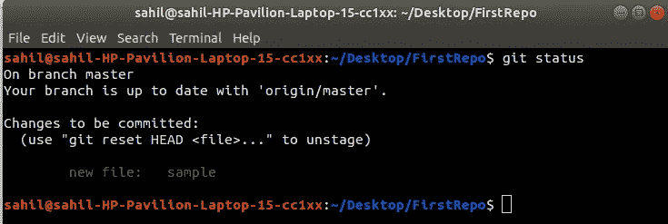

Checking files on the staging area using git status

由于我们之前已经将“样本”文件添加到暂存区，因此当我们运行`git status`命令时，我们可以看到我们已经添加到暂存区的文件。
如果您想从暂存区删除任何文件，您可以运行下面的命令。在这里，“样本”是一个文件的名称。

```
git rm --cached sample
```

现在，将文件添加到临时区域后，您可以提交这些更改，为此您必须运行以下命令。

```
git commit -m "Initial Commit"
```

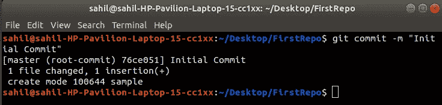

Committing changes using Git

在这里，“-m”代表一条消息，您必须输入提交消息，这意味着您必须写一条关于您所做的更改的消息，以便无论何时您在 GitHub 上推送这些更改，从事该项目的其他人都可以很容易地识别这些更改。

在这种情况下，我们将输入“初始提交”作为我们的提交消息。你可以把任何你想放的东西放进去，除非它与你所做的改变有关。

现在我们已经提交了这些变更，让我们来讨论一下 git 中分支的概念。到目前为止，我们所做的一切都是直接在主分支上进行的(我们在远程位置的项目)。因此，如果您没有创建任何分支，那么每当您提交更改时，它将默认应用于主分支。但是这不是提交变更的正确方式，相反，我们可以创建一个单独的分支，并在该分支上进行变更。

创建新的分支。

```
git branch FirstBranch
```

你可以给你的分支机构取任何你想要的名字，这里我们称之为“第一分支机构”。

但是如果你运行`git status`命令，它会告诉你仍然在主分支上。因此，要切换到我们已经创建的“FirstBranch”分支，请运行以下命令。

```
git checkout FirstBranch
```

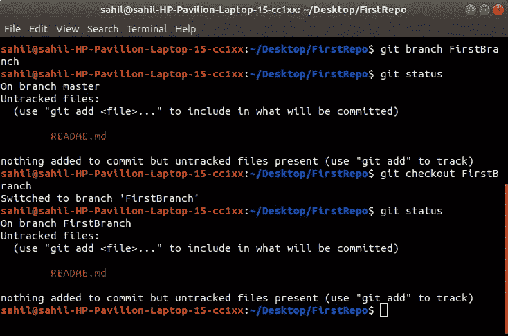

Creating a new branch and switching from the master branch to the newly created branch

让我们使用`touch login.html`命令创建一个名为 login.html 的新文件，并使用`git add .`将其添加到暂存区，然后使用`git commit -m 'Login File'`通过“FirstBranch”分支提交它。

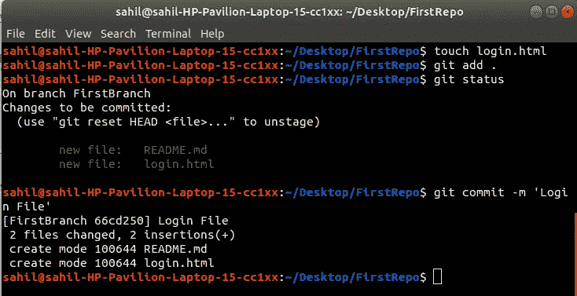

Creating a file login.html & committing it to the “FirstBranch”

现在，为了合并我们在“第一分支”和“主”分支中所做的更改，我们必须首先通过`git checkout master`命令切换到主分支。然后使用`git merge Firstbranch`命令合并这些更改。

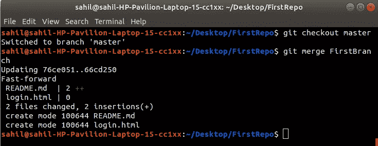

Merging the branch which we have created with the master branch

最后，要将所有这些更改推送到 GitHub 上的远程存储库，您必须运行以下两个命令。

```
//To add origin
git remote add origin 
https://github.com/sahilbhosale63/FirstRepo.git//To push changes
git push -u origin master
```

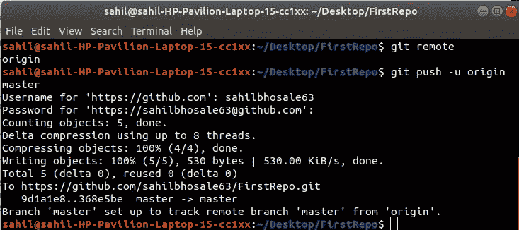

Pushing local changes to GitHub

在这里，它会要求您输入您的 GitHub 凭证，因此输入您的用户名和密码，然后，您所有的本地更改将被推送到您的 GitHub 库。你可以去你在 GitHub 上的库页面，在那里你会看到你的变化。

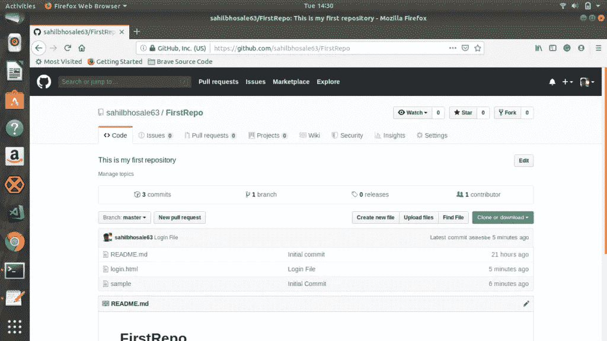

GitHub repository page

感谢您的阅读，如果您喜欢这些内容，请在 [Patreon](https://www.patreon.com/liongueststudios) 上支持我们。你的支持一定会帮助我们写出更多这样的内容。

要阅读更多关于开源主题的博客，你可以前往我们 [LionGuest studios](http://liongueststudios.com/) 网站上的[开源类别](https://liongueststudios.com/category/open-source/)页面。

如果你对 Git 和 GitHub 有任何问题，可以在下面评论。别忘了在社交平台上与他人分享这篇博文。

*原载于 2019 年 6 月 10 日*[*https://liongueststudios.com*](https://liongueststudios.com/git-and-github-tutorial-for-beginners/)*。*