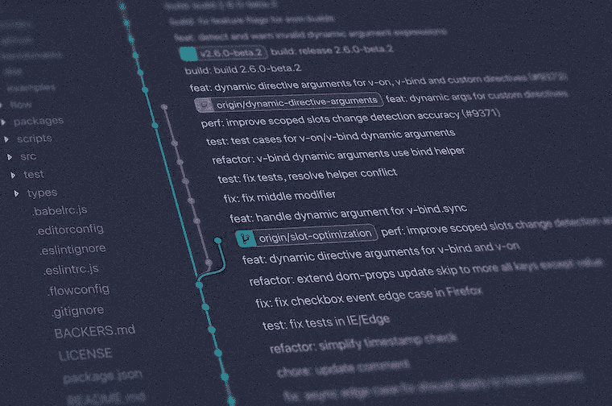
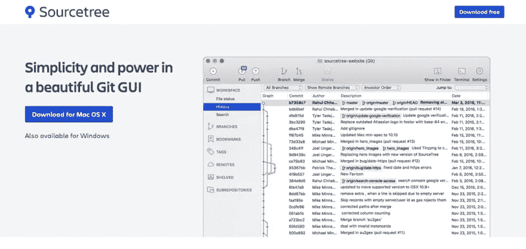

# 给初学者的 Git cheatsheet

> 原文：<https://medium.com/duomly-blockchain-online-courses/git-cheatsheet-for-beginners-ee21bb9c3e3a?source=collection_archive---------1----------------------->

[Duomly — Programming Online Courses](https://www.duomly.com)

本文最初发表于[https://www.blog.duomly.com/git-cheatsheet/](https://www.blog.duomly.com/git-cheatsheet/)

Git 是一项非常有用的技能，在许多公司几乎是必需的。浏览软件工程师的工作机会，你可能会意识到了解 git 几乎和了解一门真正的编程语言一样重要。但是仍然有许多人忘记检查 git 是如何工作的，以及什么命令负责什么动作。

前段时间，当我为 Youtube 创建了一个简单的 Git 和 Github 教程[链接]时，我注意到有很多人对这个话题感兴趣。

这就是为什么今天，我决定用基本的 git 命令创建一个简单的备忘单，当您忘记了必须在命令行中输入什么或者需要刷新您的记忆时，您可以查看并使用它。另外，我想介绍一些每个开发人员都应该知道的基本术语来理解 git-flow。

最后，我还将告诉你 git 的图形用户界面，我以前使用过或者现在正在使用，我非常喜欢它，因为它们非常简单。

如果你不知道如何建立一个 git 仓库，可以看看我们的 Youtube 教程。

[Duomly — Git, and Github tutorial](https://www.youtube.com/watch?v=70e58se9lHk)

开始吧！

## 一些有助于理解 git 命令的基本术语

存储库保存所有项目文件，包括提交和分支。

**分支**是保存特定版本的存储库的副本。git 中的主分支是 master。

提交可以被想象成对特定分支的单次保存。

**checkout** 是在当前分支和命令中指定的分支之间切换的操作。

**主**是存储库的主要分支。

**合并**是一个将变更从一个分支添加到另一个分支的动作。

**fork** 是资源库的副本。

**head** 是您使用的存储库的最近提交。

## 每个人都应该知道的基本 git 命令

`git init | git init [folder]`

Git init 用于从你当前使用的文件夹中初始化一个空的存储库，使用这个命令或者使用文件夹路径，两种方式都是正确的。它在启动一个新项目时使用，或者如果您想要在现有项目中初始化 git repo。

`git clone [repo URL] [folder]`

Git clone 用于将现有的存储库复制到您计算机上的指定文件夹中。Git clone 只能使用 repo URL 作为参数，然后它会将存储库复制到您使用该命令的文件夹中。如果要将存储库复制到计算机上的不同位置，请添加一个文件夹路径作为第二个参数。

`git add [directory | file]`

Git add stage 目录或文件中的所有更改，这取决于您作为参数添加的内容。在大多数情况下，它后面是 git commit 和 git push 命令。

`git commit -m "[message]"`

此命令用于提交所有暂存的更改，并将自定义消息作为字符串传递。通过将-m 参数更改为-am，可以一次添加和提交更改。

`git push`

这是命令，它将更改推送到源分支。

`git status`

Git status 用于检查已修改文件的状态，它显示哪些文件是暂存的、未暂存的和未跟踪的。

`git log`

Git log 用于以默认格式显示提交的历史。

`git diff`

Git diff 显示了索引和当前目录之间所有未分级的差异。此命令可与-staged 一起使用，以显示暂存文件和最新版本之间的差异。另一个选项是使用带有文件名的命令来显示文件和上次提交时的差异。

`git pull`

Git pull 用于从原始分支获取变更，并将变更合并到本地分支中。

`git fetch`

该命令从原始分支中检索最近的更改，但不合并。

## Git 分支命令

`git branch`

该命令显示存储库中所有分支的列表。如果您将分支名称作为参数添加，它也可以创建一个不存在的分支。

`git branch -d [branchname]`

使用-d 标志将删除具有指定分支名称的分支。

`git checkout [branchname]`

该命令切换到名为[branchnamed]的分支。如果您在分支名称前添加-b 标志，它将签出到一个自动创建的新分支。

`git merge [branchname]`

它将具有指定分支名称的分支合并到当前分支。

## Git 撤消更改命令

`git revert [commit]`

此命令创建一个新的提交，该提交撤消在指定提交中所做的更改，并将其应用于当前分支。

`git reset [filename]`

它从暂存中远程指定一个文件，并保持工作目录不变。

## Git 配置命令

`git config -global user.email [user_email]`

`git config -global user.name [user_name]`

上面的命令用于设置当前用户的电子邮件和名称配置。

`git config --global --edit`

这个命令非常有用，因为它允许在文本编辑器中编辑用户配置。

## Git 图形用户界面

不是每个人都喜欢在命令行中使用 git。在那里很容易出错，这需要一些时间来恢复。这就是 git 的 GUI 变得非常流行的原因。让我们检查其中的几个。

**源代码树**

Sourcetree

Sourcetree 是一个 git GUI，可用于 Mac 和 Windows，并且是免费的。我真的很喜欢它的 UI，它让我使用 git 更容易，因为我可以非常清楚地看到所有的变化。

**塔**

Tower

Tower 是另一个很棒的工具，它让使用 git 变得又好又容易。它也适用于 Mac 和 Windows，但这不是免费的。我有机会使用它，他们有一个试用选项，所以每个人都可以尝试这个软件，并检查其所有的优势。

**Github 桌面**

Github Desktop

Github Desktop 是另一个有竞争力的工具，它允许我们以一种友好的方式使用 git。它也适用于 Mac 和 Windows。还有，这是一个开源的应用程序，可以免费使用。

## 结论

在本文中，我使用了最基本的 git 命令，将它保存在一个地方，便于您检查和使用。此外，我列出了几个术语，理解这些术语可能对理解一些命令背后发生的事情非常有帮助。最后，我展示了三个我有机会使用的图形用户界面。在我看来，使用 git GUI 可能非常有帮助，特别是对于初级程序员，他们还不习惯命令行宽度，对于那些喜欢用更简单、更直观的方式使用 git 的人来说。

如果你想学习如何在 Github 中创建你的第一个 git 存储库，看看这个 Youtube 视频，在那里我也分享了一些关于 git GUIs 的信息。

好好编码！

[Duomly — Programming Online Courses](https://www.duomly.com)

感谢您的阅读，
来自 Duomly 的安娜