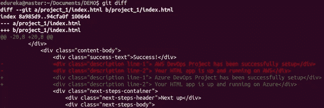

# 前 20 个 Git 命令及示例

> 原文：<https://medium.com/edureka/git-commands-with-example-7c5a555d14c?source=collection_archive---------1----------------------->

Git Commands — Edureka

Git & GitHub 已经从仅仅是一项首选技能稳步上升为当今多种工作角色的必备技能。在本文中，我将讨论在使用 Git 时经常使用的前 20 个 Git 命令。

下面是将要介绍的 Git 命令:

*   git 配置
*   git 初始化
*   git 克隆
*   git 添加
*   git 提交
*   git 差异
*   git 重置
*   git 状态
*   git rm
*   git 日志
*   git show
*   git 标签
*   git 分支
*   git 检验
*   git 合并
*   git 遥控器
*   git 推送
*   git 拉
*   git 贮藏

所以，现在就开始吧！！

# git 配置

## **用法:**git config-global user . name "[name]"

## **用法:**git config-global user . email "[电子邮件地址]"

该命令分别设置提交时使用的作者姓名和电子邮件地址。

# git 初始化

## **用法:**git init[存储库名称]

此命令用于启动新的存储库。

# git 克隆

## **用法:** git 克隆[url]

此命令用于从现有 URL 获取存储库。

# git 添加

## **用法:** git 添加【文件】

此命令将一个或多个文件添加到临时区域。

## **用法:** git add *

此命令将一个或多个添加到临时区域。

# git 提交

## **用法:git commit -m "[键入提交消息]"**

该命令在版本历史记录中永久记录或快照文件。

## **用法:git commit -a**

该命令提交您使用 git add 命令添加的任何文件，并且还提交您从那时起更改的任何文件。

# git 差异

## **用法:git diff**

此命令显示尚未转移的文件差异。

## **用法:git diff–staged**

此命令显示临时区域中的文件与当前最新版本之间的差异。

## 用法:git diff[第一个分支][第二个分支]

该命令显示了上述两个分支之间的差异。

# git 重置

## **用法:git 重置【文件】**

此命令会拆分文件，但会保留文件内容。

## **用法:git 重置[提交]**

此命令在指定的提交后撤消所有提交，并在本地保留更改。

## **用法:git 重置-硬[提交]**

此命令会丢弃所有历史记录，并返回到指定的提交。

# git 状态

## **用法:git 状态**

该命令列出了所有必须提交的文件。

# git rm

## **用法:git rm [file]**

此命令从您的工作目录中删除文件，并分阶段删除。

# git 日志

## **用法:git 日志**

该命令用于列出当前分支的版本历史。

## **用法:git log -follow[file]**

这个命令列出了文件的版本历史，包括文件的重命名。

# git show

## **用法:git show【提交】**

此命令显示指定提交的元数据和内容更改。

# git 标签

## **用法:git 标签[commitID]**

该命令用于为指定的提交提供标记。

# git 分支

## **用法:git 分支**

该命令列出了当前存储库中的所有本地分支。

## **用法:git 分支【分支名称】**

该命令创建一个新分支。

## **用法:git branch -d【分支名称】**

该命令删除特征分支。

# git 检验

## **用法:git checkout【分行名称】**

该命令用于从一个分支切换到另一个分支。

## **用法:git checkout -b【分支名称】**

该命令创建一个新分支，并切换到该分支。

# git 合并

## **用法:git merge【分支名称】**

该命令将指定分支的历史记录合并到当前分支中。

# git 遥控器

## **用法:git 远程添加【变量名】【远程服务器链接】**

该命令用于将本地存储库连接到远程服务器。

# git 推送

## **用法:git push【变量名】master**

该命令将主分支提交的更改发送到您的远程存储库。

## **用法:git push-all[变量名]**

该命令将所有分支推送到您的远程存储库。

## **用法:git 推送【变量名】:【分支名】**

这个命令将分支提交发送到您的远程存储库。

# git 拉

## **用法:git pull【资源库链接】**

该命令获取远程服务器上的更改并将其合并到您的工作目录中。

# git 贮藏

## **用法:git stash save**

该命令临时存储所有修改过的跟踪文件。

## **用法:git stash pop**

此命令恢复最近隐藏的文件。

## **用法:git stash list**

这个命令列出了所有隐藏的变更集。

## **用法:git stash drop**

这个命令会丢弃最近隐藏的变更集。

这就把我们带到了文章的结尾。如果你想查看更多关于人工智能、Python、道德黑客等市场最热门技术的文章，你可以参考 Edureka 的官方网站。

请留意本系列中的其他文章，它们将解释 DevOps 的各个方面。

> *1。* [*DevOps 教程*](/edureka/devops-tutorial-89363dac9d3f)
> 
> *2。* [*Git 教程*](/edureka/git-tutorial-da652b566ece)
> 
> *3。* [*詹金斯教程*](/edureka/jenkins-tutorial-68110a2b4bb3)
> 
> *4。* [*Docker 教程*](/edureka/docker-tutorial-9a6a6140d917)
> 
> *5。* [*Ansible 教程*](/edureka/ansible-tutorial-9a6794a49b23)
> 
> *6。* [*傀儡教程*](/edureka/puppet-tutorial-848861e45cc2)
> 
> 7。 [*厨师教程*](/edureka/chef-tutorial-8205607f4564)
> 
> *8。* [*Nagios 教程*](/edureka/nagios-tutorial-e63e2a744cc8)
> 
> *9。* [*如何编排 DevOps 工具？*](/edureka/devops-tools-56e7d68994af)
> 
> *10。* [*连续交货*](/edureka/continuous-delivery-5ca2358aedd8)
> 
> *11。* [*持续集成*](/edureka/continuous-integration-615325cfeeac)
> 
> *12。* [*连续部署*](/edureka/continuous-deployment-b03df3e3c44c)
> 
> *13。* [*持续交付 vs 持续部署*](/edureka/continuous-delivery-vs-continuous-deployment-5375642865a)
> 
> *14。* [*CI CD 管道*](/edureka/ci-cd-pipeline-5508227b19ca)
> 
> *15。* [*Docker 作曲*](/edureka/docker-compose-containerizing-mean-stack-application-e4516a3c8c89)
> 
> *16。* [*码头工人群*](/edureka/docker-swarm-cluster-of-docker-engines-for-high-availability-40d9662a8df1)
> 
> *17。* [*Docker 联网*](/edureka/docker-networking-1a7d65e89013)
> 
> *18。*
> 
> **19。* [*岗位职责*](/edureka/ansible-roles-78d48578aca1)*
> 
> **20。* [*适用于 AWS*](/edureka/ansible-for-aws-provision-ec2-instance-9308b49daed9)*
> 
> **21。* [*詹金斯管道*](/edureka/jenkins-pipeline-tutorial-continuous-delivery-75a86936bc92)*
> 
> **22。* [*顶级停靠命令*](/edureka/docker-commands-29f7551498a8)*
> 
> *23。[*Git vs GitHub*](/edureka/git-vs-github-67c511d09d3e)*
> 
> **24。* [*DevOps 面试问题*](/edureka/devops-interview-questions-e91a4e6ecbf3)*
> 
> **25。* [*谁是 DevOps 工程师？*](/edureka/devops-engineer-role-481567822e06)*
> 
> *26。 [*DevOps 生命周期*](/edureka/devops-lifecycle-8412a213a654)*
> 
> **27。*[*Git ref log*](/edureka/git-reflog-dc05158c1217)*
> 
> *28。*
> 
> ***29。* [*组织正在寻找的顶尖 DevOps 技能*](/edureka/devops-skills-f6a7614ac1c7)**
> 
> **30。 [*瀑布 vs 敏捷*](/edureka/waterfall-vs-agile-991b14509fe8)**
> 
> ***31。* [*Maven 用于构建 Java 应用*](/edureka/maven-tutorial-2e87a4669faf)**
> 
> ***32。* [*詹金斯小抄*](/edureka/jenkins-cheat-sheet-e0f7e25558a3)**
> 
> ***33。* [*Ansible 备忘单*](/edureka/ansible-cheat-sheet-guide-5fe615ad65c0)**
> 
> ***34。* [*Ansible 面试问答*](/edureka/ansible-interview-questions-adf8750be54)**
> 
> ***35。* [*50 码头工人面试问题*](/edureka/docker-interview-questions-da0010bedb75)**
> 
> ***36。* [*敏捷方法论*](/edureka/what-is-agile-methodology-fe8ad9f0da2f)**
> 
> ***37。* [*詹金斯面试问题*](/edureka/jenkins-interview-questions-7bb54bc8c679)**
> 
> ***38。* [*Git 面试题*](/edureka/git-interview-questions-32fb0f618565)**
> 
> ***39。* [*Docker 架构*](/edureka/docker-architecture-be79628e076e)**
> 
> ***40。*[*devo PS 中使用的 Linux 命令*](/edureka/linux-commands-in-devops-73b5a2bcd007)**
> 
> **41。 [*詹金斯 vs 竹子*](/edureka/jenkins-vs-bamboo-782c6b775cd5)**
> 
> **42。 [*Nagios 面试问题*](/edureka/nagios-interview-questions-f3719926cc67)**
> 
> ***43。* [*DevOps 实时场景*](/edureka/jenkins-x-d87c0271af57)**
> 
> ***44。* [*詹金斯和詹金斯 X 的区别*](/edureka/jenkins-vs-bamboo-782c6b775cd5)**
> 
> **45。[*Windows Docker*](/edureka/docker-for-windows-ed971362c1ec)**
> 
> **46。[*Git vs Github*](http://git%20vs%20github/)**

***原载于 2018 年 7 月 23 日*[*https://www.edureka.co*](https://www.edureka.co/blog/git-commands-with-example/)*。***