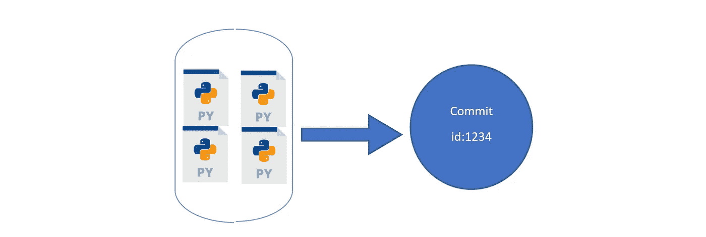
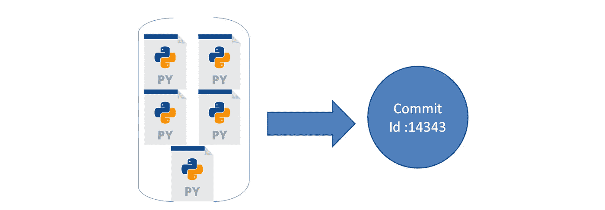
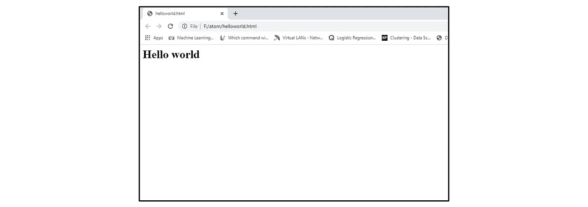
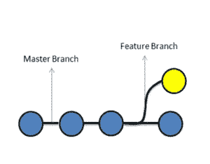
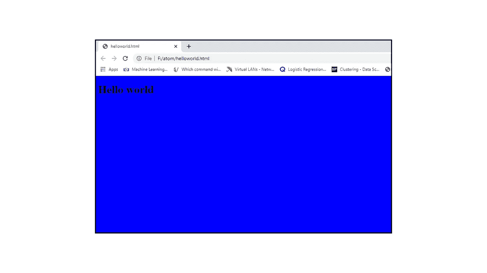
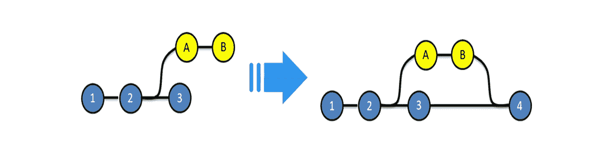
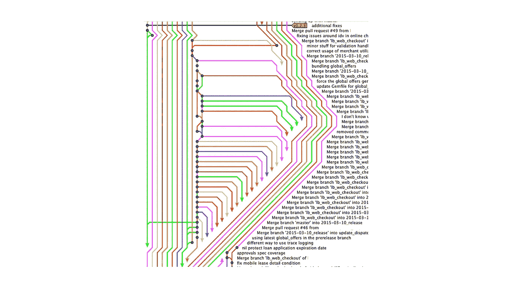
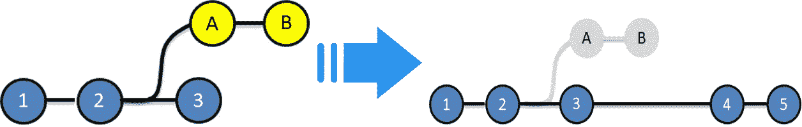
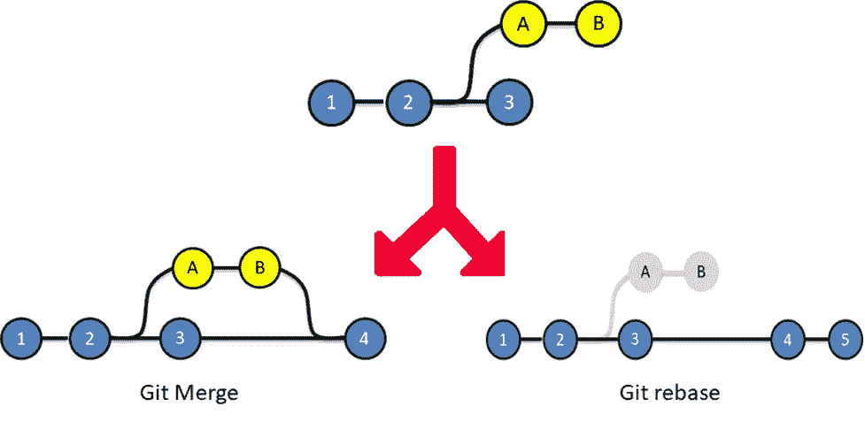

# Git Rebase vs Git Merge:哪个更好？

> 原文：<https://medium.com/edureka/git-rebase-vs-git-merge-which-is-better-b14f1af1b655?source=collection_archive---------0----------------------->

关于 git merge 和 git rebase 哪个更好，有很多争论。今天在关于 Git Rebase vs Merge 的文章中，我们将消除你对 Git Rebase 和 Git Merge 的所有疑虑。这两种技术用于相同的目的，因此由于它们的相似性，理解它们有点棘手。在博客结束时，你会知道什么时候使用 Git Rebase vs Merge。

Git Merge 和 Git Rebase 命令用于将多个开发人员的工作合并到一个代码中。这两个命令的最终目标是相同的，但是它们的用法不同。今天在这篇文章中，我们将尝试理解 Git 合并和 Git Rebase。

如果你不喜欢阅读，这里有一个关于 Git Rebase vs Merging 的视频，可以帮助你理解这篇博客中写的是什么。

因此，以下是本文涵盖的主题:

*   Git 是如何工作的？
*   什么是提交？
*   什么是分支？
*   什么是合并？
*   Git 合并
*   Git Rebase
*   Git 合并 vs Git Rebase。
*   Git Rebase 和 Git Merge 怎么一起用？

Git 是如何工作的？

为了理解 git 的工作，我们需要理解 git 中的两个基本概念，即 git 提交和 git 分支。让我们分别理解这两个术语。

# 什么是提交？

提交被定义为存储代码及其更改的位置。让我们举个例子，从下图简单讨论一下:

在图 1 中，让我们假设我们有四个 python 文件。我们在 git 上保存了它们。这四个 python 文件将保存在一个提交中。每个提交都有一个提交 id，在我们的例子中是 1234。现在，假设我们通过添加另一个 python 文件对代码做了一些更改。git 中的这些更改将被保存为另一个 commit-id 为 14343 的 commit。这可以在图 2 中看到。因此，每当我们做出任何更改，它都会生成一个新的提交。

**图 2:存储库中所做的更改将被保存为一个新的提交，具有一个新的提交 id**

# 什么是分支？

分支是代码的不同独立版本的表示。让我们举个例子来理解这一点，假设你有一个网站目前正在运行。网站看起来像这样。

**图 3:变更前的网站样本**

您希望向该网站添加更多功能。为此，你将不得不改变网站的代码。但是，如果您正在更改代码，您不希望这些更改反映在已部署的主网站中。你是做什么的？理想情况下，你会把这个网站的代码复制到一个新的文件夹中。对代码进行修改，一旦修改完成，你将替换主文件夹中的代码，对吗？让我们了解一下如何在 git 中做上面的事情。

因此，在 git 中，为了隔离不同版本的代码，我们有分支。默认情况下，所有代码都存储在主分支上。所以，我们上面给你看的网站就是大师分支。现在，我们不想接触主分支代码，我们想将主分支的代码复制到一个新的地方，在那里我们可以实验或更改代码。因此，不会影响主分支。因此，我们从主分支创建一个新分支，让我们称之为‘特征分支’。现在，您将在特性分支上进行的任何新的更改，都不会影响主分支上的代码。

**图 4:主分支和特征分支**

一旦您完成了更改，我们只需将“功能”分支的更改“合并”到“主分支”中。现在，在特性分支中所做的更改也将存在于主分支中。

**图 5:特征分支与主分支的合并**

如果我们考虑合并后的网站示例，可以在下图中看到变化:

**图 6:将变更合并到主分支后，变更被显示在网站上。**

如果您不理解合并，不要担心，在下一节中一切都会很清楚。

# 什么是合并？

总的来说，合并意味着将某物结合成一个单一的实体。

Git 合并是一种技术，用于包含从一个分支到另一个分支的变更。

因此，让我们以下面的图表为例，它显示了两个分支(特征分支和主分支)合并前后的状态。蓝色提交在主分支上，黄色提交在特征分支上。

**图 7:合并前**

在图 7 中:在合并之前，我们可以看到在主分支上有一些提交。在主服务器上提交“2”后，我们创建了一个功能分支。后来，我们以提交 A 和 b 的形式在功能分支中做了一些更改。我们还以提交 3 的形式在主分支中做了一些更改。

在当前场景中，主分支具有提交 1、2 和 3 的代码，但是它没有来自特性分支的提交 A 和 B 的更改。

类似地，由于功能分支是在提交“2”时从主服务器中分支出来的，因此它具有来自提交 1、2、A 和 B 的代码更改，但是它没有来自主服务器上提交 3 的更改。

下面，我们合并了 master 上的 feature 分支，让我们了解一下发生了什么。

**图 8:合并后**

我们合并了主服务器上的功能分支，导致提交 4。主服务器上的 Commit 4 包含代码的所有更改，即 Commit 1、2、3、A 和 b。现在，我们已经了解了合并，让我们了解我们可以在 git 中执行的不同类型的合并。在 Git 中，合并有两种类型:

*   Git 合并
*   Git Rebase

让我们详细了解一下这两者

**Git 合并**
Git 合并是 Git 中的合并技术之一，其中分支上提交的日志是完整的。

让我们举一个例子，如果我们有一个项目，在主分支上有 3 个提交，分别为提交 1、2、3，而特性分支提交为提交 A 和 B，如果我们执行 git 合并操作，那么提交 A 和 B 将合并为提交 4 到主分支上。这在图 9 中进行了描述。

**图 Git 合并前后。**

**优势:**

*   这些日志非常详尽，有助于理解每次合并是如何以及何时发生的完整历史
*   发现错误并解决它们是很容易的。
*   导致笨拙的日志/历史

**缺点:**

*   导致笨拙的日志/历史
*   不太用户友好

**图 10:示例显示了使用 git-merge** 合并的具有多个分支的存储库

**Git-Rebase**
Git Rebase 类似于 git merge，但是在这种技术中，日志在合并后被修改。Git rebase 的引入是为了克服合并的限制，也就是说，使存储库历史的日志看起来是线性的。

让我们举一个例子，如果我们有一个项目，在主分支上有 3 个提交，分别为提交 1、2、3，在功能分支上有提交 A 和 B。如果我们执行 git rebase 操作，那么提交 A 和 B 将作为提交 4 和 5 重新基于主分支，并且没有功能分支的日志。这在图 12 中进行了描述。

**图 12:git 重置前后**

**优点:**

*   对数是线性的
*   很容易完成这个项目。

**缺点:**

*   我们无法跟踪提交是何时以及如何在目标分支上被合并的

# Git 合并与 Git Rebase:

## 我们什么时候使用 Git Merge vs Git Rebase？

让我们用一个例子来理解它，请参考下图:

**图 13:描述了在 Git 合并和 Git Rebase 之后存储库中的差异**

在 git merge 中，查看结束图，可以看出提交 A 和 B 来自特性分支。然而，在 git-rebase 图中，很难理解提交 A 和 B 来自哪里。因此，当我们希望我们的团队以一种他们可以识别每个提交来自哪里的方式理解日志时，我们确实要进行 git 合并。当存储库的日志不会被其他任何人引用时，我们使用 Git Rebase。总而言之，当我们在分支上工作时，我们可以使用 Git Rebase，这是其他开发人员看不到的。当目标和源分支可以被其他开发人员看到时，我们使用 Git Merge。

# Git Rebase 和 Git Merge 怎么一起用？

让我们举一个例子，如果我们有一个项目，它包括一个主分支，有 3 个提交，分别是 1、2、3 和 2 个特征分支，在特征分支 1 上提交 A、B，在特征分支 2 上提交 C、D，如图 14 所示。

让我们假设开发人员 A 正在开发特性分支 1。

为了试验代码，他创建了另一个分支特性 branch 2，在其中做了一些修改，并通过提交 C 和 d 来完成。因此，他可以在功能 1 的基础上改变功能 2 的基础。

现在，他终于可以合并主图形上的特征 1 分支，结果如下图所示。

以上是其他开发人员看到的最终日志。他们只能看到在特性分支 1 上进行的提交，然后最终在主分支上与提交 4 合并。

至此，我们结束了 Git Merge vs Git Rebase 博客。我们确信你对 Git Merge 和 Git Rebase 的困惑现在已经很清楚了。如果没有，我们建议您先浏览一下 Git 的基础知识，查看我们的 Git 教程博客了解更多信息。

此外，如果你的目标是成为一名 Devops 工程师并需要专业帮助，请查看 Edureka 的 Devops 认证培训，并获得来自世界各地的世界级 Devops 工程师的指导！

如果你想查看更多关于人工智能、Python、道德黑客等市场最热门技术的文章，那么你可以参考 [Edureka 的官方网站。](https://www.edureka.co/blog/?utm_source=medium&utm_medium=content-link&utm_campaign=git-rebase-vs-merge)

请留意本系列中的其他文章，它们将解释 DevOps 的各个方面。

> *1。* [*DevOps 教程*](/edureka/devops-tutorial-89363dac9d3f)
> 
> *2。* [*Git 教程*](/edureka/git-tutorial-da652b566ece)
> 
> *3。* [*詹金斯教程*](/edureka/jenkins-tutorial-68110a2b4bb3)
> 
> *4。* [*Docker 教程*](/edureka/docker-tutorial-9a6a6140d917)
> 
> *5。* [*Ansible 教程*](/edureka/ansible-tutorial-9a6794a49b23)
> 
> *6。* [*木偶教程*](/edureka/puppet-tutorial-848861e45cc2)
> 
> *7。* [*厨师教程*](/edureka/chef-tutorial-8205607f4564)
> 
> *8。* [*Nagios 教程*](/edureka/nagios-tutorial-e63e2a744cc8)
> 
> *9。* [*如何编排 DevOps 工具？*](/edureka/devops-tools-56e7d68994af)
> 
> *10。* [*连续交货*](/edureka/continuous-delivery-5ca2358aedd8)
> 
> *11。* [*持续集成*](/edureka/continuous-integration-615325cfeeac)
> 
> 12。 [*连续部署*](/edureka/continuous-deployment-b03df3e3c44c)
> 
> *13。* [*持续交付 vs 持续部署*](/edureka/continuous-delivery-vs-continuous-deployment-5375642865a)
> 
> *14。* [*CI CD 管道*](/edureka/ci-cd-pipeline-5508227b19ca)
> 
> 15。 [*码头工人撰写*](/edureka/docker-compose-containerizing-mean-stack-application-e4516a3c8c89)
> 
> 16。 [*码头工人群*](/edureka/docker-swarm-cluster-of-docker-engines-for-high-availability-40d9662a8df1)
> 
> 17。 [*Docker 联网*](/edureka/docker-networking-1a7d65e89013)
> 
> *18。*
> 
> **19。* [*可能的角色*](/edureka/ansible-roles-78d48578aca1)*
> 
> *20。 [*适用于 AWS*](/edureka/ansible-for-aws-provision-ec2-instance-9308b49daed9)*
> 
> **21。* [*詹金斯*](/edureka/jenkins-pipeline-tutorial-continuous-delivery-75a86936bc92)*
> 
> **22。* [*顶级 Docker 命令*](/edureka/docker-commands-29f7551498a8)*
> 
> **23。*[*Git vs GitHub*](/edureka/git-vs-github-67c511d09d3e)*
> 
> **24。* [*顶级 Git 命令*](/edureka/git-commands-with-example-7c5a555d14c)*
> 
> **25。* [*DevOps 面试问题*](/edureka/devops-interview-questions-e91a4e6ecbf3)*
> 
> **26。* [*谁是 DevOps 工程师？*](/edureka/devops-engineer-role-481567822e06)*
> 
> **27。* [*DevOps 生命周期*](/edureka/devops-lifecycle-8412a213a654)*
> 
> **28。*[*Git Reflog*](/edureka/git-reflog-dc05158c1217)*
> 
> **29。**
> 
> **三十岁。 [*组织正在寻找的顶尖 DevOps 技能*](/edureka/devops-skills-f6a7614ac1c7)**
> 
> **三十岁。 [*瀑布 vs 敏捷*](/edureka/waterfall-vs-agile-991b14509fe8)**
> 
> ***31。* [*詹金斯备忘单*](/edureka/jenkins-cheat-sheet-e0f7e25558a3)**
> 
> ***32。* [*Ansible 小抄*](/edureka/ansible-cheat-sheet-guide-5fe615ad65c0)**
> 
> **33。 [*Ansible 面试问答*](/edureka/ansible-interview-questions-adf8750be54)**
> 
> ***三十四。* [*50 码头工人面试问题*](/edureka/docker-interview-questions-da0010bedb75)**
> 
> **35。 [*敏捷方法论*](/edureka/what-is-agile-methodology-fe8ad9f0da2f)**
> 
> ***36。* [*詹金斯面试问题*](/edureka/jenkins-interview-questions-7bb54bc8c679)**
> 
> ***37。* [*Maven 用于构建 Java 应用*](/edureka/maven-tutorial-2e87a4669faf)**
> 
> **38。 [*Docker 架构*](/edureka/docker-architecture-be79628e076e)**
> 
> ***39。*[*devo PS 中使用的 Linux 命令*](/edureka/linux-commands-in-devops-73b5a2bcd007)**
> 
> ***40。* [*詹金斯 vs 竹子*](/edureka/jenkins-vs-bamboo-782c6b775cd5)**
> 
> ***41。* [*Nagios 教程*](/edureka/nagios-tutorial-e63e2a744cc8)**
> 
> ***42。* [*Nagios 面试问题*](/edureka/nagios-interview-questions-f3719926cc67)**
> 
> ***43。* [*DevOps 实时场景*](/edureka/jenkins-x-d87c0271af57)**
> 
> ***44。* [*詹金斯和詹金斯 X 的区别*](/edureka/jenkins-vs-bamboo-782c6b775cd5)**
> 
> ***45。*[*Windows Docker*](/edureka/docker-for-windows-ed971362c1ec)**
> 
> ***46。*[*Git vs Github*](http://git%20vs%20github/)**

***原载于 2022 年 1 月 18 日*[*【https://www.edureka.co】*](https://www.edureka.co/blog/git-rebase-vs-merge/)*。***