# Git Reflog —如何恢复未合并的已删除分支

> 原文：<https://medium.com/edureka/git-reflog-dc05158c1217?source=collection_archive---------0----------------------->

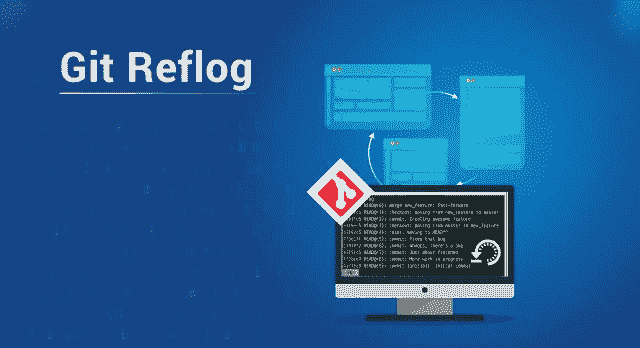

Git Reflog — Edureka

*“您是否曾经丢失过一个分支，其源代码尚未合并到‘发布’分支或‘主’分支中？如果您想要重新生成一个已删除的分支，尽管它的工作已经被合并到主分支中，该怎么办？”。那么，解决这种情况的唯一办法就是****Git ref log****。*

通过这篇关于 Git Reflog 的文章，我将帮助您理解您在分支上的工作可能丢失的场景，以及如何恢复分支。此外，本文将重点介绍在大型项目中防止分支意外丢失的方法。

1.  什么是 Git Reflog？
2.  如何以及何时删除分支？
3.  恢复已删除的分支
4.  恢复删除的分支时，恢复了哪些工作？
5.  Git Reflog 子命令

那么，让我们从这篇文章开始吧。

考虑一个场景，一个维护者必须合并来自不同合作者的许多特性分支，然后最终删除它们；但是在工作合并之前，分支被意外删除了？

在继续本文之前，让我告诉你这在 Git 中是不可能的。Git 命令是安全的，并充当检查站；不会允许你这么做的。所以，这就是 Git Reflog 的用武之地。

# 什么是 Git Reflog？

“reflog”命令保存引用日志，例如分支何时被创建或克隆、检出、重命名的提交快照，或者对分支所做的任何提交由存储库的引用(分支或标签)中的 **的**跟踪所做的每个单个改变来维护，并且保存本地创建或检出的分支和标签的日志历史。Git 并通过“reflog”命令列出。****

> *****命令:*** *git reflog***

**这个命令必须在丢失分支的存储库中执行。如果您考虑远程存储库的情况，那么您必须在拥有分支的开发人员的机器上执行 reflog 命令。**

**现在你知道了什么是 Git Reflog，让我们试着删除一个合并的和一个未合并的分支，看看 Git 是如何处理的？**

## **步骤 1:列出合并到主目录中的分支**

**首先，如果您在其他分支上，使用以下命令检查' **master** '分支:**

```
$git checkout master
```

****输出****

**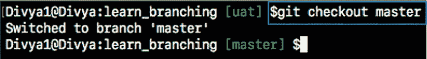**

**现在，要获得合并分支的列表，请使用以下命令:**

```
$git branch --merged
```

****输出:****

**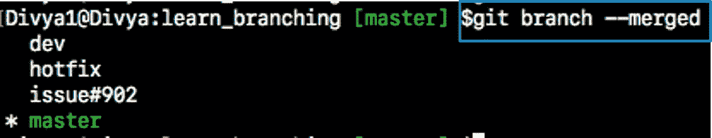**

## **步骤 1.1:然后，删除合并的分支:**

```
$git branch -d issue#902
```

****输出:****

**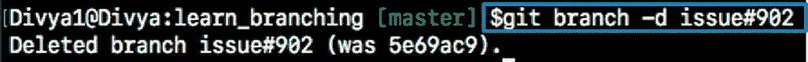**

**分支“问题#902”已被成功删除，因为它已经合并到“主”分支中。**

## **步骤 2:现在，让我们列出没有合并到主目录中的分支。**

```
$git branch --no-merged
```

****输出****

**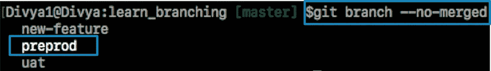**

## ****步骤 2.2:最后，让我们用下面的命令删除一个未合并的分支:****

```
$git branch -d prepod
```

**如果你试图删除一个未完成工作的分支，比如“预编程”分支，git 会显示一条警告消息。**

****输出****

**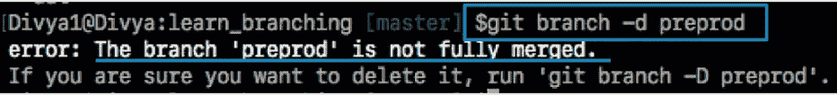**

**现在，在我告诉您如何在 Git Reflog 上恢复数据(本文)之前，让我告诉您当一个分支被删除时会发生什么，以及在什么情况下可以恢复该分支。**

# **如何以及何时删除分支？**

**正如我们所知，Git 是一个**分布式版本控制系统** (DVCS)，每一台拥有库的克隆或副本的机器既充当**节点**又充当**中枢**。这意味着每台机器都有自己的整个存储库代码和历史的副本。不用说；你将**与他人分享**你的作品，同样**出版**。**

**因此，在这样的场景中，当一个分支在一个真实的场景中被删除时，可能会有 3 种情况，在这个场景中，许多参与者在一个大的项目上工作。可能会出现以下情况:**

## **案例 1 —本地删除的未合并分支**

**考虑一个场景，开发人员在本地将特性分支合并到主分支中，然后使用带有“- **d** ”标志的“ **git branch** ”命令删除特性分支，如前面的截图所示。**

*****命令:****' git branch-d branch _ name '***

***也可能发生这样的情况，开发人员决定丢弃分支上的更改，并决定使用以下命令删除分支，而不将其与任何其他分支合并:***

******命令:***' git branch-D branch _ name '***

***使用上面的命令，开发人员会强制删除覆盖 git 警告的分支***

```
*$git branch -D preprod*
```

*****输出*****

***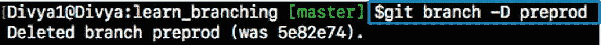***

*****注意**:当您运行“git branch”命令时，“预编程”分支将不再列出。因此，您保存在此分支上的工作将会丢失。***

## *****案例 2——开发人员删除了共享存储库中的一个分支*****

***考虑一个场景，具有读/写访问权限的开发人员试图通过使用带有“— delete”标志的“git push”命令来强制删除远程分支。***

```
*$git push origin --delete quickfix*
```

*****输出*****

***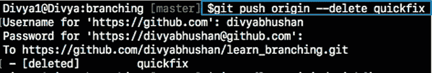***

***除此之外，还有一种情况，即未经授权的用户或恶意用户强制删除远程分支。在这种情况下，只有当维护者先前已经检出这个分支时，维护者才能够恢复被删除的‘quick fix’分支。在这种情况下，它的本地存储库仍然有它的引用日志。***

***如果维护者不能恢复分支，那么删除它的分支的所有者必须从他/她的本地引用日志中恢复。***

## ***案例 3 —具有超级权限的钩子脚本删除分支***

***这可能是一种罕见但可能的情况，即某个 git 操作事件触发了一个钩子脚本，并强制删除尚未合并的分支。您可以考虑将上面提到的命令之一用 sudo 特权编写在一个钩子脚本中。***

***现在，您已经知道当您删除分支时会发生什么，让我们继续这篇关于 Git Reflog 的文章，看看如何恢复丢失的分支。***

# ***使用 Git Reflog 恢复删除的分支***

## ***步骤 1:所有引用的历史日志***

***获取此存储库中所有引用的所有本地记录历史日志的列表(“master”、“uat”和“prepod”)。***

```
*git reflog*
```

***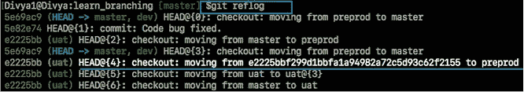***

## ***步骤 2:识别历史印记***

***从上面的快照可以看出，**突出显示的提交 id: e2225bb 以及头指针索引:4** 是从指向您最新工作的当前头指针创建“**预编程**分支时的提交 id。***

## ***第三步:恢复***

***要恢复回**预编程的**分支，使用命令‘git check out’传递索引 id 为 4 的头指针引用。这是创建“预编程”分支时的指针引用，长提交 id 在输出屏幕截图中突出显示。***

```
*git checkout -b preprod HEAD@{4}*
```

*****输出*****

***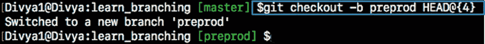***

***瞧啊。**preprog**分支恢复回你所有的源代码。***

*****注意:**让我分解一下上面使用的‘git check out’命令，帮助你更好地理解:***

***“git checkout”命令是一个重载命令(就像任何 Java 重载函数一样)。这是恢复实际分支的部分。***

***这个命令首先检查到由 *HEAD@{4}指针*指向的较早的历史时间戳，然后使用“-b”选项创建一个名为“preprod”的分支；并将您的工作目录切换到新创建的分支。***

***这意味着分支切换将从“主”切换到“预编程”，如输出屏幕所示。您现在可以根据您的分支模型，将它与“主”或“发布”分支合并。***

***现在，您已经知道了如何恢复一个分支，让我告诉您当一个被删除的分支被恢复时，什么工作被恢复。***

# ***恢复删除的分支时，恢复了哪些工作？***

***隐藏并保存在隐藏索引列表中的文件将被恢复回来。任何未被跟踪的文件都将丢失。此外，这是一个好主意，总是阶段和提交您的工作或隐藏它们。***

******要获取特定分支或标签的日志引用，运行命令“git reflog < ref_name >”。******

***示例:要单独检查“uat”分支的日志引用，请使用命令“git reflog uat”。***

# ***Git Reflog 子命令***

## ***git 参考日志***

***打开手册页的命令***

```
*$git reflog --help*
```

*****输出*****

***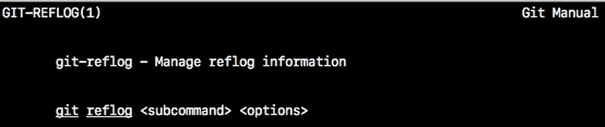***

## ***git 参考日志显示***

***显示命令行中提供的引用的日志。***

```
*git reflog show master@{0}*
```

## *****git reflog** **过期*****

***该命令用于删除旧的参考日志条目。***

```
*git reflog expire*
```

## ***git 引用日志删除***

***该命令从参考日志历史中删除单个条目。***

```
*git reflog delete*
```

## *****git ref log**存在***

***此命令检查 ref(分支或标记)是否有 reflog —记录历史条目。***

```
*git reflog exists*
```

***除了上面提到的命令,“Git Reflog”命令还接受各种子命令，以及取决于上面提到的子命令的不同选项。从终端窗口运行" **git reflog -help** "获取更多信息。***

***至此，我们结束了这篇关于 Git Reflog 的文章。如果你想查看更多关于人工智能、Python、道德黑客等市场最热门技术的文章，那么你可以参考 [Edureka 的官方网站。](https://www.edureka.co/blog/?utm_source=medium&utm_medium=content-link&utm_campaign=git-reflog)***

***请留意本系列中的其他文章，它们将解释 DevOps 的各个方面。***

> ****1。* [*DevOps 教程*](/edureka/devops-tutorial-89363dac9d3f)***
> 
> ****2。* [*饭桶教程*](/edureka/git-tutorial-da652b566ece)***
> 
> ****3。* [*詹金斯教程*](/edureka/jenkins-tutorial-68110a2b4bb3)***
> 
> ****4。* [*Docker 教程*](/edureka/docker-tutorial-9a6a6140d917)***
> 
> ****5。* [*Ansible 教程*](/edureka/ansible-tutorial-9a6794a49b23)***
> 
> ****6。* [*木偶教程*](/edureka/puppet-tutorial-848861e45cc2)***
> 
> ****7。* [*厨师教程*](/edureka/chef-tutorial-8205607f4564)***
> 
> ****8。* [*Nagios 教程*](/edureka/nagios-tutorial-e63e2a744cc8)***
> 
> ****9。* [*如何编排 DevOps 工具？*](/edureka/devops-tools-56e7d68994af)***
> 
> ***10。 [*连续交货*](/edureka/continuous-delivery-5ca2358aedd8)***
> 
> ****11。* [*持续集成*](/edureka/continuous-integration-615325cfeeac)***
> 
> ****12。* [*连续部署*](/edureka/continuous-deployment-b03df3e3c44c)***
> 
> ***13。 [*连续交付 vs*](/edureka/continuous-delivery-vs-continuous-deployment-5375642865a)***
> 
> ****14。* [*CI CD 管道*](/edureka/ci-cd-pipeline-5508227b19ca)***
> 
> ***15。 [*Docker 作曲*](/edureka/docker-compose-containerizing-mean-stack-application-e4516a3c8c89)***
> 
> ****16。* [*码头工人群*](/edureka/docker-swarm-cluster-of-docker-engines-for-high-availability-40d9662a8df1)***
> 
> ****17。* [*Docker 联网*](/edureka/docker-networking-1a7d65e89013)***
> 
> ****18。* [*易变拱顶*](/edureka/ansible-vault-secure-secrets-f5c322779c77)***
> 
> ****19。* [*岗位职责*](/edureka/ansible-roles-78d48578aca1)***
> 
> ****20。* [*适用于 AWS*](/edureka/ansible-for-aws-provision-ec2-instance-9308b49daed9)***
> 
> ****21。* [*詹金斯管道*](/edureka/jenkins-pipeline-tutorial-continuous-delivery-75a86936bc92)***
> 
> ****22。* [*顶级 Docker 命令*](/edureka/docker-commands-29f7551498a8)***
> 
> ****23。*[*Git vs GitHub*](/edureka/git-vs-github-67c511d09d3e)***
> 
> ****24。* [*顶级 Git 命令*](/edureka/git-commands-with-example-7c5a555d14c)***
> 
> ****25。* [*DevOps 面试问题*](/edureka/devops-interview-questions-e91a4e6ecbf3)***
> 
> ****26。* [*谁是 DevOps 工程师？*](/edureka/devops-engineer-role-481567822e06)***
> 
> ****27。* [*DevOps 生命周期*](/edureka/devops-lifecycle-8412a213a654)***
> 
> ****28。* [*可变配置*](/edureka/ansible-provisioning-setting-up-lamp-stack-d8549b38dc59)***
> 
> ***29。 [*组织寻找的顶尖 DevOps 技能*](/edureka/devops-skills-f6a7614ac1c7)***
> 
> ****三十。* [*瀑布 vs 敏捷*](/edureka/waterfall-vs-agile-991b14509fe8)***
> 
> ****31。* [*Maven 用于构建 Java 应用*](/edureka/maven-tutorial-2e87a4669faf)***
> 
> ***32。 [*詹金斯小抄*](/edureka/jenkins-cheat-sheet-e0f7e25558a3)***
> 
> ****33。*[](/edureka/ansible-cheat-sheet-guide-5fe615ad65c0)***
> 
> ****34。 [*可答面试问答*](/edureka/ansible-interview-questions-adf8750be54)****
> 
> *****35。* [*50 码头工人面试问题*](/edureka/docker-interview-questions-da0010bedb75)****
> 
> *****36。* [*敏捷方法论*](/edureka/what-is-agile-methodology-fe8ad9f0da2f)****
> 
> *****37。* [*詹金斯面试问题*](/edureka/jenkins-interview-questions-7bb54bc8c679)****
> 
> *****38。* [*Git 面试问题*](/edureka/git-interview-questions-32fb0f618565)****
> 
> *****39。* [*Docker 架构*](/edureka/docker-architecture-be79628e076e)****
> 
> *****40。*[*devo PS 中使用的 Linux 命令*](/edureka/linux-commands-in-devops-73b5a2bcd007)****
> 
> *****41。* [*詹金斯 vs 竹子*](/edureka/jenkins-vs-bamboo-782c6b775cd5)****
> 
> *****42。* [*Nagios 面试问题*](/edureka/nagios-interview-questions-f3719926cc67)****
> 
> *****43。* [*DevOps 实时场景*](/edureka/jenkins-x-d87c0271af57)****
> 
> *****44。* [*詹金斯和詹金斯 X 的区别*](/edureka/jenkins-vs-bamboo-782c6b775cd5)****
> 
> *****45。*[*Windows Docker*](/edureka/docker-for-windows-ed971362c1ec)****
> 
> *****46。*[*Git vs Github*](http://git%20vs%20github/)****

*****原载于 2019 年 6 月 25 日*[*【https://www.edureka.co】*](https://www.edureka.co/blog/git-reflog)*。*****