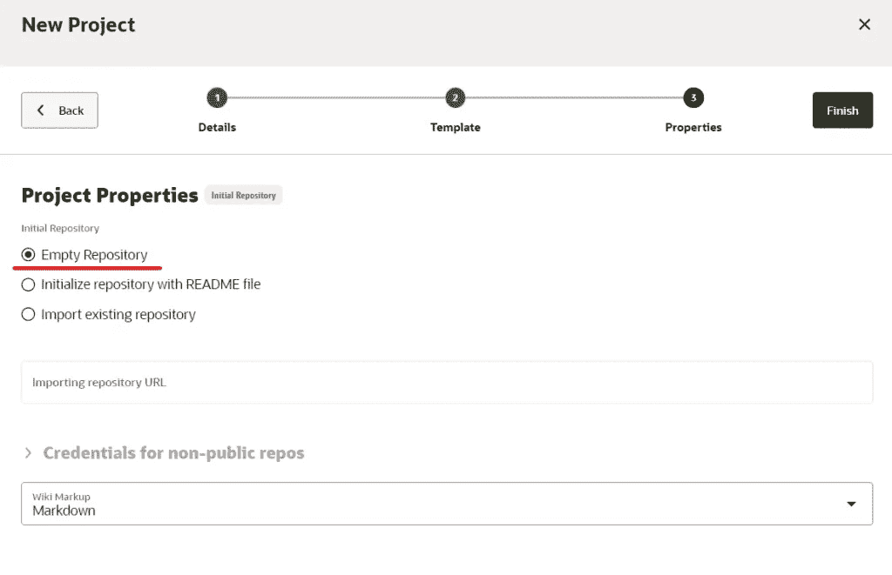
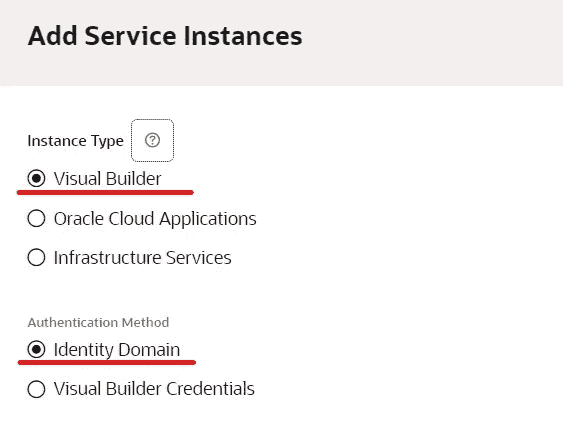

# 使用 VB Studio 管理 Oracle 集成工件的 Git 源代码

> 原文：<https://medium.com/oracledevs/git-source-code-management-for-oracle-integration-artifacts-using-vb-studio-f18bb963f518?source=collection_archive---------0----------------------->

# 概观

Oracle Visual Builder Studio(VB Studio)是一个功能强大的应用程序开发平台，使您的团队能够在应用程序开发生命周期的所有阶段成功地组织和管理他们的工作。VB Studio 还可以链接到源代码控制(Git ),以便开发人员可以跟踪更改、应用版本控制最佳实践，并与他们的队友合作开发应用程序。

Oracle Integration Cloud Service 是一个轻量级集成解决方案，用于连接基于云的应用程序。它连接您的云应用程序和本地应用程序，使两者之间的连接更容易。

在本文中，您将了解如何使用 VB Studio 的 CI/CD 功能来配置构建作业，这些作业从 Oracle Integration 实例导出集成工件，并将其推送到 VB Studio 的 Git 存储库。

# 设置

导出集成工件并推送到 Git

**第一步:创建新项目**

要创建新项目，请转到 VB Studio 中的“组织”选项卡，然后单击“创建”。

通过输入项目名称并选择“初始存储库”作为模板来创建新项目。

*Enter Project Name*

*Select Initial Repository*

*Select Empty Repository*

**第二步:添加服务实例**

单击 Environments 选项卡，添加要从中导出集成的 Oracle 集成实例。

为此，请转到创建环境>添加实例。选择“Visual Builder”作为实例类型，选择“Identity Domain”作为身份验证方法。选择集成实例，然后单击“添加”。

Add Service Instance

**步骤 3:配置一个构建作业来导出集成工件**

转到“构建”并单击“创建作业”以创建新作业。

输入工单名称。选择**Visual Builder 的系统默认 OL7 模板**作为模板，点击创建。

在作业配置中，通过选择 Git 存储库来配置 Git。

在步骤下，使用 Oracle Integration >导出集成步骤从 Oracle Integration 实例中导出集成工件。

为此，请转到步骤>添加步骤，然后选择 Oracle 集成>导出集成。

输入实例、用户名/密码、标识符和版本。

*有关如何配置从 Oracle 集成实例导出集成工件的构建作业的更多详细信息，请参考此* [*链接*](https://docs.oracle.com/en/cloud/paas/visual-builder/visualbuilder-manage-development-process/build-your-applications.html#GUID-054E71A8-C612-4551-BFEA-4F930B4453CA) *。*

上面的构建步骤将生成一个。iar 文件，可以推送到 Git 进行版本控制。

Configure Steps

**步骤 4:配置一个构建作业，将导出的文件添加并提交给 Git**

的。上一步生成的 iar 文件是一个二进制文件。由于 Git 无法跟踪二进制文件，我们将先将其解压缩，然后推送到 Git。

为此，通过单击 Add Step > Common Build Tools > Unix Shell 添加一个新的构建步骤，并输入如下所示的命令。

Configure Build Job

以上命令将解压。iar 文件，将文件添加到 Git 临时区域并提交它。

**步骤 5:将工件发布到 Git 存储库**

转到“构建后”选项卡，并在构建操作后添加“Git Publisher”。

要在构建成功时将 Git 工件推送到 Git 存储库，选择**Publish only if build successful**复选框。

要将合并推回到目标远程名称，选择**合并结果**复选框。

输入要推送到远程存储库的分支。

单击保存。

*更多 Git 发布者详情，请参考此* [*链接*](https://docs.oracle.com/en/cloud/paas/visual-builder/visualbuilder-manage-development-process/build-your-applications.html#GUID-CFA57364-E0E9-4927-832B-67B5634F5A61) *。*

**步骤 6:运行构建作业**

还不错！想分享一下经验吗？加入我们的[公共休闲活动](https://bit.ly/devrel_slack)。

您也可以注册我们的[免费等级，并试用](https://signup.cloud.oracle.com/?language=en&sourceType=:ex:tb:::::&SC=:ex:tb:::::&pcode=)。