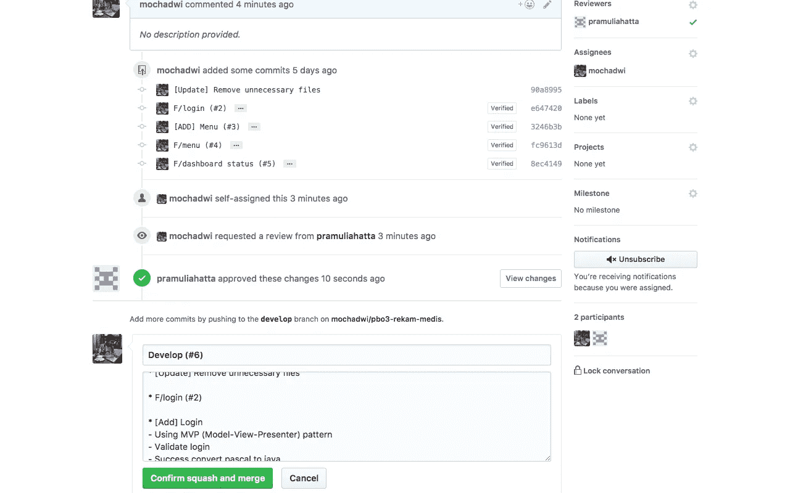
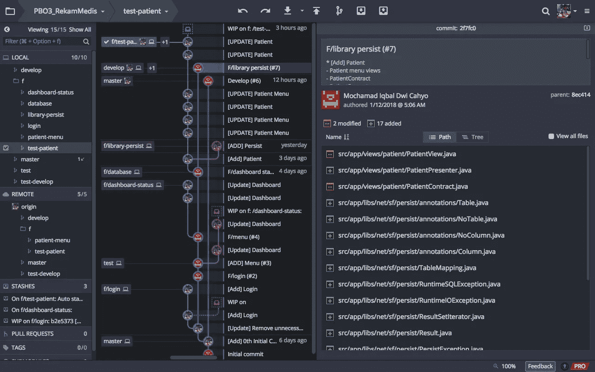

# Git —标准工作流，选择哪一个？

> 原文：<https://medium.easyread.co/git-standard-workflows-which-one-to-choose-87a49f020e17?source=collection_archive---------0----------------------->



## 到目前为止，我已经收集了 git 工作流，完全基于*imho

## 推送前合并

```
git checkout -b f/<feature-name> #from develop
```

> 黑客/调试

```
git add . && git commitgit fetch origingit checkout develop && git pullgit checkout f/<feature-name>git merge --no-ff develop #merge latest changes of developgit push -u origin f/<feature-name>
```

> 在此处对远程回购#代码进行 MR / PR 审查
> 
> 标准 MR / PR

## 推送前重设基础

不过我更喜欢这个工作流程

```
git checkout -b f/<feature-name> #from develop
```

> 黑客/调试

```
git add . && git commitgit fetch origingit checkout develop && git rebase -p origin/developgit checkout f/<feature-name>git rebase -p develop #merge latest changes of developgit push -u origin f/<feature-name>
```

> 在此处对远程回购#代码进行 MR / PR 审查
> 
> 使用挤压 MR / PR



## YOLO 推

```
git checkout -b f/<feature-name> #from develop
```

> 黑客/调试

```
git add . && git commitgit fetch origingit push -u origin f/<feature-name>
```

> 在此处对远程回购#代码进行 MR / PR 审查
> 
> 使用挤压 MR / PR

这是奥莱赫 [*莫哈迈德·伊克巴尔·德威·卡尤*](https://medium.com/u/62a4f05ca52a?source=post_page-----87a49f020e17--------------------------------) *贝劳·塞奥朗的狂热爱好者和摄影师。请关注个人资料，了解最新动态。*

*如果这是一件艺术品，那么它就应该是一件艺术品。
如果你和一个小男孩在公共场合谈论这件事，他会说:*[](https://medium.com/easyread/about-easyread-74b20960e180)**】。**