# Git 教程——探索 Git 中的命令和操作

> 原文：<https://medium.com/edureka/git-tutorial-da652b566ece?source=collection_archive---------0----------------------->

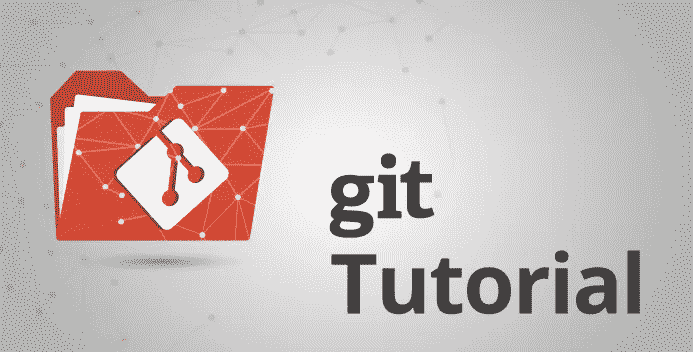

Git Tutorial - Edureka

学习 Git 就像使用这个工具一样简单。这篇 Git 教程博客的动机是从你的头脑中忽略这个困境。我相信通过这篇 Git 教程博客，你会对所有的概念了如指掌。

***Git*** 是一款免费的开源分布式版本控制系统工具，旨在快速高效地处理从小到大的各种项目。它是由 Linus Torvalds 在 2005 年创建的，用于开发 Linux 内核。我希望这篇博客能帮助你更好地理解 Git

在本 Git 教程中，您将学习:

*   Git 中的命令
*   Git 操作
*   以及一些使用 Git 有效管理项目的技巧和诀窍。

既然你已经知道这个 Git 教程会给你带来什么，让我们开始吧:-)

在开始命令和操作之前，让我们首先理解 Git 的主要动机。

Git 的动机是管理一个项目或一组随着时间变化的文件。Git 将这些信息存储在一个称为 Git 存储库的数据结构中。存储库是 Git 的核心。

非常明确地说，Git 存储库是所有项目文件和相关元数据所在的目录。

Git 通过从索引创建一个树形图来记录项目的当前状态。它通常是有向无环图(DAG)的形式。

现在您已经理解了 Git 的目标，让我们继续操作和命令。

# Git 教程—操作和命令

Git 中的一些基本操作有:

1.  初始化
2.  增加
3.  犯罪
4.  拉
5.  推

一些高级 Git 操作包括:

1.  分支
2.  合并
3.  重置基础

首先让我简单介绍一下这些操作是如何与 Git 存储库一起工作的。看看下面 Git 的架构:

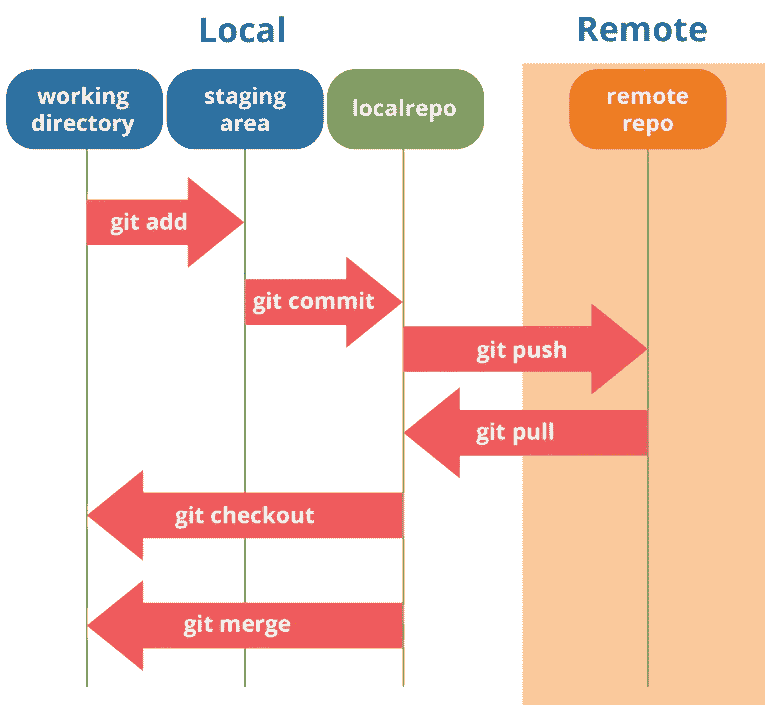

Git Architecture - Git Tutorial

如果你很好的理解了上面的图表，但是如果你不理解，你不用担心，我会在 Git 教程中一个一个的解释这些操作。让我们从基本操作开始。

您需要首先在系统上安装 Git。在这篇 Git 教程中，我将向您展示使用 Git Bash 的命令和操作。Git Bash 是一个纯文本命令行界面，用于在 Windows 上使用 Git，它提供了运行自动化脚本的特性。

在你的 Windows 系统中安装 Git 后，只需打开你要存储所有项目文件的文件夹/目录；右键选择' ***Git Bash here*** '。

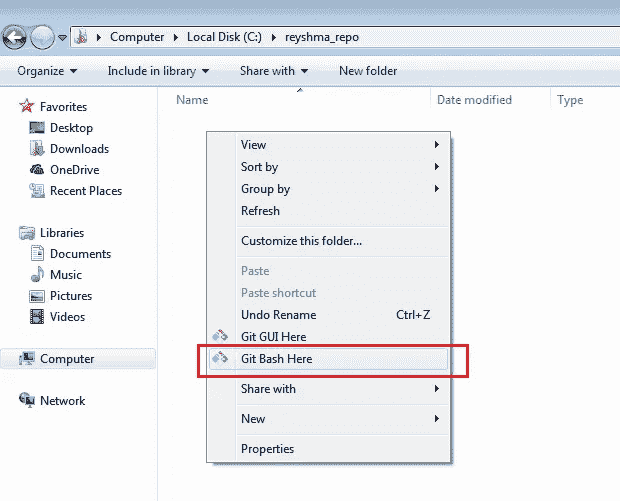

这将打开 Git Bash 终端，您可以在其中输入命令来执行各种 Git 操作。

现在，下一个任务是初始化您的存储库。

# 初始化

为了做到这一点，我们使用命令 **git init。**请参考下面的截图。

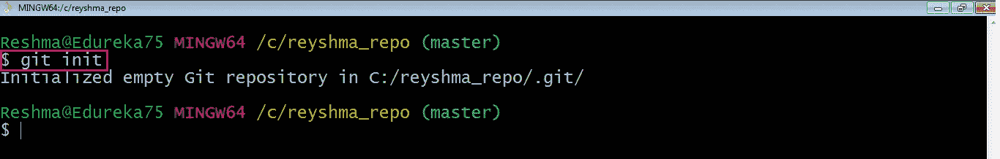

**git init** 创建一个空的 git 存储库或重新初始化一个现有的存储库。它基本上创造了一个**。git** 目录，包含子目录和模板文件。在现有的存储库中运行 **git init** 不会覆盖已经存在的东西。而是选择新添加的模板。

既然我的存储库已经初始化，让我在目录/存储库中创建一些文件。例如，我创建了两个文本文件，即 *edureka1.txt* 和 *edureka2.txt* 。

让我们使用命令 **git status** 看看这些文件是否在我的索引中。该索引保存了工作树/目录内容的快照，该快照将作为本地存储库中下一次更改的内容。

**Git 状态**

**git status** 命令列出了所有准备好添加到本地存储库中的已修改文件。

让我们键入命令，看看会发生什么:

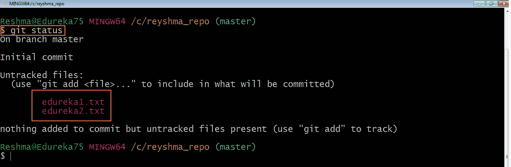

这表明我有两个文件还没有添加到索引中。这意味着我不能提交对这些文件的更改，除非我已经在索引中显式地添加了它们。

**增加**

该命令使用工作树中的当前内容更新索引，然后为下一次提交准备临时区域中的内容。

因此，在对工作树进行更改之后，在运行 **commit** 命令之前，您必须使用 **add** 命令将任何新的或修改的文件添加到索引中。为此，请使用以下命令:

**git 添加<目录>或 **git 添加<文件>****

让我为您演示一下 **git add** ，这样您可以更好地理解它。

我又创建了两个文件 *edureka3.txt* 和 *edureka4.txt* 。让我们使用命令 **git add -A** 添加文件。这个命令将把所有在目录中但还没有在索引中更新的文件添加到索引中。

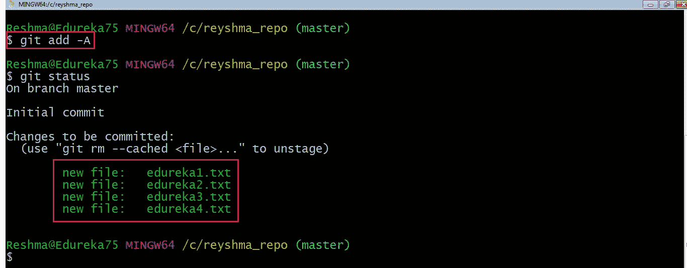

既然新文件已经添加到索引中，您就可以提交它们了。

**提交**

它指的是在给定时间记录存储库的快照。除非明确完成，否则提交的快照永远不会更改。让我用下面的图表解释一下提交是如何工作的:

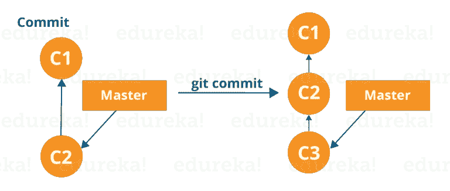

Git Commit Workflow - Git Tutorial

在这里，C1 是初始提交，即第一个更改的快照，从该快照创建另一个包含名为 C2 的更改的快照。请注意，主服务器指向最新的提交。

现在，当我再次提交时，创建了另一个快照 C3，现在主快照指向 C3 而不是 C2。

Git 的目标是让提交尽可能的轻量级。所以，它不会在每次提交时盲目地复制整个目录；它包括作为一组变更的提交，或者从一个版本的存储库到另一个版本的“增量”。简单地说，它只复制存储库中所做的更改。

您可以使用下面的命令提交:

**git 提交**

这将提交转移的快照，并将启动一个文本编辑器，提示您提交消息。

或者您可以使用:

**git commit -m " <消息> "**

让我们试一试。

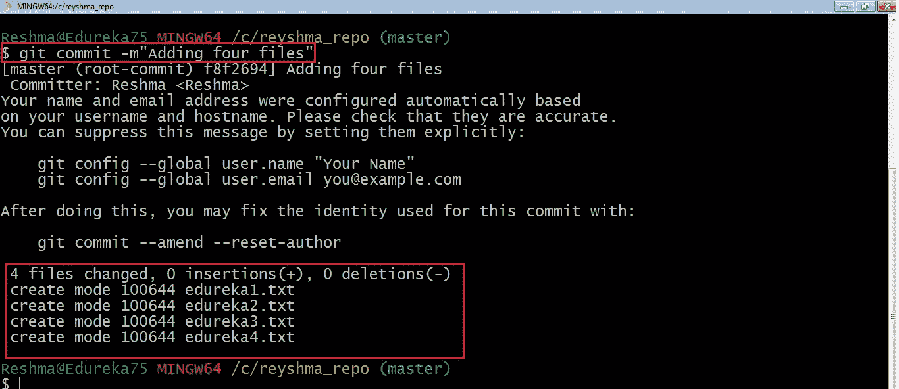

正如您在上面看到的， **git commit** 命令已经提交了本地存储库中四个文件的变更。

现在，如果您想一次提交工作目录中所有更改的快照，可以使用下面的命令:

**git 提交-a**

我在我的工作目录中创建了两个以上的文本文件。 *edureka5.txt* 和 *edureka6.txt* 但是它们还没有添加到索引中。

我使用以下命令添加 edureka5.txt:

**git 添加 edureka5.txt**

我已经将 *edureka5.txt* 显式添加到索引中，但没有将 *edureka6.txt* 添加到索引中，并对之前的文件进行了更改。我想一次提交目录中的所有更改。参考下面的快照。

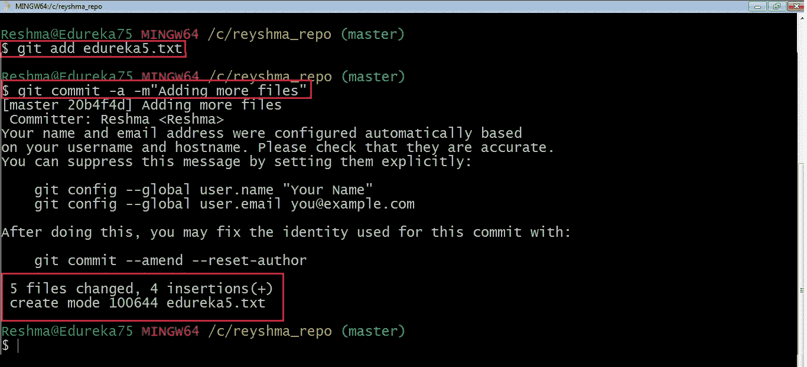

该命令将提交工作目录中所有更改的快照，但仅包括对被跟踪文件的修改，即在其历史中的某个时间点使用 **git add** 添加的文件。因此， *edureka6.txt* 没有被提交，因为它还没有被添加到索引中。但是提交了存储库中存在的所有先前文件中的更改，即 *edureka1.txt* 、 *edureka2.txt* 、 *edureka3.txt* 、 *edureka4.txt* 和 *edureka5.txt* 。现在我已经在我的本地存储库中提交了我想要的。

请注意，在您影响对中央存储库的更改之前，您应该始终将更改从中央存储库拉到您的本地存储库，以更新所有在中央存储库中工作的协作者的工作。为此，我们将使用**拉**命令。

# 拉

**git pull** 命令将变更从远程存储库提取到本地存储库。它合并本地存储库中的上游变更，这是基于 Git 的协作中的常见任务。

但是首先，您需要使用以下命令将中央存储库设置为 origin:

**git 远程添加原点<链接到您的中央存储库>**

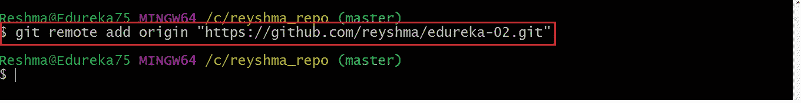

现在我的原点已经设置好了，让我们使用 pull 从原点提取文件。为此，请使用命令:

**git 拉原点主控**

此命令会将所有文件从远程存储库的主分支复制到您的本地存储库。

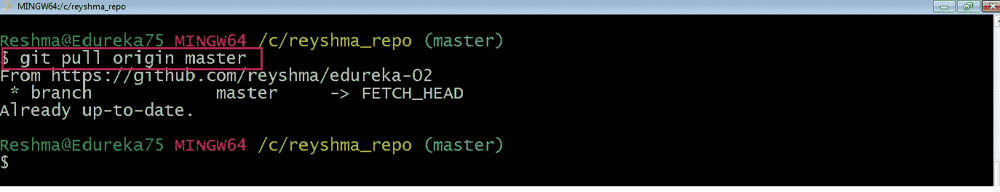

由于我的本地存储库已经更新了主分支的文件，因此消息已经是最新的。参考上面的截图。

***注意:*** *您也可以尝试使用以下命令从不同的分支提取文件:*

***git 拉原点<分支名称>***

您的本地 Git 存储库现在已经更新了所有最近的更改。是时候使用 **push** 命令在中央存储库中进行更改了。

**按下**

该命令将提交从本地存储库转移到远程存储库。与拉动操作相反。

将导入提交到本地存储库，而将导出提交到远程存储库。

使用 **git push** 是为了将您的本地更改发布到中央存储库。在您积累了几个本地提交并准备好与团队的其他成员共享它们之后，您可以使用以下命令将它们推送到中央存储库:

**git 推送<远程>**

**注意:** *此远程是指在使用*拉命令之前已经设置好的远程库。

这将把本地存储库的变更以及所有必要的提交和内部对象推送到远程存储库。这将在目标存储库中创建一个本地分支。

让我给你演示一下。

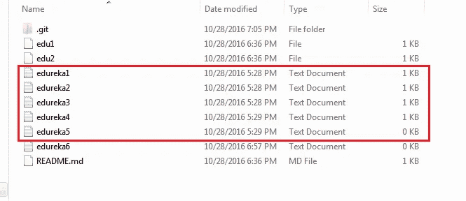

以上文件是我们之前在提交部分已经提交的文件，它们都是“*推送就绪*”。我将使用命令 **git push origin master** 在我的中央存储库的 master 分支中反映这些文件。

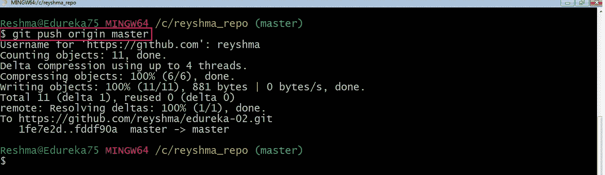

现在让我们检查一下我的中央存储库中是否发生了更改。

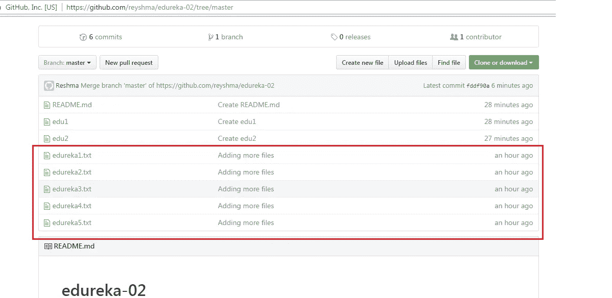

是的，确实如此。:-)

为了防止覆盖，Git 不允许 push 在目标存储库中导致非快速向前合并。

**注** : *非快进合并是指上游合并，即与子分支的祖先或父分支合并。*

要启用这种合并，请使用下面的命令:

**git push<remote>–force**

以上命令强制执行推送操作，即使这会导致非快速向前合并。

至此，我希望您已经理解了 Git 的基本命令。现在，让我们进一步学习 Git 中的分支和合并。

# 分支

Git 中的分支只不过是指向特定提交的指针。Git 通常倾向于保持其分支尽可能的轻量级。

基本上有两种类型的分支，即 ***本地分支*** 和 ***远程跟踪分支*** 。

本地分支只是工作树的另一条路径。另一方面，远程跟踪分支有特殊用途。其中一些是:

*   它们将您的工作从本地存储库链接到中央存储库。
*   当您使用 **git pull** 时，它们会自动检测从哪个远程分支获取变更。

您可以使用以下命令检查当前分支是什么:

**git 分支**

在分支的时候，你应该一直念叨的一个咒语是“早分支，多分支”

要创建新的分支，我们使用以下命令:

**git 分支<分支名称>**

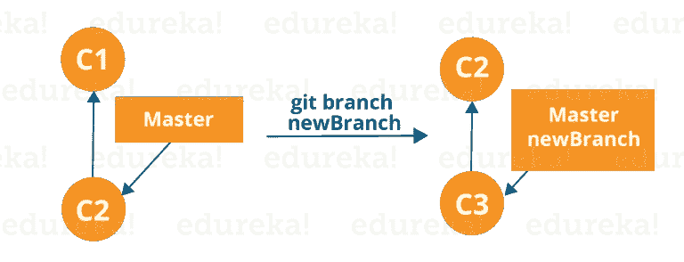

Git Branch Workflow - Git Tutorial

上图显示了创建新分支时的工作流程。当我们创建一个新的分支时，它来源于主分支本身。

由于创建许多分支不会带来存储/内存开销，因此在逻辑上划分工作比创建大而粗的分支更容易。

现在，让我们看看如何使用分支提交。

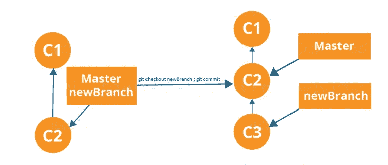

Git Checkout Workflow - Git Tutorial

分支包括特定提交以及所有父提交的工作。正如你在上面的图表中看到的，新分支已经从主分支中分离出来，因此将创建一个不同的路径。

使用下面的命令:

**git check out<branch _ name>然后**

**git 提交**

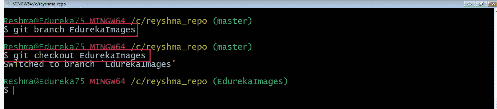

在这里，我创建了一个名为“EdurekaImages”的新分支，并使用命令 **git checkout** 切换到这个新分支。

上述命令的一个快捷方式是:

**git checkout -b【分行名称】**

该命令将创建一个新分支，同时签出该新分支。

现在，当我们在分支 EdurekaImages 中时，使用以下命令添加并提交文本文件 *edureka6.txt* :

**git 添加 edureka6.txt**

**git commit -m "添加 edureka6.txt"**

# 合并

合并是将不同分支的工作结合在一起的方法。这将允许我们分支，开发一个新的功能，然后将它组合回来。

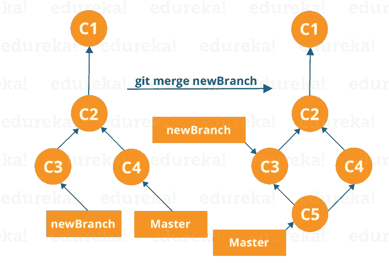

Git Merge Workflow - Git Tutorial

上图向我们展示了两个不同的分支-> newBranch 和 master。现在，当我们将 newBranch 的工作合并到 master 中时，它会创建一个新的 commit，其中包含 master 和 newBranch 的所有工作。

现在让我们用下面的命令合并这两个分支:

**git 合并<branch _ name>**

重要的是要知道上面命令中的分支名称应该是您想要合并到您当前正在检出的分支中的分支。因此，请确保您在目标分支机构中已签出。

现在，让我们将 EdurekaImages 分支的所有工作合并到主分支中。为此，我将首先使用命令 **git checkout master** 检查主分支，并使用命令 **git merge EdurekaImages** 合并 EdurekaImages

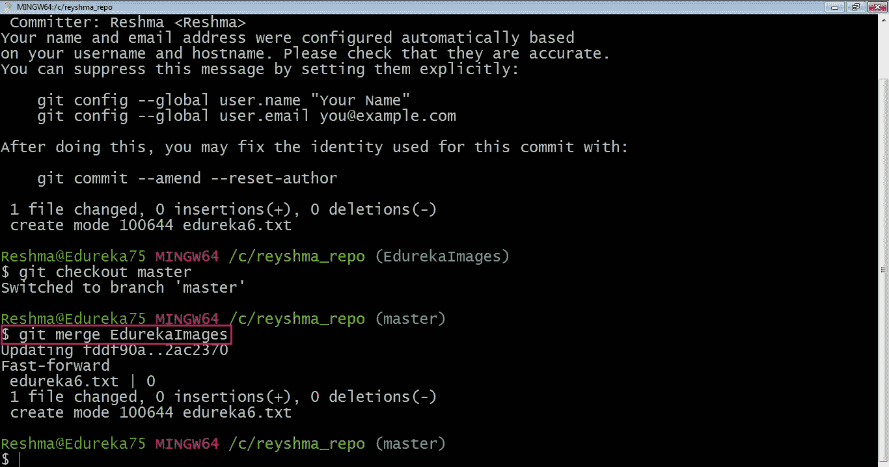

正如您在上面看到的，分支名称中的所有数据都被合并到主分支中。现在，文本文件 *edureka6.txt* 已经添加到主分支中。

Git 中的合并创建了一个特殊的提交，它有两个唯一的父级。

# 重置基础

这也是将不同分支之间的工作结合起来的一种方式。Rebasing 获取一组提交，复制它们并存储在您的存储库之外。

重定基础的优点是它可以用来生成一个线性的提交序列。如果进行了重新基准化，提交日志或存储库的历史将保持干净。

让我们看看它是如何发生的。

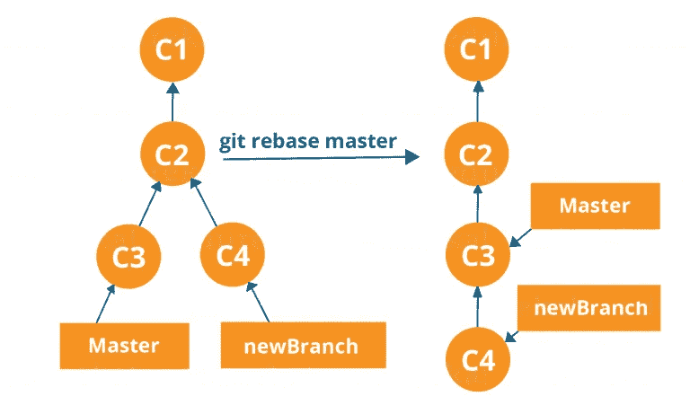

Rebasing in Git - Git Tutorial

现在，我们在 newBranch 的工作就放在 master 之后，我们有一个很好的线性提交序列。

**注意** : *重置基址还会阻止上游合并，这意味着不能将 master 放在 newBranch 之后。*

现在，要重置 master，请在 Git Bash 中键入以下命令:

**git rebase master**

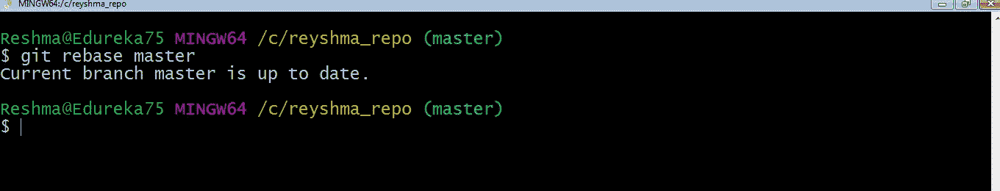

这个命令将把我们所有的工作从当前分支转移到主分支。它们看起来好像是顺序发展的，但它们是平行发展的。

# Git 教程—技巧和窍门

既然您已经完成了本 Git 教程中的所有操作，这里有一些您应该知道的技巧和诀窍。:-)

1.  **归档您的存储库**

使用以下命令-

**git 归档主文件–格式= zip–输出=../name-of-file.zip**

它将所有文件和数据存储在一个 zip 文件中，而不是**。git** 目录。

请注意，这只会创建一个完全忽略版本控制的快照。当您想将文件发送给计算机上没有安装 Git 的客户进行审查时，这很方便。

**2。捆绑您的存储库**

它将一个存储库转换成一个文件。

使用以下命令-

**git 包创建../repo.bundler master**

这会将主分支推到远程分支，只包含在文件中而不是存储库中。

另一种方法是:

**光盘..**

**git clone repo . bundle repo-copy-b master**

**cd 回购-复制**

**git 日志**

**光盘../my-git-repo**

**3。隐藏未提交的更改**

当我们想暂时取消添加一个特性或任何类型的添加数据时，我们可以暂时“隐藏”它们。

使用下面的命令:

**git 状态**

**git stash**

**git 状态**

当您想要重新应用您“隐藏”的更改时，请使用下面的命令:

**git stash 应用**

关于 Git 教程的博客到此结束。我希望你喜欢这个 Git 教程，并学习了 Git 中的命令和操作。

如果你想查看更多关于人工智能、Python、道德黑客等市场最热门技术的文章，你可以参考 Edureka 的官方网站。

请留意本系列中的其他文章，它们将解释 DevOps 的各个方面。

> *1。* [*DevOps 教程*](/edureka/devops-tutorial-89363dac9d3f)
> 
> *2。* [*詹金斯教程*](/edureka/jenkins-tutorial-68110a2b4bb3)
> 
> *3。* [*Docker 教程*](/edureka/docker-tutorial-9a6a6140d917)
> 
> *4。* [*Ansible 教程*](/edureka/ansible-tutorial-9a6794a49b23)
> 
> *5。* [*傀儡教程*](/edureka/puppet-tutorial-848861e45cc2)
> 
> *6。* [*厨师教程*](/edureka/chef-tutorial-8205607f4564)
> 
> *7。* [*Nagios 教程*](/edureka/nagios-tutorial-e63e2a744cc8)
> 
> *8。* [*如何编排 DevOps 工具？*](/edureka/devops-tools-56e7d68994af)
> 
> *9。* [*连续交货*](/edureka/continuous-delivery-5ca2358aedd8)
> 
> *10。* [*持续集成*](/edureka/continuous-integration-615325cfeeac)
> 
> *11。* [*连续部署*](/edureka/continuous-deployment-b03df3e3c44c)
> 
> *12。* [*持续交付 vs 持续部署*](/edureka/continuous-delivery-vs-continuous-deployment-5375642865a)
> 
> *13。* [*CI CD 管道*](/edureka/ci-cd-pipeline-5508227b19ca)
> 
> *14。* [*Docker 作曲*](/edureka/docker-compose-containerizing-mean-stack-application-e4516a3c8c89)
> 
> *15。* [*码头工人群*](/edureka/docker-swarm-cluster-of-docker-engines-for-high-availability-40d9662a8df1)
> 
> *16。* [*Docker 联网*](/edureka/docker-networking-1a7d65e89013)
> 
> *17。* [*可变角色*](/edureka/ansible-roles-78d48578aca1)
> 
> 18。
> 
> **19。* [*适用于 AWS*](/edureka/ansible-for-aws-provision-ec2-instance-9308b49daed9)*
> 
> *20。 [*詹金斯*](/edureka/jenkins-pipeline-tutorial-continuous-delivery-75a86936bc92)*
> 
> *21。 [*顶级 Git 命令*](/edureka/git-commands-with-example-7c5a555d14c)*
> 
> **22。* [*顶级 Docker 命令*](/edureka/docker-commands-29f7551498a8)*
> 
> **23。*T38*Git vs GitHub**
> 
> **24。* [*DevOps 面试问题*](/edureka/devops-interview-questions-e91a4e6ecbf3)*
> 
> **25。* [*谁是 DevOps 工程师？*](/edureka/devops-engineer-role-481567822e06)*
> 
> **26。* [*DevOps 生命周期*](/edureka/devops-lifecycle-8412a213a654)*
> 
> **27。*[*Git ref log*](/edureka/git-reflog-dc05158c1217)*
> 
> **28。**
> 
> ***29。* [*组织正在寻找的顶尖 DevOps 技能*](/edureka/devops-skills-f6a7614ac1c7)**
> 
> ***30。* [*瀑布 vs 敏捷*](/edureka/waterfall-vs-agile-991b14509fe8)**
> 
> ***31。* [*Maven 用于构建 Java 应用*](/edureka/maven-tutorial-2e87a4669faf)**
> 
> ***32。* [*詹金斯小抄*](/edureka/jenkins-cheat-sheet-e0f7e25558a3)**
> 
> ***33。* [*Ansible 备忘单*](/edureka/ansible-cheat-sheet-guide-5fe615ad65c0)**
> 
> ***34。* [*Ansible 面试问答*](/edureka/ansible-interview-questions-adf8750be54)**
> 
> ***35。* [*50 码头工人面试问题*](/edureka/docker-interview-questions-da0010bedb75)**
> 
> **36。 [*敏捷方法论*](/edureka/what-is-agile-methodology-fe8ad9f0da2f)**
> 
> **37。 [*詹金斯面试问题*](/edureka/jenkins-interview-questions-7bb54bc8c679)**
> 
> ***38。* [*Git 面试问题*](/edureka/git-interview-questions-32fb0f618565)**
> 
> ***39。* [*码头工人建筑*](/edureka/docker-architecture-be79628e076e)**
> 
> **40。[*devo PS 中使用的 Linux 命令*](/edureka/linux-commands-in-devops-73b5a2bcd007)**
> 
> ***41。* [*詹金斯 vs 竹子*](/edureka/jenkins-vs-bamboo-782c6b775cd5)**
> 
> **42。 [*Nagios 面试问题*](/edureka/nagios-interview-questions-f3719926cc67)**
> 
> ***43。* [*DevOps 实时场景*](/edureka/jenkins-x-d87c0271af57)**
> 
> ***44。* [*詹金斯和詹金斯 X*](/edureka/jenkins-vs-bamboo-782c6b775cd5) 的区别**
> 
> ***45。*[*Windows Docker*](/edureka/docker-for-windows-ed971362c1ec)**
> 
> ***46。*[*Git vs Github*](http://git%20vs%20github/)**

***原载于 2016 年 11 月 16 日*[*www.edureka.co*](https://www.edureka.co/blog/git-tutorial/)*。***