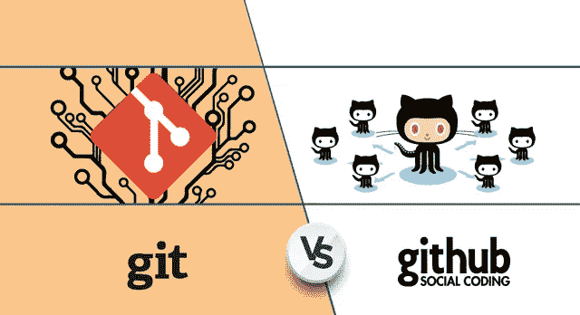
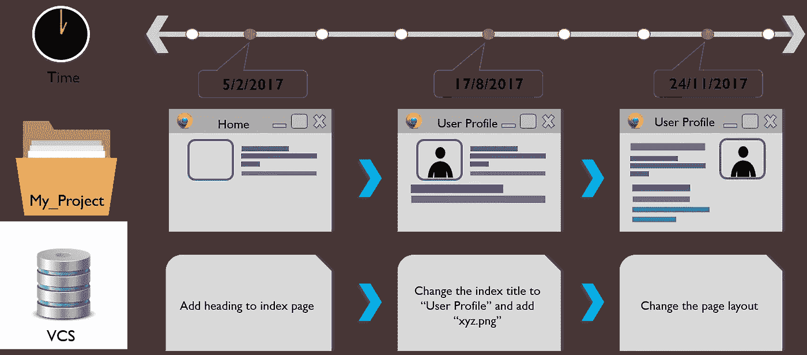
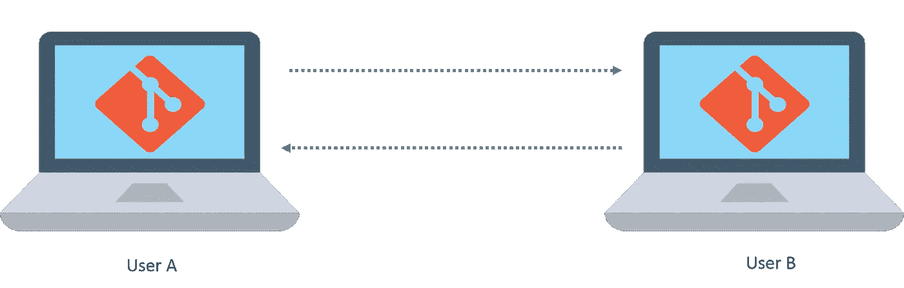
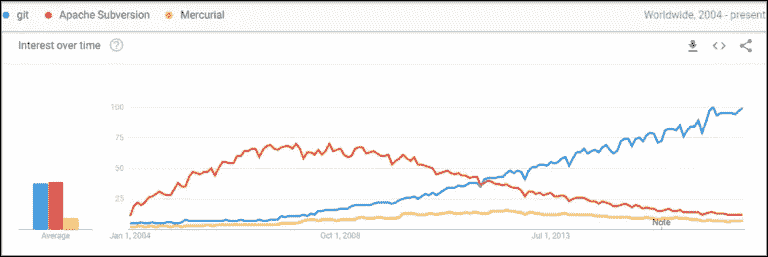
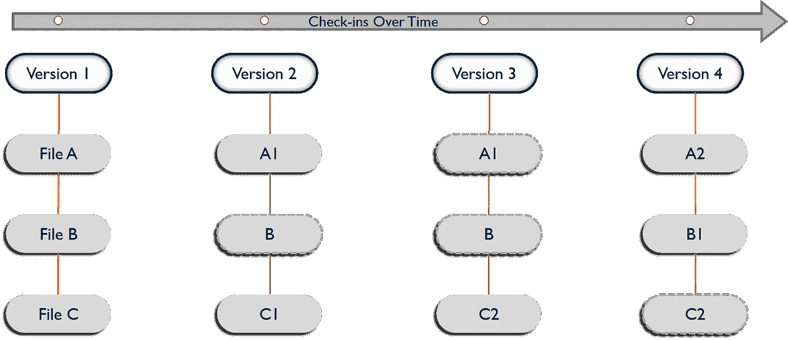
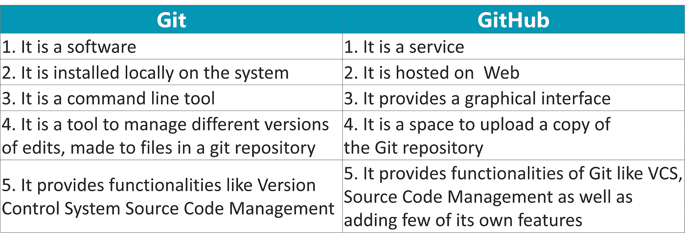

# 揭开 Git 和 GitHub 之间的区别

> 原文：<https://medium.com/edureka/git-vs-github-67c511d09d3e?source=collection_archive---------0----------------------->

Git vs GitHub — Edureka

如果你曾经和代码打交道，那么你一定会遇到像 Git 和 GitHub 这样的词。也有可能你也用过它们。但是你知道 Git 或 GitHub 到底是什么，它们之间有什么不同吗？好吧，如果你没有，没关系！学习新东西永远不会晚，在这种情况下也不会太难。在这篇关于 Git 与 GitHub 的文章中，我将向您全面介绍这两者。

以下是我将在这篇 Git Vs GitHub 文章中讨论的主题:

*   版本控制
*   Git 是什么？
*   什么是 GitHub？
*   Git vs GitHub

要理解 Git 和 GitHub 之间的确切区别，您首先需要了解版本控制。那么，你对版本控制这个术语的理解是什么？

# 版本控制

术语“版本控制”是指记录一个或一组文件随时间变化的系统，称为“版本”。换句话说，这些版本将帮助您跟踪您的代码/项目中的变更，并且如果必要的话，还可以撤销那些变更。这种能够在一个特定项目的两个版本之间比较、区分和恢复变更的特性在处理一个更大的项目时变得非常有用。更大的项目意味着更多的人在同一代码上工作，这增加了冲突的机会。使用版本控制可以很容易地防止这些冲突。

这个控制代码版本的系统被称为**版本控制系统(VCS)** 。为了更好的理解，你可以把它想象成一个“数据库”。在这个数据库中，VCS 为您的整个项目拍摄快照，并将它们存储为版本。现在，在这些快照的帮助下，您可以轻松地比较版本，并根据需要在它们之间切换。请看下图，它展示了整个过程:

我想现在你已经很清楚版本控制的概念了。我想在这里提到的一点是，不要混淆 VCS 和备份/部署系统。这种 VCS 完全消除了改变或更换工具链的需要，完全不同于备份系统。下面我列出了使用版本控制的一些优点:

*   版本控制创建了适当的工作流，这有助于防止人们在使用不同的和不兼容的工具开发过程中出现混乱。
*   每个版本都有一个描述，说明这个版本做了哪些更改。这些描述有助于按版本跟踪代码中的变化。
*   VCS 同步版本，并确保您的更改不会与使用相同存储库的其他人冲突。
*   当其他人保存你的代码的新版本时，VCS 帮助保存变更的历史。可以回顾这一历史，找出谁、为什么以及何时进行了更改。
*   VCS 自动化功能通过在保存任何新版本时执行测试、代码分析和部署，节省您和您的团队的时间，并生成一致的结果。

所以现在让我们继续这篇关于 Git 和 GitHub 的文章，理解什么是 Git。

# Git 是什么？

既然您已经了解了版本控制，那么理解 Git 将会非常容易。那么，Git 是什么？

Git 是一个版本控制软件，你需要安装在你的本地系统上才能使用它。对于单独从事一个项目的个人来说，Git 被证明是一个优秀的软件。但是如果你和一个大团队一起做一个项目呢？所有人都将参与同一个项目，但你们每个人都将拥有同一个项目的不同版本。假设您已经在您的机器上的项目目录中进行了更改，并且您想要将这些更改发送给您的协作者。此外，您希望他们所做的更改直接出现在您计算机的项目目录中。在项目工作中，与你的队友保持一致对于避免任何类型的冲突都是至关重要的。那么，你会怎么做呢？好吧，不用担心 Git 会处理所有的事情，但是这里唯一的条件是，你的每个团队成员都必须在他们的系统上安装 Git。

Git 也被称为分布式版本控制系统，这意味着使用 Git，您可以将您的以及其他人的更改推送到其他人的机器上:

现在，使用 Git，你可以和你的团队成员在同一个副本上工作。但是您将要处理的副本将不会反映主目录中的任何更改，除非您提取您的合作者的更改并推回您自己的更改。

在当今市场上，Git 是使用最广泛和最流行的现代 VCS。它相当成熟，是一个维护良好的开源项目。它是在 2005 年由 Linus Torvalds 开发的，他也是 Linux 操作系统内核的创造者。如果你查看上面 Google trends 结果的图片，你会发现自 2005 年以来 Git 在市场上持续增长。各种各样的软件项目，包括商业软件和开源软件，完全依赖 Git 进行版本控制。那么，Git 与其他让它如此受欢迎的东西有什么不同呢？

Git 和其他 VCS 如 Subversion (SVN)，Mercurial，TFS，Perforce，Bazaar 等的主要区别。，是 Git 存储数据的方式。在其他系统中，信息被存储为基于文件的变更列表，这也被称为基于*增量的*版本控制。但是在 Git 的情况下，它以微型文件系统的快照流的形式存储数据。使用 Git，每当您提交或保存项目的状态时，都会获取当前文件状态的快照，并为其存储一个引用。如果没有进行任何更改或更新，Git 会存储一个到它已经存储的前一个文件的链接。下图显示了 Git 如何存储版本:

但是，只有当您知道您的合作者的系统何时打开并连接到网络时，Git 才会有所帮助。那么当你的团队成员不在线的时候你会怎么做？在这些情况下，第三方拥有您的项目的相同副本，您可以从那里轻松地推拉更改，这将派上用场。

你会很高兴知道，这就是 GitHub 所做的，在本文的下一部分，我会解释这一切。

# 什么是 GitHub？

如前所述， **Git 是一个版本控制系统**，它在处理计算机代码时跟踪变化，而 **GitHub 是一个基于 Web 的 Git 版本控制库托管服务**。它提供了 Git 的所有分布式版本控制和源代码管理(SCM)功能，同时还增加了一些自己的特性。对于开发者来说，这是一个天堂，他们可以在这里存储他们的项目，并与志同道合的人联系。你可以把它想象成*“云为符码”。*

所以基本上它是一个存储相同的工作目录或存储库的地方。它实际上是 Git 库的一个中心，你可以使用它，只需在 GitHub 上创建一个免费帐户。这些帐户带有大量的存储空间，您可以在其中存储您的存储库，并建立一个拥有巨大价值的适当配置文件。默认情况下，库是公开的，也就是说，每个人都可以看到你的代码，但是你也可以把它变成私有的。因此，如果你是一个优秀的程序员，你可以上传自己的应用程序和程序，并获得他人的认可。

它与 Git 协同工作。Git 是一个命令行工具，GitHub 是一个基于 Web 的图形界面，它提供了访问控制、基本的任务管理工具以及一些协作特性。此外，GitHub 可以用各种编程语言托管项目的源代码，并跟踪每次迭代所做的每一项更改。GitHub 的功能并没有到此为止。它提供了以下 3 个非凡的功能，使其如此强大:

1.  ***fork:*** 或者俗称为 forking，就是在你没有写权限的情况下，从一个用户的账户中复制一个存储库。所以你可以在你自己的帐户下复制和修改它。
2.  ***拉:*** 当您对已复制的代码进行了更改，并希望与其原始订单共享时。然后，您可以向他们发送一个名为“拉取请求”的通知。
3.  ***合并:*** 现在，拥有这些代码的用户，如果发现您的更改相关，可以将您的回购中发现的更改与原始回购合并，只需点击按钮即可。

如果你的拉取请求被所有者接受，那么你将在原始站点上获得信用，并显示在你的用户资料中。它是一种帮助 GitHub 项目维护者确定你的声誉的简历。因此，GitHub 上的人和项目越多，项目维护者对其潜在贡献者的了解就越多。这鼓励了年轻的开发者和项目在行业中成长。我希望你现在明白什么是 Github 了。现在让我总结一下 Git 和 Github 的基本区别。

这篇关于 Git 和 GitHub 的文章到此结束。希望你喜欢阅读这篇文章，并学到一些新的东西。如果你想查看更多关于人工智能、Python、道德黑客等市场最热门技术的文章，你可以参考 Edureka 的官方网站。

请留意本系列中的其他文章，它们将解释 DevOps 的各个方面。

> *1。* [*DevOps 教程*](/edureka/devops-tutorial-89363dac9d3f)
> 
> *2。* [*Git 教程*](/edureka/git-tutorial-da652b566ece)
> 
> *3。* [*詹金斯教程*](/edureka/jenkins-tutorial-68110a2b4bb3)
> 
> *4。* [*码头工人教程*](/edureka/docker-tutorial-9a6a6140d917)
> 
> *5。* [*Ansible 教程*](/edureka/ansible-tutorial-9a6794a49b23)
> 
> *6。* [*木偶教程*](/edureka/puppet-tutorial-848861e45cc2)
> 
> *7。* [*厨师教程*](/edureka/chef-tutorial-8205607f4564)
> 
> *8。* [*Nagios 教程*](/edureka/nagios-tutorial-e63e2a744cc8)
> 
> *9。* [*如何编排 DevOps 工具？*](/edureka/devops-tools-56e7d68994af)
> 
> *10。* [*连续交货*](/edureka/continuous-delivery-5ca2358aedd8)
> 
> *11。* [*持续集成*](/edureka/continuous-integration-615325cfeeac)
> 
> *12。* [*连续部署*](/edureka/continuous-deployment-b03df3e3c44c)
> 
> 13。 [*持续交付 vs 持续部署*](/edureka/continuous-delivery-vs-continuous-deployment-5375642865a)
> 
> 14。 [*CI CD 管道*](/edureka/ci-cd-pipeline-5508227b19ca)
> 
> *15。* [*Docker 撰写*](/edureka/docker-compose-containerizing-mean-stack-application-e4516a3c8c89)
> 
> *16。* [*码头工人群*](/edureka/docker-swarm-cluster-of-docker-engines-for-high-availability-40d9662a8df1)
> 
> 17。 [*Docker 联网*](/edureka/docker-networking-1a7d65e89013)
> 
> 18。
> 
> *19。 [*可替代角色*](/edureka/ansible-roles-78d48578aca1)*
> 
> **20。* [*适用于 AWS*](/edureka/ansible-for-aws-provision-ec2-instance-9308b49daed9)*
> 
> **21。* [*詹金斯管道*](/edureka/jenkins-pipeline-tutorial-continuous-delivery-75a86936bc92)*
> 
> **22。* [*顶级 Git 命令*](/edureka/git-commands-with-example-7c5a555d14c)*
> 
> **23。* [*顶级 Docker 命令*](/edureka/docker-commands-29f7551498a8)*
> 
> **24。* [*DevOps 面试问题*](/edureka/devops-interview-questions-e91a4e6ecbf3)*
> 
> **25。* [*谁是 DevOps 工程师？*](/edureka/devops-engineer-role-481567822e06)*
> 
> **26。* [*DevOps 生命周期*](/edureka/devops-lifecycle-8412a213a654)*
> 
> **27。*[*Git Reflog*](/edureka/git-reflog-dc05158c1217)*
> 
> **28。**
> 
> ***29。* [*组织寻找的顶尖 DevOps 技能*](/edureka/devops-skills-f6a7614ac1c7)**
> 
> ***三十。* [*瀑布 vs 敏捷*](/edureka/waterfall-vs-agile-991b14509fe8)**
> 
> ***31。* [*Maven 用于构建 Java 应用*](/edureka/maven-tutorial-2e87a4669faf)**
> 
> **32。 [*詹金斯*](/edureka/jenkins-cheat-sheet-e0f7e25558a3)**
> 
> **33。**
> 
> ***34。 [*可答面试问答*](/edureka/ansible-interview-questions-adf8750be54)***
> 
> ***35。* [*50 码头工人面试问题*](/edureka/docker-interview-questions-da0010bedb75)**
> 
> **36。 [*敏捷方法论*](/edureka/what-is-agile-methodology-fe8ad9f0da2f)**
> 
> ***37。* [*詹金斯面试问题*](/edureka/jenkins-interview-questions-7bb54bc8c679)**
> 
> **38。 [*Git 面试问题*](/edureka/git-interview-questions-32fb0f618565)**
> 
> ***39。* [*Docker 架构*](/edureka/docker-architecture-be79628e076e)**
> 
> **40。[*devo PS 中使用的 Linux 命令*](/edureka/linux-commands-in-devops-73b5a2bcd007)**
> 
> **41。 [*詹金斯 vs 竹子*](/edureka/jenkins-vs-bamboo-782c6b775cd5)**
> 
> ***42。* [*Nagios 面试问题*](/edureka/nagios-interview-questions-f3719926cc67)**
> 
> ***43。* [*DevOps 实时场景*](/edureka/jenkins-x-d87c0271af57)**
> 
> ***44。* [*詹金斯和詹金斯 X 的区别*](/edureka/jenkins-vs-bamboo-782c6b775cd5)**
> 
> ***45。*[*Windows Docker*](/edureka/docker-for-windows-ed971362c1ec)**
> 
> ***46。*[*Git vs Github*](http://git%20vs%20github/)**

***原载于 2017 年 12 月 11 日*[*https://www.edureka.co*](https://www.edureka.co/blog/git-vs-github/)*。***