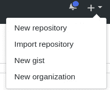
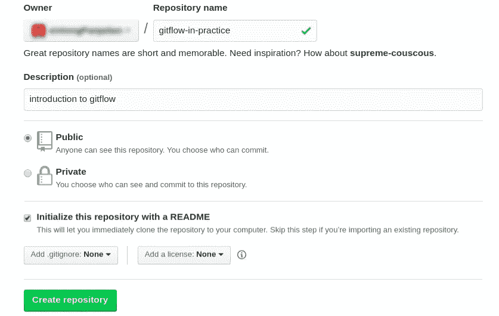
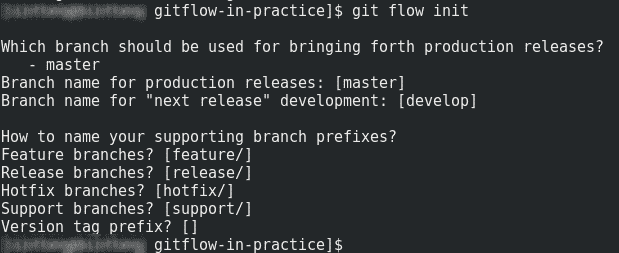
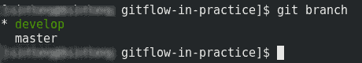
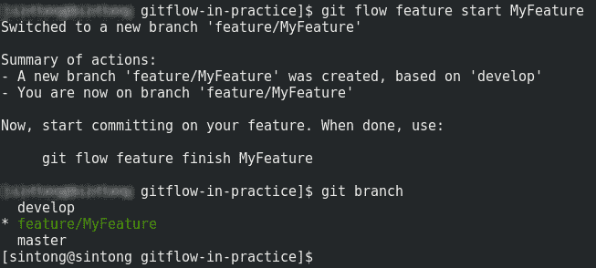
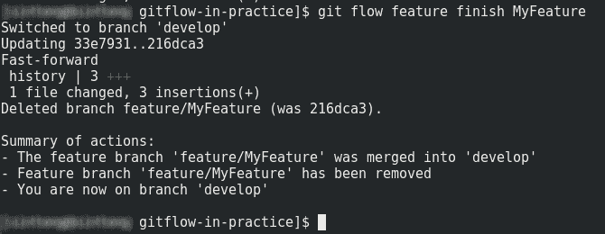
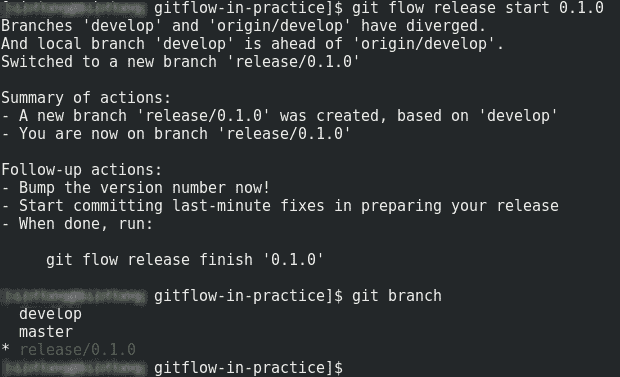
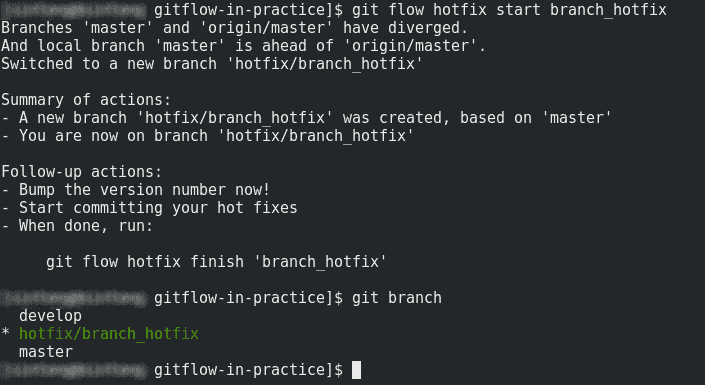

# Gitflow in Practice

> 原文：<https://medium.easyread.co/gitflow-in-practice-1d8a2bbdc3a1?source=collection_archive---------3----------------------->

## Bagaimana menggunakan git?


Sumber : [https://nvie.com/posts/a-successful-git-branching-model/](https://nvie.com/posts/a-successful-git-branching-model/)

```
Note : Jika teman-teman masih baru pertama kali mengenal git, saya sarankan untuk mempelajari dasar dasar git terlebih dahulu.
```

Pada artikel kali ini saya ingin membahas salah satu *branching* model git mulai dari membuat repositori sampai *release* . Untuk pengaplikasianya saya menggunakan [*github*](https://github.com/) .

# **Create A Repository**

Langkah pertama dalam menggunakan *github* ialah membuat repositori. Bagaimana cara membuat repositori di *github* ?

*   Di sudut kanan atas halaman klik + dan pilih *new repository* .



*   Tulis nama repositori yang ingin dibuat, lalu tambahkan deskripsi singkat mengenai repositori, jenis repositori, dan biasanya saya memilih untuk membuat repositori baru yang disertakan file *readme* dan *gitignore* .



Setelah semua form terisi klik **Create Repository** .

# **Getting Started with Gitflow**

*Gitflow* adalah sebuah *branching* model git yang diciptakan oleh [Vincent Driessen](https://nvie.com/posts/a-successful-git-branching-model/) . *Gitflow* sangat ideal untuk proyek yang memiliki siklus rilis yang terjadwal. Untuk lebih jelasnya saya akan menjelaskan satu siklus penggunaan *gitflow* .

*   Pertama, *import* repositori yang telah dibuat terlebih dahulu.

```
$ git clone [git@github.com](mailto:git@github.com):{username git}/gitflow-in-practice.git
```

**Develop and Master Branches**

*   Gunakan *command* `**git flow init**` dalam folder repositori.

```
$ git flow init
```



*   Gunakan *command* `**git branch**` untuk melihat *branch* yang telah terbentuk

```
$ git branch
```



*   Create sebuah `**file.txt**` yang akan digunakan sebagai bahan praktik dalam penggunaan *gitflow* . Sebaiknya file yang dibuat langsung di *push* ke *master* untuk mempermudah membandingkan ketika melakukan *merge* dalam tahap selanjutnya.

## **Feature Branches**

*Feature branches* digunakan untuk membangun fitur yang akan digunakan. Esensi dari *feature branch* adalah *branch* akan ada selama proses *development* . Singkatnya, *feature branch* hanya ada di *developer* bukan di origin. Proses di *feature branch* yaitu :

```
$ git flow feature start MyFeature
```



Selama pengerjaan fitur di sistem, *developer* akan berada di *branch* *MyFeature* . Sebagai ganti dari fitur, tuliskan sesuatu di dalam file yang telah dibuat sebelumnya sebagai pertanda bahwa sudah ada penambahan. Jangan lupa untuk melakukan proses *commit* agar gitnya terupdate.

```
$ git flow feature finish MyFeature
```



Sebelum dilakukan proses *finish* pada *branch* , terlebih dahulu yang dilakukan adalah proses *testing* . Hal ini dilakukan untuk mencegah adanya *error* ketika *branch* di *merge* ke *develop* .

## **Release Branches**

Setelah selesai dari *branch* *develop* , langkah selanjutnya yaitu proses *release* . *Branch release* biasanya digunakan untuk persiapan ke *production* , dalam *branch* ini masih diperbolehkan untuk melakukan perubahan tetapi hanya untuk skala kecil saja. Jika terdapat *bug* yang memerlukan banyak perubahan seperti fitur tambahan maka *branch* akan dikembalikan ke *develop* . *Branch release* dibuat dari *branch* *develop* dengan penambahan *version number* . Langkah pembuatan *branch release* yaitu :

```
$ git flow release start 0.1.0
```



Setelah sistem telah melalui proses *testing* maka proses *release* dapat diakhiri.

```
$ git flow release finish 0.1.0
```

Setelah proses *release* selesai maka *branch* akan di *merge* ke *branch* *master* dan *develop* .

## **Hotfix Branches**

Tidak dapat dipungkiri bahwa akan ada masanya *branch* di master terdapat *error* oleh karena itu diperlukan *branch* *hotfix* untuk melakukan perbaikan secepatnya. Oleh karena itu *branch* *hotfix* hanya akan di buat dari master. Berikut adalah tahapan dalam *branch* *hotfix* .

```
$ git flow hotfix start branch_hotfix
```



```
$ git flow hotfix finish branch_hotfix
```

Untuk melihat *log git* nya dapat menggunakan *tools* *git* seperti *gitkraken* , *sourcetree,* dll *.* Demikian yang dapat saya bagikan semoga teman-teman *developer* dapat mencobanya. Terima kasih dan ***Keep learning!***

## **Referensi**

[https://help.github.com/articles/create-a-repo/](https://help.github.com/articles/create-a-repo/)

[https://nvie.com/posts/a-successful-git-branching-model/](https://nvie.com/posts/a-successful-git-branching-model/)

[https://www . atlassian . com/git/tutorials/comparising-workflows/git flow-workflow](https://www.atlassian.com/git/tutorials/comparing-workflows/gitflow-workflow)