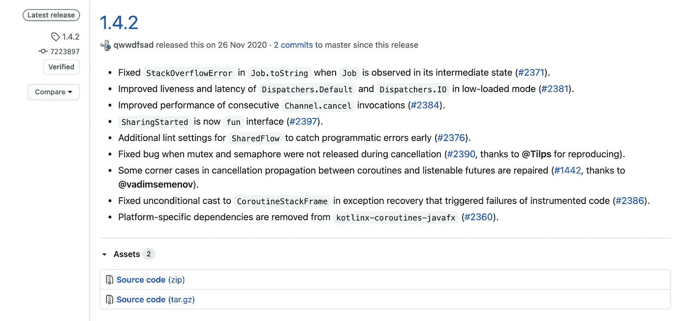

# 面向 Android 开发者的 GitHub 行动

> 原文：<https://medium.com/google-developer-experts/github-actions-for-android-developers-6b54c8a32f55?source=collection_archive---------0----------------------->


如果你正在开发 Android 应用程序，你很可能在职业生涯的某个阶段遇到过任何类型的竞争情报。如果你认为 Android 碎片化是一件事，CI 系统的广泛可用性对你来说应该很熟悉。

GitHub Actions 于 2019 年 11 月左右发布，从那时起，它已经证明了自己对于生产环境的可靠性(这是我们在承诺任何软件系统之前的要求之一)。像许多其他 CI/CD 系统一样，GitHub actions 最终让我们为我们的应用程序定义一个工作流，以自动构建、测试和部署它们。

GitHub Actions 最闪亮的一面是它与 GitHub 的集成。对于已经托管在 GitHub 中的存储库，GitHub Actions 允许我们在一个单一的平台上自动化这个过程，而不需要依赖任何外部工具。你的代码在 GitHub 上，你的 CI/CD 在 GitHub 上运行，如果你愿意，你也可以在 GitHub 上发布。

现在，GitHub Actions 提供了深思熟虑的指南和文档，尽管对于以前没有使用过它的人来说，一开始使用它可能会感到力不从心。该文档为 Android 开发人员提供了一个基本设置的示例，但是您可能想知道*“我在哪里可以获得一些使用 GitHub 操作的灵感？”*。这篇文章旨在根据我使用 GitHub Actions 的个人经验提供一些答案。我一直在一个 Android 项目中使用它，因此我的经验(和这篇文章)仅限于这个平台。不要再耽搁了，我们走吧。

## 我们的配置文件的结构

GitHub Actions 需要一个. yml 文件来指定 CI/CD 的所有步骤。YAML 文件让人不舒服，尤其是当它们变大的时候(缩进问题可能会被忽视，来自 ide 的支持也很少)。这些文件存储在文件夹`.github/workflows/file.yml`中。下面是它们外观的一个简单示例:

```
# Workflow name
name: Buildon:
# When it will be triggered
# And in which branch
  pull_request:
  push:
    branches:
      - main # Where will they run
jobs:
  build:

    runs-on: ubuntu-latest
```

## 行动

行动是一种特殊类型的步骤，可以帮助我们完成自动化 CI/CD 的任务。任何人都可以公开他们的行为，并且可以通过 GitHub 浏览。我们可能想要实现的许多功能可能已经在这里了，因此值得看一看以避免重新发明轮子。当然，也可以[派生和修改现有的动作，或者](https://docs.github.com/en/free-pro-team@latest/actions/creating-actions)创建我们自己的动作。

现在，这里列出了一些我们可以在 Android 中执行的操作的建议。正如 CI/CD 的名字一样，我们通常希望开始构建和部署应用程序，但我们可以应用一些好东西(通知某些渠道或平台等)。让我们开始吧。

## 设置我们的 Android 应用程序

最初，我们将设置我们的环境，为了做到这一点，我们需要检查我们的项目并设置我们的 JDK。我们将在这里使用我们的第一个动作， [Checkout v2](https://github.com/actions/checkout) 对我们的存储库执行`git checkout`操作，并且 [setup-java](https://github.com/actions/setup-java) 准备我们的 java 环境。

```
*## Checkout our repository ###* - name: Checkout
  uses: actions/checkout@v2.3.3

- name: Set up our JDK environment
  uses: actions/setup-java@v1.4.3
  with:
    java-version: 1.8
```

## 建造我们的艺术品

每个项目的基础是编译我们所有要上传和/或分发的工件。Android 通常有一个特殊性，那就是我们可能会基于我们的风格或构建类型生成几个 apk。它们中的一些是相关的(我们的发布工件可能直接进入我们的测试团队)，一些是不相关的(我们的测试工件仅仅用于开发)，这取决于你的团队结构。幸运的是，我们可以直接调用 Gradle 命令并生成相关的工件数量。我们将使用动作 [gradle-command-action](https://github.com/eskatos/gradle-command-action) 来执行我们的 gradle 命令。下面是一个例子:

```
*## Build all our Build Types at once ##* - name: Build all artifacts
  id: buildAllApks
  uses: eskatos/gradle-command-action@v1.3.3
  with:
    gradle-version: current
    wrapper-cache-enabled: true
    dependencies-cache-enabled: true
    configuration-cache-enabled: true
    arguments: assembleRelease
```

这里的线`arguments: assembleRelease`是相关的线。我们可以很容易地用我们想要执行的 Gradle 命令来代替它。

## 测试

我们可能希望在 CI/CD 环境中运行几个测试或分析工具。幸运的是，通过 GitHub actions，我们可以直接运行 Gradle 命令。例如，可以通过直接调用相关的 Gradle 命令来轻松启动我们的测试或 Lint:

```
- name: Run Kotlin Linter
  run: ./gradlew ktlintStagingDebugCheck

- name: Run Unit Tests
  run: ./gradlew testStagingDebugUnitTest
```

我们还可以在 GitHub Actions 上运行我们的 Espresso 测试。有几个动作允许我们触发它们，我们将通过[反应马戏团](https://github.com/ReactiveCircus)展示 [android 模拟器运行程序](https://github.com/ReactiveCircus/android-emulator-runner)

```
uses: reactivecircus/android-emulator-runner@v2
    with:
      api-level: 23
      target: default
      arch: x86
      profile: Nexus 6
      script: ./gradlew connectedCheck --stacktrace
```

## 签名工件

在创建我们的 Android 工件时，签名工件是下一个自然的步骤，因此它们可以安装在设备上。

```
*## Sign our artifact##* - name: Sign artifact
  id: signArtifact
  uses: r0adkll/sign-android-release@v1.0.1
  with:
    releaseDirectory: app/build/outputs/apk/ourbuildtype/release
    alias: ${{ secrets.KEYALIAS }}
    signingKeyBase64: ${{ secrets.KEYSTORE }}
    keyStorePassword: ${{ secrets.KEYSTORE_PASSWORD }}
    keyPassword: ${{ secrets.KEY_PASSWORD }}

- name: Upload our APK
  uses: actions/upload-artifact@v2.2.0
  with:
    name: Release artifact
    path: app/build/outputs/apk/ourbuildtype/release/app-artifact-*.apk
```

对这里发生的事情做进一步的解释:

名为“Sign artifact”的任务使用 [sign-android-release](https://github.com/r0adkll/sign-android-release) 动作。这非常简单:我们需要指定与密钥相关的信息，这样 APK 就被签名了。如果我们需要，可以指定不同的任务(例如，因为我们需要用不同的密钥签署 apk)。

“上传我们的 APK”任务从我们的工作流上传工件，允许我们在作业之间共享数据，并在工作流完成后存储数据。它使用动作[上传——神器](https://github.com/actions/upload-artifact)。注意，在 path 字段中，我们使用了通配符`app-artifact-*.apk`。

使用 Gradle，我们可以定制我们的配置文件，以确定我们的结果 APK 的名称。这会产生可读性更好的输出，而不是总是使用默认的 APK 名称。例如，下面的代码块将 Gradle 文件的名称更改为可读性更好的格式(app-{ flavor }-{ build name }-{ version name })。apk:

```
android.applicationVariants.all **{** variant **->** variant.outputs.all **{** outputFileName = "app-$**{**variant.productFlavors[0].name**}**-$**{**variant.buildType.name**}**-$**{**variant.versionName**}**.apk"
    **}
}**
```

## **创作发布**

GitHub 中提供了一些有趣的东西，可以在 GitHub 中创建一个版本，我们以后可以用它来分发我们的工件。例如，看看 Kotlin 协程的版本 1.4.2 的发布页面是什么样子的:



这些版本中的每一个都可以包含许多工件、源代码、文档等。也有可能为某个特定的版本发布一些变更日志或注释(稍后将详细介绍如何自动创建)。在整个过程中自动创建它肯定是有用的。这是将在 GitHub 中创建发布的相关部分。

```
- name: Create Release
  id: create_release
  uses: actions/create-release@v1
  env:
    GITHUB_TOKEN: ${{ secrets.GITHUB_TOKEN }}
  with:
    tag_name: ${{ github.ref }}
    release_name: Release ${{ github.ref }}
    draft: false
    prerelease: false
```

## 将我们的资产上传到 GitHub

随着发行版的创建，是时候上传我们自己的资产了。我们将使用一个辅助任务来收集我们的 APK 名称和路径(假设我们为它们定制了名称，如前所述)。

```
- name: Save name of our Artifact
  id: set-result-artifact
  run: |
    ARTIFACT_PATHNAME_APK=$(ls app/build/outputs/apk/ourbuildtype/release/*.apk | head -n 1)
    ARTIFACT_NAME_APK=$(basename $ARTIFACT_PATHNAME_APK)
    echo "ARTIFACT_NAME_APK is " ${ARTIFACT_NAME_APK}
    echo "ARTIFACT_PATHNAME_APK=${ARTIFACT_PATHNAME_APK}" >> $GITHUB_ENV
    echo "ARTIFACT_NAME_APK=${ARTIFACT_NAME_APK}" >> $GITHUB_ENV
```

请注意该代码块中的几个相关点:

*   我们在环境变量中设置路径和工件的名称，这些变量稍后会保存在 GitHub 上。这是在 GitHub Actions 中存储信息的一种极好的方式。
*   我们正在运行一个命令来确定 APK 的名称(`ls app/build/outputs/apk/ourbuildtype/release/*.apk | head -n 1`)。这是非常通用的，因为我们基本上可以使用 Unix/Mac 命令来确定各种事情(稍后，将它们存储在我们的路径中，并在其他步骤中重用它们)。

名称和路径已经存储在环境变量中，现在我们将把它们上传到我们的发布页面。这使用了动作[上传-发布-资产](https://github.com/actions/upload-release-asset):

```
- name: Upload our Artifact Assets
  id: upload-release-asset
  uses: actions/upload-release-asset@v1
  env:
    GITHUB_TOKEN: ${{ secrets.GITHUB_TOKEN }}
  with:
    upload_url: ${{ steps.create_release.outputs.upload_url }}
    asset_path: ${{ env.ARTIFACT_PATHNAME_APK }}
    asset_name: ${{ env.ARTIFACT_NAME_APK }}
    asset_content_type: application/zip
```

这已经在 GitHub 上创建了我们的工件，我们准备分发它们。我们可以使用许多通知机制。例如，如果我们有一个 Slack 组，我们可以使用 [act10ns/slack](https://github.com/act10ns/slack) 通知特定的通道我们的发布已经准备好了:

```
- name: Notify on Slack
  uses: act10ns/slack@v1.0.9
  with:
    status: ${{ job.status }}
    steps: ${{ toJson(steps) }}
    if: always()
```

GitHub 已经有很多可用的操作选项，包括通过[电报](https://github.com/appleboy/telegram-action)，通过[电子邮件](https://github.com/marketplace/actions/send-email)或[不和谐](https://github.com/Ilshidur/action-discord)进行通知。如果您能想到您需要的特定平台，很可能有一个 GitHub 动作可以涵盖它。

我们可以给它一个最后的触摸，这将是自动填充变更日志，获取一些已经可用的信息。可以想象，已经有一个 [GitHub 动作](https://github.com/marketplace/actions/git-release)解决了这个问题。这个程序根据[keepchangelog.com](https://keepachangelog.com/en/1.0.0/)从 CHANGELOG.md 文件中获取信息，但是使用 **git log - pretty=oneline** 或类似的格式并不难做到。

# 摘要

GitHub Actions 是市场上又一个 CI/CD 引擎。如果你已经在使用 GitHub，它提供了一个与你的代码、问题和发布工作流程非常好的集成。它是高度可定制的，提供 API 来创建你自己需要的动作，或者从 [GitHub marketplace](https://github.com/marketplace?type=actions) 访问它们。与任何基于云的解决方案(或任何技术解决方案，就其重要性而言)一样，在决定采用它是否有意义之前，有几个因素需要权衡。我相信这是一个舒适的解决方案，可以满足各种需求。

感谢[马顿](https://twitter.com/zsmb13)、[乔西](https://twitter.com/jossiwolf)、[乌比拉坦](https://twitter.com/ubiratanfsoares)和[瓦贾哈特](https://twitter.com/wajahatkarim?lang=en)的善意和有益的评论，摇滚吧！

我在我的推特账户上写下我对软件工程和生活的想法。如果你喜欢这篇文章或者它对你有帮助，请随意分享，👏和/或发表评论。这是给业余作家加油的货币。