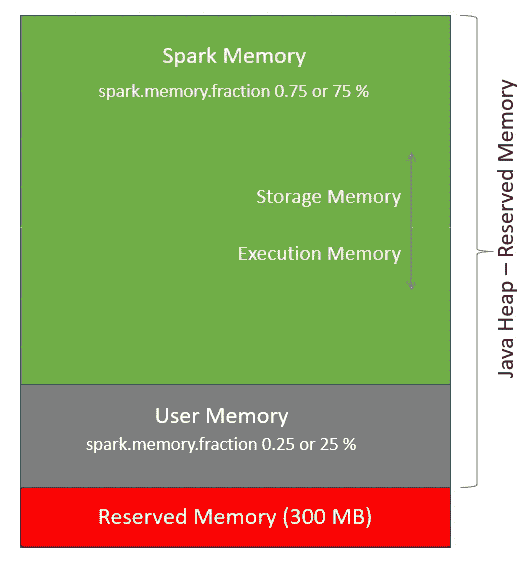
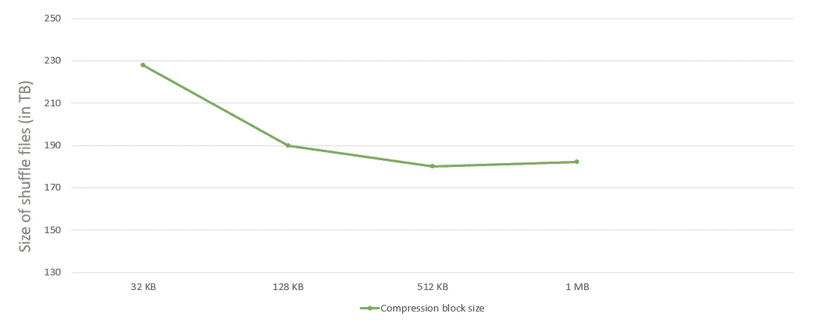
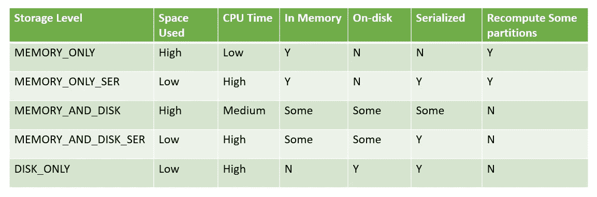
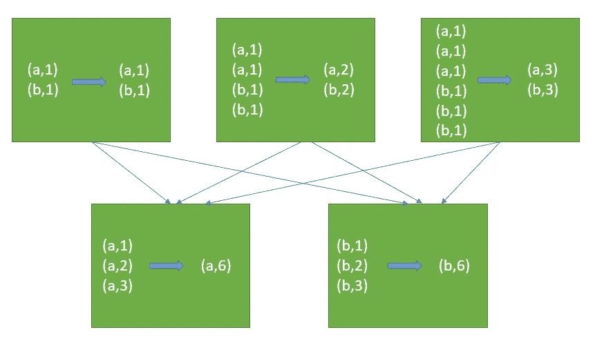
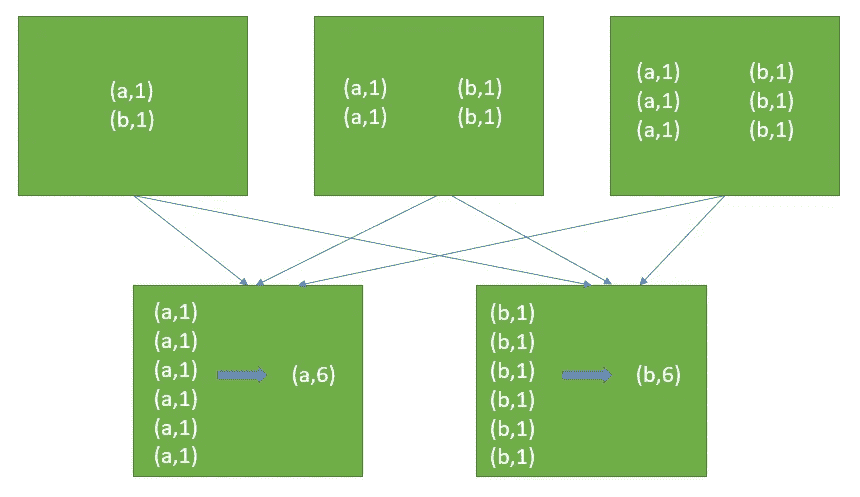
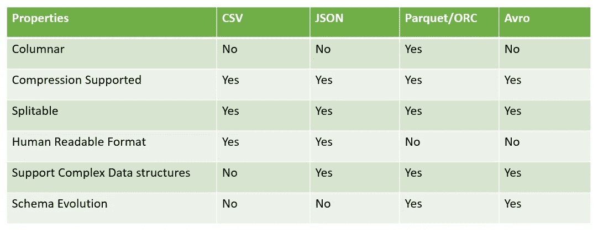

# Apache Spark 优化技术一瞥

> 原文：<https://medium.com/globant/glance-on-spark-optimization-techniques-1d3df3074e41?source=collection_archive---------0----------------------->

简要介绍广泛使用的 Spark 性能优化技术


Photo by [Marc-Olivier Jodoin](https://unsplash.com/@marcojodoin?utm_source=medium&utm_medium=referral) on [Unsplash](https://unsplash.com?utm_source=medium&utm_medium=referral)

数据只不过是关于事实和数字的信息。数据来源主要有三种: [**社会数据**](https://en.wikipedia.org/wiki/Social_data_analysis)[**机器生成数据**](https://en.wikipedia.org/wiki/Machine-generated_data)[**交易数据**](https://en.wikipedia.org/wiki/Transaction_data) **。**数据分析有助于组织改进其内部流程、客户关系管理、增强用户体验、潜在改进等。这浩如烟海的数据无非就是[大数据](https://en.wikipedia.org/wiki/Big_data)。它需要高速计算技术来更快地处理它，因为传统系统无法处理它。

[**Spark**](https://spark.apache.org/)**是一个非常强大的处理大数据的框架。您可能已经看到 Spark 应用程序运行缓慢，即使分配了足够的资源，因为该应用程序可能没有得到足够的优化。Spark 有一些内置的优化技术，如 [**催化剂优化器**](https://www.databricks.com/glossary/catalyst-optimizer) 和 [**钨优化器**](https://www.databricks.com/glossary/tungsten) ，但是还有更多优化 Spark 应用的方法。**

**本文面向使用 Spark 并希望在 Spark 应用程序中获得一些性能提升的数据工程师和数据科学家。在本文中，我将简要介绍 Spark 支持的一些广泛使用的优化技术，以及如何使用它们。让我们开始…**

# **Spark 中的优化技术**

**Spark engine 有一些内置的优化，但我们仍然需要更多地关注其他优化，这可能需要在集群优化、配置值调整、表优化、代码级优化等方面进行。，它们共同帮助提高了我们应用程序的性能。**

**我们可以将优化技术大致分为以下三类:**

*   ****优化火花配置:**这包括改变火花特性。**
*   ****优化 Spark 程序:**这包括代码级优化。**
*   ****优化存储:**这包括文件格式优化。**

**让我们深入了解每个类别…**

# **优化 Spark C *配置***

**Spark 引擎中有许多 Spark 配置属性，可以在创建`SparkSesion`对象时设置。这些属性控制着 Spark 应用程序，可以通过调整来提高应用程序的性能。**

**你将如何设置火花配置？**

**1.您需要导入所需的类。**

```
from pyspark.sql import SparkSession
```

**2.创建一个对象，并在 config()函数中设置配置值。**

```
spark = (SparkSession.builder
           .master("yarn")
           .appName("test") 
           .config("spark.sql.shuffle.partitions", 200)
           .getOrCreate())
```

**现在让我们来看看我们可以调整哪些属性来提高 Spark 应用程序的性能…**

## ****调谐火花执行器****

**大多数时候，我们给应用程序分配静态资源。当我们知道应用程序的源数据大小时，这种策略非常有效。但是，如果某一天您从源中获得大量数据，而另一天您获得少量数据，该怎么办呢？在这种情况下，静态分配不是一个实际的选择。我们可以根据 Spark 应用程序的工作负载动态地添加/删除执行器。Spark 有一个动态分配技术来支持执行器伸缩。当我们每天的工作负载不一致时，这种方法是最好的。您需要将*spark . dynamic allocation . enabled*属性设置为“true”来启用资源的动态分配。此后，Spark 应用程序将根据需要伸缩执行器。**

**这需要设置以下两个属性中的任何一个:**

*   ***spark . shuffle . service . enabled***
*   ***火花.动态定位.洗牌跟踪.启用***

**以下属性也与[动态分配配置](https://spark.apache.org/docs/latest/configuration.html#dynamic-allocation)相关:**

*   ***spark . dynamic allocation . minexecutors***
*   ***spark . dynamic allocation . max executors***
*   ***spark . dynamic callocation . initial executors***
*   ***spark . dynamic allocation . executor allocation ratio***

## ****调谐火花记忆****

**我们经常在驱动程序或执行程序端得到一个[内存不足的错误](https://www.clairvoyant.ai/blog/apache-spark-out-of-memory-issue)。为了避免这种情况，我们需要一个正确的内存配置。执行器内存分为不同的层，可以通过调整来提高性能。我们需要[设置*spark . memory . fraction*](https://stackoverflow.com/questions/39660377/spark-2-0-memory-fraction)属性来调整这些层的值。**

**您可以在下图中看到三个内存区域:**

****

**Memory management in Spark**

*   *****预留内存:*** 系统预留的内存，其大小是硬编码的。一般是 300 MB。**
*   *****用户内存:*** 用户内存计算为**(“Java 堆内存”——“保留内存”)*(1.0——spark . Memory . fraction)。*这个内存池在分配了 Spark 内存之后依然存在，完全由你按照自己喜欢的方式使用。用户内存，你完全可以决定在这个 RAM 中存储什么，Spark 如何完全不考虑你在那里做什么，以及你是否尊重这个界限。在代码中不考虑这一界限可能会导致内存不足的错误。***
*   ******Spark 内存*** : Spark 内存计算为*(“Java 堆内存”——“保留内存”)* spark.memory.fraction* 。内存池由 Spark 管理，进一步分为两个内存区域——*存储内存* & *执行内存。****

*****存储内存**用于存储所有的缓存数据，广播变量也存储在这里。Spark 将为任何包含“内存”的 *persist()* 选项在这个段中存储数据。它通过使用下面给出的公式来计算:***

****存储内存= (Java 堆内存—保留内存)* spark . Memory . fraction * spark . Memory . Storage fraction****

*****执行内存**由 Spark 用于任务执行过程中创建的对象。它通过使用下面给出的公式来计算:***

****执行内存= (Java 堆内存—保留内存)* spark . Memory . fraction *(1.0—spark . Memory . storage fraction)****

## *****调混文件缓冲*****

***与内存中的数据访问相比，磁盘访问速度较慢，因为它涉及一个耗费时间和资源的序列化过程。我们可以通过在内存中引入随机读/写文件缓冲区来降低磁盘 I/O 成本。***

***内存缓冲区大小控制着创建中间随机文件时的磁盘寻道和系统调用。我们需要设置*spark . shuffle . file . buffer*属性来改变内存缓冲区的大小。该属性的默认值是 32k。如果可用内存资源足够，我们可以增加该参数的大小，以减少 shuffle write 过程中磁盘文件溢出的次数，从而减少磁盘 IO 次数，提高性能。该属性的建议大小为 1 MB。这允许 Spark 在将最终的地图结果写入磁盘之前做更多的缓冲。我们可以如下设置该属性:
`spark.shuffle.file.buffer = 1 MB`***

## *****调整压缩块大小*****

***对于大型数据集，我们可以更改默认的压缩块大小。这些数据块可以通过存储或基于速度进行压缩，如 [LZO](https://en.wikipedia.org/wiki/Lempel%E2%80%93Ziv%E2%80%93Oberhumer) 、[爽快](https://en.wikipedia.org/wiki/Snappy_(compression))和 [GZIP](https://en.wikipedia.org/wiki/Gzip) 。需要为 [LZ4](https://en.wikipedia.org/wiki/LZ4_(compression_algorithm)) 压缩中使用的块大小设置以下属性。默认压缩块大小为 32 kb，这对于大型数据集来说不是最佳值。通过增加块大小，您可以看到随机/溢出文件大小减少了 20%。
`spark.io.compression.lz4.blockSize = 512KB`***

******

***Compression block size vs. size of shuffle files***

## *****调整洗牌分区值*****

***shuffle-partition 是指导致数据混洗的每个转换步骤后生成的分区数量，如`join()`、`agg()`、`reduce()`等。通过设置*spark . SQL . shuffle . partitions*属性，您可以决定 Spark 应用程序中的并行级别。***

***您可以[设置 Spark 属性*Spark . SQL . shuffle . partitions*](https://www.linkedin.com/pulse/always-more-resources-performance-spark-optimization-gaurav-patil)来控制默认的 shuffle 分区。该属性的默认值为 200。您应该根据集群的数据大小和可用资源来设置随机分区的数量。分区的数量应该是您拥有的执行器的倍数，这样分区就可以在任务之间平均分配。
`spark.sql.shuffle.partitions = <<integer value>>`***

## *****使用堆外内存*****

***堆外内存位于 JVM 之外，但是被 JVM 用于特定的用例(例如字符串的内部化)。Spark 可以显式地使用堆外内存来存储序列化的数据帧和 rdd。Spark 使用堆外内存有两个目的:***

***—一部分堆外内存由 Java 内部使用，用于字符串存储和 JVM 开销等目的。作为钨计划的一部分，Spark 也可以明确地使用堆外内存来存储其数据。***

***Spark 执行器的总堆外内存由*Spark . executor . memory overhead*配置控制。Spark 用来存储实际数据帧的堆外内存量由*Spark . memory . off heap . size*控制。可以通过将*spark . memory . off heap . use*配置设置为 true 来启用。这两个存储器的区别在这里[解释](https://stackoverflow.com/questions/61263618/difference-between-spark-executor-memoryoverhead-and-spark-memory-offheap-size)。***

# ***优化 Spark 程序***

***只有当我们运行一个优化良好的程序时，才能看到 CPU 的真正威力。我们不应该仅仅认为增加资源会有助于提高性能，除非我们优化代码。Spark 提供了许多我们可以用来优化应用程序的技术。本节将介绍一些广泛使用的程序优化技术。***

## *****广播加入*****

***让我们考虑一个场景，其中您将一个大表与一个小表连接起来。在该加入操作期间，将发生更多的[洗牌](https://sparkbyexamples.com/spark/spark-shuffle-partitions/#:~:text=Shuffling%20is%20a%20mechanism%20Spark,Disk%20I%2FO)。我们可以通过使用广播连接来避免洗牌。它会将一个小表复制到执行程序运行的每个节点上。然而，在某个阈值之后，广播加入往往比基于混洗的加入具有更少的优势。***

```
*# Example program to illustrate use of broadcast join
from pyspark.sql.functions import broadcastemp_df = spark.sql("select id, name, dept_id from employee")
dept_df = spark.sql("select dept_id, dept_name from department")
df_joined = emp_df.join(broadcast(dept_df),emp_df.dept_id == dept_df.dept_id, ‘inner’)
df_joined.show(20)*
```

## *****缓存数据*****

***每次我们调用 Spark 程序中的 [*动作*](https://sparkbyexamples.com/apache-spark-rdd/spark-rdd-actions/) ，都会触发 [DAG](https://www.projectpro.io/recipes/what-is-dag-apache-spark) 并从头执行。这就是为什么建议不要在 Spark 程序中使用不必要的*动作*的原因。仔细检查代码，删除或注释掉您在 Spark 程序中为调试/测试而编写的*动作*。***

***当同一个[数据帧](https://spark.apache.org/docs/3.1.1/api/python/reference/api/pyspark.sql.DataFrame.html)在多个地方被引用时，提高性能的一个关键点是缓存该数据帧。Spark 有两个函数来缓存数据帧:`cache()`和`persist()`。RDD 的`cache()`函数默认将数据帧保存到内存中，而`persist()`函数用于在用户定义的存储级别存储数据帧。`persist()`功能支持不同的参数。***

******

***Storage Levels comparison chart***

## *****重新分区数据*****

***数据帧被分区意味着其中有逻辑记录组。一组记录称为一个分区。每个任务处理每个分区，许多任务在一个执行器内并行运行，并行执行发生在 Spark 中。如果我们正确地分配数据，并行度可以提高。对于重新分区，Spark 有两种方法— `[repartition()](https://sparkbyexamples.com/spark/spark-repartition-vs-coalesce)`和`[coalesce()](https://sparkbyexamples.com/spark/spark-repartition-vs-coalesce)`。***

***如果我们检查源代码，我们看到`coalesce()`在`repartition()` 中被调用，其中`shuffle` 参数被设置为`true`。不带`shuffle` 参数的`coalesce()`与`repartition()`的主要区别在于`coalesce()`主要用于减少分区，`repartition()`用于增加分区。与`repartition()`相比，当我们使用`coalesce()` it 时，发生的洗牌更少。`repartition()`函数也可用于解决数据偏斜问题。***

***下面是摘自 [**RDD 源代码**](https://github.com/apache/spark/blob/15dc0eb6c6b5b5da4632eddafaec0ac82fe1043b/core/src/main/scala/org/apache/spark/rdd/RDD.scala#L473) 的代码片段。***

```
*/*
* Return a new RDD that has exactly numPartitions partitions.
* Can increase or decrease the level of parallelism in this RDD. 
* Internally, this uses a shuffle to redistribute data.
* If you are decreasing the number of partitions in this RDD, 
* consider using `coalesce`, which can avoid performing a shuffle.
*/
def repartition(numPartitions: Int)(implicit ord: Ordering[T] = null): RDD[T] = withScope {
    coalesce(numPartitions, shuffle = true)
}*
```

***因此，为了提高应用程序的性能，您需要增加或减少分区。这完全取决于你的数据。如果您正在处理大量数据，并且想要创建更多的并发任务，那么您可以使用`repartition()`功能来增加分区。如果您想根据列值重新排列数据，也可以使用`repartition()`功能。如果你想减少输出文件的数量，那么你可以使用`coalesce()`功能。应用这些更改后，您可以显著提高应用程序的性能。***

## *****过滤前面步骤中的数据*****

***提高连接和其他处理性能的关键是在前面的步骤中过滤结果集中不需要的数据。假设您只想处理和存储‘Mumbai’的员工。然后，您可以在将表读入数据帧时，先过滤数据帧，而不是读取整个数据和过程，然后对结果应用过滤器。***

***Spark 还有一个更重要的特性。它在内部优化了逻辑计划。它使用[谓词下推](https://docs.datastax.com/en/dse/6.8/dse-dev/datastax_enterprise/spark/sparkPredicatePushdown.html)来支持文件格式，并在开始时推送过滤器，然后对过滤后的数据进行处理。***

## *****使用** [**加盐技术**](https://towardsdatascience.com/skewed-data-in-spark-add-salt-to-compensate-16d44404088b) **消除数据偏斜问题。*****

***我们经常在 Spark UI 上看到，有些任务需要更长的时间，有些任务很快就完成了。当您的数据有偏差时，就会发生这种情况。这意味着数据不是均匀地分布在各个分区上。因此，在数据量大于其他分区的分区上工作的任务需要更多的时间来完成。这有时也会导致内存不足的问题。跨分区重新洗牌可以消除数据偏斜。我们可以通过使用`repartition()`函数来实现洗牌。但是这个函数不能保证记录的均匀分布。所以，我们必须在 dataframe 中的一个新列中添加一些随机值，我们通常称之为*加盐键*，然后我们可以在 repartition 函数中将那个*加盐键*作为参数传递。之后，`repartition()`函数将根据 *salted key* 列值重新洗牌。***

```
*# Example program to illustrate use of Salting Techniquesalt_df_new = df.withColumn(“salted_key”, 
                                (rand * n).cast(IntegerType))
shuffled_df = salt_df_new.repartition(100, ‘salted_key’)*
```

## *****将数据读入数据帧时，明确提供模式*****

***预定义的模式使得 Spark 更容易获得列和数据类型，而无需读取整个文件；如果您正在处理大量数据，这将提高 Spark 代码的性能。如果我们希望 Spark 隐式地识别模式，我们可以使用`inferSchema=True`选项，并且我们可以使用 schema 选项为 dataframe 提供一个模式。***

```
*# Example program showing how to provide the schema externally
# while reading the filefrom pyspark.sql.types import StructType, IntegerType, DateTypeschema = StructType([
         StructField(“col_01”, IntegerType()),
         StructField(“col_02”, DateType()),
         StructField(“col_03”, IntegerType()) ])df = spark.read.csv(filename, header=True, schema=schema)*
```

## *****优化 JSON 文件处理*****

***JSON 是一种广泛使用的格式，允许半结构化数据，因为它不需要模式。这为存储和查询不总是遵循固定模式和数据类型的数据提供了更大的灵活性。JSON 文件与许多系统兼容。总是建议在读取 JSON 文件时显式传递 schema，以避免不正确的数据类型标识。***

```
*# Example program showing how to provide the schema externally 
# while reading JSON filefrom pyspark.sql.types import StructType, StructField, StringType 
schema = StructType([ 
             StructField(“first_name”, StringType(), True),
             StructField(“last_name”, StringType(), True), 
             StructField(“address”, StringType(), True)
         ])emp_df = sqlContext.read.json(“employee_file.json”, schema)*
```

## *****对 GroupByKey 使用 ReduceByKey 函数*****

***`reduceByKey()`和`groupByKey()` 都是宽泛的转换，这意味着两者都将在分区间洗牌。`reduceByKey()`和`groupByKey()`的关键区别在于`reduceByKey()` 做地图边合并而`groupByKey()`不做。`reduceByKey()`就像一个微型减速器。所以，如果我们使用`reduceByKey()`，就可以减少数据的混乱。***

******

***Reduce by key example***

******

***Group by key example***

## *****避免使用 UDF(用户定义函数)*****

***说到性能，UDF 很重。Spark 没有优化 UDF，因为它就像一个黑盒。内置的“ [Spark SQL](https://www.databricks.com/glossary/what-is-spark-sql) ”函数进行了优化，推荐在程序中使用。Spark 提供了很多常用的 Spark SQL 函数进行数据转换。因此，在决定创建 UDF 之前，请查看 Spark SQL 文档，看看是否有可以满足您要求的函数。***

## *****使用连接列时检查键的唯一性*****

***我们应该总是小心地选择连接两个数据帧的连接列。如果在任一列中存在重复值，那么连接这样的数据帧需要很长时间，因为可能会产生笛卡儿积。这也会导致内存不足的错误。因此，在我们编写代码之前，最好通过执行一些查询来分析这个表。***

# ***优化存储***

***优化存储对于提高 Spark 应用程序的性能非常重要。这包括通过创建分区和存储桶来组织数据、使用序列化数据格式、根据应用程序的需求选择合适的文件格式等。让我们一个一个来看…***

## *****分桶和分区*****

***分桶和分区是优化配置单元表的广泛使用的技术。分区通常表示为目录，存储区表示为文件。分区根据分区列，将记录拆分到与分区列值同名的不同目录下的文件中。分桶有助于根据哈希函数将记录进一步拆分到不同的文件中。这提高了我们在 Spark 中读取数据时的性能。***

***如果表被分区和分桶，那么“Spark SQL ”(其中的过滤器列与分区/分桶列相同)可以运行得更快，因为它只扫描特定的目录和文件，而不是扫描所有的目录。因此，查询性能得到了提高。***

***列的**基数**可以定义为该列中不同值的数量。总是建议对高基数列使用分桶，对低基数列使用分区。***

```
*# Example program showing how to use partitioning and bucketing 
# while creating a Hive tableCREATE EXTERNAL TABLE zipcodes(
    rec_no int,
    country string,
    city string,
    zip_code int
)
PARTITIONED BY(
    state string
)
CLUSTERED BY zip_code INTO 10 BUCKETS
ROW FORMAT DELIMITED
FIELDS TERMINATED BY ‘,’;*
```

## *****序列化数据格式*****

*****序列化** 是一种将对象状态转换成字节流的机制。这种机制用于持久化对象。**反序列化** 是相反的过程，其中字节流用于在内存中重新创建实际的 Java 对象。Spark 使用 Java 序列化程序。我们可以通过使用 [Kryo 序列化器](https://blog.knoldus.com/kryo-serialization-in-spark/)来显式地提示 Spark，这样可以提高性能。***

***不同的文件格式支持序列化，比如 [Avro](https://avro.apache.org/docs/1.2.0/) 、 [Parquet](https://www.databricks.com/glossary/what-is-parquet) 和 [ORC](https://cwiki.apache.org/confluence/display/hive/languagemanual+orc#LanguageManualORC-ORCFiles) 。这些文件格式也支持压缩库，如 [ZLIB](https://docs.python.org/3/library/zlib.html) 、 [SNAPPY](https://en.wikipedia.org/wiki/Snappy_(compression)) 等。***

## ***选择合适的文件格式***

***Spark 兼容多种文件格式，如 text、Parquet、ORC、Avro、JSON 等。每种文件格式都有其优点和缺点。文本格式广泛用于非结构化数据。JSON 格式用于半结构化数据。结构化数据可以存储在 ORC 或 Parquet 中，因为两者都是列格式。ORC 和 Parquet 是内存高效的，在加速查询方面表现更好。Avro 以 JSON 格式存储 schema，与其他系统具有广泛的兼容性。根据需求，我们必须选择正确的文件格式来平衡性能和需求。***

******

***File formats comparison***

# ***结论***

***在本文中，我向您简要介绍了所有广泛使用的优化技术。尽管 Spark 是一个非常受欢迎和突出的大数据处理引擎，但优化始终是一个具有挑战性的话题。因此，了解您的数据和您的过程中所有可能的火花配置是至关重要的。***

***没有预定义的方法来优化 Spark 应用程序。这完全取决于您的数据和代码。在决定程序的优化技术之前，确保执行不同的基准和源数据分析。您可以使用 Spark UI 来分析您的应用程序，并确定可以改进的地方。谢谢你阅读我的博客。编码快乐！***

# ***参考***

*   ***调谐火花—[https://spark.apache.org/docs/2.3.2/tuning.html](https://spark.apache.org/docs/2.3.2/tuning.html)***
*   ***性能调优—[https://spark . Apache . org/docs/2 . 4 . 2/SQL-performance-Tuning . html](https://spark.apache.org/docs/2.4.2/sql-performance-tuning.html)***
*   ***Spark 内存管理—[https://Community . cloud era . com/T5/Community-Articles/Spark-Memory-Management/ta-p/317794](https://community.cloudera.com/t5/Community-Articles/Spark-Memory-Management/ta-p/317794)***
*   ***大数据文件格式—[https://www.clairvoyant.ai/blog/big-data-file-formats](https://www.clairvoyant.ai/blog/big-data-file-formats)***