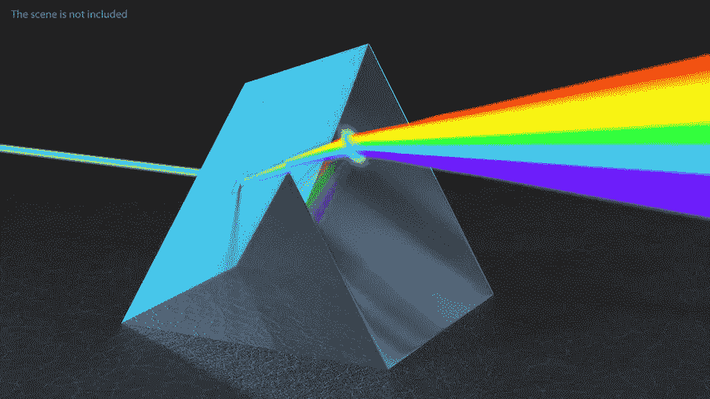

# Globant 棱镜与牛顿棱镜

> 原文：<https://medium.com/globant/globants-prism-and-newton-s-prism-8818c4386db1?source=collection_archive---------1----------------------->

## 快速忽略动态业务策略对产品的影响，以及我们作为 Product Studio 的角色

1664 年，牛顿用棱镜实验证明，阳光实际上是由各种颜色的光线组成的。这一发现彻底改变了科学，为光纤、激光技术和现代望远镜的发明奠定了基础。

在某种程度上，我们在 Prisma 的过程与牛顿的棱镜著名实验有很多共同之处。

**开灯**

2019 年 8 月，Prisma Discovery 项目启动，Globant 和 Prisma SA(阿根廷零售支付解决方案市场的主要参与者之一)达成协议，开始开发新版虚拟钱包“Todo Pago”及其零售解决方案，重点关注入职可用性以及促销和折扣。

在过去几年中，梅尔卡多帕果通过支付链接和二维码扫描技术在小企业领域的持续扩张，促使其他公司在该领域开发解决方案。

他们的目标是推出一款虚拟钱包(mobile app)，用户可以在 Prisma 已经部署的终端上进行支付(收购模式)，当然还有“Todo Pago”计划(分组模式)，主要是在 2019 年底前进行二维码扫描。此外，门户网站和卖家的应用程序将在 2020 年重新设计并推出。

**从光明走向黑暗**

第一个问题是战略和发展之间缺乏一致性:例如，我们知道人们对钱包的期望是什么，但我们不知道它的独特之处在于，它能让我们打入 Macado Pago 应用主导的市场。

另一方面，阿根廷几大银行组成的一个团体看到了同样的情况，开始联合起来反击梅尔卡多·帕果从传统银行手中夺走的金融业务，因此他们去找 Prisma 作为技术合作伙伴，这给该战略增加了压力，并开始向我们提出以下问题:

*   我们想要的应用是普通客户想要的，还是银行认为足够好让他们加入的？
*   我们是必须验证价值假设并找到差异化特征以进行竞争，还是想要拥有其他公司已经拥有的东西？
*   我们将是 B2B 还是 B2C 业务？商家的网络会对这一计划的成功起到怎样的作用？

所有这些问题都变成了长期问题，并开始损害那些没有从战略中获得明确愿景的团队。

**分解光明见彩虹**

这种情境要求我们改变看待自己的视角，把它变成一个棱镜，透过棱镜，我们可以分解每一项举措和价值主张，就好像它们是不同的颜色。

我们从一个在发现阶段发挥作用的紧凑结构发展到一个项目和解决方案组合，每个项目和解决方案都有一个新的目的，我们分析并确定了一个生态系统，并开始创建每个独立的愿景、目标、价值主张和指标。我们已经找到了所有问题的答案，我们将自己组织成三个差异化的价值流，这三个价值流在战略上相辅相成:

*   Todo Pago 平台:实现 APIGee 的企业解决方案
*   钱包:买家的移动应用
*   微商户:商户收款解决方案(支付链接、商户应用和门户网站)

此外，我们必须与不同的团队合作，使已经在进行的 2020 战略适应新常态，这改变了游戏规则，并由于 COVID19 而增强了在线交易。我们将自己视为技术提供商，同时也是变革的推动者，我们还帮助一个重要的合作伙伴参与进来，以增强钱包解决方案(Clarín，阿根廷的一个主要通信联盟，及其 365 忠诚度计划)，这也是 BIMO 钱包诞生的地方。

作为一个团队，尤其是作为一名产品经理，我们的目标是确保战略定义反映在每个已发现产品的最终提案中。在某种程度上，Prisma 实验只是介绍了最初的发现给我们带来的启示，通过基于价值生成的投资组合组织的棱镜，看看它是如何被分解为一系列计划的，这些计划绘制了未来几个月的战略路线图和战术。