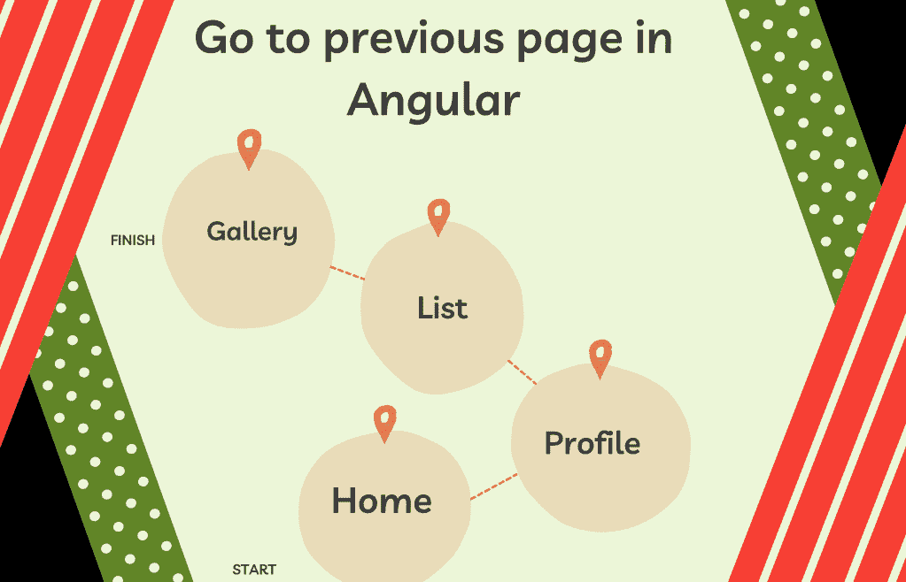
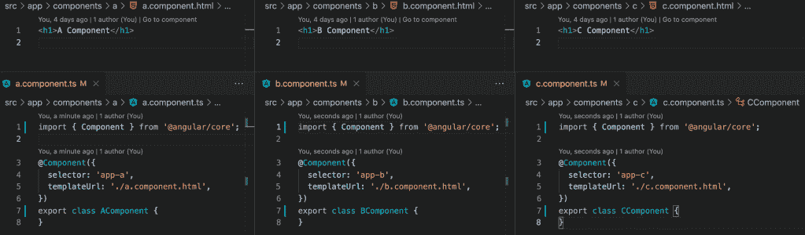
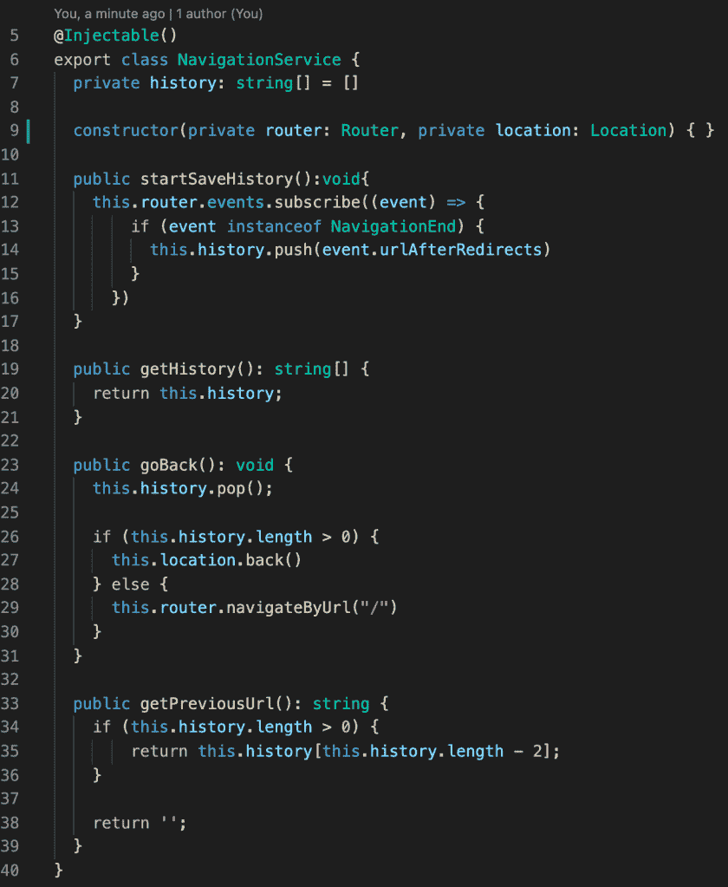
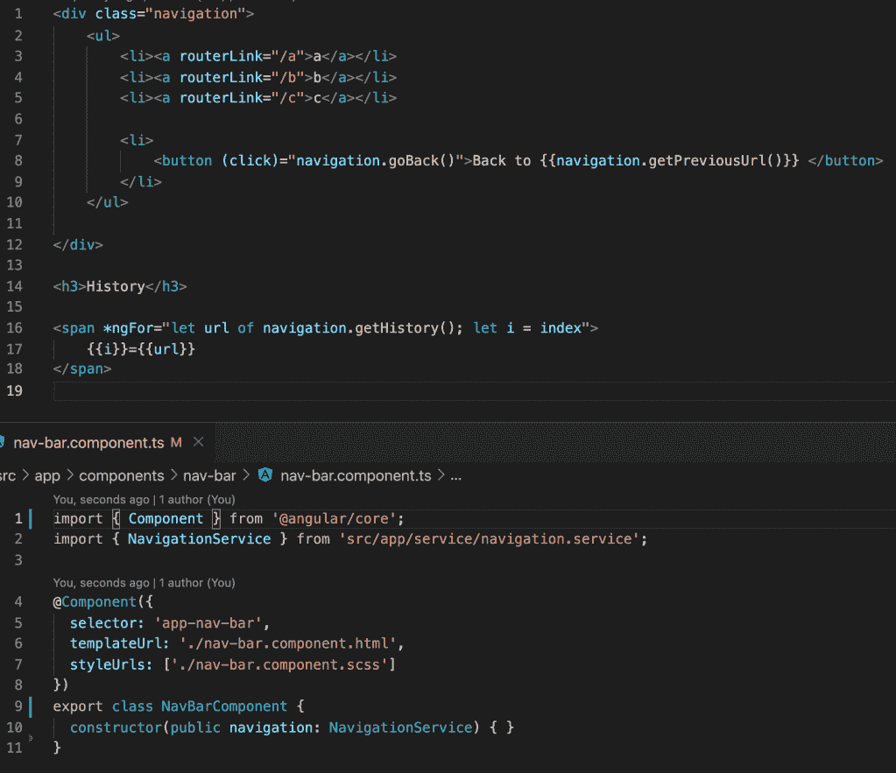
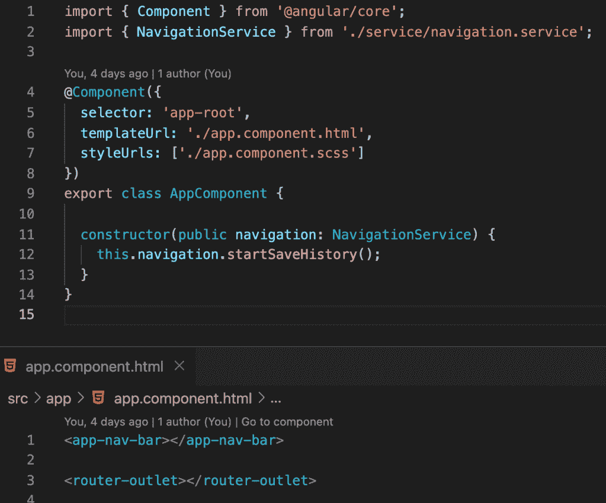
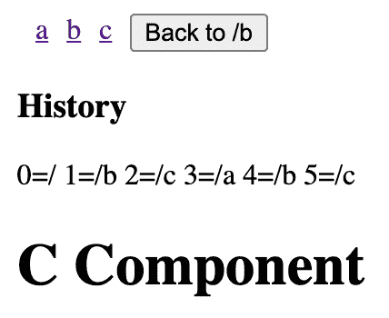

# 有角度的返回按钮。保存路线历史。

> 原文：<https://medium.com/quick-code/go-back-button-in-angular-save-route-history-in-angular-374f28c4a793?source=collection_archive---------0----------------------->

大概每个网站都有后退按钮。这个按钮应该如何工作？基本上，当我们得到一个新的 URL 地址时，我们得到一个新的页面，这个 URL 保存在浏览器历史中。利用这段历史，我们可以回到过去。像 angular 这样的 spa 应用呢？在 angular 的大部分时间里，我们有一个静态的路径，但是我们改变了当前页面的内部组件。

在我们的网站上有一个后退按钮会很好。我们能做什么？标准的浏览器历史对我们不起作用。我们可以编写自己的服务，当用户在我们的 angular 应用程序中改变路线时，该服务将进行侦听。新的路线将被保存，当用户点击后退按钮，我们给最后保存的项目。

我们的角度应用有三条路线。每个组件只显示当前位置。

在我们存储路线历史的导航服务中，我们订阅路线变化的事件。我们在数组中保存的每条新路线。显然，这个服务包含了一个获取上一条路线并返回的方法。

在导航栏中，我们有改变路线的按钮，返回按钮。此外，我们显示导航历史。

在 app 组件中，我们初始化了一个导航服务，在这里我们订阅了一个路线更改。

因此，我们在 angular 应用程序中提供了保存路线历史的导航服务。

如果你需要仔细看看这个项目，这里有链接。

*原载于 2021 年 8 月 6 日*[*【http://tomorrowmeannever.wordpress.com】*](https://tomorrowmeannever.wordpress.com/2021/08/06/navigation/)*。*