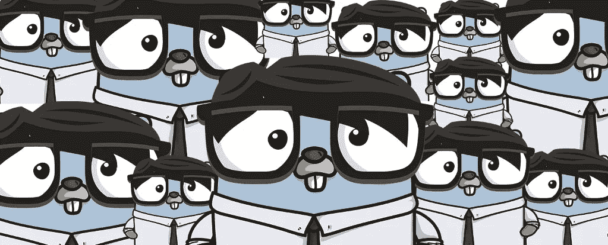
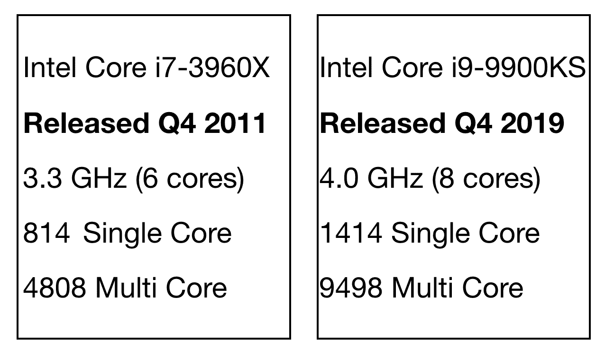
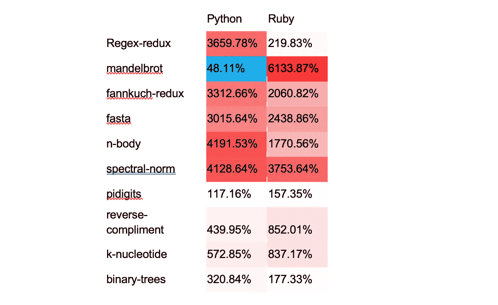
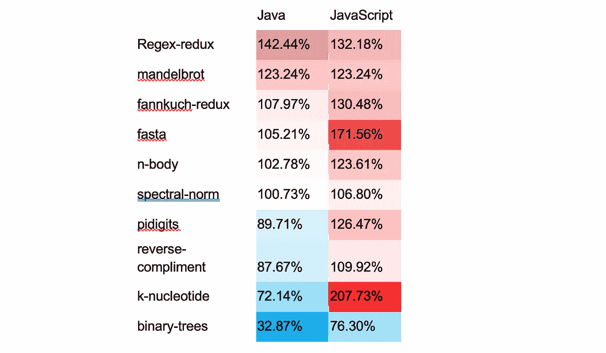

# 围棋很无聊…这太棒了！

> 原文：<https://medium.com/capital-one-tech/go-is-boring-and-thats-fantastic-d350ebdc4748?source=collection_archive---------1----------------------->

# 深入探究为什么这个世界依赖于简单、可靠、易于理解的技术

我做专业软件工程师已经将近 23 年了，写程序大概 38 年了。

在那段时间里，我用过很多语言。我喜欢编程语言，学习它们的新特性，以及与之前的语言相比，它们有什么变化。

如果你看看编程语言的过去 10 年，你会看到很多变化。C++、Java、Python 和 JavaScript 获得了新的特性，像 Rust 和 Swift 这样的新语言自推出以来变化很快。这是非常令人兴奋的，但有时也感觉你永远无法跟上所有这些语言的所有想法。

# 然后是 Go。

思考围棋的最佳方式是思考所有它*没有*的东西。

*   Go *没有虚拟机或者基于 LLVM 的编译器。*
*   Go *没有*有异常。
*   Go *没有*的自定义实现继承。
*   Go *没有*的函数、方法或操作符的重载。
*   围棋*没有*没有不变的。
*   Go *没有*的枚举。
*   Go *没有*有泛型。
*   而且自 2012 年 Go 1 发布以来，Go 并没有增加任何重大功能。

Go 令人兴奋的一点是通过 goroutines、channels 和 select 提供的内置并发支持。然而，它是基于来自 [CSP 的想法，沟通顺序流程](https://www.cs.cmu.edu/~crary/819-f09/Hoare78.pdf)，它在 1978 年首次被描述。

这听起来不像是 21 世纪的编程语言吧？

然而，根据 Stack Overflow 统计，Go 是第三大热门语言(可能不是巧合)[和第三大收入最高的语言](https://insights.stackoverflow.com/survey/2019/#technology-_-what-languages-are-associated-with-the-highest-salaries-worldwide)。硅谷的每一家初创公司都在使用 Go 来构建他们的基础设施。Docker、Kubernetes、etcd、Terraform、Vault、Consul、Traefik 等很多前沿项目都是用 Go 编写的。这是怎么回事？为什么大家都对这种*无聊的*语言感兴趣？

# 为什么软件工程是新的桥梁建筑

所以在我们回答这个问题之前，让我们先退后一步。

“Arkadiko Mycenaean Bridge II” (https://commons.wikimedia.org/wiki/File:Arkadiko_Mycenaean_Bridge_II.JPG) by Flausa123 (https://commons.wikimedia.org/w/index.php?title=User:Flausa123&action=edit&redlink=1) is licensed under CC BY-SA 3.0 (https://creativecommons.org/licenses/by-sa/3.0).

这是希腊阿尔戈利斯的阿尔卡迪科桥。这座桥有 3000 多年的历史，是世界上现存的最古老的桥。令人惊讶的是，它仍然在使用。

现在，我们为什么要关心一座旧桥呢？这是因为有一个关于软件开发的普遍真理，软件工程师不喜欢谈论太多。

*我们真的不擅长写软件。*

我指的不仅仅是办公室里一个被你的经理派去喝咖啡的人在关键时刻跑去减少错误数量。我指的是每个人——我、你和你能想到的每一个著名的开发者。

但是设计和建造桥梁的人，他们很擅长这个。桥梁按时、按预算建成，并持续几十、几百甚至几千年。如果你仔细想想，造桥有点儿像*牛逼*。桥是如此常见，以至于它们也令人难以置信的无聊。当一个桥工作正常时，没有人会感到惊讶，当软件工作正常时，每个人都会有点惊讶。

不幸的是，这个世界非常依赖软件。它甚至可能更依赖于软件而不是桥梁。因此，我们在编写软件方面的进步必须远远快于我们在搭建桥梁方面的进步。

# 我们所知道的关于编写软件的一切

在过去的 60 年里，我们学到了一些关于编写程序的事情，这些事情有很多普遍的共识:

*   我们同意早发现问题比晚发现好。
*   我们同意人们在程序中管理内存是很糟糕的。
*   我们同意代码评审有助于发现 bug。
*   我们同意，在任何需要一个以上的人的项目中，沟通成本占主导地位。

# 硬件救不了我们

我们可以将这些我们知道的事情与另一个已经确定的事实结合起来:计算机不再变得更快了。至少不像以前那样了。[在 20 世纪 80 年代和 90 年代，CPU 的速度每 1-2 年提高一倍](http://www.gotw.ca/publications/concurrency-ddj.htm)。这已经改变了。

当你看单核性能时，[最快的 2019 酷睿 i9](https://browser.geekbench.com/processors/2600) 比[最快的 2011 酷睿 i7](https://browser.geekbench.com/processors/662) 快不到两倍。我们没有变得更快，而是向 CPU 添加了更多的内核。当你看多核性能时，它稍微好一点，略快 2 倍多。

限制我们的不仅仅是 CPU 性能。Forrest Smith 写了一篇关于 RAM 和 RAM 访问模式对性能影响的精彩博文。亮点是:

*   RAM 比 CPU 慢得多，差距也没有变好，即使 CPU 也没有变快多少。
*   RAM 可能是随机存取的，但是如果你真的那样使用它，它会很慢。如果数据是连续的，在现代的英特尔 CPU 上，每秒可以从 RAM 中读取大约 40gb。如果你做一个随机读取，它是每秒少于半个千兆字节。
*   有很多指针的代码特别慢。引用福里斯特的话:*“指针后面的值的顺序求和运行速度不到 1 GB/s。两次未命中缓存的随机存取运行速度仅为 0.1 GB/s。指针追踪速度慢 10 到 20 倍。朋友不让朋友用链表。”*哎哟。

# 无聊是新的刺激

因此，考虑到这些我们知道的关于如何构建软件和硬件的宝贵知识，让我们再来看看围棋。

# 去和软件

## 尽早发现问题

Go 语言可能缺乏特性，但是它提供了一套很好的工具。Go 的编译器很快，那种快编译速度被 Go 团队认为是一个特色。它让您快速查看您的代码是否编译，如果没有，它让您看到问题在哪里。测试内置于标准库中，以鼓励开发人员测试他们的代码并发现问题。基准测试、概要分析和竞赛检查也是现成的。很少有语言附带这些工具，它们使得快速发现问题变得更加容易。

## 内存管理

众所周知，Go 有一个垃圾收集器。你不必担心保持记忆的轨迹，这是一件奇妙的事情。在编译语言中，垃圾收集很少见。Rust 的借用检查器是一种获得高性能和内存管理的迷人方式，但它有效地将开发人员变成了垃圾收集器，这可能很难正确使用。如果您犯了错误并且忘记将一些引用声明为弱引用，Swift 的 ARC 仍然会泄漏内存。现在，Go 的 GC 并不像这些半自动系统那样高性能，在某些情况下你需要额外的速度，但在大多数情况下，它肯定是足够的。

## 代码审查

代码审查如果做得好，是很重要的。为了进行有效的代码评审，你需要确保评审人员关注正确的事情。低质量的代码评审花费时间在格式化这样的事情上。Go 在这里很有帮助，因为在检查 Go 代码时没有格式参数，因为所有 Go 代码都是按照 go fmt 规定的格式进行格式化的。

代码审查是双向的。如果您想要一个工作良好的评审，您需要确保其他人能够理解您的代码。Go 程序应该是简单的，使用一些自语言发布以来就没有改变过的易于理解的结构。因为没有异常，没有面向方面的编程，没有继承和方法重写，也没有重载，所以什么代码调用什么以及在哪里返回值是非常清楚的。如果您在 Go 中不修改包级变量，那么就很容易看到数据是如何被修改的。由于 Go 的变化如此之小，你可以避免[熔岩流反模式](https://www.infoq.com/news/2015/01/lava-layer-antipattern/)，在那里你可以准确地说出一些代码是基于它所使用的特性何时被引入语言的。

## 通信费用

Go 对这有什么帮助？我们已经讨论了 Go 的简单性、稳定性和标准格式如何使交流你的代码正在做什么变得更加容易。虽然这是一部分，但还有其他原因。Go 的隐式接口帮助团队编写解耦的代码。它们是由调用代码定义的，准确地描述了需要什么功能，这澄清了您的代码正在做什么。

# 去硬件

让 Go 成为编译语言的决定得到了回报。当 CPU 的速度越来越快时，在虚拟机上运行解释语言似乎是一个好主意。如果你的程序不够快，等一年就好了。那已经不管用了。编译成本机代码没有最新的虚拟机技巧有趣，但是它有很大的性能优势。

让我们用基准游戏中的[的微基准来比较 Go 和一些在虚拟机中运行的语言的性能。首先，我们将 Python 和 Ruby 与 Go 进行比较。任何小于 100%的百分比都意味着比 Go 快，大于 100%意味着比 Go 慢:](https://benchmarksgame-team.pages.debian.net/benchmarksgame/index.html)

红色太多了。有一个基准测试表明 Python 更快(奇怪的是，它不仅比 Go 快一倍，而且在这个测试中比其他任何语言都快)，而 Ruby 却没有。除了那种情况，两种语言产生的代码都比 Go 慢 17%到 60 多倍的 T4。

现在让我们看看 Java 和 JavaScript 是怎么做的:

这些语言更接近围棋的表现。在一个基准测试中，JavaScript 比 Go 快，在另一个基准测试中慢，但是 JavaScript 最差的情况是慢三倍。

Java 和 Go 在性能上非常接近。Java 在四种情况下比 Go 快，两种情况下差不多，四种情况下比较慢。Go 最差的表现是比 Java 慢三倍，最好的表现是快 50%。

我们看到的是，唯一能跟上 Go 的 VM 是 Java 的。 [Hotspot](https://www.oracle.com/technetwork/java/whitepaper-135217.html) 是一项令人惊叹的技术，但你需要世界上最好的工程软件之一，才能与优先考虑编译速度而不是优化的编译器持平，这一事实说明了一些问题。你要为这项惊人的技术付出代价。Java 应用程序的内存使用量比 Go 应用程序大很多很多倍。

还有第二个优势。垃圾收集器管理的垃圾是不使用的指针。与隐藏指针的语言不同，Go 给了你控制权。它可以让你避开指针，以一种允许快速 RAM 访问的方式来布置你的数据结构。这也允许 Go 使用更简单的垃圾收集器，因为 Go 程序只是创建了更少的垃圾。*无聊只是工作少了。*

众所周知，CPU 正在通过更多的内核来弥补其速度提升的不足。所以使用利用这一点的语言是很好的。这就是 Go 的并发支持的用武之地。拥有对并发性的语言级支持和跨多个线程调度 goroutines 的运行时库意味着，当您拥有多个 CPU 内核时，这些线程可以映射到这些内核。

# 我不想要我没有的东西

我们已经看到，Go 专注于我们所知的使创建软件更容易、更适合现代计算机的内存和 CPU 架构的特性和工具。但是其他语言有而 Go 没有的特性呢？也许 Go 开发者错过了，那些 Go 没有的特性帮助开发者写出更少的错误，更容易维护的代码。据研究人员所知，事实并非如此。

2017 年的一篇名为“[Github](https://web.cs.ucdavis.edu/~filkov/papers/lang_github.pdf)中编程语言和代码质量的大规模研究”的论文研究了 729 个项目，8000 万 SLOC，29000 名作者，150 万次提交，用 17 种语言试图回答这个问题:*编程语言对软件质量有什么影响？他们的回答是没什么区别:*

*“值得注意的是，这些源于语言设计的适度影响是由诸如项目规模、团队规模和提交规模等过程因素压倒性地主导的。”*

另一组研究人员对这些数据进行了第二次审视，并在 2019 年进行了一项名为“[关于编程语言对代码质量的影响](https://arxiv.org/pdf/1901.10220.pdf)”的再现研究。他们的发现更加令人惊讶:

不仅不可能根据手头的数据在编程语言和代码质量之间建立因果联系，甚至它们的相关性也被证明是有问题的

如果编程语言选择不重要，为什么要选择 Go？这些研究表明，过程很重要。工具、测试、性能和长期维护的便利性比时髦的功能更重要。当正确使用时，Go 的内置工具支持更好的过程，同时提供经过时间考验的特性。

这并不是说新功能不好。桥梁建筑技术已经进步了几个世纪甚至几千年。但是你想成为第一个走过一座用全新的想法和未经测试的技术建造的桥吗？在你采用它之前，你需要等待一段时间，让人们测试一下。

软件也是如此。如果我们要构建像桥梁一样可靠的软件基础设施，我们将需要使用像我们在物理基础设施中使用的那些技术一样经过充分测试和充分理解的软件技术。这就是为什么 Go 大部分都在使用 70 年代设计的功能。我们知道它们有用。

***走得无聊，真是太棒了。让我们都出去，用它来构建明天令人激动的应用程序。***

*****

用 [Gopherize.me](https://urldefense.com/v3/__http:/Gopherize.me__;!!EFVe01R3CjU!IjyWo8esadqQE5IsseqfbP2yWKgMKU8lCZoOhpj0nl-yzB3uhLAv9mB6h-_tcY8113-k$) 生成的 Gopher 吉祥物

*原载于*[*https://www.capitalone.com*](https://www.capitalone.com/tech/software-engineering/go-is-boring/)*。*

*披露声明:2020 资本一。观点是作者个人的观点。除非本帖中另有说明，否则 Capital One 不隶属于所提及的任何公司，也不被这些公司认可。使用或展示的所有商标和其他知识产权是其各自所有者的财产。*