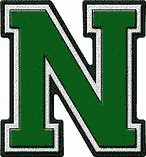

# GO——编程世界的特斯拉

> 原文：<https://medium.com/globant/go-the-tesla-of-programming-world-a3ad8584723e?source=collection_archive---------0----------------------->

## 围棋遇上特斯拉


```
***Disclaimer:*** The content of this article are for entertainment and informative purposes only. I strongly urge the readers not to rely on it for professional decision making. The opinions expressed here are those of the author's and in no way represent the opinions, ideas, ideologies or point of view of any organisation the author is affiliated to.
```

在我喝早间咖啡的时候，我回顾了我女儿在 10ᵗʰ的一个月 [**一个月**](https://en.wiktionary.org/wiki/monthiversary#:~:text=monthiversary%20(plural%20monthiversaries),Synonym%3A%20mensiversary)(🥰的一种新时尚)中的成长，一篇关于 GO 最终拥抱仿制药的文章，接着是特斯拉最终的新闻


**Image Source:** [**http://www.symbols-n-emoticons.com**](http://www.symbols-n-emoticons.com/)

计划在 2021 年前往印度(我的祖国)引发了一个奇怪的想法:如果围棋和特斯拉是“如何不陷入困境并提前思考未来”的新缩影，那确实是值得的。一个保留了其父母物种的复杂解剖身体结构的新生婴儿，如何成长和发展自己的性格和态度。下面是我对为什么、如何以及是什么让 **me *感觉 GO 确实是编程语言中的特斯拉的看法。***

***特斯拉在汽车界的破晓和成长与围棋在编程界惊人的相似，***

*   *两者都是为了打破各自领域中已为人所知的做事方式的束缚，并提出一种新的、高效的方法来完成同样的事情*
*   两家公司都与已经建立的巨头展开较量，并根据各自的增长图表来看，似乎都在赢得这场战斗
*   *两者都旨在保留各自领域的优秀部分，并在硬部分的基础上进行改进*
*   两人都被设定为各自帝国的未来


**Image Source:** [**https://giphy.com/**](https://giphy.com/)

N***asce(又名 Inception): *** 与普遍的看法相反，是通用汽车而不是特斯拉生产了世界上第一辆名为 *** EV1 的量产电动汽车。这辆车只通过租赁出售，在生产了几年后，通用汽车召回了所有的 EV1 汽车并销毁了它们！！！这引发了 ***马丁·艾伯哈德*** 和 ***马克·塔彭宁*** 启动特斯拉(最初是特斯拉汽车公司)挑战大型汽车制造商，并引领进入零排放的交通方式。***

在 GO 之前，Google 的开发人员面临着编译时间和代码可维护性的问题，这直接影响了生产力。此外，还需要一种具有更好并发支持的编程语言来利用多核处理器的能力。并且同时更容易学习，实现简单，减少编程混乱。那是谷歌主要使用 C++的时候，任何问题或代码的微小修改都需要花费一天以上的时间。C++的另一个缺点与它的内存管理模型有关:内存的分配和取消分配不是动态的，如果程序员不能处理同样的问题，就会导致内存堵塞，导致应用程序变慢，最终崩溃。在 GO 时代之前，在项目开始时，需要选择要使用的编程语言:为了简单而使用 Python，从而放弃内存、CPU 管理和可移植性，或者以实现简单为代价接受 java 的垃圾收集、内存管理和可移植性，或者像 C++这样具有复杂的内存管理模型和缺乏内置垃圾收集的任何其他语言。进入 GO:一种简单、易学的编程语言，由 ***Rob Pike*** 开发，内置垃圾收集器(远比 Java 中的简单)，拥有让 Java 喘不过气来并支持并发编程的编译时。GO 和 C++的编译时间大致相同，但前者的主要优势是动态内存管理。

仔细观察，可以发现 TESLA 和 GO 的诞生都归功于一个出现的机会。这是一个机会，促使其各自的创造者开发一种方法，试图回答他们各自领域中“当时”的缺点。


**Image Source:** [**https://giphy.com/**](https://giphy.com/)

  S   ***自力更生(又名自持):*** 电动汽车最重要的部件是电池，编程语言的部件是一种叫做编译器的软件。特斯拉的 Elon Musk 最近宣布，他们将开发“平板”电池，这将有助于为他们的车辆提供更好的行驶里程。重大新闻，特斯拉将在内部生产这些电池。

> 为什么特斯拉没有从拥有内部电池制造部门开始？没有具体的原因，但特斯拉优先考虑获得他们在汽车制造方面的专业知识，然后才开始为他们的汽车制定内部电池生产计划。

GO 编译器是“实现自身的语言”的一个奇怪例子。在 Go v1.4 之前，GO 编译器是用 C 语言编写的，后来被用 GO 语言编写的编译器所取代！！！

> 这提供了主要的优势:有了它们，现在对编译器有了更好的控制，因为 GO 更简单会使调试编译器问题更快更容易。此外，GO 对单元测试和概要分析有着强大的内置支持。

```
**Further read:** For the more curious among you, provided below the link for a resource which explains the motivation behind making a change in the go-compiler[https://docs.google.com/document/d/1P3BLR31VA8cvLJLfMibSuTdwTuF7WWLux71CYD0eeD8/edit](https://docs.google.com/document/d/1P3BLR31VA8cvLJLfMibSuTdwTuF7WWLux71CYD0eeD8/edit)
```


**Image Source:** [**https://giphy.com/**](https://giphy.com/)

  I   ** *创新:在当今竞争激烈、竞争激烈的世界中，创新一直是取得成功的关键。特斯拉和 GO 都采用了*颠覆性创新方法*。颠覆性并不意味着新进入者必须挑战/修改/改变完成任务的既定方式的每一个方面，而是采取不同的、更好的、更简单的、通常更有效的方式来完成符合当前趋势的事情。***

> 根据维基百科,[颠覆性创新](https://en.wikipedia.org/wiki/Disruptive_innovation)是一种创新，它创造了一个新的市场和价值网络，并最终颠覆了现有的市场和价值网络，取代了现有的市场领先企业、产品和联盟。

特斯拉通过一项几乎不存在的电动汽车制造提案，进入了以汽油动力汽车为主的汽车制造市场。保留了车辆久经考验的空气动力学设计，特斯拉彻底改变了这些车辆推进自己的方式。自从他们的第一辆汽车问世以来，大约 12 年时间，特斯拉已经将这场战斗带到了已经成立的、历史悠久得多的汽车制造商的门口，除非他们也进行创新，否则这些制造商将威胁到他们的生存。特斯拉是未来交通的掌舵人:零排放，可再生能源驱动的车辆。

GO 建立在现有编程语言的优势之上，即 [C](https://en.wikipedia.org/wiki/C_(programming_language)) 、 [Pascal](https://en.wikipedia.org/wiki/Pascal_(programming_language)) 和 [Oberon](https://en.wikipedia.org/wiki/Oberon_(programming_language)) 编程语言。GO 面临的最大恶魔是所谓的最复杂的需求:简单和极简。c 已经很简单了，但是 GO 将简单性提升到了一个更高的层次。GO 因其学习和实现的简单性以及遵循实现复杂编程概念(如并发性)的极简方法而广受好评。最初，GO 被认为是为了解决谷歌内部的编程障碍。尽管技术进步意味着多核处理器从 2006 年开始成为标准，但没有一种编程语言能够最大限度地利用这种处理能力，进而提高代码的执行速度，并有效利用底层硬件和软件基础设施。

> 这种颠覆性的方法反映在 GO 如何处理某些编程范式上。GO 允许 OOP 风格的语法，但实际上并不是面向对象的语言！它和其他面向对象语言一样有类型和方法，但是缺少类型层次。GO 的继承概念与其他面向对象语言如 JAVA 所追求的完全不同。与 JAVA 不同的是，在 JAVA 中两个相关类的显式声明是必要的，GO 基于特定的标准隐式地计算类型依赖。

尽管进入了已经拥挤不堪的编程语言世界，GO 在短短的 12 年时间里，已经引起了巨大的轰动，可以说是最受喜爱、使用最多、发展最快的编程语言之一。根据目前的市场报告，GO 对语言中的庞然大物 JAVA 是一个威胁，并被广泛认为是未来的编程语言。


**Image Source:** [**https://www.wix.com/**](https://www.wix.com/)

 G 这就是创新的特斯拉所造成的破坏，它很可能取代苹果成为世界上最有价值的公司(按市值计算)。特斯拉被广泛认为是领先其他汽车制造商至少十年的公司！！！

跨平台 GO 语言是 Github 上发展最快的编程语言之一，还有谷歌自己的 DART。截至 2020 年第三季度，它是 GitHub 上第四大最受欢迎的语言。


**Image Credit: *HackerEarth***

根据 2020 年 [StackOverflow 开发者调查](https://stackoverflow.blog/2020/05/27/2020-stack-overflow-developer-survey-results/)，它是 StackOverflow 上第五受欢迎的语言。GO 的发展绝非侥幸，也不仅仅是炒作，尤其是当你想到像 Docker、Kubernetes、Terraform 这样的应用完全是用 GO 编写的时候。GO 也是职业人士想在 2020 年学习的编程语言的第一名。随着 GO 2.0 的出现，GO 正在成为企业软件开发的首选语言，取代长期的王者 JAVA。


**Image Source:** [**https://basseyblogs.blogspot.com/**](https://basseyblogs.blogspot.com/)

**SER 心态:**特斯拉的大部分用户都放弃了汽油动力汽车，为了熟悉他们的新车，用户需要经历一次大的心态转变。用户需要明白，他们需要记录的不是油位和冷却液液位，而是电池电量。用户还需要了解充电周期和不当充电技术的影响。

对于 GO，这里的用户是开发人员和那些决定在 GO 中继续他们的项目实现的人。开发人员需要特别了解项目需求以及与 GO 相关的优势和限制。开发人员经常从 GO 开始，因为他们对它是当前时代的编程语言感到兴奋，而忽略了它的局限性。一个简单的概念，比如泛型和类型层次结构，也可能是项目开发中使用或不使用 GO 的成败关键。


**Image Source:** [**https://giphy.com/**](https://giphy.com/)

  S   **支持:**关于特斯拉，支持挑战主要在于基础设施，特别是充电基础设施。在他们的祖国，即美国，这可能不是一个大障碍，但如果特斯拉要扩展到印度等国家，那么它需要与当地管理机构合作，开发必要的基础设施，以维持电动汽车的流动性。

关于围棋，最大的障碍是要有一个支持用户的技术社区。在这个领域，像 JAVA trumps 这样的成熟语言很容易也很有说服力。JAVA 享有最大的社区支持之一。像 GO 这样的发展中语言肯定需要建立一个强大的、熟练的技术社区，这反过来不仅有助于 GO 作为一种语言的发展，也有助于它的改进。


**Image Source:** [**https://tenor.com/**](https://tenor.com/)

  S   **可持续性:**特斯拉在建立了自己的庞大品牌后，通过在销售和服务过程中提供最佳的客户支持来维持它，这是一项具有挑战性的工作。此外，由于其雄心勃勃的新产品迎合大众的计划，需要看看他们是否能在生产过程中保持同样高水平的质量控制。

GO 比特斯拉更关注可持续发展。尽管 GO v2.0 是围绕最小化和简单的原则构建的，但它正在引入泛型。展望未来，它的创建者需要确保包含 never 特性、概念和改进不会偏离他们的愿景，也不会像今天的 JAVA 一样成为一种概念过多的语言。JAVA 的早期采用者可能会说，它开始时也是最小的，但随着时间的推移变得越来越大。GO 应该避免走那条路。

> 考虑到所有的因素，现在很清楚，特斯拉取得成功的创新而艰难的道路同样适用于围棋。他们各自领域的困难可能性质不同，但在相似的原则上影响他们。

***感谢阅读。在*捣碎👏*按钮帮助传播爱&表达你的欣赏。***

# 😇点击下面的图片了解更多关于我的信息😇

[](https://www.linkedin.com/in/vinodh-n-5914874b/)

Hyperlink for Vinodh’s LinkedIn profile