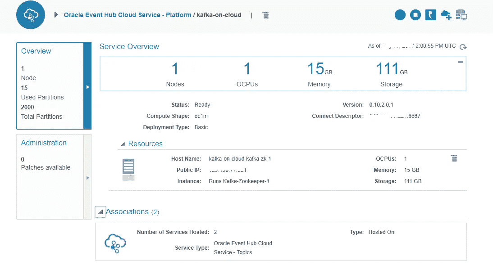
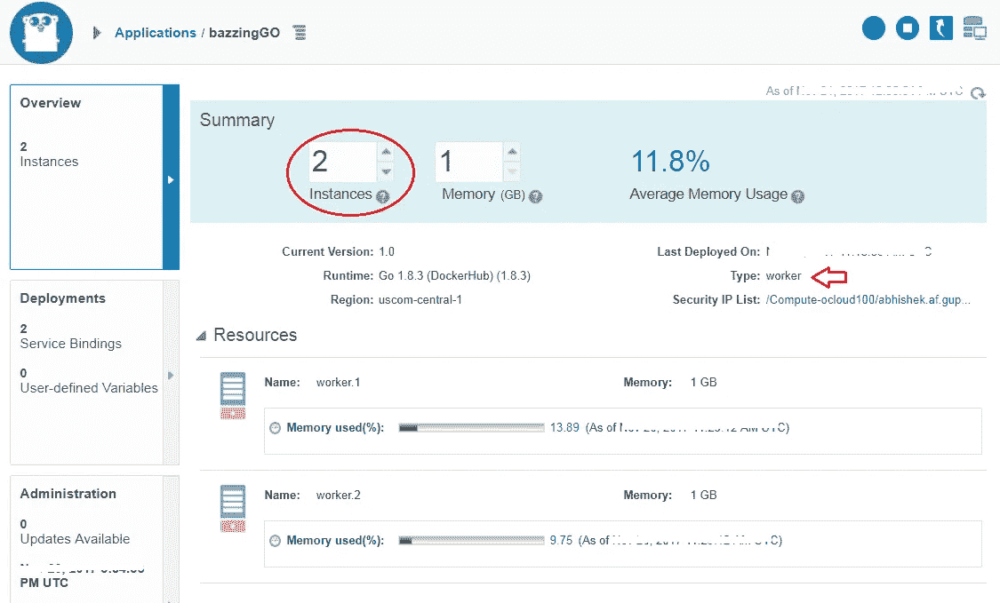

# 在 Oracle 云上使用 Kafka 和 MySQL

> 原文：<https://medium.com/oracledevs/go-with-kafka-mysql-on-oracle-cloud-9c93e71167c2?source=collection_archive---------0----------------------->

Oracle Application Container Cloud 现在[支持**Go**(](https://docs.oracle.com/en/cloud/paas/app-container-cloud/jsewn/index.html#JSEWN-GUID-BADD0C4E-49F4-4FE4-8DA1-DC8237615C53)[golang](https://golang.org/))以及现有的运行时集，包括 *Node.js、Java SE、Java EE、Python、PHP 和 Ruby*


Welcome Gopher to Oracle Cloud!

这个博客演示了一个基于 Go 的异步 **worker** 应用程序

*   [Oracle 事件中心云](https://cloud.oracle.com/en_US/event-hub)(托管 Apache Kafka)充当消息中心
*   [Oracle 应用程序容器云](https://cloud.oracle.com/en_US/application-container-cloud) (polyglot，云本地开发平台)托管(Go)消费者应用程序，该应用程序使用 Kafka 的 [sarama 客户端](https://github.com/Shopify/sarama)
*   [Oracle MySQL Cloud](https://cloud.oracle.com/en_US/mysql) 用作存储来自消费者应用程序的已处理消息的接收器—[Go MySQL 驱动程序](https://github.com/go-sql-driver/mysql)用于此目的

> 这里是[一篇博客文章](/oracledevs/worker-applications-on-oracle-application-container-cloud-f449eaa77c39)，它通过一个基于使用 Redis 队列中的数据的例子来讨论工人应用程序的基础

# 应用概述

> [代码可从 Github 上获得](https://github.com/abhirockzz/accs-go-kafka-mysql)

这个应用程序非常简单——一个图表就足以理解正在发生的事情

*   制片人将数据推向卡夫卡主题
*   基于 Go 的 Kafka 消费者应用程序(可横向扩展)处理数据，
*   将它们与分区、偏移量、键值和处理节点/实例信息一起推送到 MySQL


High level architecture

## 事件中心和 MySQL 云服务的服务绑定

服务绑定用于我们的应用 Oracle Event Hub 和 Oracle MySQL Cloud 之间的私有和安全通信— [详情请见](https://docs.oracle.com/en/cloud/paas/app-container-cloud/csjse/exploring-application-deployments-page.html#GUID-BCD4C8AA-0E1C-490D-92E8-6BAE003F5F5C)

这里有一些代码片段，突出了我们作为绑定的结果而获得的环境变量的用法

**为 MySQL 构建连接字符串(DSN)**

```
mysqlUser := os.Getenv(“**MYSQLCS_USER_NAME**”)
mysqlPwd := os.Getenv(“**MYSQLCS_USER_PASSWORD**”)
mysqlConnString := os.Getenv(“**MYSQLCS_CONNECT_STRING**”)

mysqlConnStringAndDB := strings.Split(mysqlConnString, “/”)
hostport, dbname := mysqlConnStringAndDB[0], mysqlConnStringAndDB[1]**mysqlDSNForDriver** := mysqlUser + “:” + mysqlPwd + “[@tcp](http://twitter.com/tcp)(“ + hostport + “)/” + dbname
```

**在 Oracle Event Hub 上为 Kafka broker 创建消费者实例**

```
ehcsBroker := os.Getenv("**OEHCS_EXTERNAL_CONNECT_STRING**")
 if ehcsBroker == "" {
  ehcsBroker = "192.168.99.100:9092"
 }ehcsTopic := os.Getenv(“**OEHCS_TOPIC**”)
 if ehcsTopic == “” {
 ehcsTopic = “test”
 }config := cluster.NewConfig()
config.Consumer.Return.Errors = true
config.Group.Return.Notifications = true**brokers** := []string{ehcsBroker}
**topics** := []string{ehcsTopic}consumer, err := cluster.NewConsumer(**brokers**, “test-consumer-group”, **topics**, config)
```

# 基础设施设置

## Oracle 事件中心云(Kafka broker)

博客中用于示例应用程序的 Kafka 集群拓扑相对简单，即一个代理与 Zookeeper 位于同一位置。

> 请参考[文档](http://docs.oracle.com/en/cloud/paas/event-hub-cloud/ehcug/creating-cluster.html)了解更多关于拓扑和详细安装过程的细节(提示:很简单！)



**创建主题—** 创建主题(详细的[文档](http://docs.oracle.com/en/cloud/paas/event-hub-cloud/ehcug/creating-topic.html))

**创建自定义访问规则**

您需要在 Oracle Event Hub Cloud 上的 Kafka 服务器虚拟机上创建一个自定义的**访问规则**来打开端口**6667**—[详情请见](https://docs.oracle.com/en/cloud/paas/event-hub-cloud/admin-guide/platform-access-rules-page.html)。这只是帮助使用 Kafka CLI 进行测试的临时更改

> Oracle Application Container Cloud 不需要打开端口 6667 (Kafka broker ),因为安全连接由服务绑定负责

## Oracle MySQL 云

提供一个 MySQL 数据库实例——您可以在这里参考[详细文档](https://docs.oracle.com/cloud/latest/mysql-cloud/UOMCS/GUID-D03FE523-AD8D-4C53-935C-D5D6513D2A24.htm#UOMCS-GUID-D03FE523-AD8D-4C53-935C-D5D6513D2A24)


Oracle MySQL Cloud service instance

**创建自定义访问规则**

您需要创建一个定制的**访问规则**来在 Oracle MySQL Cloud 上的虚拟机上打开端口 3306—[详情请见](https://docs.oracle.com/cloud/latest/mysql-cloud/UOMCS/GUID-91DABBDA-48FF-456D-96D1-8B03BECF88D8.htm#UOMCS-GUID-91DABBDA-48FF-456D-96D1-8B03BECF88D8)。这只是帮助测试的临时改变

> Oracle Application Container Cloud 不需要打开端口 3306(用于 MySQL 服务),因为安全连接由服务绑定负责

**创建数据库表**

连接到 Oracle Cloud 上的 MySQL 实例并引导数据库表

```
CREATE TABLE `**datadump**` (
 `uid` INT(10) NOT NULL AUTO_INCREMENT,
 `topic` VARCHAR(64) NULL DEFAULT NULL,
 `partition` INT(64) NULL DEFAULT NULL,
 `offset` INT(64) NULL DEFAULT NULL,
 `key` VARCHAR(64) NULL DEFAULT NULL,
 `value` VARCHAR(64) NULL DEFAULT NULL,
 `processedby` VARCHAR(64) NULL DEFAULT NULL,
 `createdat` VARCHAR(64) NULL DEFAULT NULL,
 PRIMARY KEY (`uid`)
 );
```

我们已经有了基础——是时候将我们的应用程序部署到云中并进行测试了

# 构建和部署

## 建设

*   `git clone [https://github.com/abhirockzz/accs-go-kafka-mysql](https://github.com/abhirockzz/accs-go-kafka-mysql).git`
*   `cd [accs-go-kafka-mysql](https://github.com/abhirockzz/accs-go-kafka-mysql)`
*   `zip [accs-go-kafka-mysql](https://github.com/abhirockzz/accs-go-kafka-mysql).zip gokafkamysql.go start.sh`

## 部署

**先决条件**

在部署之前，您需要用以下详细信息更新 *deployment.json*

*   Oracle MySQL 云服务(您之前创建的)
*   Oracle 事件中心云主题(您之前创建的)


deployment.json

借助 Oracle Application Container Cloud，您在部署应用程序方面有多种选择。本博客将利用 **PSM CLI** ，这是一个用于管理 Oracle 云服务的强大命令行界面

> *其他部署选项包括*[*REST API*](https://docs.oracle.com/en/cloud/paas/app-container-cloud/apcsr/index.html)*[*Oracle 开发者云*](https://docs.oracle.com/en/cloud/paas/developer-cloud/csdcs/deploying-application-oracle-developer-cloud-service.html#GUID-6FE6D850-65DC-471D-A249-F7CCA9CAB56F) *当然还有* [*控制台/UI*](https://docs.oracle.com/en/cloud/paas/app-container-cloud/csjse/creating-application.html)*

*   *在您的机器上下载并设置 PSM CLI(使用`psm setup` ) — [详情请点击](https://docs.oracle.com/en/cloud/paas/java-cloud/pscli/using-command-line-interface-1.html)*
*   *部署应用程序— `psm accs push -n accsgokafkamysql -r **golang** -s hourly -m manifest.json -d deployment.json -e **dockerhub** -p [accs-go-kafka-mysql](https://github.com/abhirockzz/accs-go-kafka-mysql).zip`*

## *检查您的应用程序*

*完成后，您应该能够看到部署的应用程序及其详细信息——注意，它有两个实例，类型是 **worker***

**

***bazzingGO** is ready!*

# *试车*

## *产生数据*

*使用基于 Kafka CLI 的生成器将数据推送到 Kafka 主题*

```
*kafka-console-producer.bat --broker-list **<event_hub_host>:6667** --topic **<identity_domain>-<your_topic>** --property "parse.key=true" --property "key.separator=:"*
```

**

*Using Kafka CLI producer*

## *检查 MySQL*

*使用任何 SQL 客户端检查*数据转储*表，以检查相应的结果— `select * from datadump`*

**

*Processed data in Oracle MySQL cloud*

> **注意，Kafka 主题分区*分布*在两个消费者实例之间——处理来自 Kafka 的事件的*实例/节点*的信息也被推送到表中(以红色突出显示)**

*这就是全部了！您刚刚在 Oracle Cloud 上使用 Kafka 和 MySQL 创建了一个简单而有用的 Golang 应用程序*

# *不要忘记…*

*   *查看 Oracle 应用容器云的教程[——每个运行时都有一些内容！](https://docs.oracle.com/en/cloud/paas/app-container-cloud/create-first-applications.html)*
*   *[其他关于应用容器云的博客](http://bit.ly/2gR3nrV)*

*干杯！*

> *本文表达的观点是我个人的观点，不一定代表甲骨文的观点。*