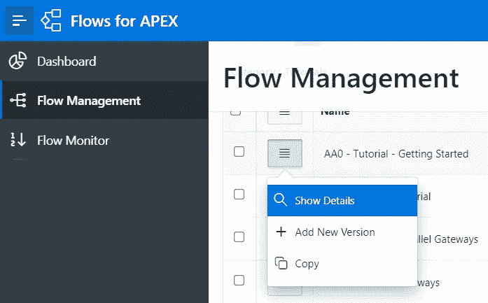

# 随波逐流

> 原文：<https://medium.com/oracledevs/go-with-the-flow-13da46f24f5b?source=collection_archive---------0----------------------->

有没有想过是否有可能创建一个业务流程应用程序？

低代码的业务流程应用程序怎么样？

嗯，不要再想 APEX 项目的流程了。

 [## GitHub-mt-ag/APEX-flowsforapex:APEX 的流-模型和运行流程流都在 Oracle 中…

### 这个 github 存储库是为愿意为即将到来的 APEX 流版本做贡献的开发人员准备的。克隆/分叉…

github.com](https://github.com/mt-ag/apex-flowsforapex) 

为了展示流程到 APEX 应用程序的集成，MT-AG 的优秀人员创建了一个教程，介绍如何创建一个使用业务流程映射符号(BPMN)的基本应用程序。

有 APEX 流程的教程，但没有关于如何安装的文档。

因此，我们将通过下面的安装程序。

**下载 FlowsForAPEX 应用程序**

首先我们需要从官方网站下载 FlowsForAPEX 应用程序。

 [## 顶点流量

### Lerne 甲骨文应用快递 kennen！APEX hilft dir，individuelle，datenzernische Webanwendungen-20…

apex.mt-ag.com](https://apex.mt-ag.com/en/processmodelling) 

文件下载完成后，解压。

下一步我们感兴趣的文件将是 FLOWSFORAPEX _ apex 201 _ 984339 _ UTF8 _ v 21.1 . SQL

**在 Oracle APEX 内部安装 FlowsForAPEX 应用**

登录到您的 Oracle APEX 工作区。我们将在 Oracle 云中使用 APEX 服务，但是您也可以使用任何 APEX 实例。

选择导入。

然后选择文件:FlowsforAPEX _ v 21.1 \ Flows for APEX v 21.1 \ Applications \ FlowsforAPEX _ APEX 201 _ 984339 _ UTF8 _ v 21.1 . SQL

保留默认值，然后单击 Next。

导入成功后，再次单击 Next。

再次保持默认值，并点击安装应用程序。

下一步是安装应用程序的支持对象。

保留默认值，然后单击“Next”。

一旦完成，FlowsForAPEX 就可以运行了。

现在选择运行应用程序。

登录到工作区。

**查看教程**

登录后，您将看到应用程序控制面板。

左上角是汉堡菜单，点击它，然后选择流量管理。

现在，您将看到所有可用的教程。

完整列表如下:

*   教程 0 —入门。
*   教程 1 —网关教程—如何实现有条件的任务路由。
*   教程 2 —并行网关—如何创建并行执行的流程部分。
*   教程 3 —包含网关—但并不总是所有的并行部分。
*   教程 3A —使用变量表达式从模型中设置过程变量。
*   教程 4 —任务完成您的工作—如何在流程中调用 APEX 页面、脚本和发送电子邮件。
*   教程 5 —子流程—将流程的一部分封装到子流程中。
*   教程 6 —错误和升级—如何处理流程中需要帮助或出错的事情。
*   教程 7 —是时候了—添加定时器来创建提醒、流程关闭流、流程超时等。
*   教程 8 —车道和预留区—模拟谁做什么。
*   教程 9 —光猪六壮士。

选择第一个教程的汉堡菜单，并显示详细信息。

现在你可以看到第一个教程:教程 0 —入门

浏览所有教程。

最后一个教程在同一个页面上展示了所有的特性。

Flows for APEX 是 MT-AG 的一个 100%开源项目。

正如我们所发现的，它也是 100%的棒！

# 加入对话！

如果你对甲骨文开发人员在他们的自然栖息地发生的事情感到好奇，请加入我们的[公共休闲频道](https://oracledevrel.slack.com/join/shared_invite/zt-uffjmwh3-ksmv2ii9YxSkc6IpbokL1g#/shared-invite/email)！我们不介意成为你的鱼缸🐠

*Paul Guerin 出席了一些世界领先的甲骨文会议，包括甲骨文 2013 年世界开放大会。自 2015 年以来，他的工作一直是 IOUG 最佳实践技巧小册子以及 AUSOUG、Oracle Technology Network、Quest 和 Oracle Developers (Medium)出版物的主题。2019 年，他被授予 My Oracle 支持社区最有价值贡献者。他是一名 DBA OCP，并将继续参与 Oracle ACE 计划。*