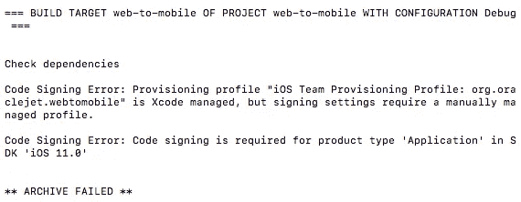

# 借助 Oracle JET 实现移动化

> 原文：<https://medium.com/oracledevs/going-mobile-with-oracle-jet-ccc1b3bd9af5?source=collection_archive---------0----------------------->

您应该选择 Oracle JET 而不是其他 javascript 框架的部分原因是它非常易于移动。

我的意思是把你的网络应用变成一个本地的移动应用，你可以调整它来使用你的目标设备的特性。

在这个过程中，我偶然发现了一些问题，花了一些时间才弄清楚问题是什么，以及随后如何解决它。如果你也在挣扎，希望这篇文章能帮到你。

这篇文章将带你经历一个在 JETs navdrawer 模板中搭建的 web 应用程序的旅程，并以我相当旧的 iPhone 为目标，而无需支付开发者许可证。你不能部署到应用商店，但至少这样你可以“先试后买”。

# 苹果开发者先决条件

开发一个苹果意味着加入苹果开发者计划。对于我的调查/测试，我不喜欢支付这 99 美元，并发现您实际上可以创建一个临时的(在创建 7 天后过期)。

首先，启动 Xcode 并导航到

```
Xcode > Preferences > Accounts tab
```

在这里，您可以点击+图标并从弹出菜单中选择“Apple ID”来添加您的 Apple ID。


Add your Apple ID to Xcode

添加后，您的 Apple ID 将显示您是个人团队的成员:


单击“管理证书…”将打开一个弹出窗口。

点击这个窗口的+号，给自己颁发“iOS 开发”证书。


不幸的是，这并没有包括我们需要为配置文件做的所有事情。在搜索了一些博客后，我发现一个有用的方法是创建一个新的 Xcode 项目。

我们不会使用这个项目，但只是设置一个初始化配置文件，我们需要签署应用程序。

*   打开 Xcode，然后前往文件>新建>项目。
*   选择“单视图应用程序”。
*   在下一个屏幕中，我们需要提供一些值


**产品名称**需要与您的项目名称匹配，去掉破折号。例如，我的目录/项目被命名为“web-to-mobile ”,它解析为 webtomobile。将**团队**设置为您刚刚通过 Xcode 偏好设置添加的账户，并输入“org.oraclejet”。

**产品名称**和**组织标识符**值组成了**捆绑包标识符**，如上面截图所示。**包标识符**需要与＄project/hybrid/config . XML 中的`widget id`属性相同:


单击窗口上的“下一步”。

您将被询问在哪里存储您的新项目，以及您是否想要“创建 Git 存储库”。对于 Git，我们可以取消选中该框，您可以选择一个位置来创建未使用的项目:


一旦您的项目完成，我们会创建一个配置文件。您可以通过使用终端来检查这是否已创建，并使用以下命令更改目录并查看文件夹的内容:

```
cd ~/Library/MobileDevice/Provisioning\ Profiles
ls -altr
```


如果你打开你的。mobileprovision 文件您将找到您的团队标识符 id:


除了文件名中的 id，您还需要团队标识符来签名您的应用程序。我们将在下一步的构建配置文件中使用这两个值。

# 添加混合源

```
ojet add hybrid 
```

没错。这就是你需要从你的 JET 项目中运行的所有内容，以使你的项目适合移动。

**旁注**:你可以添加一些额外的参数来使事情变得更简单，比如`--appName=”My New Cool App”`，它是你的仿真器/设备上的应用程序的名称

配置文件包含您的 iOS 签名详细信息。正如开发人员指南中提到的，Windows/Android 开发不需要这个。

下面是这个配置文件的一个例子。注意，我已经将我的配置文件的文件名放入“provisioningProfile”中，并将该文件中的值放入“developmentTeam”中:

```
{
    "ios": {
        "debug": {
            "codeSignIdentity": "iPhone Developer",
            "provisioningProfile": "**c8dc2d39-5de2-4bb3-bc26-c83ed6d119ac**",
            "developmentTeam": "**R5CXVFCSDJ**",
            "packageType": "development"
        },
        "release": {
            "codeSignIdentity": "iPhone Distribution",
            "provisioningProfile": "70f699ad-faf1-4adE-8fea-9d84738fb306",
            "developmentTeam": "FG35JLLMXX4A",
            "packageType": "app-store"
        }
    }
}
```

详情请访问:[http://Cordova . Apache . org/docs/en/6 . x/guide/platforms/IOs/index . html # signing-an-app](http://cordova.apache.org/docs/en/6.x/guide/platforms/ios/index.html#signing-an-app)

**注意:**如果你还没有安装 Cordova，那么当你运行它的时候，你会得到下面的消息


**Gotcha Alert:** 运行上述命令时，我没有正确的目录访问权限。正如我发现我的危险，如果这不起作用，那么你会有问题。所以我在这里的提示是不要退回到使用 sudo，而是整理你的目录，并确保它在你的 Mac 用户权限之下。

当您运行此命令时，您将获得选择目标的选项。对于 Mac，如果安装了 iOS，这只是 iOS


JET scans your installed libraries for available targets

完成后，您将收到“添加-混合完成”消息:


JET having finished adding hybrid libraries

当查看您的项目目录时，您会注意到您现在有了一个**混合**、 **src-hybrid** 和 **src-web** :


这看起来有点令人生畏，因为有这么多目录，所以让我们依次回顾一下:

*   混合——这相当于你的“网络”文件夹。这个文件夹现在包含了你的 xcode 项目(hybrid/platforms/ios)。它包含您编译的“web”文件夹以及来自 src-hybrid 的任何覆盖，这是您的设备(hybrid/www)的构建输出。
*   src-hybrid —将此文件夹视为移动应用程序的覆盖目录。例如，如果您想要为某些视图或不同的视图模型逻辑使用不同的 html，那么这就是您想要放置它的地方。该目录中的文件将完全覆盖主“src”目录中的文件
*   src-web——如果您开发过纯 web 应用程序，那么您会非常清楚“src”和“web”目录。要理解“src-web”文件夹，需要在思考项目结构时进行一点范式转换；您现在实际上正在处理 2 个源集。这并不是说一切都是重复的，这是 JET 试图为您处理的一件大事。现在看这个项目的方式是你的原始“src”目录是你的主要代码行，src-hybrid 允许覆盖你的手机，src-web 允许进一步覆盖你的 web 主要代码行。同样，如果您来自一个纯 web 应用程序，那么您在这里什么都不用做，但是 JET 会在必要时将该文件夹作为扩展点

# 编译到模拟器

如果您 cd 到$JET_PROJ/hybrid，那么您可以根据需要运行 cordova 命令。你不需要直接用 cordova 做任何事情，但是知道这些是很有用的。

例如，当您的模拟器瞄准一个特定的设备时，您可以检查安装了哪些模拟器(我们将在后面使用):

```
cd hybrid
cordova run ios --list
```


Available emulators and my connected iPad

回到我们在这里的原因，您只需运行以下命令，就可以在模拟器上运行您的 web 应用程序:

```
ojet serve ios
```

ios 平台的默认目的地是模拟器，因此您不需要提供该参数。你也不需要提供构建配置，这意味着让你的应用程序在模拟器上运行非常容易。

默认情况下，我的目标似乎是我不太喜欢的“iPhone X”。

在对 JET 构建代码进行了一些调试之后，我发现您可以通过在`emulator`后面的分号之后提供它作为`destination`标志的一部分，来在模拟器上定位不同的设备:

**重要提示:** JET 不会把这种调试留给你去解决。我很好奇它是如何扩展我对构建工具的学习的。有了命令`ojet help`。例如，您可以运行`ojet help serve`来帮助您的应用程序

运行以下代码意味着我可以使用前面提到的 cordova list 命令中列出的一个来更改模拟器设备:

```
ojet serve ios --destination=”emulator:iPhone-5s"
or
ojet serve ios --destination=”emulator:iPhone-SE"
or 
ojet service ios --emulator="iPhone-SE"
```

在模拟器中运行后，您将看到您的应用程序:


Oracle JET running on iPhone X emulator


Oracle JET running on iPhone SE emulator

# 部署到设备

如果您已经获得了“付费”开发人员供应，那么从这一点来看，事情就变得简单了，您只需运行:

```
ojet serve ios  --destination="device" --build-config=mobileConfig.json
```

**Gotcha Alert** :但是对于自己创建的配置，通过命令行运行上面的内容时会出现错误，因为配置文件是 Xcode 管理的:



尽管我做了很多尝试，但在没有真正理解苹果应用程序部署过程的情况下，我发现一些博客说不再支持用 cordova 和 self provision 签署你的应用程序。

然而，并不是所有的都失去了；我们可以使用 Xcode 来完成这里的工作。

重申一下，如果你已经创建了你的免费条款，你只需要*遵循这个方法。*

导航到您的 xcode 项目文件`$JET_PROJ/hybrid/platforms/iOS/$your_project_name.xcode`

双击它，在 Xcode 中打开它:


一旦你的 Xcode 和你的项目一起打开，点击左上角的项目名称，打开你的项目选项。你可以看到默认情况下有错误。这是因为没有**队**入选。


JET cordova project in Xcode

当改变**组**时，这些错误消失:


我们*现在可以*运行构建，应用将被部署到设备上。

然而，应用程序加载后，我得到了一个稳定的白屏和 Xcode 日志中的一个错误:


这不起作用，但这里发生的是，它为我们设置了自动分析。现在我们可以使用 cordova 来启动该应用程序。

所以我现在推荐的是，现在您已经更改了 **Team** 概要文件，关闭 Xcode 并运行 JET 脚本以最终部署:

```
ojet serve ios — destination=”device”
```

**Gotcha Alert** :第一次将您的应用程序加载到您的设备时，您会收到类似以下内容的消息:


First run errors as its a self signed certificate

这是因为您自己签署的条款不可信。您可以通过导航到设备上的以下内容来信任您的设备:

```
Settings > General > Device Management > user > Trust user
```

现在，您可以重新运行该命令，或者尝试在设备上运行该应用程序。

好了，这款应用终于出现在设备上了:


App on the device


JET app open

**Gotcha Alert:** 我在设备上的移动应用程序中运行 web 应用程序时遇到了问题。该应用程序在模拟器中运行良好，但该应用程序只是没有加载中心视图模型。

我最终追踪到了 main.js 中的 knockout applyBindings。我使用的是 URLPathAdapter，而不是 URLParamAdapter(注意:如果没有定义 urlPathAdapter，则默认使用它)。一旦在手机中加载的应用程序中添加了这一行

```
oj.Router.defaults[‘urlAdapter’] = new oj.Router.urlParamAdapter();
```

我在 Mac 上使用 Safari 连接到设备，并以这种方式进行调试。奇怪的是，knockout 实际上并没有抛出任何错误信息，但是当我缩小了问题所在的区域时，我就尝试了..catch 帮助了我:

```
try {
   ko.applyBindings(app, document.getElementById(‘globalBody’));
 } catch(e){
   console.info(e)
 }
```

这在 safari 控制台上打印出了真正的错误，我可以解决核心问题了。

**注意**:我得到这个错误是因为我来自一个 web 应用程序，在那里我使用了路径适配器用于 SEO 目的。那么快速注意:如果你在手机上，使用 urlParamAdapter。

# 状态栏修复

**Gotcha Alert** :你可能已经注意到这个应用程序占据了整个屏幕，这意味着占据了顶部的状态栏，力量栏、时间等都在那里。

这不是真正的理想，因为它重叠，看起来很丑。然而，来自 Graeme Mawson @ Oracle 的提示解决了这个问题:

*   添加一个 cordova 插件
*   将配置添加到`<platform name=”ios”>` 部分的`$PROJ/hybrid/config.xml`文件中

所以，首先让我们安装插件:

`ojet add plugin cordova-plugin-statusbar`

然后将以下几行添加到`$PROJ/hybrid/config.xml:`

```
<preference name=”StatusBarOverlaysWebView” value=”false” />
<preference name=”StatusBarStyle” value=”default” />
```

在这里，您可以看到我已经将它们添加到预先存在的首选项下:


Configuring the App preferences for the Status Bar

现在重新运行并部署应用程序，瞧，一切都搞定了:


Screenshot direct from iPhone 6 with Status Bar fix

# 最后的想法

使用苹果设备获取应用程序极其复杂。如果试图使用免费的配置文件，这种复杂性会变得更加困难，因为这意味着您必须通过重重困难才能让某些东西正常工作。

希望你可以用这个博客作为参考，免费在苹果设备上测试你的应用程序，以便在申请苹果许可证之前检查它们。

我花了很多时间试图避免使用 Xcode，因为脚本化的想法很酷。然而，现实是，免费条款意味着这是不可能的。

然而，Oracle JET 让从 web 应用程序到移动应用程序变得异常容易，希望通过遵循这一点，您可以比我更快地让它工作起来:)

祝你好运！