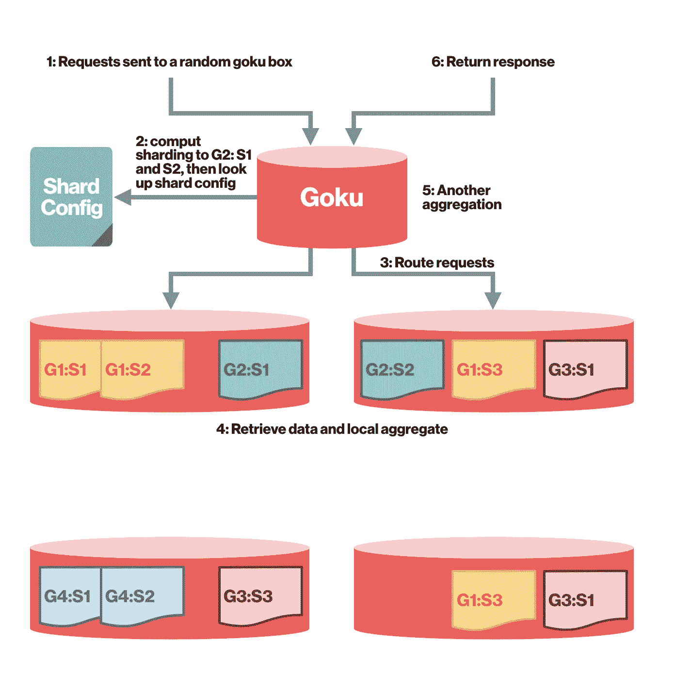
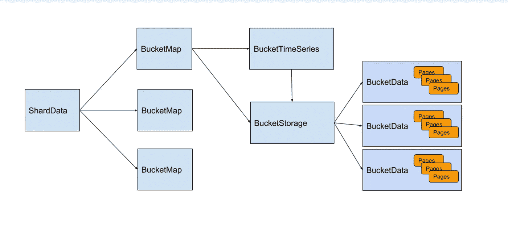

# 悟空:构建可扩展的高性能时间序列数据库系统

> 原文：<https://medium.com/pinterest-engineering/goku-building-a-scalable-and-high-performant-time-series-database-system-a8ff5758a181?source=collection_archive---------2----------------------->

作者:张睿|存储和缓存工程师

*徐、合著&张天英，工程师*

在 Pinterest，开发者依靠 Statsboard 来监控他们的系统并发现问题。一个可靠高效的监控系统对开发速度非常重要。过去，我们一直使用 OpenTSDB 来接收和提供指标数据。然而，随着 Pinterest 的发展，服务的数量也从数百增加到数千，每秒产生数百万个数据点，并且还在增长。

虽然 OpenTSDB 在功能上运行良好，但随着 Pinterest 的增长，它的性能下降了，导致了操作开销(例如严重的 GC 问题和经常崩溃的 HBase)。作为一个解决方案，开发了 Goku——我们的内部时间序列数据库，使用 C++编写的 OpenTSDB 兼容 API，以支持高效的数据接收和昂贵的时间序列查询。

Two-level sharding with Goku

# 时间序列数据模型

*时间序列数据*

悟空遵循 OpenTSDB 的时间序列数据模型。时间序列由一个键和一系列随时间变化的数字数据点组成。key =指标名称+一组标记键值对。例如“TC . proc . stat . CPU . total . infra-Goku-a-prod { host = infra-Goku-a-prod-001，cell_id=aws-us-east-1}”。数据点=键+值。值是时间戳和值对。例如，(1525724520，174706.61)，(1525724580，173456.08)。

*时间序列查询*

除了开始时间和结束时间之外，每个查询还包括以下部分/全部:指标名称、过滤器、聚合器、缩减采样器、速率选项。

1)度量名称的一个示例是“TC . proc . stat . CPU . total . infra-Goku-a-prod”。

2)针对标签值应用过滤器，以减少在查询或组中选取序列的次数，并在各种标签上聚集。Goku 支持的过滤器示例包括:完全匹配、通配符、Or、Not or、Regex。

3)聚合器指定了将多个时间序列合并为一个时间序列的数学方法。悟空支持的聚合器的例子包括:Sum、Max/Min、Avg、Zimsum、Count、Dev。4)下采样器需要时间间隔和聚集器。聚合器用于计算指定时间间隔内所有数据点的新数据点。

4)比率选项可选择计算变化率。详见 [OpenTSDB 数据模型](http://opentsdb.net/docs/build/html/user_guide/query/index.html)。

# 挑战

Goku 解决了 OpenTSDB 中的许多限制，包括:

1)不必要的扫描:悟空用倒排索引引擎代替 OpenTSDB 的低效扫描。

2)数据大小:OpenTSDB 中的一个数据点是 20 字节。我们采用 Gorilla 压缩技术实现了 12 倍的压缩率。

3)单机聚合:OpenTSDB 将数据读取到一个服务器上并进行聚合，而 Goku 的新查询引擎将计算移动到更靠近存储层的位置，从而在根节点上聚合部分结果之前在叶节点上实现并行处理。

4)序列化:OpenTSDB 使用 JSON，返回的数据点太多时速度较慢；悟空改用节俭二进制。

# 体系结构

# 存储引擎

悟空在内存存储引擎中使用了脸书大猩猩来存储过去 24 小时内的最新数据。

Brief introduction of the storage engine. If you want to know the details, please check the [Gorilla paper](http://www.vldb.org/pvldb/vol8/p1816-teller.pdf) and its [GitHub repository](https://github.com/facebookarchive/beringei).

如上所述，在存储引擎中，时间序列被分成不同的片段，称为 *BucketMap* 。对于一个时间序列，它也被划分为持续时间可以配置的时段(内部我们使用 2 小时时段)。在每个 BucketMap 中，每个时间序列被分配一个惟一的 id，并链接到一个 *BucketTimeSeries* 对象。BucketTimeSeries 在 *BucketStorage* 中保存最新的可修改缓冲桶和不可变数据桶的存储 id。经过配置的存储桶时间后，BucketTimeSeries 中的数据将被写入 BucketStorage，并成为不可变的。

为了实现持久性，BucketData 也被写入磁盘。悟空重启的时候，会把数据从磁盘读入内存。我们使用 NFS 来存储数据，这使得碎片迁移变得容易。

# 分片和路由

我们使用两层分片策略。首先，我们对指标名称进行哈希运算，以确定一个时间序列属于哪个分片组。接下来，我们对指标名称+标记键值集进行哈希运算，以确定时间序列属于该组中的哪个片段。这种策略确保了数据在碎片间的平衡。同时，由于每个查询只进入一个组，扇出保持较低，以减少网络开销和尾部延迟。此外，我们可以独立扩展每个分片组。

# 查询引擎

*倒索引*

悟空通过指定标签键和标签值来支持查询。例如，如果我们想知道一台主机 ***host1*** 的 CPU 使用率，我们可以发送一个查询***CPU . usage { host = host 1 }***。为了支持这种查询，我们实现了一个倒排索引。(在内部，它是从搜索词到位集的散列表。)搜索项可以是指标名称，如 ***cpu.usage*** 或标记键值对，如 ***host=host1*** 。有了这个倒排索引引擎，我们可以快速地执行**和**、**或**、**而不是**、**通配符**和 **REGEX** 操作，与最初的基于 OpenTSDB 扫描的查询相比，这也减少了许多不必要的查找。

*聚合*

在从存储引擎中检索数据之后，是最终结果的聚合和构造步骤。

我们最初尝试了 OpenTSDB，使用了它内置的查询引擎。性能严重下降，因为所有的原始数据都需要在网络上传输，而且那些短命的对象会导致大量的垃圾收集。

所以我们在悟空内部复制了 OpenTSDB 的聚合层。我们还尽可能早地推动计算，尽量减少网络上的数据。

典型的查询流程如下:

*   来自 Statsboard 客户端(Pinterest 的内部指标监控 UI)的查询会发送到任何代理 goku 实例
*   代理悟空根据分片配置将查询扇出到同一组内的相关悟空实例
*   每个悟空读取倒排索引以获得相关的时间序列 id，并继续获取它们的数据
*   每个悟空基于查询聚集数据，像聚集器、下采样器等
*   代理悟空在从每个悟空收集结果后进行第二轮聚合，并返回给客户端

# 表演

与之前使用的 OpenTSDB/HBase 方案相比，悟空几乎在各个方面的表现都要好得多。

这里是另一个延迟图，重点是使用悟空前后的高基数查询。

# 下一步是什么

*基于磁盘的长期数据存储*

悟空最终将支持超过一天的查询。对于像一年这样的长期查询，我们不强调一秒钟内发生了什么，而是着眼于整体趋势。因此，我们将进行缩减采样和压缩，将每小时的时段合并到更长的时段中，这样可以减少数据量并提高查询性能。

Goku Phase #2 — Disk based: Data includes index data and time series data

*复制*

目前，我们有两个悟空集群在进行双重写入。这个设置为我们提供了高可用性:当一个集群出现问题时，我们可以轻松地将流量切换到另一个集群。但是，因为两个集群是独立的，所以很难确保数据的一致性。例如，如果对一个的写入成功，而对另一个的写入失败，则数据将变得不一致。另一个缺点是故障转移总是群集级别的粒度。我们正在研究基于日志的集群内复制，以支持主从碎片。这将提高读取可用性，保持数据一致性和碎片级粒度的故障转移。

*分析用例*

所有行业都广泛需要分析，Pinterest 也不例外。像实验结果和广告活动表现这样的问题每分钟都会被问到。目前，我们主要使用离线作业和 HBase 进行分析，这意味着没有实时数据和大量不必要的预聚合。由于时间序列数据的性质，悟空可以很容易地适应它，不仅提供实时数据，而且按需聚合。

我们将继续探索悟空的用例。如果你对这样的项目感兴趣，请查看我们的[职业页面](https://careers.pinterest.com/careers/engineering)！

*鸣谢:非常感谢可视性团队的布莱恩·奥弗斯特里特、朱未、*、*保罗·宾德斯和池永·徐帮助推出《悟空》和设计建议。*