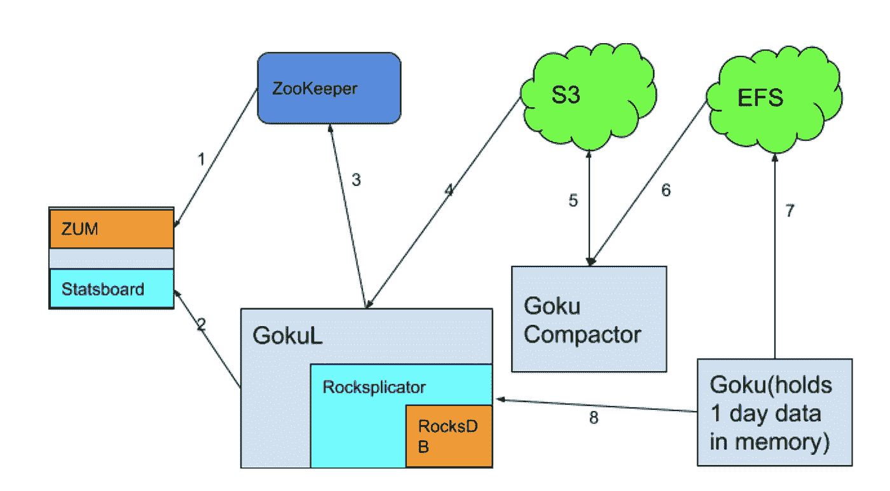
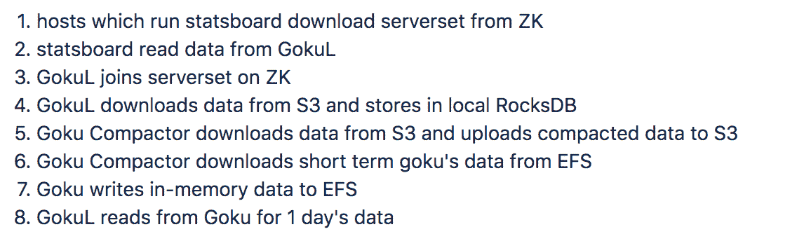
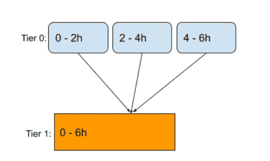
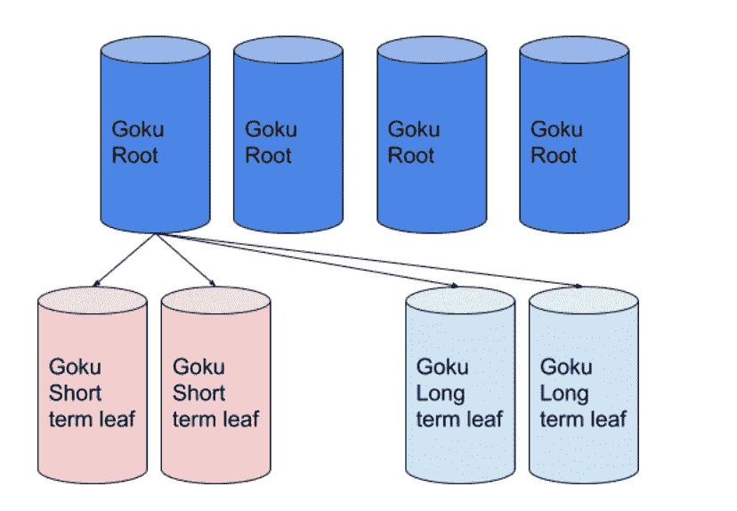

# GokuL:将时间序列数据存储扩展到一天以上

> 原文：<https://medium.com/pinterest-engineering/gokul-extending-time-series-data-storage-to-serve-beyond-one-day-52264307364d?source=collection_archive---------2----------------------->

姜灏张睿，郭健莫尼勒·穆克什·桑哈维|实时分析团队

在 Pinterest，开发人员严重依赖 Statsboard 来监控他们的系统，并在问题发生时得到提醒。去年，我们[推出了我们的时间序列数据库](/pinterest-engineering/goku-building-a-scalable-and-high-performant-time-series-database-system-a8ff5758a181)(又名悟空)，它存储并提供最近一天的数据。尽管这涵盖了 90%以上的查询，但仍有开发人员希望查询一天之外的数据的情况(如周与周的比较、年度容量规划或调查几天或几周前的问题等。)

作为回应，我们建立了 GokuL——一个基于磁盘的 Goku 版本，用于长期数据。GokuL 用 C++编写，使用 RocksDB 作为存储引擎，高效支持一天以上的查询。

# GokuL 的新特性

## 数据汇总

汇总是使用一个聚合器将特定时间间隔内的多个数据点转换为一个数据点的过程。例如，假设我们有 10 个数据点(0，1)、(60，2)、(120，3)、(180，4)、(240，5)、(300，6)、(360，7)、(420，8)、(480，9)、(540，10)，我们希望以 5 分钟的时间间隔进行汇总，并对聚合器求和。汇总后的数据点变为(0，15)，(300，40)。

虽然原始数据是最准确的，但它在资源和存储方面成本很高，并且查询速度很慢。从更长的时间跨度来看，数据的时间粒度越粗越好，但是您希望以更低的成本实现更快的查询体验。我们在 GokuL 中引入了内置的 roll up 支持作为我们的解决方案。数据越老，时间粒度就越粗，所以我们在 GokuL 中设置了可配置的时间粒度。以下是我们在 Pinterest 中使用的设置:

如果开发人员在某些情况下喜欢原始数据，比如周与周之间的比较，我们仍然保留 24 天的原始数据。

在查询 GokuL 时，客户端需要在查询中设置 **rollupAggregator** 和 **rollupInterval** ，以获取相应的汇总数据。

## 体系结构

整个悟空生态系统如下图所示:

## 分层数据

悟空中的数据被分成多个桶，每个桶的长度为两个小时。要读取的桶取决于时间范围。在 GokuL 中，除了数据存储，我们还引入了另一个概念——层。在一个层中，数据被划分到存储桶中，但是不同的层可能具有不同的存储桶大小。对于分层数据，我们引入了一种称为压缩的新流程，将较低层的多个存储桶合并到较高层的一个存储桶中。压实过程中也会发生卷起。

可用的层设置如下，并且都可以调整。

1.  桶大小(秒)
2.  以秒为单位的汇总间隔
3.  是否在该层保留原始数据
4.  需要合并到下一层的存储桶数量
5.  保留在该层中的存储桶数量

## 悟空压缩机服务

为了进行压缩，我们开发了另一个名为 Goku Compactor 的服务。对于第 0 层的压缩，该服务从 EFS 自动气象站下载短期悟空数据，合并到第 1 层存储桶并上传到 S3。对于其他层的压缩，该服务从 S3 下载，压缩后上传到 S3。通过将数据压缩与在线服务分离，压缩可以充分利用资源，但不会影响在线服务性能。

压缩使用大量 CPU 和内存。为了保护悟空压缩机，我们使用两个线程池。一个池有更多的线程用于轻量级压缩，另一个池有更少的线程用于重量级压缩。

因为压缩不会一直运行，所以我们使用自动缩放来最小化成本。

在压缩过程中，Goku Compactor 会生成 sst 文件，然后由 GokuL 使用。

## RocksDB 关键和价值设计

生成的 sst 文件中有三种类型的数据:a .字典；b .时间序列数据；倒排索引。我们为每个碎片和桶生成这些数据。

对于每个指标名称、标记键和标记值，我们将为其分配一个唯一的 4 字节 id。例如，如果我们有以下时间序列:

***TC . proc . stat . CPU . total { host = host 1，host _ type = infra-Goku-a-prod }***

**TC . proc . stat . CPU . total { host = host 2，host _ type = infra-Goku-d-prod }**

***鸵鸟. metrics . Goku . ms _ short _ query _ root . p90 { host = host 1，host _ type = infra-Goku-a-prod }***

生成的字典将是:

*TC . proc . stat . CPU . total =>1*

*鸵鸟. metrics . Goku . ms _ short _ query _ root . p90 =>2*

*主机= > 3*

*主机 1 = > 4*

*host_type = > 5*

infra-Goku-a-prod = 6

*主机 2 = > 7*

infra-goku-d-prod = > 8

出于不同的目的，我们在 RocksDB 中存储了 word 到 id 的映射和反向映射。

就像小悟空一样，我们用[大猩猩](http://www.vldb.org/pvldb/vol8/p1816-teller.pdf)编码对时间序列数据进行编码。关键字的格式为*【汇总聚集器类型】【指标名称字典 id】【时间序列 id】*。汇总聚合器类型是 1 字节的聚合器枚举。对于原始数据，聚合器设置为 None。时序 id 是一个 4 字节的整数，范围从 0 到指标名称的基数。

倒排索引键的格式为[ *度量名字典 id* ][ *标记键字典 id* ][ *标记值字典 id(可选)* ]。这些值是编码的时间序列 id，用在具有相同指标名称字典 id 的数据关键字中。我们使用本[主题演讲](http://static.googleusercontent.com/media/research.google.com/en//people/jeff/WSDM09-keynote.pdf)中提到的 Group Varint 编码算法。当只有标签键 id 时，索引键用于有效地应用通配符过滤器(例如， *host=** )。

因为我们的数据是分层和分桶的，所以在生成这些键时，我们将*【magic(1 字节)】【tier(1 字节)】【bucket(4 字节)】*添加到每个 RocksDB 键的前面。幻数是一个字节，用来标识不同类型的密钥。

## 数据保持

如前所述，我们为汇总数据设置 TTL，并为不同的层设置不同的 TTL。

为了实现这个目标，我们实现了一个 RocksDB [压缩过滤器](https://github.com/facebook/rocksdb/wiki/Compaction-Filter)。压缩过滤器用于根据每层的*保留的桶数*参数检查 key 中的桶是否过期。如果过期，该密钥将在压缩过程中被删除。

## 集群管理

GokuL 在 Goku 中使用相同的两层分片策略来提供水平可伸缩性、并行聚合和限制查询扇出。

Rocksplicator 用于管理集群中的碎片。它通过自动碎片管理和恢复能力减少了我们的操作负载。(关于 Rocksplicator 的更多细节可以在[开源 Rocksplicator，一个实时 RocksDB 数据复制器](/pinterest-engineering/open-sourcing-rocksplicator-a-real-time-rocksdb-data-replicator-558cd3847a9d)和[Rocksplicator 的自动集群管理和恢复](/pinterest-engineering/automated-cluster-management-and-recovery-for-rocksplicator-f1f8fd35c833)中找到)

## 查询过程

GokuL 使用与悟空相同的查询引擎。但是，我们在悟空根中重新实现了路由逻辑(见下图)。悟空根按照以下步骤处理查询。

1.  如果时间范围同时触及悟空和悟空，则将查询拆分为两个查询；
2.  分别向相应的 Goku 和 GokuL 叶子发送查询，并对叶子进行聚合；
3.  从树叶聚集结果并合并成一个查询结果

在内部，我们有两个悟空集群和两个悟空集群。如果一个叶查询失败，悟空根将故障转移到持有相同碎片的另一个集群的叶。

## 服务器保护

时间序列查询有时非常昂贵，并且当时间范围更大时会变得更糟。它们会占用过多的内存和 cpu 资源，使其他查询处于饥饿状态，并使进程崩溃。GokuL 采用以下方法来保护自己。

**流水线查询执行**

我们实现了流水线执行，逐批读取、解码和聚集数据。通过这样做，它能够在执行每个操作符后释放内存，从而将内存不足错误的风险降至最低。此外，通过在同一管道中并行化数据 IO 和计算，它可以更有效地使用 CPU。

**提前终止**

即使使用流水线执行，一些查询也会导致 cpu 和内存使用量激增。例如，获取每个时间序列而不进行聚合的查询。这些查询有一些共同的特征:高基数或大量插值。目前，我们将终止一个查询，只要它达到两个阈值之一:a .基数限制；b .内存使用限制。

## 表演

我们在 OpenTSDB 和 GokuL 上评估了一些不同时间范围的常见查询。以下是基准测试期间的一些设置。

**硬件**

OpenTSDB+h base:c 5.2x large+I 3.2x large

GokuL:3.2 倍大

**查询**

时间范围为 2 天、4 天、7 天和 14 天的查询。

**结果**

GokuL 比 OpenTSDB 快 30-100 倍，具体取决于查询。

# 下一步是什么

**分页支持**

虽然我们现有的服务器保护方法在大多数情况下工作良好，但我们失去了处理一些高基数和昂贵查询的能力。目前，我们需要要求用户重写他们的查询，或者我们必须调整阈值。

为了处理这些查询并且不使我们的系统崩溃，我们可以在时间尺度上进行分页。给定一个长范围的查询，我们可以返回一个子范围的结果和一个延续令牌给客户端。下一次，客户端向 GokuL 提供这个 continuation token 来获取下一个子范围的结果。

通过分页，不仅减轻了服务器的负载，也减轻了客户端的负载。因为客户端不需要在绘制图形之前等待所有数据就绪。相反，他们可以一部分一部分地画图。

**查询缓存**

在 GokuL 中执行查询很快，但是如果缓存了热查询数据结果，速度可能会更快。GokuL 将像原始数据一样基于时间对缓存数据进行分区，这也可以使分页查询更快。我们的目标是使缓存层足够抽象，这样我们就可以很容易地采用不同的缓存系统，比如本地内存或 memcached。

*鸣谢:非常感谢 visibility 团队的 Brian Overstreet、、Humsheen Geo、Dai Nguyen 和 Nomy Abbas 帮助在 Statsboard 上推出 GokuL，并感谢 Serving Systems 团队的、、、韩、帮助我们了解和采用 Rocksplicator。*

> 我们正在建造世界上第一个视觉发现引擎。全球超过 3.2 亿人使用 Pinterest 来梦想、计划和准备他们在生活中想做的事情。来加入我们吧！