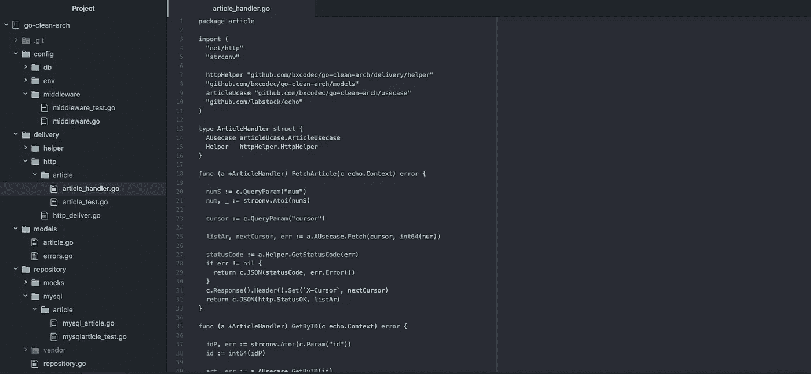
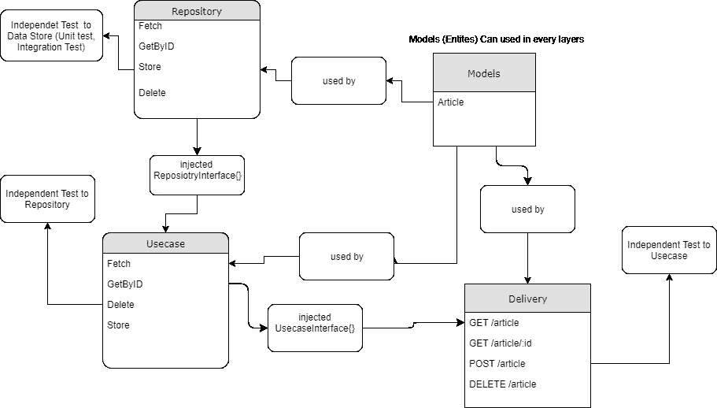

# 在 Golang 尝试干净的建筑

> 原文：<https://medium.easyread.co/golang-clean-archithecture-efd6d7c43047?source=collection_archive---------0----------------------->

## 独立的、可测试的和干净的

在阅读了鲍勃大叔的清洁建筑概念后，我正试图在 Golang 中实现它。这是我们公司使用的类似架构，[**Kurio-App Berita Indonesi**](https://kurio.co.id/)**a，**但结构略有不同。没有太大的不同，相同的概念，但不同的文件夹结构。

你可以在这里找到一个示例项目[https://github.com/bxcodec/go-clean-arch](https://github.com/bxcodec/go-clean-arch)，一篇示例 CRUD 管理文章。



*   免责声明:
    我不推荐这里使用的任何库或框架。你可以用你自己的或第三方的具有相同功能的东西来替换这里的任何东西。

# 基础

正如我们所知，设计干净架构之前的约束条件是:

1.  独立于框架。该体系结构不依赖于某些功能丰富的软件库的存在。这允许您将这样的框架用作工具，而不是将您的系统塞进它们有限的约束中。
2.  可测试。可以在没有 UI、数据库、Web 服务器或任何其他外部元素的情况下测试业务规则。
3.  独立于 UI。用户界面可以很容易地改变，而不需要改变系统的其他部分。例如，Web 用户界面可以用控制台用户界面代替，而不需要改变业务规则。
4.  独立于数据库。您可以将 Oracle 或 SQL Server 换成 Mongo、BigTable、CouchDB 或其他。您的业务规则没有绑定到数据库。
5.  独立于任何外部机构。实际上，你的商业规则根本就对外界一无所知。

更多信息请访问[https://8 thlight . com/blog/uncle-bob/2012/08/13/the-clean-architecture . html](https://8thlight.com/blog/uncle-bob/2012/08/13/the-clean-architecture.html)

因此，基于这个约束，每一层都必须是独立的和可测试的。

如果鲍勃叔叔的建筑有 4 层:

*   实体
*   用例
*   控制器
*   框架和驱动程序

在我的项目中，我也使用 4:

*   模型
*   贮藏室ˌ仓库
*   用例
*   交付

## **型号**

与实体相同，它将用于所有层。这一层将存储任何对象的结构及其方法。例子:文章，学生，书。
示例结构:

任何实体或模型都将存储在这里。

## **储存库**

存储库将存储任何数据库处理程序。查询，或创建/插入任何数据库将存储在这里。这一层将只作为数据库的 CRUD。这里没有业务流程发生。只有普通的数据库功能。

这一层还负责选择 DB 将在应用程序中使用什么。可能是 Mysql，MongoDB，MariaDB，Postgresql 什么的，在这里决定。

如果使用 ORM，这一层将控制输入，并将它直接提供给 ORM 服务。

如果调用微服务，会在这里处理。为其他服务创建 HTTP 请求，并整理数据。这一层必须完全充当存储库。处理所有数据输入输出没有特定的逻辑发生。

该存储库层将依赖于连接的数据库或其他微服务(如果存在)。

## **用例**

这一层将充当业务流程处理程序。任何流程都会在这里处理。这一层将决定使用哪个存储库层。并且有责任提供用于交付的数据。处理数据，做计算或任何事情都会在这里完成。

用例层将接受来自交付层的任何输入，这些输入已经被清理，然后处理输入，可以存储到数据库中，或者从数据库中提取，等等。

这个用例层将依赖于存储库层

## **交货**

这一层将作为演示者。决定数据将如何呈现。可以是 REST API、HTML 文件或 gRPC，无论交付类型如何。
这一层也将接受来自用户的输入。净化输入，并将其发送到用例层。

对于我的示例项目，我使用 REST API 作为交付方法。
客户端通过网络调用资源端点，交付层获取输入或请求，并发送给用例层。

该层将取决于用例层。

## **层间通信**

除了模型之外，每一层都将通过一个接口进行通信。例如，Usecase 层需要 Repository 层，那么它们如何通信呢？存储库将提供一个接口作为它们的契约和通信。

存储库界面示例

用例层将使用此契约与存储库通信，存储库层**必须**实现此接口，以便用例可以使用

用例的接口示例

与用例相同，交付层将使用这个契约接口。并且用例层**必须**实现这个接口。

# **测试各层**

我们知道，干净意味着独立。每一层都是可测试的，即使其他层还不存在。

*   模型层
    该层仅测试是否在任何结构中声明了任何函数/方法。
    并能方便独立地对其他层进行测试。
*   为了测试这一层，更好的方法是进行集成测试。但是你也可以对每个测试进行模仿。我使用 github.com/DATA-DOG/go-sqlmock 作为我的助手来模拟查询过程 msyql。
*   用例
    因为这一层依赖于存储库层，意味着这一层需要一个存储库层来进行测试。因此，我们必须基于之前定义的契约接口，制作一个库
    的模型，该库使用 mocking 进行模拟。
*   交付
    与用例相同，因为这一层依赖于用例层，意味着我们需要用例层进行测试。基于之前定义的契约接口，用例层也必须被嘲弄

对于嘲讽，我用 vektra 的《嘲讽戈朗》可以在这里看到[https://github.com/vektra/mockery](https://github.com/vektra/mockery)

## **储存库测试**

如前所述，为了测试这一层，我使用 sql-mock 来模拟我的查询过程。你可以用像我在这里所用的 github.com/DATA-DOG/go-sqlmock，或另一个有类似功能的

```
func TestGetByID(t *testing.T) {
 db, mock, err := sqlmock.New() 
 if err != nil { 
    t.Fatalf(“an error ‘%s’ was not expected when opening a stub  
        database connection”, err) 
  }  defer db.Close() 
 rows := sqlmock.NewRows([]string{
        “id”, “title”, “content”, “updated_at”, “created_at”}).   
        AddRow(1, “title 1”, “Content 1”, time.Now(), time.Now())  query := “SELECT id,title,content,updated_at, created_at FROM 
          article WHERE ID = \\?”  mock.ExpectQuery(query).WillReturnRows(rows)  a := articleRepo.NewMysqlArticleRepository(db)  num := int64(1)  anArticle, err := a.GetByID(num)  assert.NoError(t, err) 
 assert.NotNil(t, anArticle)
}
```

## **用例测试**

用例层的示例测试，依赖于存储库层。

嘲弄将为我生成一个存储库层的模型。所以我不需要先完成我的存储库层。我可以先完成我的用例，即使我的存储库层还没有实现。

## **交付测试**

交付测试将取决于您如何交付数据。如果使用 HTTP REST API，我们可以在 golang 中使用 httptest 的内置包 httptest。

因为它依赖于用例，所以我们需要一个用例的模拟。对于 Repository 也是一样，我也使用 mocking 来模拟我的用例，用于交付测试。

```
func TestGetByID(t *testing.T) {
 var mockArticle models.Article 
 err := faker.FakeData(&mockArticle) 
 assert.NoError(t, err) 
 mockUCase := new(mocks.ArticleUsecase) 
 num := int(mockArticle.ID) 
 mockUCase.On(“GetByID”, int64(num)).Return(&mockArticle, nil) 
 e := echo.New() 
 req, err := http.NewRequest(echo.GET, “/article/” +  
             strconv.Itoa(int(num)), strings.NewReader(“”))  assert.NoError(t, err)  rec := httptest.NewRecorder() 
 c := e.NewContext(req, rec) 
 c.SetPath(“article/:id”) 
 c.SetParamNames(“id”) 
 c.SetParamValues(strconv.Itoa(num))  handler:= articleHttp.ArticleHandler{
            AUsecase: mockUCase,
            Helper: httpHelper.HttpHelper{}
 } 
 handler.GetByID(c)  assert.Equal(t, http.StatusOK, rec.Code) 
 mockUCase.AssertCalled(t, “GetByID”, int64(num))
}
```

# **最终输出和合并**

完成所有层并通过测试后。您应该在根项目的 main.go 中合并到一个系统中。
在这里您将定义和创建环境的每一个需求，并将所有层合并成一个。

找我的 main.go 为例:

你可以看到，每一层合并成一个依赖关系。

# 结论:

*   简而言之，如果画在一张图中，可以看到下图



*   这里使用的每个库都可以自己修改。因为干净架构的要点是:不管你的库是什么，你的架构是干净的，可测试的，也是独立的
*   这是我如何组织我的项目的，你可以争论，或者同意，或者可能改进它使之更好，只需留下评论并分享它

## **样本项目**

在这里可以看到示例项目[https://github.com/bxcodec/go-clean-arch](https://github.com/bxcodec/go-clean-arch)

用于我的项目的库:

*   Glide:用于包管理
*   来自 github.com/DATA-DOG/go-sqlmock 的 go-sqlmock
*   作证:为了测试
*   用于交付层的 Echo Labstack (Golang Web 框架)
*   Viper:用于环境配置

关于清洁建筑的进一步阅读:

*   本文第二部分:[https://hacker noon . com/trying-clean-architecture-on-golang-2-44d 615 BF 8 fdf](https://hackernoon.com/trying-clean-architecture-on-golang-2-44d615bf8fdf)
*   [https://8 thlight . com/blog/uncle-bob/2012/08/13/the-clean-architecture . html](https://8thlight.com/blog/uncle-bob/2012/08/13/the-clean-architecture.html)
*   [http://manuel . kiesling . net/2012/09/28/applying-the-clean-architecture-to-go-applications/](http://manuel.kiessling.net/2012/09/28/applying-the-clean-architecture-to-go-applications/)。另一个版本的戈朗清洁建筑

*如果你有问题，或者需要更多的解释，或者有什么东西，我在这里不好解释，你可以从我的*[*LinkedIn*](https://www.linkedin.com/in/imantumorang/)*或者*[*email*](mailto:iman.tumorang@gmail.com)*问我。谢谢*