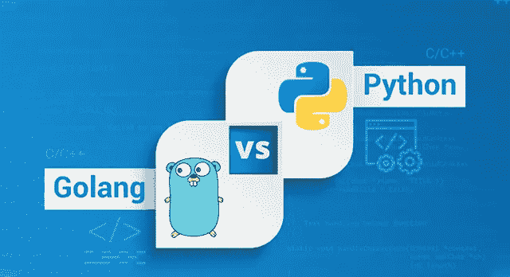
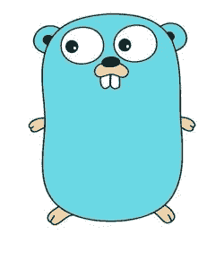
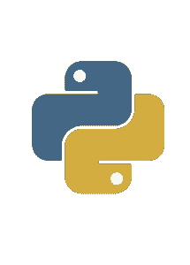
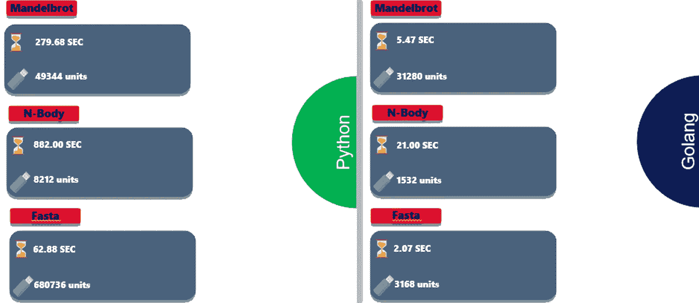
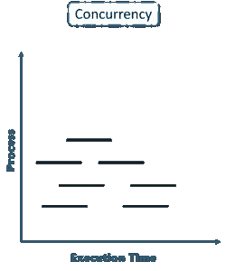
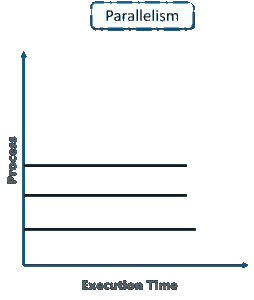
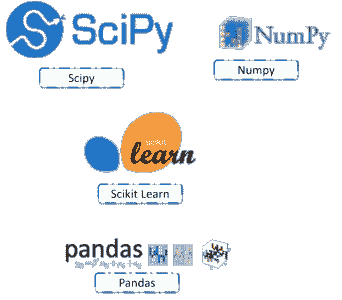

# Golang vs Python:选哪个？

> 原文：<https://medium.com/edureka/golang-vs-python-5ac32e1ef2?source=collection_archive---------8----------------------->

Golang vs Python — Edureka

在开始任何项目之前，大多数开发团队都要经过几次会议来决定他们软件的最佳语言。很多时候，这种讨论归结为 Python 和 Golang。在本文中，我将对这两种语言进行正面比较，通过各种参数来帮助您作为开发人员决定哪种语言最适合您。比较的参数是:

*   表演
*   可量测性
*   应用程序
*   执行
*   图书馆
*   代码的可读性

现在让我们开始吧。在我们开始比较 Golang 和 Python 之前，让我简单介绍一下这两种语言。

# Golang 是什么？

Golang 又称 go，是谷歌开发的一种计算机编程语言。它的开发始于 2007 年的谷歌，并于 2009 年向公众推出。谷歌的三位首席围棋开发者分别是罗伯特·格里斯默、罗布·派克和肯·汤普森。他们的目标是创建一种语言，松散地基于 C 编程语言的语法，这将消除诸如 C++等语言的“无关垃圾”。因此，Go 融合了其他现代语言的许多特性，比如方法和操作符重载、指针算法和类型继承。最终，这个产品是一种静态类型的语言，有一个精炼而强大的库，以及无与伦比的性能和速度！

关于 Go 已经说够了！现在让我们来简单介绍一下 python。

# Python 是什么？

因此，Python 是一种通用编程语言，这只是它几乎可以用于任何事情的另一种说法。它是由荷兰程序员吉多·范·罗苏姆创建的，并于 1991 年首次发布。python 最重要的一点是，它是一种解释型语言，这意味着编写的代码在运行时实际上并没有被翻译成计算机可读的格式；大多数编程语言在编译程序时都会进行这种转换。这种类型的语言也被称为“脚本语言”，因为它最初是用于琐碎的项目。

好了，既然我已经给你们粗略介绍了这两种语言，让我们开始比较它们。

# Golang vs Python:性能

首先，我们将比较这两种语言的性能，以及除了解决复杂的数学函数之外还有什么更好的方法。虽然不完全公平，但当谈到内存使用和解决问题所花费的时间时，它肯定能说明问题。

我们用这两种语言解决了三个不同的问题，即*曼德尔布罗方程*、 *n 体问题*和 *fasta* 。这些都是非常复杂的问题，需要进行大量的计算，是测试相关语言的性能和内存管理的完美方法。除此之外，它们确实是有趣的问题，值得一读，但是现在，让我们看看 Golang 和 Python 的进展如何。

这清楚地向我们展示了 Golang 在性能方面胜过 Python。

好了，继续，让我们在可伸缩性这个话题上比较一下这两者。

# Golang vs Python:可伸缩性

今天，构建一个真正可扩展的应用程序是一件艺术作品。如果事情不能扩展，只会对业务造成损害。Golang 是作为一种牢记这一点的语言而开发的。Golang 的整个目的是帮助谷歌的开发人员解决“谷歌”规模的问题，这基本上涉及到数千名程序员在数千个集群上运行大型服务器软件。这就是为什么 Golang 内置了对并发进程通道(即并发性)的支持。另一方面，Python 很难处理并发性，但是可以通过线程实现并行性。

让我们来理解并发和并行的区别。

## 并发性和并行性

并发意味着一个应用程序同时(并发地)在多个任务上取得进展。嗯，如果计算机只有一个 CPU，应用程序可能不会同时处理多个任务，但是在应用程序内部同时处理多个任务。在开始下一项任务之前，它不会完全完成一项任务。

并行性是指应用程序将其任务分解为可以并行处理的更小的子任务，例如在同一时间在多个 CPU 上处理。

因此，显而易见的是，天生支持并发的语言是大型可伸缩程序的完美语言。

现在，让我们根据这两种语言的应用对它们进行比较。

# Golang vs Python:应用

这一部分不会有明显的赢家，因为每种编程语言都有特定的用途，例如 javascript 主要用于 web 开发。同样， ***python*** 在数据分析、人工智能、深度学习、web 开发等领域得到了广泛的应用。这在很大程度上归功于 python 中的疯狂库，这些库使得上述领域的工作变得更加容易。

另一方面，Golang 主要用于系统编程。由于其对并发性的支持，它在云计算或集群计算领域也获得了大量的使用和认可。Golang 在 web 开发中也得到了广泛的赞赏和使用，这是因为它强大且易于使用的库，允许您在几秒钟内建立一个 web 服务器。

# Golang vs Python:执行

现在，让我们比较一下 Go 代码和 Python 代码是如何执行的。所以首先，Python 是动态类型语言，Golang 是静态类型语言。Python 和 Go 分别使用解释器和编译器。

现在要理解我为什么在这个参数上比较语言，我们必须理解静态类型语言和动态类型语言之间的区别。

静态类型语言是一种为编译器显式声明变量类型的语言，因此即使是微不足道的错误也很容易被发现，而在动态类型语言中，类型推理是由解释器实现的，因此由于解释器错误地解释某些东西，可能会留下一些错误！

基本上，我想说的是，由于 python 是一种动态类型语言，当程序员打算构建一个真正大的程序时，它会限制程序员，而 Go 可以巧妙地处理这两种类型的程序。

现在让我们来谈谈图书馆。

# Golang vs Python:库

库是上帝给开发者的礼物，因为它让我们的生活变得更容易。因此，拥有一个优秀的编程语言库是至关重要的。在这种情况下，Python 无疑在大量可用的库中独占鳌头。有像 Numpy 这样的软件包可以帮助你处理数组和复杂的矩阵函数，Tensorflow 和 Scikit Learn 用于深度学习，OpenCV 用于图像处理，Pandas 用于数据分析，matplotlib 用于可视化，等等。真的，如果 python 因为一件事而出名，那一定是它疯狂的库。但这并不意味着围棋功亏一篑。在开发 go 的时候，Google 选择了最重要的库作为内置 Go 库的一部分。虽然数量可能没有 python 的多，但使用领域几乎是相同的。他们有疯狂的库，用于 web 开发、数据库处理、并发编程和加密。

现在让我们进入最后一个比较点，即可读性！

# Golang 与 Python:可读性

当你为客户开发软件时，你通常会和十个甚至上百个其他开发人员组成一个团队。在这种情况下，代码可读性成为需要考虑的主要因素。

现在，你们中的很多人可能会认为 python 肯定是最棒的，但是我有不同的看法，所以请听我说完。乍看之下，Python 确实有很好的可读性，但在我看来，它们有时做得过头了。在 python 中，可能有 10 种不同的方式来表达同一件事，这通常会在代码很大或者从事代码工作的人很多的时候导致混乱。

另一方面，在编程方面，Go 有着严格的规则。它不允许导入不必要的库，也不允许创建不必要的变量。这意味着有一种明确的方法来执行一项任务，从而在大的团队中更好地理解代码。你们中的一些人可能会说代码的通用性受到了影响，但是谁真正关心通用性，尤其是在核心编程方面？Golang 的语法对初学者来说也不太友好，但它不像 c 或 c++那样苛刻。所以为了代码的可读性，我打算用 Golang。

所以正如你们所见， *Golang 在大多数情况下绝对占据上风*,在我看来，它胜过 python 作为一种编程语言。当然，它可能没有 python 这些年来赢得的名声和互联网的扩张，但 Go 肯定也在这方面迎头赶上。不同意我？在下面的评论区告诉我为什么。这个对比暂时到此为止！我希望我已经帮助你决定了哪种语言更适合你的项目。

如果你想查看更多关于人工智能、DevOps、道德黑客等市场最热门技术的文章，那么你可以参考 [Edureka 的官方网站。](https://www.edureka.co/blog/?utm_source=medium&utm_medium=content-link&utm_campaign=golang-vs-python)

请留意本系列中的其他文章，它们将解释 Python 和数据科学的各个方面。

> 1. [Python 教程](/edureka/python-tutorial-be1b3d015745)
> 
> 2. [Python 编程语言](/edureka/python-programming-language-fc1015de7a6f)
> 
> 3. [Python 函数](/edureka/python-functions-f0cabca8c4a)
> 
> 4.[Python 中的文件处理](/edureka/file-handling-in-python-e0a6ff96ede9)
> 
> 5. [Python Numpy 教程](/edureka/python-numpy-tutorial-89fb8b642c7d)
> 
> 6. [Scikit 学习机器学习](/edureka/scikit-learn-machine-learning-7a2d92e4dd07)
> 
> 7. [Python 熊猫教程](/edureka/python-pandas-tutorial-c5055c61d12e)
> 
> 8. [Matplotlib 教程](/edureka/python-matplotlib-tutorial-15d148a7bfee)
> 
> 9. [Tkinter 教程](/edureka/tkinter-tutorial-f655d3f4c818)
> 
> 10.[请求教程](/edureka/python-requests-tutorial-30edabfa6a1c)
> 
> 11. [PyGame 教程](/edureka/pygame-tutorial-9874f7e5c0b4)
> 
> 12. [OpenCV 教程](/edureka/python-opencv-tutorial-5549bd4940e3)
> 
> 13.[用 Python 进行网页抓取](/edureka/web-scraping-with-python-d9e6506007bf)
> 
> 14. [PyCharm 教程](/edureka/pycharm-tutorial-d0ec9ce6fb60)
> 
> 15.[机器学习教程](/edureka/machine-learning-tutorial-f2883412fba1)
> 
> 16.[Python 中从头开始的线性回归算法](/edureka/linear-regression-in-python-e66f869cb6ce)
> 
> 17.[面向数据科学的 Python](/edureka/learn-python-for-data-science-1f9f407943d3)
> 
> 18.[Python 中的循环](/edureka/loops-in-python-fc5b42e2f313)
> 
> 19. [Python 正则表达式](/edureka/python-regex-regular-expression-tutorial-f2d17ffcf17e)
> 
> 20. [Python 项目](/edureka/python-projects-1f401a555ca0)
> 
> 21.[机器学习项目](/edureka/machine-learning-projects-cb0130d0606f)
> 
> 22.[Python 中的数组](/edureka/arrays-in-python-14aecabec16e)
> 
> 23.[集于 Python](/edureka/sets-in-python-a16b410becf4)
> 
> 24.[Python 中的多线程](/edureka/what-is-mutithreading-19b6349dde0f)
> 
> 25. [Python 面试问题](/edureka/python-interview-questions-a22257bc309f)
> 
> 26. [Java vs Python](/edureka/java-vs-python-31d7433ed9d)
> 
> 27.[如何成为一名 Python 开发者？](/edureka/how-to-become-a-python-developer-462a0093f246)
> 
> 28. [Python Lambda 函数](/edureka/python-lambda-b84d68d449a0)
> 
> 29.[网飞如何使用 Python？](/edureka/how-netflix-uses-python-1e4deb2f8ca5)
> 
> 30.[Python 中什么是套接字编程](/edureka/socket-programming-python-bbac2d423bf9)
> 
> 31. [Python 数据库连接](/edureka/python-database-connection-b4f9b301947c)
> 
> 32. [Python Seaborn 教程](/edureka/python-seaborn-tutorial-646fdddff322)
> 
> 33. [Python 职业机会](/edureka/python-career-opportunities-a2500ce158de)

*原载于 2018 年 10 月 4 日 https://www.edureka.co***。**