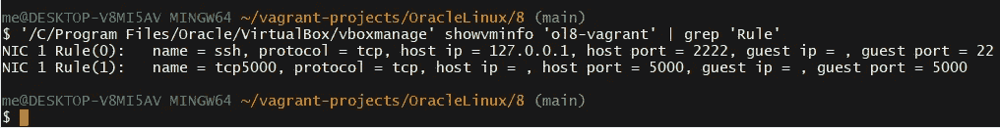

# 金发女郎脚本——让流浪者恰到好处！

> 原文：<https://medium.com/oracledevs/goldilocks-scripting-make-vagrant-just-right-caff51fadb21?source=collection_archive---------7----------------------->


**原型制作**

开发人员创建应用程序通常需要安装许多必备组件。虽然并不总是需要在虚拟机中开发应用程序，但这是将应用程序与工作站上的其他工作负载分离的有效方法。

虽然可以在启动 VM 后手动执行这些任务，但是在 travel file 中编写任务脚本更容易。

Oracle vagger 项目位于以下链接:

[](https://github.com/oracle/vagrant-projects) [## 甲骨文/流浪者-项目

### 一组自动提供 Oracle 和其他软件的浮动项目，使用 Oracle Linux……

github.com](https://github.com/oracle/vagrant-projects) 

当您将安装脚本编写在 Vagrantfile 中时，设置您的开发环境并不会变得更容易。

我们打算使用 OEL8 创建一个应用程序，所以我们将使用适当的项目。ie ~/vagger-projects/Oracle Linux/8

顺便说一句，如果应用开发是你的事情，你可能想看看[甲骨文云基础设施的免费层帐户。](https://signup.cloud.oracle.com/?language=en)

## 打开虚拟机的防火墙

在流浪 OEL 中，防火墙守护程序默认是不启用的，因此要对防火墙进行更改，防火墙守护程序需要运行。

要在 vacator 中设置防火墙，我们首先需要在 vacator 文件中设置防火墙守护进程:

```
config.vm.provision "shell", run: "always", inline: "systemctl unmask firewalld"
config.vm.provision "shell", run: "always", inline: "systemctl start firewalld"
```

现在，因为我们的应用程序将使用 HTTP 和端口 5000，所以也要在 travel file 中定义它们:

```
config.vm.provision "shell", run: "always", inline: "firewall-cmd --add-port=5000/tcp"
config.vm.provision "shell", run: "always", inline: "firewall-cmd --add-service=http"
```

要使设置持久，请添加以下内容:

```
config.vm.provision "shell", run: "always", inline: "firewall-cmd --runtime-to-permanent"
```

现在防火墙已经设置好了，以适应我们想要开发的应用程序。

## 在主机上设置端口转发

可以通过 Oracle VirtualBox manager 手动设置对虚拟机的外部访问。ie VBoxManage controlvm。

然而，用流浪者更容易做到这一点。

添加此行以匹配端口 5000 的防火墙设置:

```
 # Oracle port forwarding
  # config.vm.network "forwarded_port", guest: 22, host: 2220
  config.vm.network "forwarded_port", guest: 5000, host: 5000
```

默认情况下，流浪者将配置 NAT(网络地址转换),因此我们不需要单独进行配置。

调配后，我们将能够使用 URL 127.0.0.1:5000 从主机访问应用程序。

## 在虚拟机上安装开发人员工具

当然——开发人员离不开一些开发工具，比如 Vim 和 Git，所以把这几行添加到 lavong file 中:

```
config.vm.provision "shell", run: "always", inline: "yum install -y vim"
config.vm.provision "shell", run: "always", inline: "yum install -y git"
```

另外，Python 不是默认安装的，所以让我们添加一行来安装它。

```
config.vm.provision "shell", run: "always", inline: "yum install -y python3"
```

我们需要为应用程序创建一个目录，因此用下面一行创建一个目录:

```
config.vm.provision "shell", run: "always", inline: "mkdir /home/vagrant/myapp"
```

然后将目录的所有者从 root 更改为游民:

```
config.vm.provision "shell", run: "always", inline: "chown vagrant /home/vagrant/myapp"
```

所以我们需要的所有核心工具都定义在流浪者文件中。

## 启动流浪者

在完成了 living file 之后，我们准备好第一次启动，并且将开始供应。

```
> vagrant up
```

在构建阶段，您应该会看到添加到 travel file 中的配置的日志。


注意—添加的配置行仅在虚拟机首次启动时执行，在后续启动时会被忽略。

## 检查供应情况

在主机上，使用 Oracle VirtualBox 管理器，我们可以确认端口转发是否存在。

```
$ '/C/Program Files/Oracle/VirtualBox/vboxmanage' showvminfo 'ol8-vagrant' | grep 'Rule'
```



因此端口转发为 5000。

防火墙还需要为端口 5000 打开，因此使用以下命令启动虚拟机的防火墙守护程序，并查询设置。

```
# systemctl unmask firewalld
# systemctl start firewalld
# firewall-cmd --list-all
```


HTTP 和端口 5000 是开放的。

现在让我们看看 Python 是否存在。

```
$ python3
```


Python 出现了。

到目前为止一切顺利，现在让我们运行一个测试应用程序。

## 运行测试应用程序

我们希望使用 Python Flask 作为开发框架，因此需要为流浪者帐户安装它。

“myapp”目录应该已经存在了，因为我们已经将它包含在了 Vagrantfile 中，所以让我们安装 Flask。

```
$ cd myapp
$ python3 -m venv .
$ . ./bin/activate
$ pip install Flask
```

现在让我们在目录~/myapp 中创建一个名为 myapp.py 的文件，其内容如下:

```
**from** flask **import** Flask

app = Flask**(**__name__**)**

@app.route**(**"/"**)**
**def** hello_world**():**
    **return** "<p>Vagrant scripting rocks!</p>"
```

现在运行 myapp.py:

```
$ export FLASK_APP=myapp
$ flask run
```

转到主机的浏览器，尝试 127.0.0.1:5000


这不管用。

原因很简单。

我们需要通知 Flask 将应用程序暴露给外部网络。

```
$ export FLASK_APP=myapp
$ flask run --host 0.0.0.0
```

因此，指定 0.0.0.0 允许从虚拟机的主机访问虚拟机中运行的应用程序。

现在从主机再次尝试 127.0.0.1:5000。


是真的——流浪脚本石头！

# 加入对话！

如果你对甲骨文开发人员在他们的自然栖息地发生的事情感到好奇，来加入我们的公共休闲频道吧！我们不介意成为你的鱼缸🐠

*Paul Guerin 是一名专注于 Oracle 数据库的国际顾问。此外，他还出席了一些世界领先的甲骨文会议，包括甲骨文 2013 年世界开放大会。自 2015 年以来，他的工作一直是 IOUG 最佳实践技巧小册子以及 AUSOUG、Oracle Technology Network、Quest 和 Oracle Developers (Medium)出版物的主题。2019 年，他被授予 My Oracle 支持社区最有价值贡献者。他是一名 DBA OCP，并将继续参与 Oracle ACE 计划。*