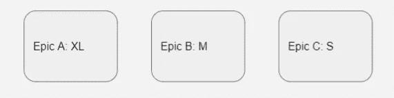
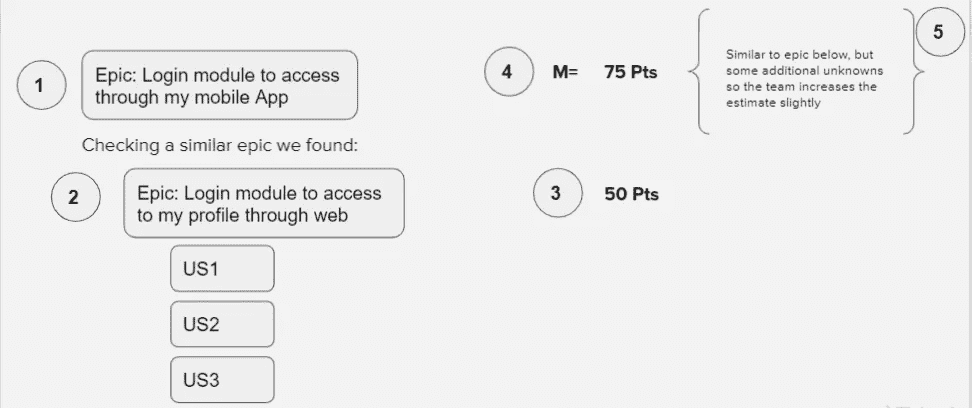
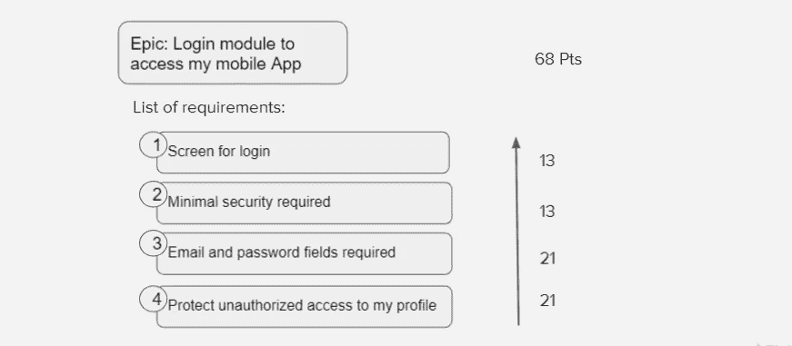
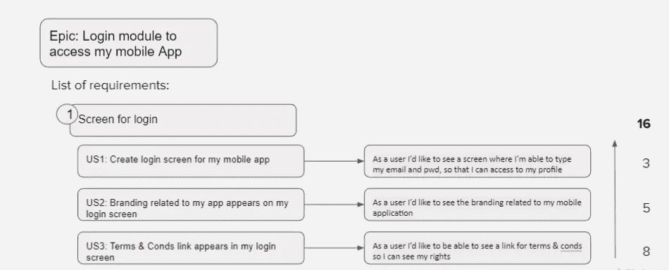
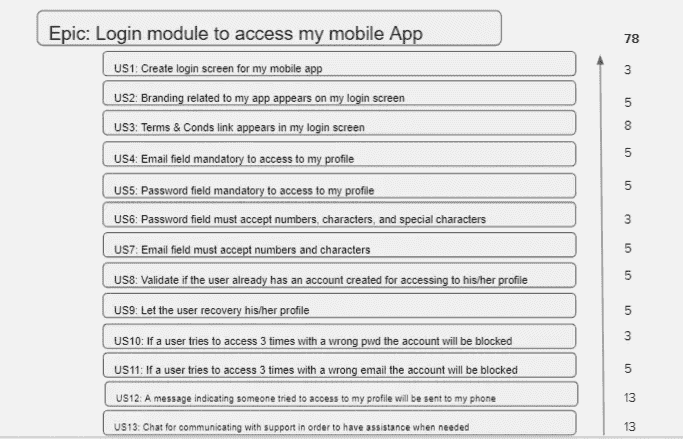

# 评估史诗的良好实践

> 原文：<https://medium.com/globant/good-practices-for-estimating-epics-5099470da776?source=collection_archive---------0----------------------->

*剧透警告:*

*你将在这里看到的技术并不局限于任何敏捷框架，这些都是在我有幸参与的一些项目中实现它们的结果。*

在深入之前，你必须知道的另一件事是，你需要小心何时使用这些技术，原因很简单，如果顶级团队或成员(更不用说某些角色)要求你提前一年计划，你使用了本文中介绍的一些技术，你正在做一些正确的事情，但同时你正在做一些不一定正确的事情。

**你做得对吗？**好吧，你正在帮助你的团队用一种更准确的方法来评估一些可能需要几次冲刺才能完成的事情。

**你做错了什么？**你在计划一整年(一整年！！！lol)听起来是不是更像瀑布方法？在一年中，许多事情可能会发生，更有可能的是，你所估计的事情不会准确，或者不会反映现实。

说到这里，我认为我们要回答的第一个问题是**为什么要估计史诗？**

这样做有一些很好的理由:

1.  使容量规划能够超出估计故事的时间范围(几个月而不是几周)
2.  使团队能够对他们的工作做出有根据的、基于数据的预测，并与关键利益相关者和高管分享这些预测。

你可能会问自己的第二个问题**何时评估史诗？**

我认为要回答这个问题，我只有一个可能的场景，如果你需要知道你的团队在接下来的 3 个月或下学期会发生什么，那么你可以使用这些技巧。否则，正如我之前所说的，你只会做瀑布(抱歉不抱歉)。

说了这么多，还是说搞笑的部分吧。接下来你会发现三种不同的技术，明智地决定何时使用其中的任何一种

# 相对估计

**何时使用相对估计？**

*   这种方法通常在你对史诗的信息最少的早期使用。​
*   评估应该由产品经理、业务涉众和技术负责人领导，并听取团队的意见。​
*   准确度和精确度将会很低

**如何使用相对估计？**

*   从 t 恤尺寸开始，根据彼此之间的关系进行排序:

Relative estimations — T-Shirt sizing

> 在这个特殊的例子中，Epic A 是 XL 大小，这意味着它的复杂程度非常高(无论是出于技术原因、不确定性还是业务原因)
> 
> 现在 Epic B 比 Epic B 简单一些，但不一定容易处理，所以它的大小是 M。
> 
> 最后，Epic B 与 Epic A 和 Epic B 相比似乎很简单，所以它的大小是 S。

*   然后，找一部过去完成的史诗，它与你正在创作的史诗有些相似，并相对于历史史诗粗略地估计新的史诗，以得出你的相对史诗估计值。

我想此时您已经对如何使用这种方法有了一个很好的想法，但是为了更清楚，让我们用一个简单的例子来说明这种技术:

Relative estimation — Example

> 分离这个场景:
> 
> 1.我们将评估的史诗是:*登录模块，通过我的移动应用程序访问。*
> 
> 2.我们真幸运！我们发现了一个史诗，在某种程度上类似于这个新的:*登录模块，通过网络访问我的个人资料。*
> 
> 3.对于通过 web epic 访问我的个人资料的*登录模块，我们必须做三个用户故事，这三张票的总和是 50 分*
> 
> 4.考虑到我们已经发现的历史信息，团队决定新的史诗将是一个 M 尺寸。
> 
> 5.最后，考虑到未知因素，团队决定略微增加估计值，75 个指针。

# 中间估计

**何时使用中间估计？**

*   要使用这种方法，您需要有一个需求列表，以及什么在范围内，什么在范围外的明确定义。​
*   评估应由产品负责人/BA 领导，并听取产品经理、技术负责人和整个团队的意见。​
*   准确度和精确度将是中等的

**如何使用中间估计？**

*   为旅程中的每个主要“步骤”和活动创建一个用户旅程。​
*   如果一个用户旅程不适合你的 Epic，就把它分解成块。我们的目标是将史诗分成代表整个工作范围的片段。​
*   根据团队的历史工作，对每个步骤或活动进行粗略的估计。这些从积分上来说应该是大的。​
*   将所有步骤和活动的总点数相加，计算出您的中级史诗估计值。

让我们使用相同的例子作为相对估计，但在这种情况下，我们假设我们有更多的信息，以便我们能够将史诗分解成更小的块

Intermediate estimation — Example

分离这个场景:

> 对于这种情况，我们有更多的信息…对吗？因此，有了这些信息，我们可以将工作分成更小的块，在这个例子中是:*登录屏幕，最低安全要求，电子邮件和密码字段的要求，并保护对我的个人资料的未经授权的访问。*
> 
> 我知道你可能认为这四个块仍然很模糊，因此估计值需要很高，在这种情况下:*分别是 13、13、21 和 21*
> 
> 综合我们所有的估计，史诗将会是 68 个指针。

# 自下而上的估计

**何时使用自下而上的估计？**

*   一旦你有了史诗创作和评估的所有故事，你就可以应用这个评估
*   评估应由产品负责人/BA 领导，并听取整个团队的意见，由产品经理和技术负责人审查。​

如何使用自下而上的估计？

*   将所有故事评估的总数相加，得到你的史诗自下而上的评估。​

与前两种技术相同的情况，让我们使用相同的场景，但对于这种情况，我们有足够的信息，所以我们能够创建用户故事(我知道，最好的场景…永远不会。)

Bottom-up — User stories for requirement 1.

我们对其余的要求应用相同的方法(最低限度的安全性要求，电子邮件和密码要求，并保护对我的个人资料的未授权访问)

最终我们会得到这样的东西:

Bottom-up — Sum of all the user stories needed

在估计了覆盖这个史诗所需的所有用户故事之后，结果是这个史诗将是一个 78 指针。

就目前而言，我希望这些信息对您在项目/产品中所做的事情有所帮助。在结束本文之前，我想强调几件事:

1.  对于这里列出的任何技术，这是团队的责任，不是产品经理，不是产品所有者，不仅仅是技术领导…整个团队。
2.  这些都是估计，这意味着即使在最好的情况下(自下而上), epic 需要更多或更少努力的预测也是完全可能的。

现在，我想我完成了。感谢您的阅读。