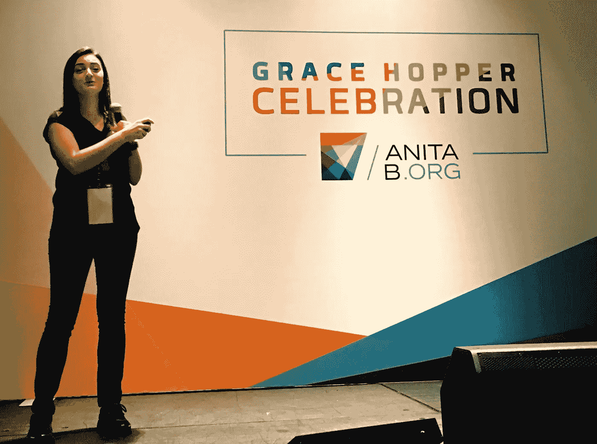
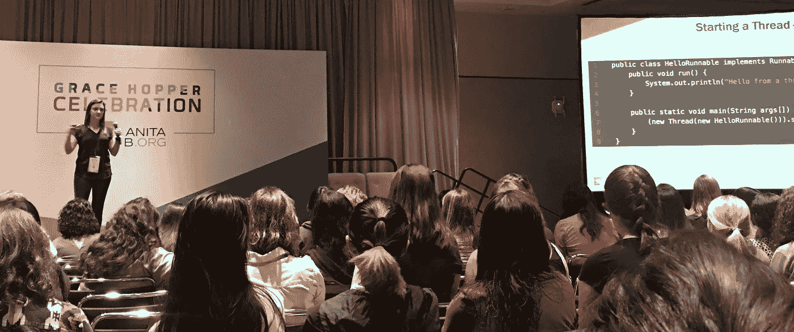

# 好去:一种语言，使工程师之间容易交谈

> 原文：<https://medium.com/capital-one-tech/good-to-go-a-language-that-makes-it-easy-for-engineers-to-talk-to-each-other-17ad0f47f76c?source=collection_archive---------7----------------------->

第一资本公司高级软件工程师凯琳·吉比尔特拉

编程中人性的一面不常出现在教科书或博客文章中，但却是我作为软件工程师最喜欢的一面。在编写代码时，很明显要确保它解决了手头的问题，它将运行而不会崩溃，并且它可以大规模工作。要确保在你离开后阅读你的代码的人能够保持这个系统的运行并给它添加新的特性，这并不容易。

这是我喜欢解决的编程中人性的一面，也是我今天要在格蕾丝·赫柏计算机女性庆典上谈论的一个问题。

作为一个研究计算机科学、心理学和工程领导与开发的人，以及一个在大量非常大、非常古老的代码库中工作过的人，我总是有一种思考这些事情的自然倾向。但是我从来没有感觉到我写的编程语言也考虑过这些事情。

也就是直到我遇到了围棋。Go 是一种编程语言，自谷歌首次开发并于 2012 年作为 Go 1.0 发布以来，它变得越来越受欢迎。它最初是对几十年前创建的 C++和其他语言的复杂性的回应——新开发人员加入代码库的准备期太长，程序员经常会发布漏洞百出的代码。

这种反应产生了一种编码语言，其中三分之一的关键字是 C++，一半的关键字是 Java，还有一个 40 页的语言规范。从工程的角度来看，Go 速度很快，可以在任何机器上运行。在 Windows、Mac 或 Linux 上，你可以使用二进制——这意味着你不会遇到 Java 所遇到的麻烦，在 Java 中你必须运行 JVM。

*Kaylyn at Grace Hopper 2017*

该语言的另一个流行特性是它内置的并发支持。学习如何一次处理多项任务是一个巨大的概念，对于职业生涯初期的工程师来说，这可能会非常令人沮丧。在 Go 中，你可以用简单的语法“go func()”来创建一个新线程，不需要导入任何东西。扩展监听消息的功能可以很容易地通过等待组或通道来完成，从而大大简化了令人生畏的并发性话题。

我刚从大学毕业的时候就开始用 Go 写作，我简直不敢相信自己这么快就学会了，尤其是和其他语言相比。我花了几个月的时间学习如何用其他语言构建 API(大部分都失败了)，但在编写 Go 一周后，我完成了第一个与 Slack 集成的 API。不到两个月，我就发布了一个后端系统，用于处理我们参加黑客马拉松时的事件注册，并配有离线同步功能，一次可以处理数千个请求。Go 不仅完美地为我工作，而且我能够将项目移交给更新的 Capital One 员工，他们在没有我的情况下无缝地继续这个项目。

> 我们的 Go 开发者社区在内部复制了 Go 社区的大部分内容:欢迎和兴奋地与那些语言新手一起工作。

这次经历让我和其他一些早期采用者一样，成为了 Capital One 的一名 Go 布道者——你可能会惊讶地发现，我们有多么喜欢这里的语言！我们的 Go 开发者社区在内部复制了 Go 社区的大部分内容:欢迎和兴奋地与那些语言新手一起工作。如果你对这门语言感兴趣——我希望如此——我鼓励你加入我们的 Slack 社区,看看你能跑多快。

*以上观点为作者个人观点。除非本帖中另有说明，否则 Capital One 不属于所提及的任何公司，也不被其认可。使用或展示的所有商标和其他知识产权都是其各自所有者的所有权。本文为 2017 首都一。*