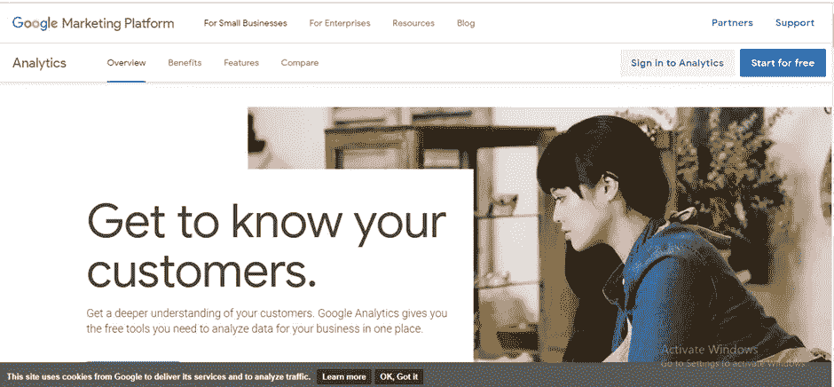

# 使用 Mendix 进行谷歌分析

> 原文：<https://medium.com/mendix/google-analytics-e96fbd9d59aa?source=collection_archive---------5----------------------->

Google Analytics with Mendix

# 许多网络工具有助于在网站上收集数据。在这些工具中，网站可以使用的最受欢迎的免费服务是谷歌分析。Google Analytics 允许您跟踪和了解客户的行为、用户体验、在线内容、设备功能等。

它有助于分析用户在你的网站上的互动，有助于提高和确保业务的成功。你可以在任何网站上使用谷歌分析来了解你的访问者的行为，并提供更好的结果。

Google Analytics 是一个免费的网络分析服务，用于跟踪网站性能，提供基本的统计和分析工具。

# 使用分析的优势:

> 监控你的访问者和用户
> 
> 优化你的网站
> 
> 分析完网络数据后，我们就可以制定营销计划了
> 
> 预测未来趋势
> 
> 跟踪比赛

# 谷歌分析的工作原理:

谷歌分析有四个主要组成部分

Major Components

## 数据收集:

第**件事**你需要做的是创建一个谷歌分析账户，然后添加一个跟踪代码到你的项目，我们将在博客的后面部分讨论这个初始设置(如何),现在，让我们知道它的工作。

**跟踪代码**是一小段代码，Google Analytics 使用它来跟踪你的网站访问者以及他们在你的网站上执行的任何操作。这段代码由 JavaScript 组成，看起来像这样

Tracking code

工作原理——一旦用户到达一个网站，JavaScript 代码就开始收集关于你的网站的一些信息:URL、网络浏览器、浏览器语言、操作系统、IP 地址、位置等。

当用户访问您的网站时，Google Analytics 会在用户的浏览器中放置一个 cookie，cookie 只是包含用户活动信息的小文件。

现在，通过使用这些 cookies，谷歌分析将知道用户在你的网站上的行为。然后，它收集这些信息，向您显示不同的报告。

这使得跟踪单个域 URL 或默认子域上的流量变得容易。但是，如果您考虑在不同域的页面上使用相同的默认跟踪代码，Analytics 将分别计算用户和会话。如果您需要跨不同域跟踪用户会话，您需要设置跨域跟踪。

随着用户在你的网站上的每一次互动，分析跟踪代码向谷歌分析发送关于用户如何与你的网站互动的更新，称为“点击”。

hit 是一个 URL 参数字符串，该参数包含关于用户的有用信息。如果我们分解代码，我们可以看到传递到字符串中的唯一标识符。这将有助于谷歌分析区分新用户和回头客。

Analytics tracking code as in hits

# 处理和配置:

一旦收集的数据通过“点击”到达谷歌分析服务，它就进入下一步的数据处理，

在这一阶段，收集的原始数据被转化为更有意义的信息。

数据处理依赖于配置，在此阶段，您确定的配置将应用于原始数据。我们还可以对数据进行过滤。**例如**，您可能希望对一家公司的销售数据应用过滤器，并查找所有使用员工折扣完成的销售。

# 报告:

报告是谷歌分析平台的最终组成部分；Google 提供了一个 web 界面，您可以使用它来创建报告。

Google Analytics Report Dashboard

# 开始分析:

1.  前往 google.com/analytics>创建或登录您的分析账户:

2.请执行下列操作之一:

*   要创建帐户，请点击**免费开始**。
*   要登录您的帐户，请点击**登录分析**。

3.下一步是创建一个管理员帐户并设置一个属性。我们的跟踪代码已经在这里生成。

财产 id 是你的追踪代码。

Property ID

4.将 [Google Analytics](https://marketplace.mendix.com/link/component/105) 小部件导入您的 Mendix 项目。

# 小部件配置:

## 事件跟踪器小部件

谷歌分析市场模块:[https://marketplace.mendix.com/link/component/105](https://marketplace.mendix.com/link/component/105)

您可以利用事件跟踪器小部件来收集自定义事件的数据。一个事件点击有四个参数:**动作**、**类别**、**标签**和**值**。您可以使用它在特定于网站的报告中对交互进行分类。

Event Tracker Widget

## 事件跟踪器按钮小部件:

在这个小部件的帮助下，可以执行微流操作，其中小部件负责点击。在“行为”选项卡中，您可以对其进行配置，以便仅当开发人员启用按钮时才传输数据。

Event Tracker button Widget — Event tab

Event Tracker button Widget — Behaviour tab

**仪表板概述:**

从点击中收集的原始数据已被处理并转换为有价值的信息，并显示在分析仪表板中。上面的截图显示了页面和屏幕的细节，例如，它被浏览了多少次，有多少用户访问了该页面等。

Data Insights from processed hits

# 结论:

我们一次又一次地了解到，在营销世界中取得成功的最可靠的方法是了解你的客户。然而，你也需要创造方法在竞争中保持领先，并及时了解网站访客的变化趋势。如果是这样的话，没有合适的工具就很难做到。我的意思是——在竞争中保持领先并同时理解你的客人几乎是不可能的。借助这些工具中可用的精彩功能，可以更容易地确定网站上到底出了什么问题。有许多丰富多彩的创造性的方法可以用来改进你的网站，但是没有一个明确的错误建议，最终确定一个行动计划就变得很微妙。

> 利用这些分析，领先于你的挑战者。引领市场。

## 阅读更多

 [## GitHub-mendix/Google analytics:Google analytics 小部件使页面/按钮和事件能够…

### GoogleAnalytics 小部件支持跟踪页面/按钮和事件。这也包括谷歌网站管理员…

github.com](https://github.com/mendix/GoogleAnalytics)  [## 谷歌分析

### 描述 Google Analytics 小部件的配置和用法，该小部件可在 Mendix 市场中获得。

docs.mendix.com](https://docs.mendix.com/appstore/widgets/google-analytics/)  [## 谷歌分析

### 描述 Google Analytics 小部件的配置和用法，该小部件可在 Mendix 市场中获得。

docs.mendix.com](https://docs.mendix.com/appstore/widgets/google-analytics/#eventtrackerbutton)  [## 谷歌分析

### 描述 Google Analytics 小部件的配置和用法，该小部件可在 Mendix 市场中获得。

docs.mendix.com](https://docs.mendix.com/appstore/widgets/google-analytics/#pagetracker) 

*来自发布者-*

*如果你喜欢这篇文章，你可以在我们的* [*中页*](https://medium.com/mendix) *找到更多喜欢的。对于精彩的视频和直播会话，您可以前往*[*MxLive*](https://www.mendix.com/live/)*或我们的社区*[*Youtube PAG*](https://www.youtube.com/c/MendixCommunity/community)*e .*

*希望入门的创客，可以注册一个* [*免费账号*](https://signup.mendix.com/link/signup/?source=direct) *，通过我们的* [*学苑*](https://academy.mendix.com/link/home) *获得即时学习权限。*

有兴趣加入我们的社区吗？加入我们的 [*Slack 社区频道*](https://join.slack.com/t/mendixcommunity/shared_invite/zt-hwhwkcxu-~59ywyjqHlUHXmrw5heqpQ) *。*