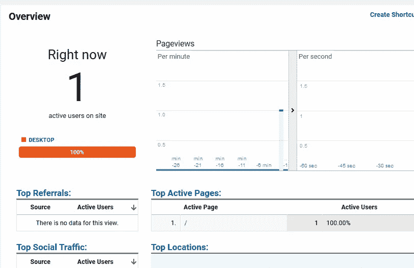
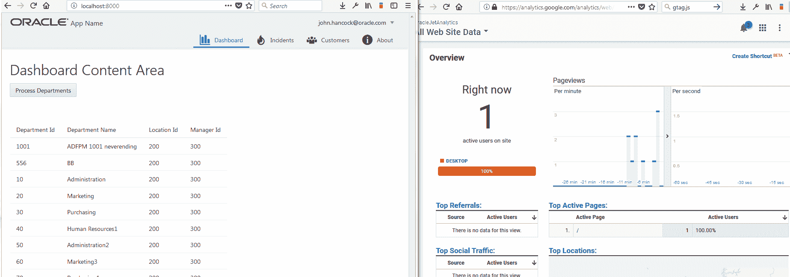

# 使用 autotrack.js 将 Google Analytics 集成到 Oracle JET 中

> 原文：<https://medium.com/oracledevs/google-analytics-integration-into-oracle-jet-using-autotrack-js-ac5024e8df28?source=collection_archive---------0----------------------->

ADF 应用程序的行为更像 SPA(单页应用程序)，因此与传统网站不同，浏览量不会被正确跟踪。特别是在任务流中导航时。

为了克服这一点，您必须发送一个“假”页面视图，并手动设置页面上下文(我计划写一篇关于如何在 ADF 中做到这一点的博文)。

同样的问题也适用于 Oracle JET 应用程序(可能更严重)。幸运的是， [Google 已经承认了](https://developers.google.com/analytics/devguides/collection/analyticsjs/single-page-applications)这个问题，甚至有一个图书馆可以为我们处理这些繁重的工作。



进入 autotrack.js，其中包含一个名为*‘urlChangeTracker’的插件。*该插件通过历史 API 监听 URL 的变化，并发送额外的浏览量。

## autotrack.js

要安装 autotrack，请运行以下 npm 命令:

```
npm install autotrack --save
```

然后修改您的 **oraclejet-build.js** 文件，在构建时将您的新库移动到您的登台目录中:

```
copyCustomLibsToStaging: {
     fileList: [
       {
            cwd: 'node_modules/autotrack/',
            src: ['*.js'],
            dest: 'web/js/libs/autotrack'
        },
            {
            cwd: 'node_modules/autotrack/lib/plugins/',
            src: ['*.js'],
            dest:'web/js/libs/autotrack/plugins'
        }
     ]
},
```

在您的 **main.js** 文件中需要您的新依赖项:

```
require(['ojs/ojcore', 'knockout', 'appController', 'ojs/ojknockout', 'ojs/ojmodule', 'ojs/ojrouter', 'ojs/ojnavigationlist', 'ojs/ojbutton', 'ojs/ojtoolbar', **'autotrack'**],
```

将以下代码片段添加到您的**index.html**文件的头部分，用您的 Google Analytics 跟踪代码替换 ***【此处跟踪代码】*** 。

```
<script>
window.ga=window.ga||function(){(ga.q=ga.q||[]).push(arguments)};ga.l=+new Date;
ga('create', '***[tracking code here]***', 'auto');
ga('require', 'urlChangeTracker');ga('send', 'pageview');
</script>
<script async src="[https://www.google-analytics.com/analytics.js](https://www.google-analytics.com/analytics.js)"></script>
```



Google Analytics working in a JET SPA with autotrack.js

你可以在这里找到更多关于 autotrack.js 的信息，它是一个出色的工具，让你不仅仅是跟踪 SPA 浏览量。当您开始跟踪更多的用户与事件的交互时，它会很有用。

— DC