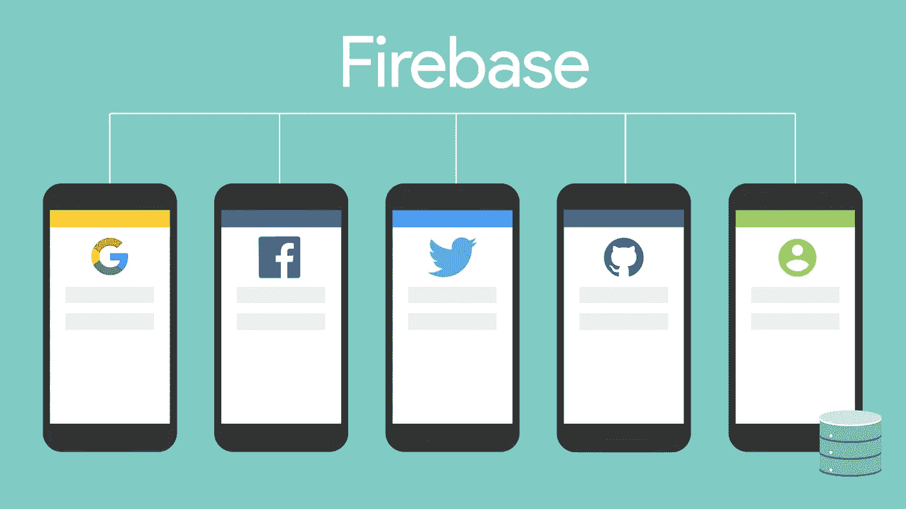
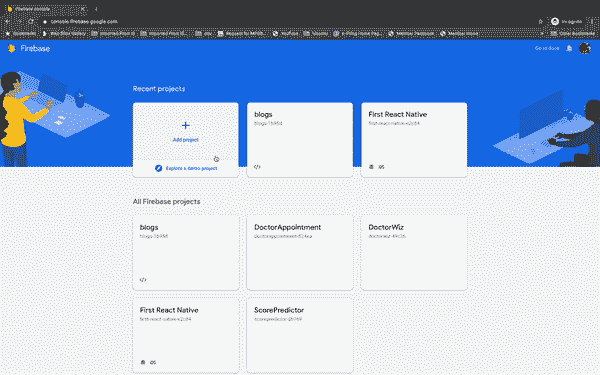
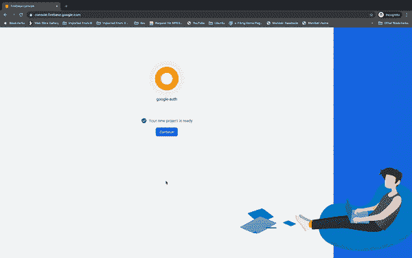
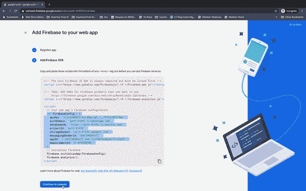
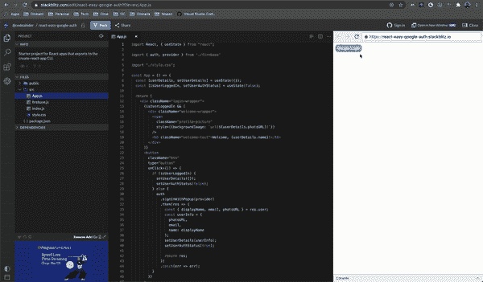

# 使用 Firebase 的 Google 认证——鸭汤！

> 原文：<https://medium.com/globant/google-authentication-with-firebase-the-duck-soup-2bc504d67a33?source=collection_archive---------0----------------------->

大部分前端项目都需要用户认证。有太多的解决方案，如 OAuth、JWT、Amazon Cognito 等。但是每一种都有一个问题——它们在所需专业知识的范围上有所不同。有些情况下，您可能希望有一个快速的解决方案。也许，你在你的团队里没有足够的时间或者足够的专业知识。Firebase 可以在这种情况下给你一条出路。它有一个非常用户友好的界面，你可以认为它是一个更友好、更容易的 AWS 替代品。

Image by [OpenClipart-Vectors](https://pixabay.com/users/OpenClipart-Vectors-30363/?utm_source=link-attribution&utm_medium=referral&utm_campaign=image&utm_content=2029283) from [Pixabay](https://pixabay.com/?utm_source=link-attribution&utm_medium=referral&utm_campaign=image&utm_content=2029283)

> Firebase 提供了除身份验证之外的一系列服务。在本文范围内，我们将只关注 **Google** auth。此外，由于 Firebase 独立于您希望使用(或不使用)的任何前端框架/库，我将保持它的简单性&在示例中使用 ReactJS。

提到这一点，让我们直接进入正题…

Image by OpenClipart-Vectors from Pixabay

# 为身份验证设置 Firebase

首先，让我们建立一个 Firebase 项目。

*   登录 [Firebase 控制台](https://console.firebase.google.com/)。
*   "*添加项目* " —输入项目名称& " *继续*"。
*   您可以在此步骤中禁用分析，或者保持原样& " *Continue* "。
*   如果您想要分析，请选择“*Firebase 的默认帐户*”&“*创建项目*”。

Add a new project to Firebase

*   添加新的 web 应用程序(>)开始使用。
*   “*用昵称注册*app(可以不勾选保持托管)。
*   复制`firebaseConfig`变量。我们将很快在 React 应用程序中使用它。

Setup Project for Web app

*   现在，“*继续控制台*”&点击左侧导航中“*开发*选项下的“*认证*”。
*   点击*设置签到方式*。
*   点击*谷歌***>>***启用* it **> >** 从下拉列表中选择您的*电子邮件地址*。
*   "*保存*"就大功告成了。

Add sign-in method

# 设置 React 应用程序

这是最简单也是最直接的过程:

*   首先，在 React 项目中运行`npm i --save firebase`。
*   创建`firebase.js`文件。
*   添加所有的`imports` &完成设置，如下面的代码片段所示:

firebase.js

*   更新您的`App.js`以使用 firebase 身份验证提供商:

App.js

*   `auth.signInWithPopup(provider)`将打开一个弹出窗口&询问您的 Google 凭据以验证您的用户身份。

Sign-in Popup

您获得用户数据作为成功登录的响应。您可以使用它将用户添加到您自己的数据库中。用户名、电子邮件、用户 id、个人资料图片 URL 是`user`对象可用的一些字段。

真快。这就是使用 Google auth 来设置 Firebase 的登录机制所需要做的全部工作。

## 注意事项:

*   您可以尝试其他登录选项。Google auth 是最简单的，因为 Firebase 是 Google 的产品。在前端使用这些产品的方式略有不同。
*   部署应用后，您需要将您的域添加到“*身份验证*”、**、>、**、*登录方式*下的“*授权域*”。默认添加`localhost`。
*   在 React 应用程序中，有适当的方法来构建身份验证机制。为了简洁起见，这里保持简单。

# 演示

 [## react-easy-Google-auth-stack blitz

### 导出到 create-react-app CLI 的 React 应用程序的启动项目。

stackblitz.com](https://stackblitz.com/edit/react-easy-google-auth?file=src/App.js) 

您可以查看我创建的 Stackblitz 实现示例，作为本文的基线。