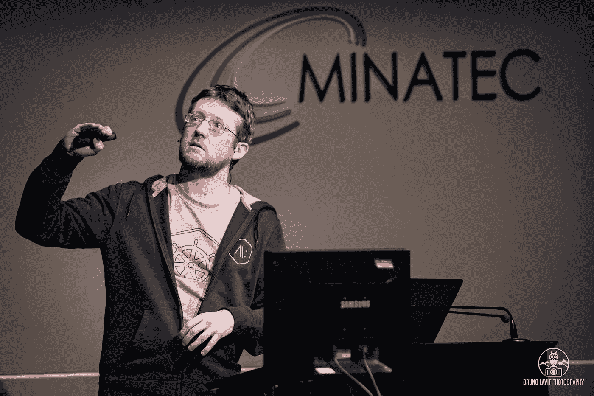

# 谷歌云&科特林·GDE 凯文·戴维恩帮助他人在面临挑战时学习

> 原文：<https://medium.com/google-developer-experts/google-cloud-kotlin-gde-kevin-davin-helps-others-learn-in-the-face-of-challenges-ddca7278ca19?source=collection_archive---------0----------------------->

*Kevin Davin speaking at the SnowCamp Conference in 2019*

Kevin Davin 总是热衷于学习和帮助他人学习，不管他们的背景如何，也不管他们可能面临什么样的挑战。他解释说，“我每天都想学习新的东西，我想帮助别人学习，我沉迷于学习。”这句口头禅在他所做的每一件事上都显而易见，从在众多会议上发表演讲，到帮助来自代表性不足的群体的人克服冒名顶替综合症，甚至帮助他们成为 GDEs。除了学习，Kevin 还热衷于多样性和包容性工作，部分灵感来自于在部分失明的情况下导航世界。

Kevin 现在已经做了 10 年的职业程序员，在计算机科学领域也有大约 20 年了。多年来，他一直强调学习方法和学习地点的重要性。例如，虽然他在大学学习时学到了很多东西，但他通过同事也能学到同样多的东西。事实上，正是通过他的同事，他学到了团队合作的经验，以及向不同观点和经验的人学习的能力。由于他能够从周围的人那里学到很多东西，凯文也想把它向前支付，并开始在一所残疾人学校做志愿者。在省残疾人中心的指导下，该方案的目的是教授编码语言，并使学生重新融入技术职业。在该中心工作期间，凯文帮助学生实践他们所学的知识，并最终成功过渡到新的职业。

在这些经历中，Kevin 总是通过开源项目参与开发人员社区。正是通过这些项目，他了解了 GDE 计划，并与谷歌开发者权益倡导者建立了联系。Kevin 被 GDE 计划所吸引，因为他想与他人分享他的知识，并直接访问 Google，以便成为开发人员的代言人。2016 年，他发现了 Kubernetes，并帮助他当时的公司迁移到谷歌云。他总是觉得这种模式是正确的解决方案，并投入了大量时间来学习和实践它。“谷歌云是为开发者打造的。这就像一套乐高玩具，因为你可以把你想要的零件组装起来，”他说。

GDE 项目让他获得了他最珍视的东西:成为开发者社区的一员，成为开发者的拥护者，帮助来自各种背景的人感到融入其中，最重要的是，每天都有机会学习新的东西。凯文给满怀希望的 GDEs 的临别建议是:“即使你现在达不到成为 GDE 的目标，你总可以在未来被接受。不要害怕失败，因为没有失败，你什么也学不到。”通过参与该计划，Kevin 希望继续与开发人员社区保持联系，并在支持多样性工作的同时不断学习。

*在*[*Twitter*](https://twitter.com/davinkevin)*&*[*LinkedIn*](https://www.linkedin.com/in/davinkevin/)*上了解更多关于凯文的信息。*

[*谷歌开发者专家(GDE)计划*](https://developers.google.com/community/experts) *是一个由经验丰富的技术专家、影响者和思想领袖组成的全球网络，他们通过在活动中发言和发布内容来积极支持开发者、公司和技术社区。*