# Google Cloud Next’19:与会者的观点

> 原文：<https://medium.com/google-developer-experts/google-cloud-next-19-an-attendees-perspective-8ba6fa623d6f?source=collection_archive---------2----------------------->

两周前，超过 35，000 人聚集在旧金山，参加关于谷歌云最新进展的年度大会，谷歌云下一个 2019 年旧金山。

作为一名谷歌开发人员专家，我很高兴参加，与许多有趣的人(包括其他谷歌开发人员专家、谷歌开发人员关系团队、谷歌员工和许多优秀的开源人员)交往，并出席宣布新产品和服务的主题演讲以及一系列分组会议，以了解谷歌和其他公司如何利用所有这些技术。

在这篇博文中，我将概述我的会议要点，并提供一些额外资源的链接，如下所示:

*   主旨发言
*   分组会议摘要
*   课外活动

我希望人们可以通过这篇博客来了解谷歌云正在发生的事情，了解更多关于 GCP 的事情，并受到启发，参与其中或尝试自己建造一些东西。

# **主题演讲**

我喜欢这个主题演讲的原因是中央开源是怎样的，从宣布 [Anthos](https://cloud.google.com/anthos) 开始。

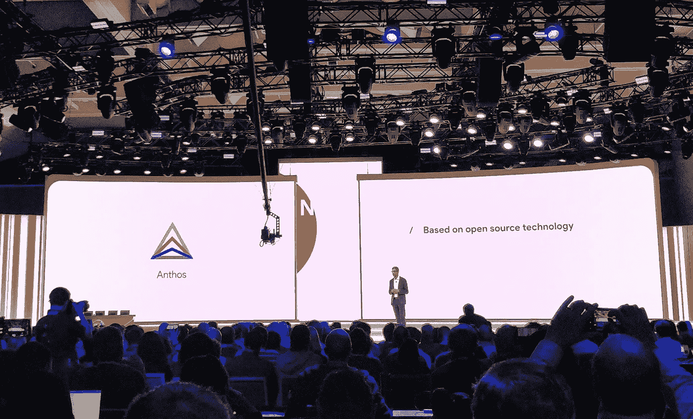

Anthos 允许你在云上部署、运行和管理你的应用，但不仅仅是 Google Cloud。主题演讲中的演示实际上是在 AWS 上运行的，这使得“*一次开发，随处运行”*的梦想成为现实。

另一个开源亮点是[与 Confluent、MongoDB、Elastic、Neo4j、Redis Labs、InfluxData 和 Datastax 的战略开源合作伙伴关系](https://cloud.google.com/blog/products/open-source/bringing-the-best-of-open-source-to-google-cloud-customers)，这些合作伙伴现在在运行、计费和支持方面与 GCP 紧密集成。

其他有趣的公告:

*   [**云运行**](https://cloud.google.com/run) :无服务器容器构建在 Knative 之上！
*   [**big query BI engine**](https://cloud.google.com/solutions/business-intelligence/#featured-products):亚秒级查询响应时间，采用完全托管的内存高并发系统，实现数据可视化。
*   [**数据融合**](https://cloud.google.com/data-fusion) ，基于开源产品 [CDAP](https://cdap.io) 的全托管、无代码数据集成服务。
*   [AutoML 表格](https://cloud.google.com/automl-tables):使用结构化数据的自动化预测洞察。

Key take-away from the Developer Keynote

完整的公告列表可以在谷歌云博客上找到。

# **刘宇**

接下来，除了参加主题演讲，还有分组会议，会上发布了其他公告，进行了产品演示，分享了最佳实践，其他公司也谈到了他们对谷歌云平台的使用。在这一部分，我将分享其中的亮点和我的收获。

如果可以的话，我会附上录音的链接、演讲者的 Twitter 页面和有用的外部链接。

## **德沃普斯 vs SRE:竞争标准还是朋友？**

*   **演讲者** : [塞斯·瓦戈](https://twitter.com/sethvargo)
*   [**更多信息**](https://cloud.withgoogle.com/next/sf/my-schedule?session=OPS100)
*   [**录音**](https://www.youtube.com/watch?v=0UyrVqBoCAU)

这是我第一次参加会议，也是我最喜欢的会议之一，甚至在会议快结束的时候。它是由伟大的 Seth Vargo 交付的，他是 Google 开发人员关系团队的一员。

会议以回答“什么是开发？”这个问题开始以及“什么是运营？”。开发人员开发代码、编写软件、推出新功能，重点是敏捷性，而运营人员将运行该软件的生产系统保持在理想状态(“它正在运行，请勿触摸”)。

从历史上来看，开发人员更接近业务，并且像业务需要的那样，他们不断推出代码，并将其“越过墙”扔给远离业务(例如，在数据中心中)的运营人员，但他们是在出现故障(不仅是硬件，还有软件错误)时被呼叫的人。因此，编写、测试和部署良好的代码对他们有利。

DevOps 的实践是用一些具体的概念来打破这堵“墙”和“扔代码”:减少组织的筒仓，接受失败是正常的，实施渐进的改变，利用工具和自动化，测量一切。

SRE(网站可靠性工程)是具体的、指令性的开发操作程序，它来自谷歌，用于在生产中运行搜索或 Gmail。

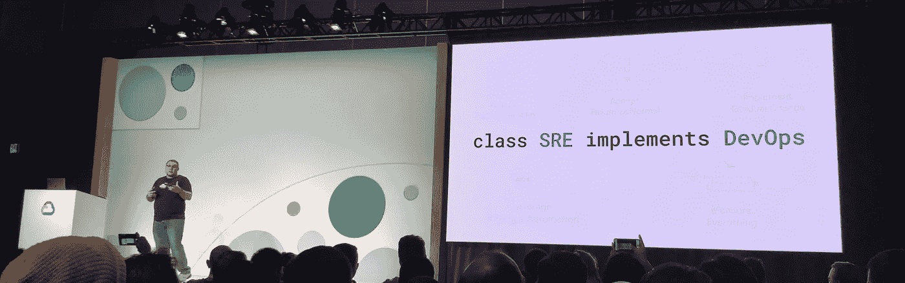

class SRE implements DevOps

它将 DevOps 的概念具体化为您可以应用的实践:

*   **减少组织孤岛**:让工程、SRE 和产品协同工作。
*   **接受失败为常态**:贯彻 SLO 的；系统的可用性和可靠性如何(取决于手头的工作)
*   **实施渐变**:降低失败成本(10 行代码比 100 000 LOF 更容易调试和回滚)
*   **利用工具&自动化使事情可重复**:摆脱辛劳，从长远来看为系统带来价值
*   **衡量一切**:首先是与客户相关的有形事物，如响应时间，但也包括 CPU 使用率等。以防你需要找到根本原因。

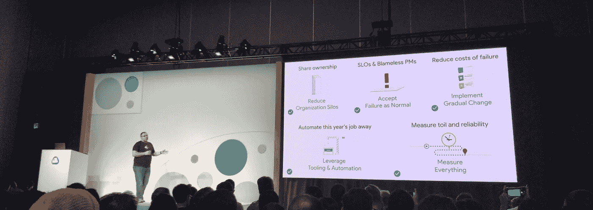

Concepts

开发新服务时，您需要决定以下几件事:

*   **SLI** :服务水平指示器:二进制值——是否满足特定服务的标准？
*   **SLO** :服务水平目标:这是您在一段时间内的 SLI 目标——您希望在多长时间内达到 SLI？
*   **SLA** :服务水平协议:在之前建立的标准之上的业务协议

每个不同的概念都涉及组织中不同的人:

*   SLIs 包括软件工程师、站点可靠性工程师和产品经理
*   SLO 包括现场可靠性工程师和产品经理
*   SLA 涉及销售和客户

自然，事情时不时会出错。这就是'*错误预算'*概念的由来:在 SLO 范围内，我们还能接受多少次服务失败。这取决于您可以接受的风险，而风险又将决定您的 SLO(我们希望提供多少个 9 取决于我们的应用程序有多重要，交付的时间有多敏感……)。一旦你检查了你的错误预算，开发工作需要从交付新特性到提高可靠性和可用性，直到你的错误预算得到补充。

会议结束时，气氛有点紧张:什么时候应该自动化那些手动的、重复的、缺乏长期价值的、高度自动化的流程，什么时候是好的，什么时候是坏的。一般来说，您希望尽可能多地实现自动化，但 toil 也有优势，当考虑实现自动化时，您应该考虑投资回报(例如，自动化一项每年需要完成的工作，只需 15 分钟，自动化需要 20 小时，这不是一个好的投资回报。在这种情况下，你需要记录工作并分享知识)。

找到更多关于 google.com/sre SRE 的信息或者阅读免费的书籍

## **BigQuery GIS —地理可视化探索**

*   [**更多信息**](https://cloud.withgoogle.com/next/sf/sessions?session=DZ206)
*   [记录**记录**记录](https://www.youtube.com/watch?v=Q6BzuIgGnfA)

该会议在 DevZone 举行，讨论了 BigQuery 中与地理空间数据相关的数据类型和查询功能。

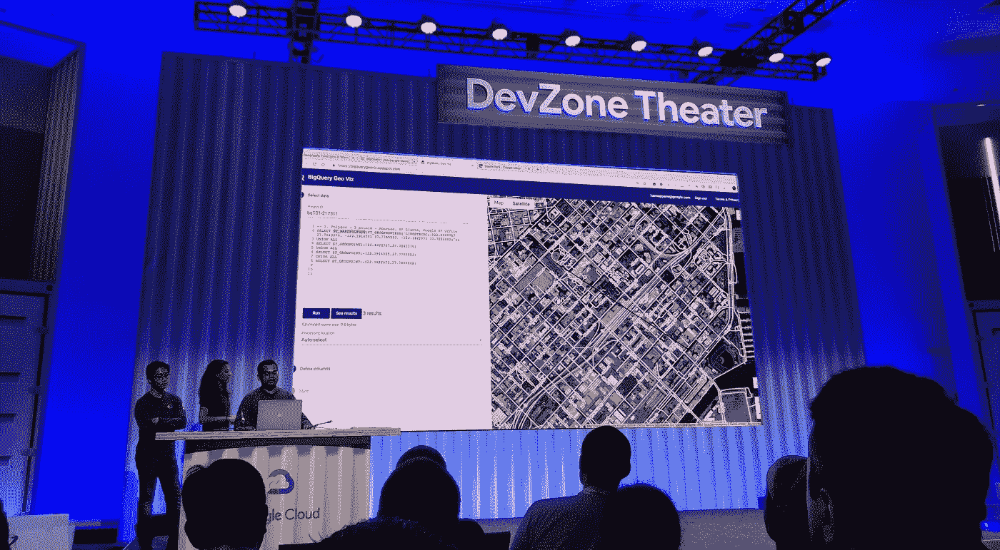

BigQuery GIS demo

使用纬度和经度，您可以描述地球上的一个点，但对于描述更复杂的形状，如多边形，BigQuery 有一个“GEOGRAPHY”数据类型，支持 GeoJSON、WKT(众所周知的文本)和 WKB(众所周知的二进制)。

将这一点与 BigQuery 的强大功能(能够以大规模并行方式处理大量数据)相结合，使您能够从地理空间的角度连接和分析数据，例如，在 SQL 查询的 WHERE 子句中使用本机原语询问您在另一个数据点的范围内有多少数据点。

BigQuery Geo Vis 使您能够在地图上快速显示查询结果，使结果更加直观，并以更简单的方式做出商业决策。

快速浏览可以在这里找到[。](https://www.youtube.com/watch?v=BUEmvT3p_zE)

## **通过闯入保护无服务器**

*   **发言人** : [海莉·登布雷弗耶](https://twitter.com/hayleydenb)
*   [**更多信息**](https://cloud.withgoogle.com/next/sf/sessions?session=DZ307)
*   [**录音**](https://www.youtube.com/watch?v=RCpHUUp-tpM)

该会议也在#DevZone 举行。

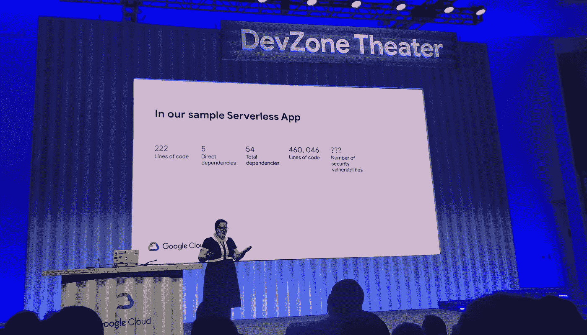

Securing serverless

会议从介绍无服务器开始，将它与云中的其他架构联系起来:monolithic(云处理硬件)、containers(云处理虚拟机)、无服务器(云处理容器……)。

即使在部署一个只有 200 行代码的小应用程序到无服务器运行时，你也必须意识到你的应用程序在代码行方面可能要大得多。这就引出了一个问题:这些线路真的安全吗？

关键要点是:

*   检查依赖关系中的漏洞。您的代码可能很好，但其他人的可能就不好了！
*   部署精细的功能和权限。
*   不要依赖于函数排序:您需要单独保护每个函数，而不仅仅是那些暴露的函数。
*   担心所有功能。
*   不要依赖不变性:假设服务器可以重用。

全幻灯片[此处](https://drive.google.com/file/d/1fuSAWrL8irN7DaZFvPILshYqJKGzcUOq/view)。

## **认识作者— Go 语言**

*   **演讲嘉宾** : [泰勒·布伊-帕尔苏利奇](https://twitter.com/tbpalsulich)，梅根·伯德-萨尼奇，[布拉德·菲茨帕特里克](https://twitter.com/bradfitz)，[罗伯特·格里斯默](https://github.com/griesemer)，[伊恩·兰斯·泰勒](https://github.com/ianlancetaylor)，罗伯特·范·根特
*   [**更多信息**](https://cloud.withgoogle.com/next/sf/sessions?session=DZ208)
*   [**录音**](https://www.youtube.com/watch?v=3yghHvvZQmA)

在这一环节中(还是在发展区——是的，我经常在那里闲逛),小组由幕后黑手组成。会议主要以问答的形式进行，既有准备好的问题，也有来自观众的问题，这使得很难捕捉到很多信息，不幸的是，我没有找到录音。

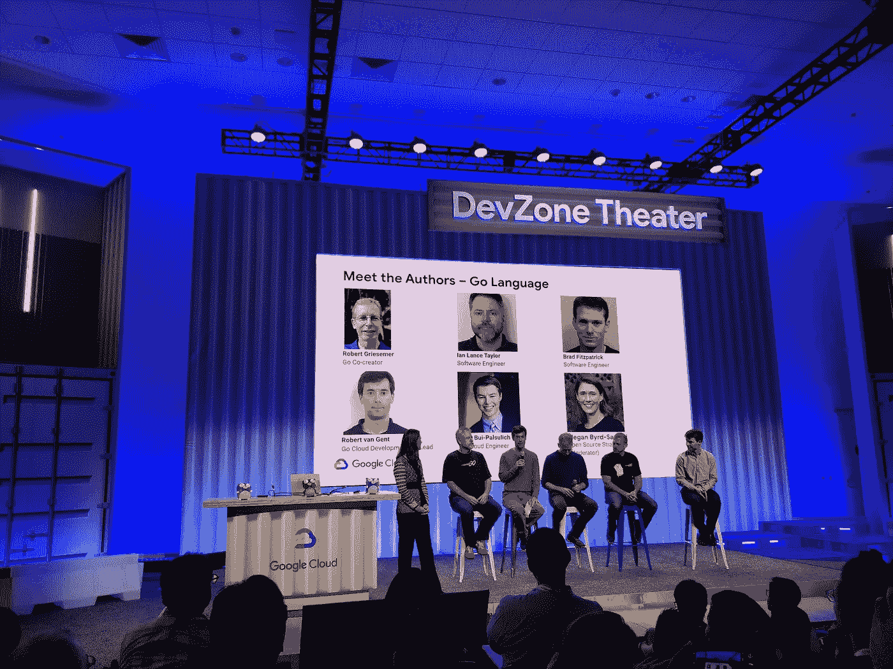

Meet the Authors — Go language

我能够捕捉到的是:

*   为什么要用 Go？易于管理，易于学习，非常高性能，在云上很好使用(Kubernetes 就是用它写的)。总结一下:快&好玩。
*   什么是新的？为移动到 Go 2 热身！听取社区的意见和贡献，对语言的添加和删除，对依赖管理的改进，检查和响应错误，决定是否包含泛型，以及减少标准库中的内容。
*   做围棋的动机是什么？做得比 Java 和 C++更好，做一个紧凑的，高性能的语言，在其中并发是很容易做到的。
*   围棋最大的挑战？拒绝(反对新功能)

对于一个小的介绍，请查看这篇由 Hackernoon [在 Medium](https://hackernoon.com/why-go-ef8850dc5f3c) 上发表的文章。

## **Twitter 如何将数 Pb 的数据复制到谷歌云存储中**

*   **发言人** : [Lohit VijayaRenu](https://twitter.com/lohitvijayarenu)
*   [**更多信息**](https://cloud.withgoogle.com/next/sf/my-schedule?session=DA300)
*   [**录音**](https://www.youtube.com/watch?v=g2zDWDqqV4U)

在本专题讲座中，Twitter 高级软件工程师 Lohit 介绍了 Twitter 数据分析基础设施的架构。该基础架构主要基于 Hadoop 集群，每天记录超过 1.5 万亿个事件。引入了几个特性，其中包括[文件系统抽象](https://blog.twitter.com/engineering/en_us/a/2015/hadoop-filesystem-at-twitter.html)、数据访问层(DAL，包含元数据)和用于探索数据集的前端([鹰眼](https://blog.twitter.com/engineering/en_us/topics/insights/2016/discovery-and-consumption-of-analytics-data-at-twitter.html))。

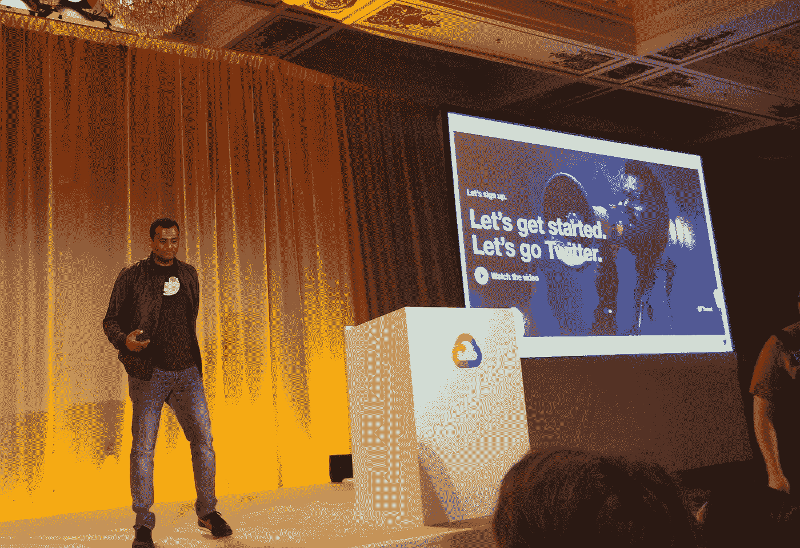

GCP at Twitter

在 ViewFS 之上，Twitter 构建了一个复制服务，目的地负责复制并与源同步。他们决定将这项复制服务扩展到谷歌云存储，以便利用谷歌云的数据处理能力，如 BigQuery。在这个过程中，他们非常依赖 Google Storage Connector 的使用。总移动量涉及超过 300PB 的存储

更多信息请点击[本页](https://cloud.google.com/twitter)。

## **混乱:打破你的系统，使之牢不可破**

*   **演讲者** : [杰森·易](https://twitter.com/gitbisect)
*   [**更多信息**](https://cloud.withgoogle.com/next/sf/sessions?session=OPS216)
*   [**录音**](https://www.youtube.com/watch?v=pVYwagnFXJI)

这个会议是关于混沌和混沌是什么:系统处于一个持续的失败状态(它不是二元的)。避免失败的最好方法是不断失败。失败是可以学习的。

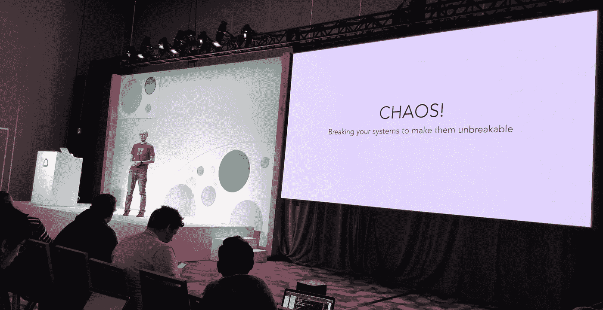

那么如何练习混沌(不做混球)？你需要建立规则来保持它的趣味性和教育性。

1.保持简短:90 分钟应该足够了。

花 30 分钟做 ***规划*** :

*   安排一下(你打算什么时候做？)
*   挑选测试(你要打破什么？)
*   写下你预期会发生什么(应该发生什么？)
*   当事情出错时你会怎么做(后备计划是什么？)
*   与工程组织共享文件

50 分钟分配给 ***玩*** (好玩的部分——打破东西看看会发生什么):

*   从试运行开始，在生产中运行(非高峰时间)，然后在生产中运行(黄金时间)。
*   宣布您将从群聊开始。
*   在群聊中保持讨论。
*   监控停机。
*   运行您的测试并做笔记。

增加 10 分钟 ***汇报:***

*   创建票证以跟踪需要处理的问题
*   写一份总结和主要经验教训
*   给工程部发电子邮件
*   庆祝一下！

2.有一个小团队(通常 2 人)

*   主题专家，构建服务的人
*   安·SRE:谁是保持系统正常运行的真正专家
*   (可选:初级工程师或开发人员，用于指导和对系统的全新看法)

3.您想玩什么级别的游戏—有不同的选项:

*   0 级:终止服务。阻止访问 1 个依赖项
*   级别 1:阻止所有依赖关系
*   级别 2:终止主机
*   级别 3:降低环境质量(例如，网络速度慢、数据包丢失、信息格式错误)
*   第 4 级:高峰流量(自己 DDOS)
*   级别 5:终止区域/云:故障转移到其他云或本地云

会议以一个应用了上述概念的混沌实验演示结束——点击[这里](https://www.youtube.com/watch?v=pVYwagnFXJI&feature=youtu.be&t=1417)查看。

## **流分析的进步**

*   **演讲者** : [谢尔盖·索科连科](https://twitter.com/datancoffee)和[托马斯·维斯](https://twitter.com/thweise)
*   [**更多信息**](https://cloud.withgoogle.com/next/sf/my-schedule?session=DA311)
*   [**录音**](https://www.youtube.com/watch?v=YW2yK5V5L5k&list=PLIivdWyY5sqKBNhDaKHtyfPfcF9mYGLug&index=33&t=0s)

我在 Twitter 上广泛报道了这次会议——来自 Google Cloud Dataflow 团队的许多令人兴奋的公告和学习，以及来自 Lyft 的 Apache Beam 部署的学习:

## **在 GitLab.com 实现零信任**

*   **演讲嘉宾** : [凯西·王](https://twitter.com/wangkathy)和[菲利普·拉福瑞耶](https://twitter.com/plafoucriere)
*   [**更多信息**](https://cloud.withgoogle.com/next/sf/sessions?session=SEC220)
*   [**录音**](https://www.youtube.com/watch?v=DrPiCBtaydM)

这次会议讨论了一个话题，这个话题后来引起了我的注意，我渴望了解更多:现代公司如何做好安全工作。

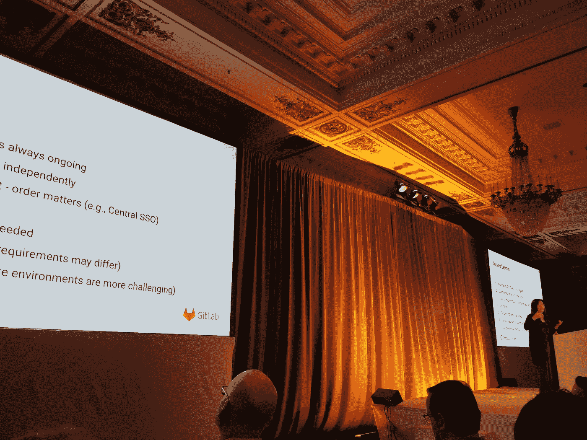

传统公司有一种外强中干的方法。作为一个行业，我们知道这是行不通的，但这仍然是大多数企业的设置方式。

零信任:所有试图访问端点的设备和用户都需要获得授权和认证。这一过程中涉及的所有决策都是动态的、基于风险的。

它不是一个产品，而是一个过程，它不是新的，并且在重大违规之前通常不会实施(只有大约 20%的云原生公司只实施或开始实施零信任)。

有什么好处:

*   横向移动要困难得多(服务是独立的周界)
*   偷来的凭证价值较低
*   容易被利用的已知漏洞会更少
*   无针对性的攻击价值较低(导致攻击者的成本较高)

在 Gitlab.com 开始他们的零信任之旅之前，他们已经有了一些东西:数据分类政策，GCP 安全准则(由[凡赛堤](https://forsetisecurity.org)执行)，内部可接受的使用政策，以便不依赖于良好的意图，以及一个人力资源系统，以了解谁在你的组织中，以便给予适当的访问权。

然后，他们研究了他们在零信任之旅中解决的 3 个问题:

1.管理用户身份和访问:回答一系列问题:

*   如何验证端点完整性？
*   访问数据的人是否适合该角色？
*   您如何简化入职/离职流程？
*   我们如何最大限度地减少信用卡盗窃？
*   我们如何实施我们的数据分类政策？)

2.保护我们的应用:

*   通过培训开发人员和扫描每一次提交，将安全性转移到管道的左侧并合并请求。
*   通过仅部署受信任的容器映像来应用二进制授权，从部署过程中去除人员，在 CI 阶段对映像进行签名和注释。
*   密钥管理服务
*   用户和实体行为分析

3.保护我们的基础设施:

*   漏洞管理:及时部署补丁
*   谁拥有什么资产:由资产数据库回答
*   如何迁移虐待行为？
*   如何让进攻者更难横向移动？
*   为 GitLab.com 应用谷歌的最佳安全实践
*   强制执行策略，以避免依赖最佳意图

旅程是如何组织的？将不同的部分分类:

*   GitLab.com:处理客户数据的基础设施(集中管理)
*   端点:用户和员工笔记本电脑(单独管理)
*   后端基础设施:第三方应用程序

跨这些存储桶的实现是并行完成的。

吸取的教训？这是一个正在进行的实现，排序很重要(一些实现会促进其他实现)，UX 很重要:人们需要能够完成他们的工作，自动化是规模的关键，零信任是针对你的公司和你的需求的。

幻灯片可以在[这里](https://storage.googleapis.com/gweb-cloudnext19.appspot.com/event-assets/sf/materials/SEC220_%20Towards%20Zero%20Trust.pdf)找到，我也喜欢阅读谷歌放在他们网站上的论文[这里](https://cloud.google.com/beyondcorp/#researchPapers)。

# **课外活动**

当然，峰会是一个与来自世界各地的人们见面、学习和交流的好机会。照片中最能捕捉到的几个亮点:

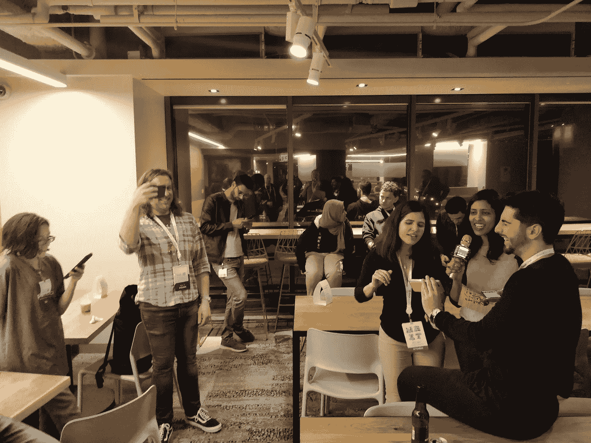

**GDE karaoke at the Community dinner**

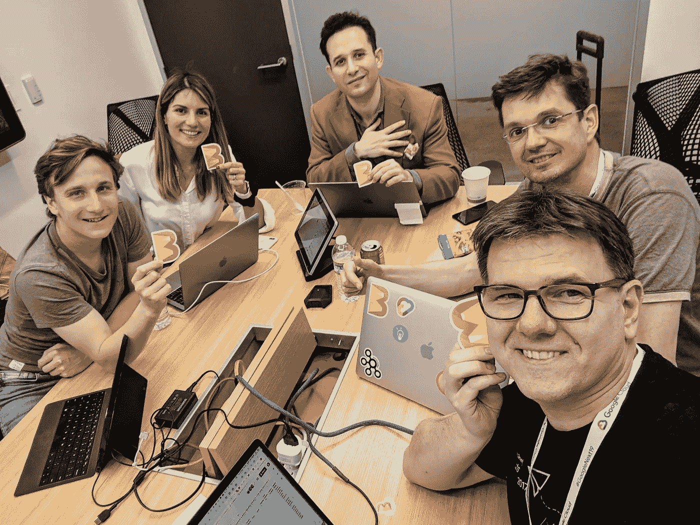

**Beam Summit organisation in the after hours**

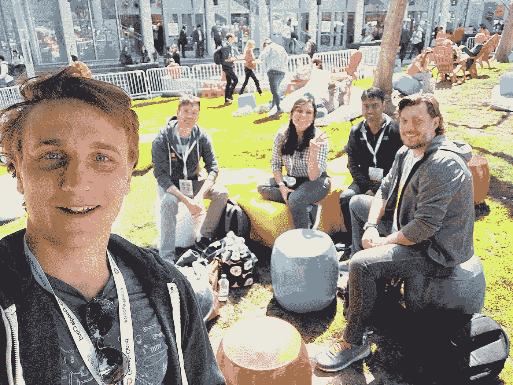

**Hanging out with (old and new) open-source friends!**

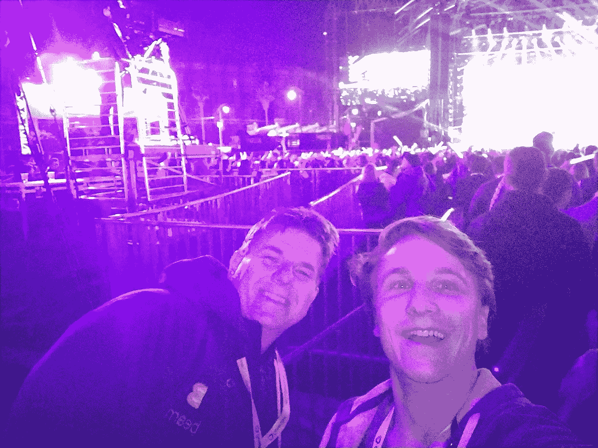

**Hanging out with Gwen Stefani**

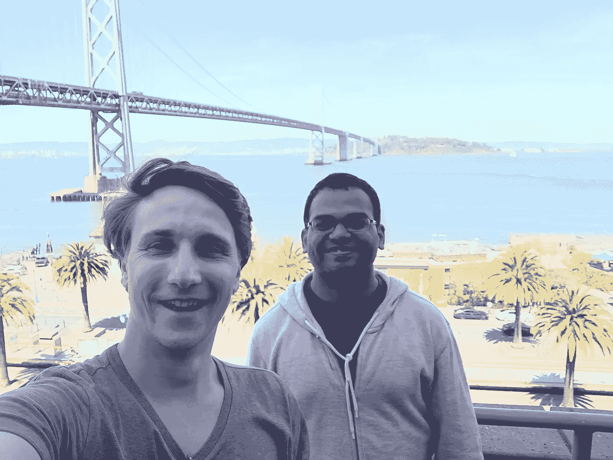

**Visiting the Google San Francisco offices and making more Apache Beam friends**

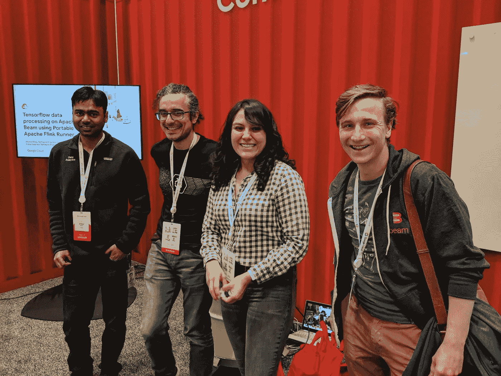

**Beam meetup in the Community Corner at DevZone**

# **包装完毕**

如果您有兴趣了解更多关于其他会议和谷歌云平台的信息，可以参考以下资源:

*   谷歌云博客每日总结:[第 1 天](https://cloud.google.com/blog/topics/inside-google-cloud/next19-recap-day1)，[第 2 天](https://cloud.google.com/blog/topics/inside-google-cloud/day-2-next-19-working-smarter-better-and-more-securely-cloud) & [第 3 天](https://cloud.google.com/blog/topics/inside-google-cloud/next19-recap-day3)
*   **Twitter** :在 Twitter 上开始关注 [Google Cloud](https://twitter.com/googlecloud) 和 [Google Cloud Platform](https://twitter.com/GCPcloud) 手柄。
*   你可以在 [**YouTube**](https://www.youtube.com/playlist?list=PLIivdWyY5sqIXvUGVrFuZibCUdKVzEoUw) 上查看 Google Cloud Next '19 sessions 的播放列表。
*   [谷歌博客](https://cloud.google.com/blog/topics/inside-google-cloud/100-plus-announcements-from-google-cloud-next19)很好地总结了 Google Cloud Next’19 发布的 122+条公告。
*   [Alexis Moussine-Pouchkine](https://twitter.com/alexismp)，谷歌 DevRel 团队的一员，每周撰写名为 TWiGCP 的博客(本周在谷歌云平台上)，他也为下一个 2019 年做了一篇:[点击](/google-cloud/twigcp171-c17a29deb0cf)。