# 谷歌云服务:关于 GCP 服务你需要知道的一切

> 原文：<https://medium.com/edureka/google-cloud-services-a633dd83e567?source=collection_archive---------2----------------------->

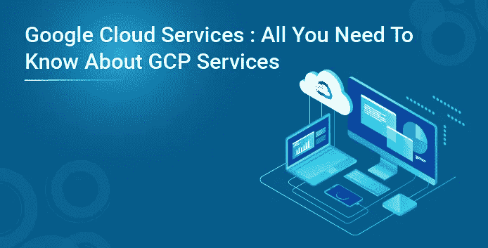

谷歌云服务是由谷歌提供的一套**计算、网络、存储、大数据、机器学习和管理服务**，运行在谷歌内部为其最终用户产品使用的相同云基础设施上，如谷歌搜索、Gmail、谷歌照片和 YouTube。它提供**各种各样的服务**，价格相当**惊人**。

在这篇谷歌云服务博客中，我将讨论:

*   谷歌云服务
*   计算服务
*   网络服务
*   数据库和存储服务
*   大数据服务
*   机器学习服务
*   身份和安全服务
*   管理和开发工具

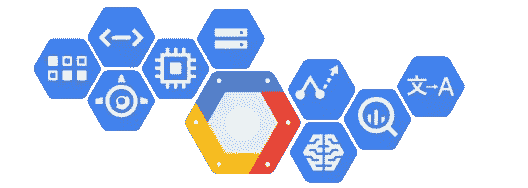

# 谷歌云服务

谷歌提供广泛的服务，从基本的云服务(如容器、计算引擎)到复杂的服务(如机器学习)以及各种物联网服务。那么，让我们逐一了解这些服务。

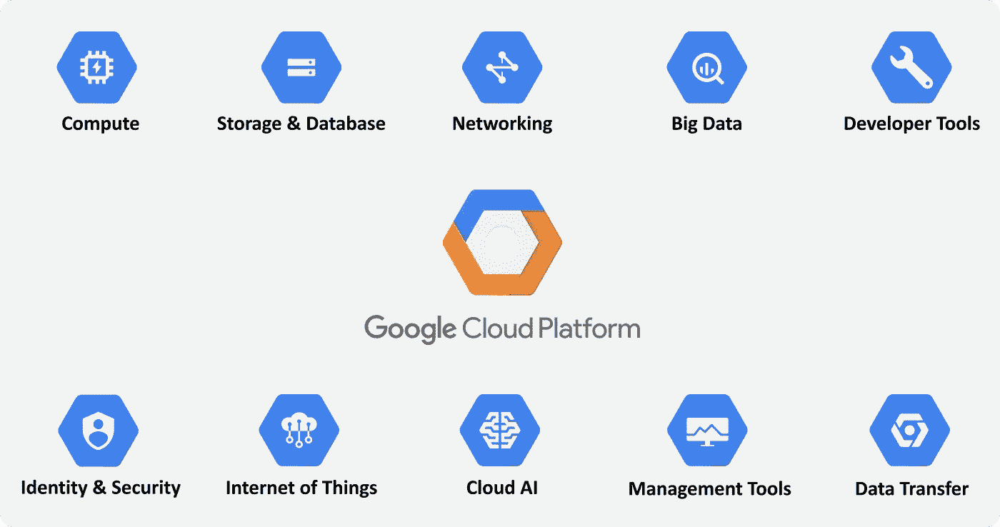

# 计算服务

谷歌云平台提供了一系列可扩展的计算选项。它提供了高度可定制的虚拟机，您可以定制这些虚拟机来满足您的需求，并选择直接或通过容器部署您的代码。

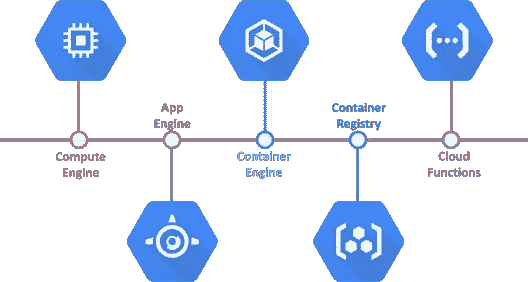

谷歌计算引擎:它提供在谷歌创新数据中心和全球光纤网络中运行的虚拟机。计算引擎虚拟机可快速启动，它们配有高性能持久和本地磁盘选项，可提供一致的性能。

**谷歌应用引擎:****应用引擎**作为一个平台，用于构建**可扩展的 web 应用**和物联网后端。App Engine 根据收到的流量自动扩展应用程序。它为您提供了内置的服务和 API，如数据存储、NoSQL、Memcache 和大多数应用程序通用的用户验证 API。

Google Kubernetes 引擎:它是一个强大的**集群管理器**和平衡系统，用于运行你的 Docker 容器。Kubernetes 引擎将您的容器调度到集群中，保持它们健康，并根据您定义的需求自动管理它们。

**Google Cloud Container Registry:**It**是一个**私有 Docker 仓库**，它与流行的连续交付系统一起工作。**

# **网络服务**

**网络是最重要的，也是最基本的谷歌云平台服务之一，由最先进的网络服务提供。**

**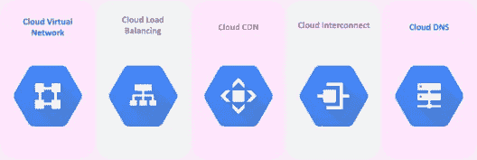**

****云虚拟网络:**你可以使用谷歌拥有的全球网络将各种 GCP 资源相互连接，并使用他们的**虚拟专用云(VPC)网络**将它们相互隔离。**

**让我们看看如何才能创建一个 VPC 网络。**

*   ****步骤 1:** 打开 GCP 的网络部分，点击创建 VPC 网络按钮。您将被重定向到此页面，在此您需要输入网络的名称和描述。**

**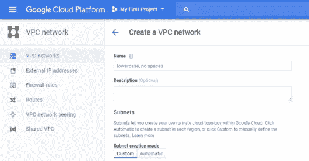**

*   ****第二步:**您可以选择子网创建模式— **【自定义或自动】。**自定义让您输入自己的**子网名称、区域和 IP 地址。**在自动模式下，您有一个子网列表和一个防火墙列表可供选择。**

****自定义模式:****

**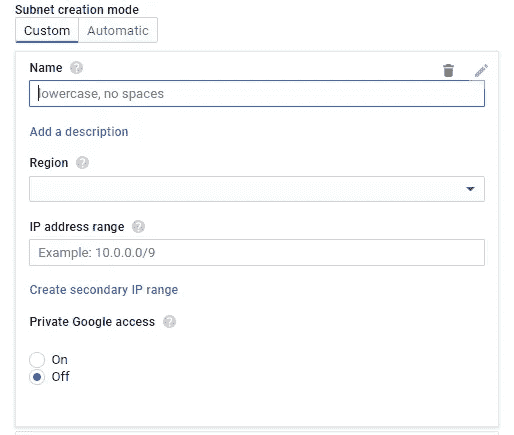**

****自动模式:****

**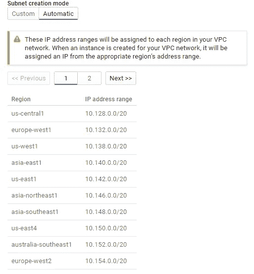**

****防火墙规则:****

**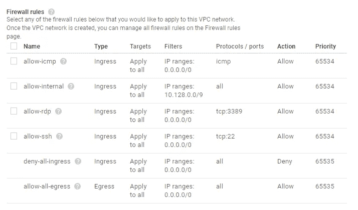**

****第三步:**接下来，您需要选择**路由模式**，根据您的需求，该模式可以是**区域性的，也可以是**全球性的。只需点击创建按钮，几分钟内您的网络就会启动并运行。**

**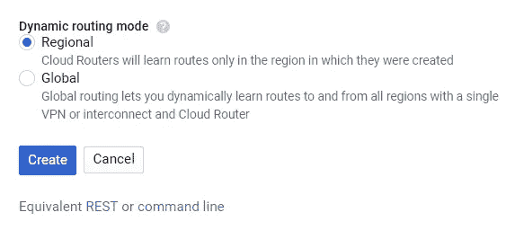**

**回到谷歌云网络服务，我们有:**

****谷歌云负载平衡:**它帮助你**根据你的需求扩展你的应用**。在靠近用户的单个或多个区域中平衡您的计算机器资源负载，以满足您的高可用性要求。**

****云 CDN(内容交付网络):**它使用谷歌的全球**分布式边缘缓存**来加速从谷歌计算引擎提供的网站和应用的内容交付。云 CDN 降低了网络延迟，卸载了源，降低了服务成本。**

****Google Cloud Interconnect:**Cloud Interconnect 允许云平台客户通过企业级连接连接到 Google，比他们现有的互联网连接具有更高的可用性和/或更低的延迟。**

****Google Cloud DNS:** 它是一个可扩展的、可靠的、可管理的权威**域名系统** (DNS)服务，运行在与 Google 相同的基础设施上。它具有低延迟、高可用性，是向用户提供应用程序和服务的一种经济高效的方式。**

# **存储和数据库服务**

**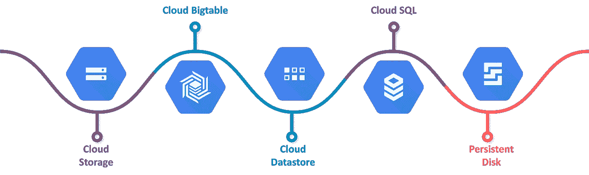**

****谷歌云存储:**它在谷歌范围内提供统一的产品。它既可以处理实时数据，也可以处理云归档解决方案。**

****Cloud SQL:** Cloud SQL 是一种完全托管的数据库服务，可以轻松地在云中设置、维护、管理和管理您的**关系型 MySQL 和 PostgreSQL 数据库**。**

****Cloud Bigtable:** 它提供了一个**大规模可扩展的 NoSQL 数据库**适合低延迟、高吞吐量的工作负载。它可以与流行的大数据工具(如 Hadoop 和 Spark)轻松集成，并支持开源的行业标准 HBase API。**

****Google Cloud Datastore:**Cloud Datastore 给你一个弹性的、高度可用的**面向文档的数据库**即服务。**

****持久磁盘**:是一种高性能**块存储**服务，适用于虚拟机和容器存储。它提供了无与伦比的**性价比。****

# **大数据服务**

**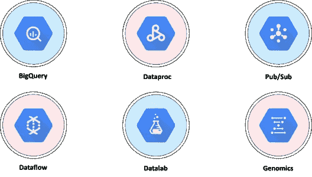**

****Google big query:**big query 是 Google 完全托管的低成本**分析数据仓库**。**

****Google Cloud Dataproc:** 它是一个托管的 Spark 和 Hadoop 服务，用于使用 Apache 大数据生态系统中强大的开放工具轻松处理大数据集。**

****Google Cloud data lab:**Cloud data lab 是一款交互式**笔记本(基于 Jupyter)** 用于探索、协作、分析和可视化数据。它与 BigQuery 和谷歌云机器学习相集成，让您轻松访问关键的数据处理服务。**

****Google Cloud Pub/Sub:** 它是一个无服务器、大规模、可靠的实时消息服务，允许你在独立的应用程序之间发送和接收消息。**

**现在继续我们的谷歌云服务博客，我们有机器学习和某些身份和安全服务以及某些管理和开发工具。**

# **机器学习服务**

**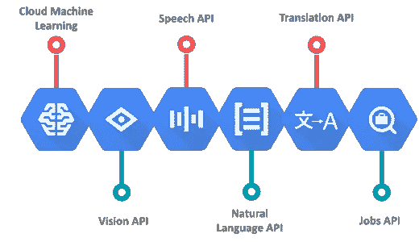**

****Cloud AutoML:** 它是一套**机器学习产品**，使机器学习专业知识有限的开发人员能够通过利用谷歌的神经架构搜索技术来训练高质量的模型。**

****谷歌云 TPU:** 云 TPU 是一个硬件加速器**家族**，谷歌专门设计和优化了它，以加速和扩展用 TensorFlow 编程的训练和推理的 ML 工作负载。**

****谷歌云机器学习引擎:**ML 引擎让你可以轻松构建复杂的大规模机器学习模型，涵盖从构建复杂的回归模型到图像分类的广泛场景。**

# **身份和安全服务**

**身份和安全属于谷歌云服务最重要的列表之一，知道你的数据是安全的，是加密的。**

****

****Google Cloud Identity &访问管理:** **IAM** 让管理员授权谁可以对特定资源采取行动，让您可以完全控制和查看集中管理云资源。**

****云安全扫描器:**是一款针对 App Engine 应用常见漏洞的 web 安全扫描器，包括跨站点脚本(XSS)、Flash 注入、混合内容(HTTPS 的 HTTP)、不安全库等。**

# **管理和开发工具**

**转到最后一组谷歌云服务，我们有一些管理工具。这些工具用于**监控**服务、**发现错误**、**调试**它们以及**跟踪**服务。**

**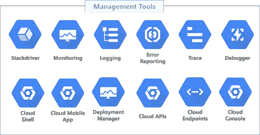**

****stack driver**在整个 GCP 提供实时监控和日志记录，以及有用的诊断工具。**

**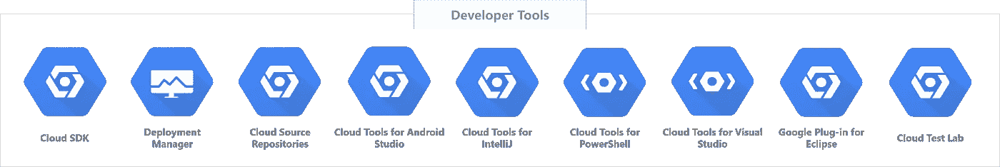**

**Google Cloud Platform 提供了一系列工具和库，可以帮助您更快地进行开发。**

****Google Cloud SDK** 是一组库和工具，您可以使用它们来管理托管在 Google 云平台上的计算资源和应用程序。借助 Cloud SDK，您可以使用交互式命令行工具来管理您的虚拟机、云 SQL 实例和部署。**

**伙计们，就是这样了！**

**我希望你喜欢这个**谷歌云服务**博客。如果你正在读这篇文章，那么恭喜你！你不再是谷歌提供的各种云服务的新手。如果你想查看更多关于市场最流行技术的文章，你可以参考 Edureka 的官方网站。**

**原文 p *发布于*[*https://www.edureka.co*](https://www.edureka.co/blog/google-cloud-services/)*2021 年*7 月*日。***