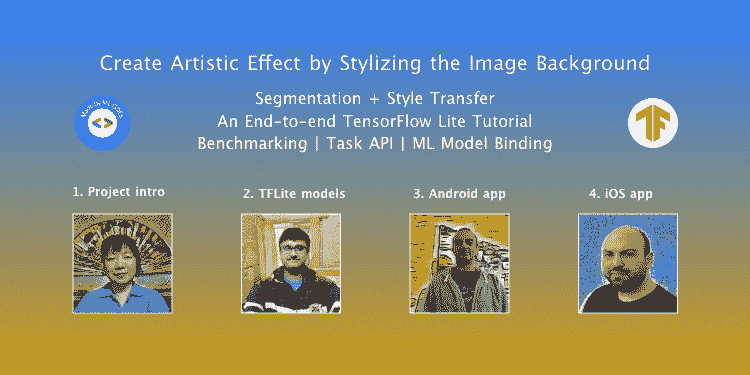
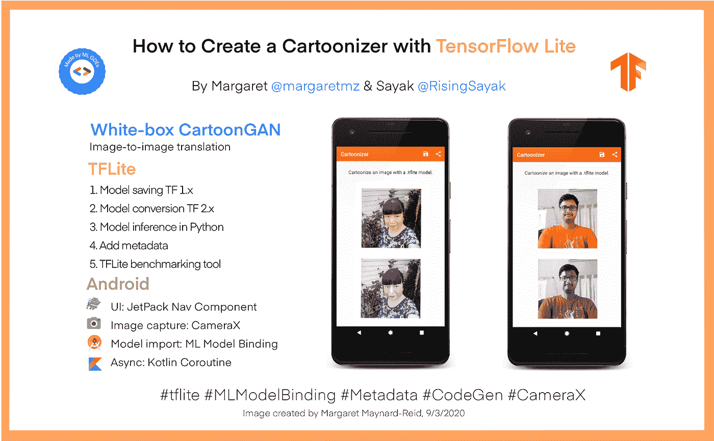
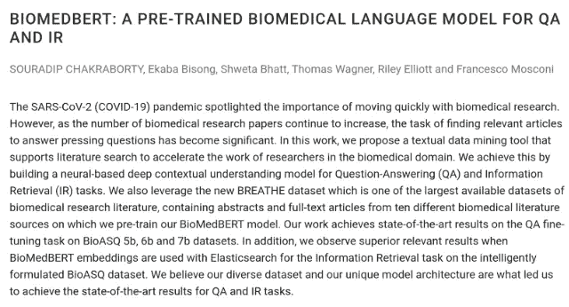
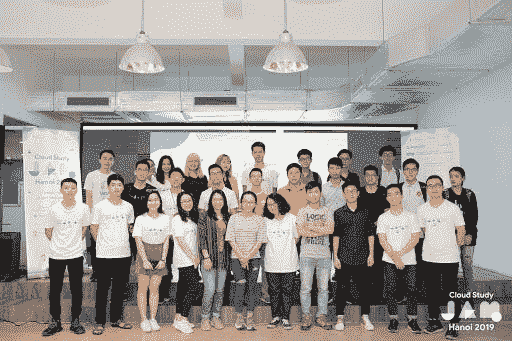
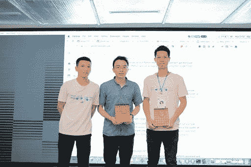
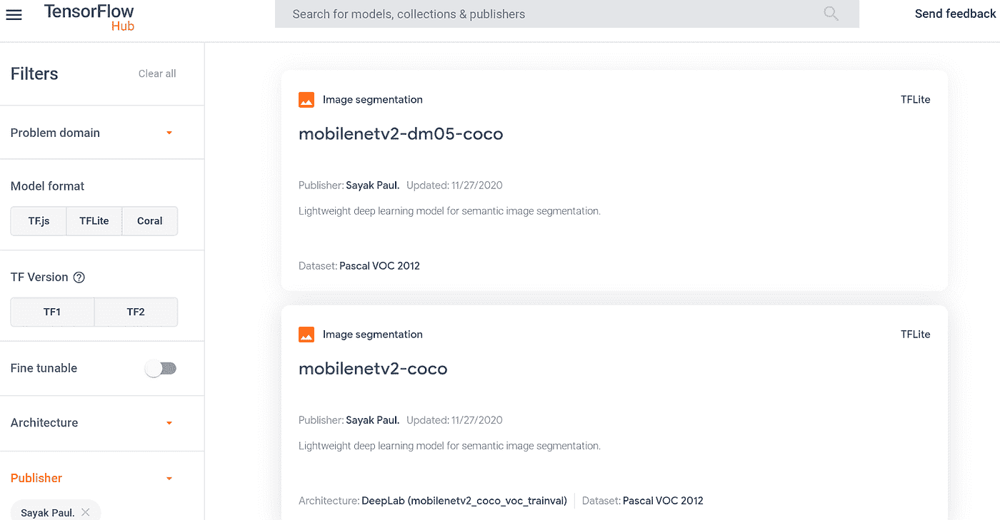
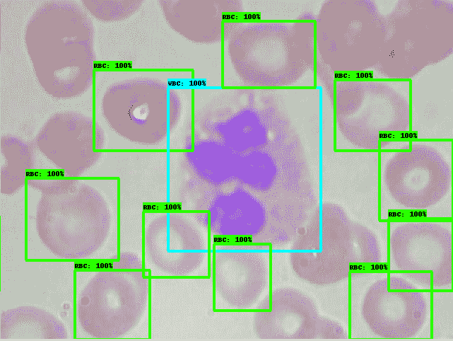

# 谷歌开发者专家:转变全球机器学习社区

> 原文：<https://medium.com/google-developer-experts/google-developers-experts-transforming-global-machine-learning-communities-a2537236cdd4?source=collection_archive---------3----------------------->

*作者* [*阿丽娜*](https://www.linkedin.com/in/alina-rakhmatoullina-8aa1b12a/) *和* [*孙文森*](https://www.linkedin.com/in/ksoonson/) *、谷歌开发者关系项目经理*

谷歌开发者专家计划是一个由专业开发者和思想领袖组成的全球社区，他们热衷于为本地开发者社区做贡献。每个 GDE 代表一种特定的谷歌技术。GDEs 开发应用程序，创建技术内容，并在全球行业会议上发言。全世界有超过 150 位机器学习和 TensorFlow 专家，这里是他们的一些惊人成就。

Margaret Maynard-Reid，Sayak Paul，George Souloupis，Patrick Halalabidis 合作制作图像背景风格化器( [intro](/google-developer-experts/image-background-stylizer-part-1-project-intro-d68c4547e7e3) ， [tflite](/@spsayakpaul/e614af91944d) ， [android](https://farmaker47.medium.com/android-part-of-create-artistic-effect-by-stylizing-an-image-segment-2a646da2d39a) ，ios 即将推出！)和 TFLite 团队一起。这将多个 ML 模型结合起来，通过分割图像来创建艺术效果，然后通过神经风格转移来设计图像背景。Margaret 和 Sayak 也发布了使用 TFLite 的[卡通化器](https://blog.tensorflow.org/2020/09/how-to-create-cartoonizer-with-tf-lite.html)和使用 TFLite 的[自我动画](/google-developer-experts/selfie2anime-with-tflite-part-1-overview-f97500800ffe)。

Souradip Chakraborty、Ekaba Bisong、Shweta Bhatt、托马斯·瓦格纳、Riley Elliott 和 Francesco Mosconi 的论文“BioMedBERT:一种用于 QA 和 IR 的预训练生物医学语言模型”在 [COLING 2020](https://coling2020.org/pages/accepted_papers_main_conference.html#) (自然语言处理的一级会议)上作为全文被接受。这是由 ML GDEs 与 TensorFlow Research Cloud 和 Google Cloud 团队合作的 [AI vs. COVID 项目](https://cloud.google.com/blog/products/ai-machine-learning/google-ai-community-used-cloud-to-help-biomedical-researchers)的继续努力。

越南的 Ngoc Ba 启动了 [TensorFlow 越南用户组](https://www.facebook.com/gdgtensorflowvietnam/)为当地 AI 社区举办研讨会。Ngoc 与用户组一起运营项目 [ProtonX](https://protonx.ai/tf) ，这是一个教育平台，在这里他开发了完全用越南语的[课程，以帮助学生学习 ML 和 TensorFlow。他感到自豪的是，许多越南开发人员从课程中受益，包括 30 名通过](https://www.youtube.com/watch?v=j5HxIJoOJms&list=PLMm4sOMuA2QI5x_0KlNT3LuKDi6-ByboB) [TensorFlow 开发人员证书](https://www.tensorflow.org/certificate)的开发人员。

印度的 Sayak Paul 使用 TF Object Detection API 创建了[血细胞检测项目。由于他在谷歌开发者关系和 TensorFlow 团队之间的合作，Sayak Paul 还获得了“谷歌开源同行奖金”，他在 TF Hub 发布图像分割模型方面做出了许多贡献，实现了](https://github.com/sayakpaul/Blood-Cell-Detection-using-TFOD-API/) [EAST:一个高效和准确的场景文本检测器](https://arxiv.org/abs/1704.03155)和[编码器-解码器，具有用于语义图像分割的阿特鲁可分离卷积](https://arxiv.org/abs/1802.02611)。

Merve Noyan 喜欢在土耳其 ML&AI 社区与他人分享 ML。今年，她在土耳其 YouTube 频道组织并主持了“用 TensorFlow 和 Rasa 制作自己的聊天机器人”主题系列。她还专注于增加女性在人工智能社区的存在，在几个[dev fest](https://www.youtube.com/watch?v=F7DnGLkxwi8&ab_channel=GoogleDeveloperCommunitiesTurkey)上发表演讲，并通过分享她们的故事将女性人工智能从业者聚集在一起，作为土耳其各地的榜样。

要了解更多关于专家社区及其所有全球开源 ML 贡献的信息，请查看 [GDE 目录](https://developers.google.com/community/experts/directory)并在 Twitter 和 LinkedIn 上联系 GDEs。