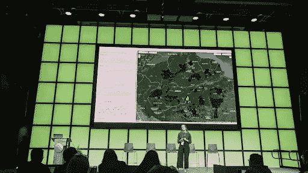

# 谷歌地球引擎 uses 丽莎·戈德堡利用科技对抗气候变化

> 原文：<https://medium.com/google-developer-experts/google-earth-engine-gde-liza-goldberg-uses-tech-to-fight-climate-change-6bd80e77ac9c?source=collection_archive---------3----------------------->

*Liza Goldberg, Google Earth GDE*

由凯蒂·金德·沃格尔撰写

*凯文·埃尔南德斯审核*

丽莎·戈德堡(Liza Goldberg 岁时学会了通过谷歌地球引擎(Google Earth Engine)编写代码，当时她在美国国家航空航天局(NASA)实习，她的导师介绍了这一工具，将其作为模拟全球环境变化趋势的一种方式。Liza 来到 NASA 时没有任何编码或遥感经验，但由于强大的导师、谷歌培训和谷歌地球引擎开发者社区的指导，她逐渐掌握了该平台的专业知识。事实上，谷歌地球引擎是为科学家打造的，并具有明显的世界影响，这与 Liza 利用技术应对气候变化的承诺相一致。“地球引擎使我能够编写每一行代码，因为我知道我的算法最终会真正改变气候监测，”她说。“Earth Engine 以可视化为重点的界面向我展示了编码可以是简单的、以数据为重点的，并且对气候科学的所有领域都有广泛的影响。”

*Liza Goldberg speaking at the Geo for Good Summit*

# **成为 GDE**

Liza 在 NASA 实习期间使用地球引擎多年，后来成为兼职研究职位。2022 年，她在谷歌地球引擎团队的长期合作者泰勒·埃里克森提名丽莎参加 GDE 计划，她于 2022 年 4 月成为 GDE。

“当我得知我被提名时，我确实感到怀旧，”她说。“我记得我 14 岁时第一次打开地球引擎时的兴奋——整个世界突然对我开放。成为 GDE 感觉就像回到了原点；在很多方面，我是伴随着地球引擎长大的。”

丽莎希望她在 GDE 的角色能鼓励其他年轻学生探索新技术。

“我希望我作为 GDE 的职位可以向其他年轻学生——尤其是女性——展示，一开始对某个领域一无所知，并不一定会成为你实现最终目标的障碍，”她说。“作为北美最年轻的女性 GDE，我希望打破阻碍其他年轻女性在男性主导的舞台上追逐激情的障碍。”

在 GDE 的职位上，Liza 与谷歌印度和印度理工学院(IIT)合作，在全国范围内开展一系列谷歌地球引擎培训，培养下一代气候科学家的技术能力。

“我们将指导学生基本的地理空间技能，让他们为来年与合作保护组织的奖学金做好准备，”她说。“我很乐观，这个项目可以将 Earth Engine 的先进计算能力分配给学生，他们可以利用其工具实现地方到国家范围的变化。”

# 在国家航空航天局工作

Liza 继续在美国国家航空航天局从事全球红树林生态系统脆弱性的长期工作，分析各种红树林保护和治理模式对森林干扰程度的影响。Liza 和她的 NASA 同事在西非度过了一个夏天，完成了基于红树林的野外工作，并为该地区的学术和保护机构提供了 Google Earth 引擎培训。

Liza 目前还在美国航天局领导亚特兰蒂斯项目，这是一项全球倡议，旨在使地球上最易受气候影响的人口发展社区灾害应对能力。

“我们正在使用谷歌地球引擎来绘制社区从即将到来的气候灾害中恢复的关键障碍，使援助组织能够更有效地在正确的社区针对正确的压力源，”她说。“我们目前正在对极易遭受洪灾的社区进行早期预警系统部署和家庭灾难准备及应对方面的培训。”

她的团队还与印度的非政府组织合作，对社区进行灾后援助权利的教育。

# 在斯坦福大学学习

Liza 也是一名大学生，在斯坦福大学学习地球系统和国际发展政策。

“我试图更好地理解气候变化如何进一步将极端贫困人口困在经济增长滞后的循环中，”她说。“然后，我将把我的遥感知识与这一政策和气候变化背景结合起来，为发展中国家的气候适应开发新的解决方案。”

最终，Liza 寻求利用技术帮助地球上最易受气候影响的人群最有效地应对气候影响。

“我发现卫星分析是应对这些挑战的最有效方法之一，但我爱上了这个问题，而不是任何特定的解决方案，”她说。“在我的职业生涯中，我寻求继续应用卫星技术来建立技术能力和地面需求之间的关键桥梁。”

*在* [*LinkedIn*](https://www.linkedin.com/in/liza-goldberg-5758a020b/) *上了解更多 Liza。*

[*谷歌开发者专家(GDE)计划*](https://developers.google.com/community/experts) *是一个由经验丰富的技术专家、影响者和思想领袖组成的全球网络，他们通过在活动中发言和发布内容来积极支持开发者、公司和技术社区。*