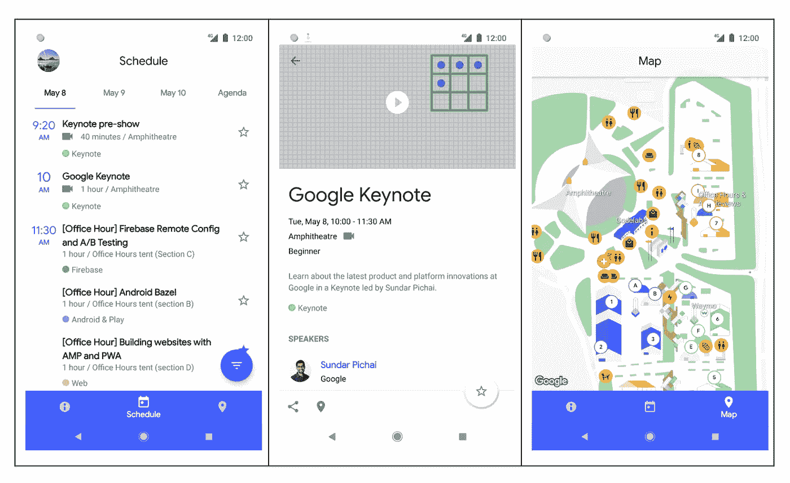
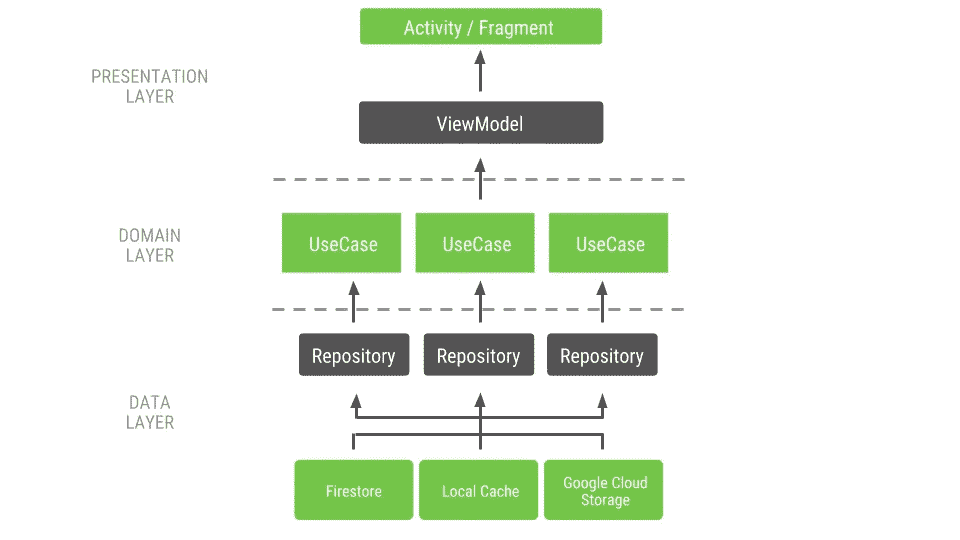

# Google I/O 2018 应用程序—架构和测试

> 原文：<https://medium.com/androiddevelopers/google-i-o-2018-app-architecture-and-testing-f546e37fc7eb?source=collection_archive---------3----------------------->

Illustration by [Virginia Poltrack](https://twitter.com/VPoltrack)

Google I/O 应用程序是一个开源项目，它显示了年度 Google I/O 会议的日程和信息。它面向活动的参与者和远程观众。

今年我们有机会从头开始。我们可以选择工具，考虑应用程序架构的整体设计。什么是最好的建筑？使您团队中的开发人员最具生产力的方法。他们应该能够在不重新发明轮子的情况下工作，专注于用户特性。此外，开发人员应该能够获得关于他们工作的及时反馈。开发这款应用的大多数团队成员都是 20%的人——谷歌人将 20%的时间投入到这个项目中——他们来自不同的团队、背景和时区，这是做这些决定时需要考虑的因素。

# 体系结构

由多元化团队开发的项目需要关于如何面对共同问题的明确指导方针。例如，开发人员需要一种方法让**脱离主线程**。提供一个框架来始终如一地做到这一点是有意义的。此外，一个好的架构应该很难被打破:定义应用程序的**层**并清楚地描述它们的关系，避免错误并简化代码审查。

我们从 [Clean Architecture](https://8thlight.com/blog/uncle-bob/2012/08/13/the-clean-architecture.html) 中获取概念来解决这两个问题(分层和后台执行)。该应用程序分为三层结构:

*   表示层(视图和视图模型)
*   领域层(用例)
*   数据层(存储库、用户管理器)

表示层不能直接与数据层对话。一个视图模型只能通过一个或多个用例到达一个存储库。这个限制确保了独立性和可测试性。这也带来了一个跳到后台线程的好机会:所有用例都在后台执行，保证 UI 线程上不会发生数据访问。

General architecture of the app

## 表示层:视图+视图模型+数据绑定

视图模型通过 [LiveData](https://developer.android.com/topic/libraries/architecture/livedata) 向视图提供数据。实际的 UI 调用是通过 [**数据绑定**](https://developer.android.com/topic/libraries/data-binding/) 完成的，将活动和片段从样板文件中释放出来。

我们使用一个**事件包装器**来处理事件，它被建模为 UI 状态的一部分。在这篇博文中阅读更多关于这种模式的内容。

## 领域层:用例

领域层围绕着[用例](https://github.com/google/iosched/blob/master/shared/src/main/java/com/google/samples/apps/iosched/shared/domain/UseCase.kt)类，这个类经历了很多迭代。为了避免[回调地狱](https://www.google.es/search?q=callback+hell)，我们决定使用 LiveData 来公开用例的结果。

默认情况下，用例在一个`[DefaultScheduler](https://github.com/google/iosched/blob/master/shared/src/main/java/com/google/samples/apps/iosched/shared/domain/internal/TaskScheduler.kt#L38)`(一个 Kotlin `object`)上执行，稍后可以从测试修改为同步运行的[。我们发现这比处理一个定制的 Dagger 图来注入一个同步调度器更容易。](https://github.com/google/iosched/blob/master/mobile/src/test/java/com/google/samples/apps/iosched/test/util/SyncTaskExecutorRule.kt)

## 数据层

该应用处理了 3 种*类型*的数据，考虑到它们变化的频率:

*   从不改变的静态数据:地图、议程等。
*   每天更改 0-10 次的数据:日程数据(会话、演讲者、标签等。)
*   即使没有用户交互也不断变化的数据:预订和会话主演

app 的一个重要要求是**离线支持**。用户应该在第一次运行时就可以获得每一条数据，即使是在 Wi-Fi 连接不稳定的情况下(我们不能假设场馆有完美的覆盖，我们应该假设许多游客会关闭他们的漫游数据)。

静态数据是硬编码的。例如，agenda 存储库最初是一个嵌入式 JSON 文件，但是它非常静态，为了简单和性能，我们将其转换为 Kotlin。

会议数据来自一个相对较大的 JSON 文件(大约 600Kb 未压缩)。它的初始版本包含在 APK 中，以实现完全的离线支持。每当用户刷新时间表时，或者当应用程序收到请求刷新的[**Firebase Cloud Messaging**](https://firebase.google.com/docs/cloud-messaging/)信号时，应用程序会从静态 URL 下载新数据。会议数据被下载到由[作业调度器](https://developer.android.com/reference/android/app/job/JobScheduler)管理的作业中，以确保用户的数据被负责任地使用。

使用 [**OkHttp**](http://square.github.io/okhttp/) 缓存下载的 JSON，这样下次启动应用程序时，就会使用缓存的版本，而不是引导文件。这种方法使我们不必直接处理文件。

对于用户数据(预订、会话启动、上传 Firebase 令牌等。)我们用的是 [**Firestore**](https://firebase.google.com/docs/firestore/) ，这是一个 NoSQL 云数据库。它带有离线支持，因此我们能够毫不费力地在 Android、web 和 iOS 之间同步用户数据。

使用 [**Firebase 认证**](https://firebase.google.com/docs/auth/) 实现了登录支持。一个`[AuthStateListener](https://firebase.google.com/docs/reference/android/com/google/firebase/auth/FirebaseAuth.AuthStateListener)`使用一个 LiveData observable 来指示当前用户何时改变(例如，从注销到登录)。

# 库和工具

我们决定避免使用不稳定的依赖关系，所以没有使用[协程](https://kotlinlang.org/docs/reference/coroutines.html)、[导航](https://developer.android.com/topic/libraries/architecture/navigation/)组件和[工作管理器](https://developer.android.com/topic/libraries/architecture/workmanager)。

除了前面已经讨论过的工具之外，值得一提的还有:

*   [依赖注入的 Dagger2](https://github.com/google/dagger)
*   [木材](https://github.com/JakeWharton/timber)用于伐木
*   [Gson](https://github.com/google/gson) 用于 JSON 解析
*   用于处理日期和时间
*   [防撞系统](http://try.crashlytics.com/)

我们广泛使用了 LiveData 来创建一个反应式架构，其中所有的东西都被连接起来，所以当数据改变时 UI 会自动更新。在这篇[文章](/google-developers/livedata-beyond-the-viewmodel-reactive-patterns-using-transformations-and-mediatorlivedata-fda520ba00b7)中，你可以找到更多关于使用 ViewModel 之外的 LiveData 的信息。

# 梯度模块和代码组织

良好的模块化策略对于良好的开发体验至关重要。事实上，依赖性问题通常是糟糕的架构或模块化方法的标志。我们创建了以下模块:

*   `model`:包含应用程序中使用的实体
*   `shared`:业务逻辑和核心类
*   `mobile`:移动应用，包括活动、片段、视图模型和 UI 相关的类，如数据绑定适配器、BottomSheetBehavior 等。
*   `tv`:安卓电视应用
*   `test-shared`:所有模块中所有单元测试使用的测试数据
*   `androidTest-shared`:所有模块中所有 UI 测试要使用的实用程序

这里的一般规则是创建尽可能多的模块来改进封装，通常会导致更快的增量构建。在我们的例子中，`shared`和`mobile`模块可以进一步分割。

# 测试和口味

在特性开发之前，为了使应用程序可测试，投入了大量的精力。开发人员只有在他们所做的事情能够得到早期反馈的情况下才是高效的，而不是依赖于其他人。

## 单元测试

架构和模块化方法允许良好的测试隔离、伪造依赖和快速执行。域和数据层都经过了广泛的单元测试。只有表示层中的一些 util 类经过了单元测试。

我们最初没有在项目中添加 [Mockito](https://site.mockito.org/) 来避免嘲笑。我们尽可能使用接口，伪造测试中的依赖关系，这比模仿要干净得多。然而，最终[添加了](https://github.com/google/iosched/commit/efd6167da84c184d7ba707b29a39b1e68b9bbf11)mock ITO 来创建外部依赖的模拟。我们使用了 [Mockito-Kotlin](https://github.com/nhaarman/mockito-kotlin/) 来获得更地道的体验。

我们使用了一个内部持续集成工具，它拒绝了破坏构建或单元测试的变更列表。在一个有这么多贡献者的项目中，这是至关重要的，当有多个变体时尤其重要，因为 Android Studio 只构建活动的一个。对于 Github，我们添加了 [Travis CI](https://github.com/google/iosched/blob/master/.travis.yml) 。

## UI 测试

我们确保 [Espresso](https://developer.android.com/training/testing/espresso/) 不需要[空闲资源](https://developer.android.com/training/testing/espresso/idling-resource)，因此用例框架提供了一种设置同步任务执行器的方法。此外，我们确保测试将密封运行:使用假货，以避免使用不可靠的依赖，如网络。首选项、时间和任务调度程序都是使用 JUnit 规则从测试中修改而来的，这提供了稳定性和可重复的测试。

UI 测试只在`staging`风格上运行。这个应用程序的特殊变种总是假装一个登录的用户，不发出任何网络请求。手动测试应用程序时，这也有助于加快迭代速度。

当 UI 处于繁重的开发中时，维护 UI 测试可能是一种负担。我们计划在整合了 UI 设计之后引入它们。然而，UI 测试被延迟了，我们发布了第一个没有合适套件的版本。这导致了生产中的几次[崩溃](https://github.com/google/iosched/issues/268)，这些崩溃本可以通过在 [Firebase 测试实验室](https://firebase.google.com/docs/test-lab/)上简单地运行一条快乐路径(只关心正常操作，而不关心不太频繁的交互的测试)来避免。

在一个理想的世界中，我们不需要仅仅为了测试而修改我们的*可发布的*代码，但是我们确实需要做一些改变:

*   我们必须添加一种方法来禁用 [BottomSheetBehavior](https://github.com/google/iosched/blob/master/mobile/src/main/java/com/google/samples/apps/iosched/widget/BottomSheetBehavior.kt#L210) 类中的动画，因为它不使用任何动画框架(所以动画不会自动禁用)。
*   我们不得不添加一个函数，当某个动画在 [EventFilterView](https://github.com/google/iosched/blob/master/mobile/src/main/java/com/google/samples/apps/iosched/ui/schedule/filters/EventFilterView.kt#L255) 类中完成时执行。

将我们的架构分成不同的层，并记录每一层的责任，这对我们分布式的贡献者团队来说效果很好。例如，强制使用用例框架从存储库层检索数据使得脱离主线程成为默认行为，避免从一开始就引入 jank，而不是在以后不得不追踪它。还有，大多数测试问题都是伪装的架构问题；打下一个良好的基础对于构建一个合理的测试体验是必不可少的。

Iosched 是一款拥有真实用户的真实应用，并且有一个非常真实的截止日期。因此，我们希望在一些领域继续努力，以保持代码库的健康、可维护性，并使其成为更好的示例应用。例如,`[ScheduleViewModel](https://github.com/google/iosched/blob/master/mobile/src/main/java/com/google/samples/apps/iosched/ui/schedule/ScheduleViewModel.kt)`是有机生长的，可以用来分解。我们计划公开改进该应用程序，添加新的架构组件，修复问题，重构和增加代码覆盖率。

如果您发现问题或想要为项目做出贡献，请随时打开[问题](https://github.com/google/iosched/issues)！