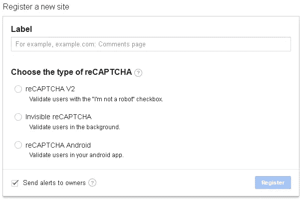
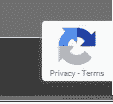

# 用 Oracle JET 实现 Google Recaptcha

> 原文：<https://medium.com/oracledevs/google-recaptcha-and-oracle-jet-4dd17a8a6a20?source=collection_archive---------0----------------------->

当我接近我的客户面向 JET 的网站的终点线时，我不得不做的最后一项任务是“保护服务器”。

其中一部分意味着在我的搜索表单上放置一个安全措施，这样它就不会被自动化滥用。谷歌 reCAPTCHA 非常适合这一点。谷歌现在也使用隐形模式，这意味着用户不必做任何事情。

# 谷歌 reCAPTCHA

如果你前往[https://www.google.com/recaptcha/](https://www.google.com/recaptcha/intro/)你可以创建你的 API 密匙。

这就像多年来一样，所以这里没有变化…除了一件事:隐形 reCAPTCHA



一旦你创建了你的密钥，就该把它插入 JET 了。

# 在 Oracle JET 中使用 reCAPTCHA

**添加 URL 作为库**

首先，我们需要将 reCAPTCHA 添加到 require 路径中，这样我们就可以在需要时调用它。所以在 main.js 文件中:

```
$projectRoot/src/js/main.js
```

在*路径中添加以下内容:*对象，如下所示:

`paths:
//injector:mainReleasePaths
{
**‘googlerecaptcha’:’**[**https://www.google.com/recaptcha/api.js?onload=onloadCallback&render=explicit'**](https://www.google.com/recaptcha/api.js?onload=onloadCallback&render=explicit')**,**
‘knockout’: ‘libs/knockout/knockout-3.4.0.debug’,
‘jquery’: ‘libs/jquery/jquery-3.1.1’,
‘jqueryui-amd’: ‘libs/jquery/jqueryui-amd-1.12.0’,
‘promise’: ‘libs/es6-promise/es6-promise’,
‘hammerjs’: ‘libs/hammer/hammer-2.0.8’,`

你会注意到，我们使用 explit 方法将 reCAPTCHA 附加到页面上，当我试图弄清楚这一切时，这给我带来了一些严重的痛苦。如果您正在使用它(您应该这样做),那么此时将它添加到发布路径中可能是明智的。)

**在您的模型中使用 reCAPTCHA**

这里是我的乐趣开始的地方。默认情况下，Google reCAPTCHA 希望用类`g-recaptcha`绑定到一个按钮或 div，并且本质上绑定到它。然而，在单页应用程序(SGA)中，这种情况不会发生，因为视图模型在视图之前运行。这就是我们之前使用`render=explit`的原因。

我们还提供了另一个参数，`onload=onloadCallback.`,这样我们可以自己手动处理 reCAPTCHA 附件。

因此，在视图模型中创建一个函数，实现 reCAPTCHA 的 onload 功能:

```
onloadCallback=function(a){grecaptcha.render('**submit**', {
                      'sitekey'  : 'YOUR_API_KEY',
                      'callback' : onSubmit
                  },true);
}
```

这将把 reCAPTCHA 代码的运行附加到一个 id 为`submit.`的元素上。还提供了一个回调方法`onSubmit` ，一旦 reCAPTCHA 完成，这个方法就会被调用。

为了回放，当我单击表单提交按钮(id 为' submit ')时，reCAPTCHA 将运行并自动检查我是否是机器人。如果成功，那么`onSubmit` 将被调用，它将生成的令牌作为参数传入，用于服务器端验证。如果 reCAPTCHA 认为我不是一个人，我得到的挑战是在写作的时候选择有特定目标的方块。

为了结束模型代码，`onSubmit` 方法看起来像这样:

```
onSubmit=function(token){
        console.info("google recatpcha onSubmit",token) //do validation/application code using token
}
```

所以 reCAPTCHA `onSubmit` 函数现在是您进入应用程序的入口点。

**查看代码**

在模型中，我们将 reCATPCHA 附加到 id submit 按钮上。定义如下:

`<button id=”submit” data-bind=”ojComponent: {
component: ‘ojButton’,
label: ‘Send’}”/>`

您会注意到这里没有 click 事件处理。这是因为 reCAPTCHA bind 为我们做了这一切。

# 从这里去哪里

当运行你的应用程序时，你应该在应用程序的右下角看到 reCAPTCHA 横幅，告诉你它正确加载。如果您没有看到这一点，然后检查您的控制台；可能你的 API 不允许你的域名。



reCAPTCHA loaded successfully

您现在应该扩展`onSubmit` 方法来调用您的应用程序代码，确保将令牌发送到您的服务器，在那里您可以验证它。在验证该令牌之前，您不应该在服务器上做任何工作。

我的后端验证看起来很松散，如下所示(NodeJS):

```
var data = {secret: grecaptcha, response: recaptchaToken}
  request.post({
       url:"[https://www.google.com/recaptcha/api/siteverify](https://www.google.com/recaptcha/api/siteverify)",
       form: data})
  .then(function (e){
      //recaptcha service called...check result
      var resp = JSON.parse(e);
      if (resp.success == false){
        console.info("recaptcha token outcome is false")

      } else {
        console.info("recaptcha token validated")
      } })
```

请求的数据包含两个参数:`secret` 和`response.``secret`来自您在 Google 内部的 API 帐户。`response` 是您从前端的`onSubmit` 调用中收到的令牌，它应该已经被传递到您的 API 中。

我们在这里做的是要求 Google 验证给定的令牌是有效的，而不是伪造的。否则任何机器人都可以传入令牌并调用我们的 API。

# 外卖食品

使用不可见的 reCAPTCHA 很容易出错，但是一旦实现，它会为你提供一些保护来抵御编程攻击/僵尸程序，从而拯救你的 API。

——杰森·斯卡夫::[格里菲斯·韦特](http://www.griffiths-waite.co.uk)