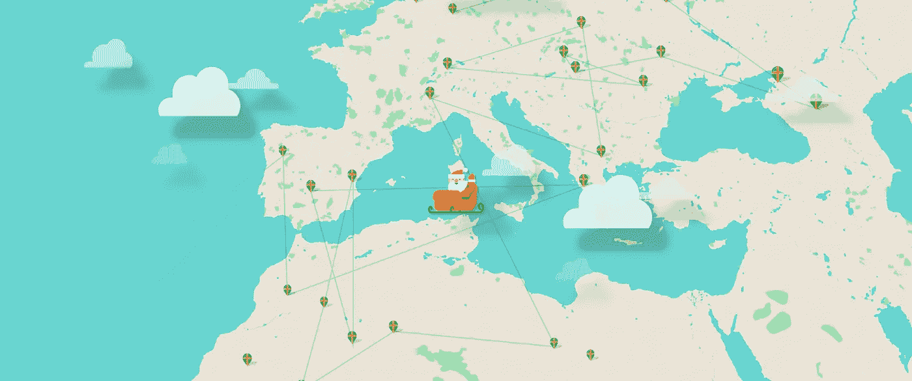
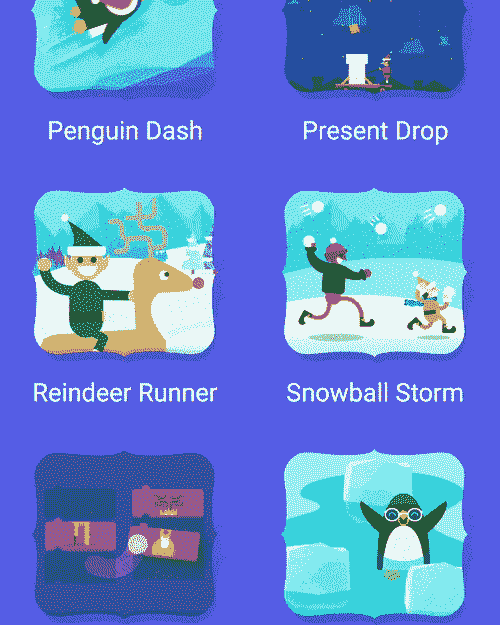
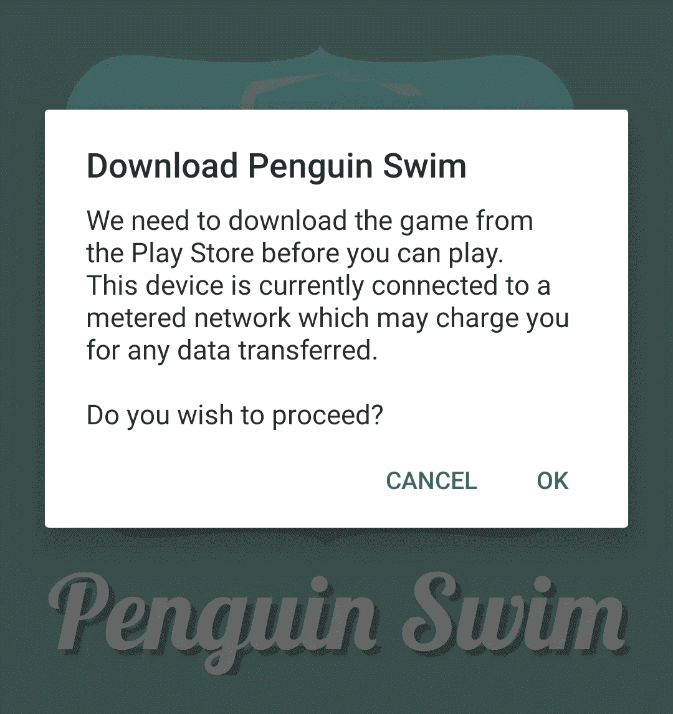
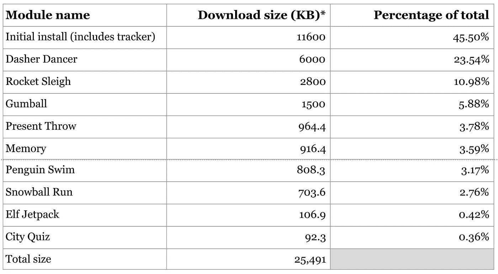
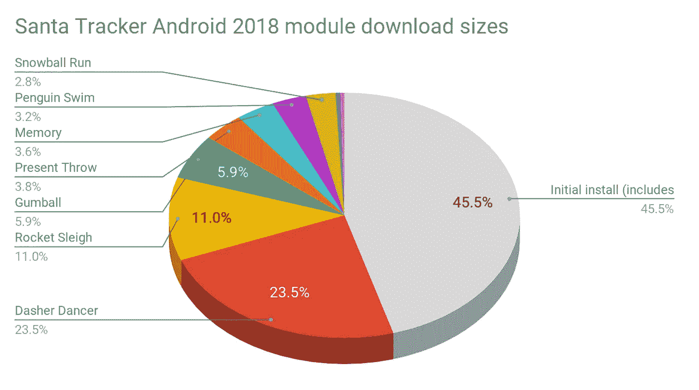
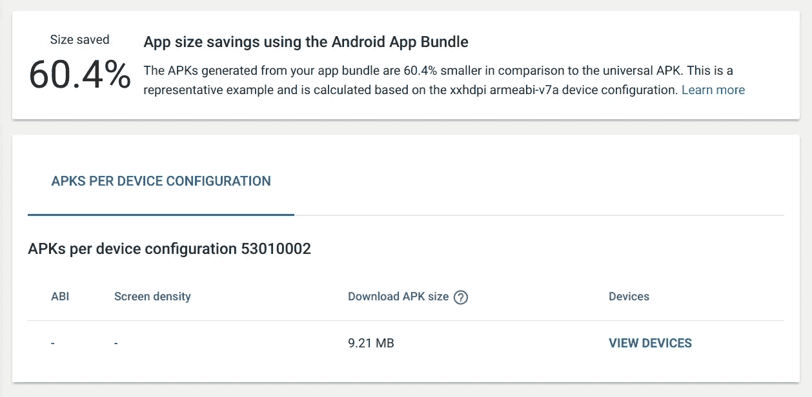

# 谷歌圣诞老人追踪器——转向安卓应用捆绑包

> 原文：<https://medium.com/androiddevelopers/google-santa-tracker-moving-to-an-android-app-bundle-dde180716096?source=collection_archive---------5----------------------->

*本文是探索 2018 年谷歌圣诞老人追踪安卓应用改进的系列文章中的第一篇。*

圣诞老人追踪器是谷歌每年发布的一款应用，允许用户在圣诞老人环游世界时追踪他。不幸的是，圣诞老人追踪器近年来规模急剧增长，导致 2017 年下载量高达 60MB**。我们最近假日季的目标是大幅减少这种情况，这篇文章讲述了我们是如何做到的。**

如果你使用过[谷歌圣诞老人追踪器安卓应用](https://play.google.com/store/apps/details?id=com.google.android.apps.santatracker)，你会知道它有两个主要功能,“追踪器”允许用户追踪圣诞老人在世界各地的旅程，以及一系列小游戏，可在整个 12 月玩，旨在帮助用户融入节日气氛🎄。

“追踪器”是这款应用的主要功能，也是我们使用最多的地方。该功能实际上只在圣诞节(12 月 24 日)前的 26 小时*内可用，在此期间，追踪器是使用最多的功能。给你一个数字的概念，37%的屏幕浏览(12 月)发生在 12 月 24 日，超过 65%的屏幕浏览发生在当天。

那么为什么这很重要呢？了解了我们的主要功能后，我们就可以思考应用程序的哪些部分在初始安装中是至关重要的，哪些部分是次要的，可以被拆分成独立的模块，这些模块可以动态安装，从而使我们的初始安装变得更小。2017 年的应用程序是作为一个单一的 APK 发布的，它包含了一切，包括所有的游戏，即使用户没有玩它们。

我们知道圣诞老人追踪者是时候节食了，所以我们设定了一个目标，将我们的初始下载大小缩小到仅仅 10MB😥。

你为什么问这个尺寸？事实证明，它的转化率比 100MB 大小的应用程序高 30%。圣诞老人追踪器不是一个我们可以追踪转化率的应用程序，但是很多应用程序都可以。10MB 也是一个很低的尝试和实现的目标，看看它是否可能。关于这背后的统计数据的更多信息，请阅读来自 [Google Play 团队](https://medium.com/googleplaydev)的文章:

 [## 缩减 apk，增加安装

### 你的应用的 APK 大小如何影响安装转化率

medium.com](/googleplaydev/shrinking-apks-growing-installs-5d3fcba23ce2) 

# 动态交付

你可能听说过新的 [Android 应用捆绑](https://developer.android.com/platform/technology/app-bundle/)格式，它允许 Google Play 商店动态提供一个定制的应用，只包含与设备相关的部分。这对我们来说是容易的第一步。通过简单地上传 AAB (Android 应用捆绑包)而不是 APK，我们立即设法将下载大小减少了近 **20%** 到 **48.5MB** (从 60MB)。对于我们不得不做的少量工作来说，这是一笔巨大的节省！

> 如果你从这篇文章中只学到一件事，那就是为你的应用上传一个 AAB 而不是 APK。这个小小的改变很有可能会为你的用户节省时间和金钱。

那么 Google Play 是如何实现这种节约的呢？通过能够提供针对单个设备优化的内容，基础架构可以移除所有不适用于该设备的语言资源、密度资源和本地库。例如，如果您的设备设置为`fr-FR`，有一个`xxhdpi`显示屏，有一个`arm64-v8a` CPU，则交付的 APK 将只包括必要的资源，而不包括任何本地化为西班牙语的字符串。像本地化字符串这样的东西能占用多少空间，你会感到惊讶。

请务必观看“[优化您的应用程序大小](https://www.youtube.com/watch?v=QdoEcfibG-s)”来自[Android Dev Summit’18](https://developer.android.com/dev-summit/)的演讲，了解更多信息:

‘Optimize Your App Size’ talk from ADS ‘18

# 功能模块

虽然我们有了一个良好的开端，但我们离 10MB 的目标还很远！因此，我们开始思考应用程序的哪些功能可以拆分为动态功能模块，在那里可以使用 [Play 核心库](https://developer.android.com/guide/app-bundle/playcore)按需获取它们。幸运的是，我们的应用程序已经被逻辑地分成了很好的独立模块:游戏🎮。

将每个游戏转换成一个独立的功能模块，并且仅在用户第一次选择玩该特定游戏时安装它们的计划。听起来很棒，对吧？虽然从逻辑上来说，游戏都是独立的，但代码库是… *而不是*。经过几年的发展，它已经变成了一堆错综复杂的相互依赖的模块，每样东西下面都是一层层的库模块，到处都是重复的资源。

我们的第一项工作是修复游戏模块之间的紧密耦合并断言一些清晰的分离。我们使用新的`com.android.dynamic-feature` Gradle 插件，煞费苦心地解开所有的游戏模块，使每个都是一个完全独立的模块。对于任何共享依赖关系的游戏(例如，“企鹅游泳”和“精灵喷射背包”游戏共享大量代码)，依赖关系被添加到“基础”模块中，这样它们将只安装一次。

## 实现功能模块

如上所述，转移到功能模块的大部分工作实际上是组织现有的代码，但仍然需要与 [Play 核心库](https://developer.android.com/guide/app-bundle/playcore)进行一些集成，以便将它们连接起来。

首先让我们来讨论一下用户启动游戏时的 UX。我们开始一个“闪屏”活动，显示游戏的标志和标题，然后在一段短暂的时间后，它启动游戏。关于要启动的游戏的所有信息都作为额外的意图传递给 splash 活动。这种行为在应用程序中已经持续了很多年，我们不想改变。然而，它为获取动态特性模块提供了一个非常好的集成点。

在 2018 年，我们更新了 splash 行为，以便我们发送四个关键信息，游戏标题，游戏图标，要启动的活动类别，以及它所在的功能模块的 ID。一旦显示了 splash 活动，它将检查是否安装了相关的功能模块。如果是，它只是正常启动游戏。如果没有，它会通过 Play Core 库请求安装，并显示一个进度条，指示正在进行的下载:

我们在测试的早期就发现，您需要小心安装特性模块的条件。我们不希望用户在移动网络上安装功能模块时，无意中花费了他们的钱。为了解决这个问题，我们在检测到设备连接到计量网络(如移动网络)时添加了一个确认对话框:

Confirmation dialog shown when the device is connected to a metered network

其整体逻辑如下所示:

由于 Play 核心 API 的工作方式，`startModuleInstall()`方法稍微复杂一些。您需要连接一个将在安装过程中调用的监听器，然后请求安装，如下所示:

听众稍后会收到一个安装完成的信号，最后我们启动游戏。你可以在这里找到完整的代码。

# 结果

如果你已经读到这里，你可能想看看我们做得怎么样…

Android Studio 有一个很好的方法来分析你的应用包(和 apk)，深入查看每个功能模块的下载大小值。使用它，我们可以看到我们的初始下载大小是 11.6MB(没有达到 10MB 的目标)，我们的总下载大小是 25.5MB

** Download size calculated using Analyze Bundle feature in Android Studio*

Chart showing how the module sizes compare

但是…这些值只是查看生成的 Android 应用捆绑包归档，并没有考虑 Google Play 通过动态交付(我们在上面讨论过)可以提供的任何节省。查看特定设备下载量的最可靠方法是查看 Google Play 开发者控制台。上传应用捆绑包后，您可以在“发布管理”- >“工件库”下查看典型设备的交付尺寸:

And the survey says…

你可以看到我们达到了 10MB 的目标，下载量只有 **9.21MB** ！与 2017 年的应用程序相比，60MB，我们已经设法将大小减少了 **85%** ！🎉🎆

Actual footage from Santa HQ

## 所有人的利益

希望这篇文章向你展示了迁移到应用捆绑包可以给你的用户带来巨大的好处。是的，拆分所有的模块是一项不小的工作，但是这项工作的好处也是实施良好的代码实践，比如内聚和去耦的模块。

对上面的数字有一点需要注意的是，它们还包含了我们使用的其他缩减规模技术的结果，包括资产压缩和转移到 R8。我们将在下一篇博文中对此进行更多讨论。

你可能想知道为什么是 26 小时而不是 24 小时？这是因为国际日期变更线 [*不是直线*](https://en.wikipedia.org/wiki/International_Date_Line#/media/File:International_Date_Line.png) *。基里巴斯的时区为*[*UTC+14*](https://www.timeanddate.com/worldclock/difference.html?p1=274)*，这意味着与使用 UTC-12 的豪兰岛和贝克岛有 26 小时的时差。*