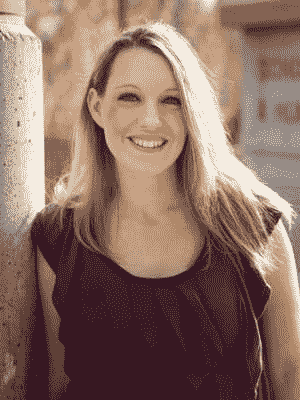

# 谷歌工作场所 GDE·爱丽丝·基勒谈平衡责任和把编码当作自我照顾

> 原文：<https://medium.com/google-developer-experts/google-workplace-gde-alice-keeler-on-balancing-responsibilities-and-using-coding-as-self-care-8ae16bedea99?source=collection_archive---------4----------------------->

*心理健康宣传月期间，GDEs 关于心理健康的两次采访中的第一次*

*作者凯蒂·金德·沃格尔*

*凯文·埃尔南德斯审核*

“我不认为我有工作与生活的平衡，”谷歌职场 GDE·爱丽丝·基勒说。“我可以用一些。我也不太擅长自理……我心目中的美好时光就是编码。”

爱丽丝可能很卑微，但她成功地承担了许多责任。除了她的自由编程工作和她已经出版的[书](https://www.amazon.com/Alice-M.-Keeler/e/B00XAIP6XU/ref=sr_tc_2_0?qid=1506966670&sr=8-2-ent)之外，她有五个孩子，他们都有各种各样的心理健康挑战。爱丽丝是一名教育家，以发布插件、调度程序和谷歌课堂提示而闻名，她教高中高年级学生数学。她说，他们也在精神健康上挣扎，通常是因为贫穷和家庭问题。

“作为一名雇主、母亲和教师，我亲眼目睹了心理健康挑战如何影响人们，但我们希望每个人都振作起来，去工作、上学，并对家庭事件做出回应，”她说。“我真的想了很多，因为我看到了我的家人和学生正在经历的挑战。我努力给别人提供更多的优雅和灵活性。”

她指出心理健康是非常个人化的。“在我生命中最亲近的 20 个人中，没有一个解决方案能适用于所有人，”她说。

**编码为自理**

在爱丽丝的经历中，技术提供了一种自我保健、职业机会和学术支持的方式。“我认为编码的好处之一是，它不一定要在特定的时间完成，可以为人们提供一些灵活的创造性选择，”她说。“我可以凌晨 3 点编码，没人会在意。不是很社交，这对那些纠结于社交期望的人是有帮助的。”

在编码过程中，基勒建立了创造性的解决方案。

“你可以做出非常酷的东西，”她说。“当我用十行代码解决一个问题时，这是一种让我感到被重视的好方式。”

爱丽丝发现 GDE 社区非常支持她，尽管一开始她担心没有人想听她说话。

“我在 GDE 聊天室发帖，人们回复说，‘爱丽丝！’她说。我教数学；我不是全职程序员。我是自学的；我做的每件事，都是我自己想出来的。我不再觉得自己是个骗子了。我已经批准了 14 个附加项目。"

随着时间的推移，她意识到即使是“专家”也在学习。

“你认为每个人都知道一切，但事实并非如此，人们可能被认为是专家，但你可以把他们甚至没有想到的东西放在那里，”她说。“你很快意识到它不像一座塔，你已经到达了顶端，它更像分散的乐高积木:我知道一些这个，一些那个，你知道这个，它是分散的。”

Alice 的编码专业知识源于她为自己和其他教师创建技术解决方案的愿望，这些解决方案可以简化他们的流程并减轻压力。她对教育技术工具充满热情，这些工具可以帮助教师和学生减轻压力，提高幸福感。

**改善福祉的教育技术**

Alice 欣赏让教师和学生的生活更轻松的课堂技术。例如，她将平板电脑称为“特殊教育史上最棒的事情之一”，因为它为面临学习挑战的学生提供了一种分享想法和展示他们对学术材料理解的替代方式。爱丽丝解释说，平板电脑和 Chromebooks 使学生在需要时有更多时间完成作业和评估变得很容易。

“它带来了前所未有的巨大包容性，”她说。“这实际上给了一些孩子发言权；他们可以通过数字方式提交问题和回答，而无需举手。”

作为一名教育工作者、开发人员和家长，Alice 的重点是使用技术来简化任务和平衡责任，这可以减轻压力、提高幸福感，并有益于她的心理健康。在疫情期间，她很感激科技让她能够在线教学、写代码，还能为家人呈现。她有更多的时间去参加孩子们的活动，并能够减轻她的压力。像我们所有人一样，她仍在思考接下来会发生什么，但她致力于支持她所爱的人和学生。

*在爱丽丝的* [*网站*](https://alicekeeler.com/') *或推特*[*@ Alice keeler*](http://twitter.com/alicekeeler)上了解更多关于爱丽丝的信息