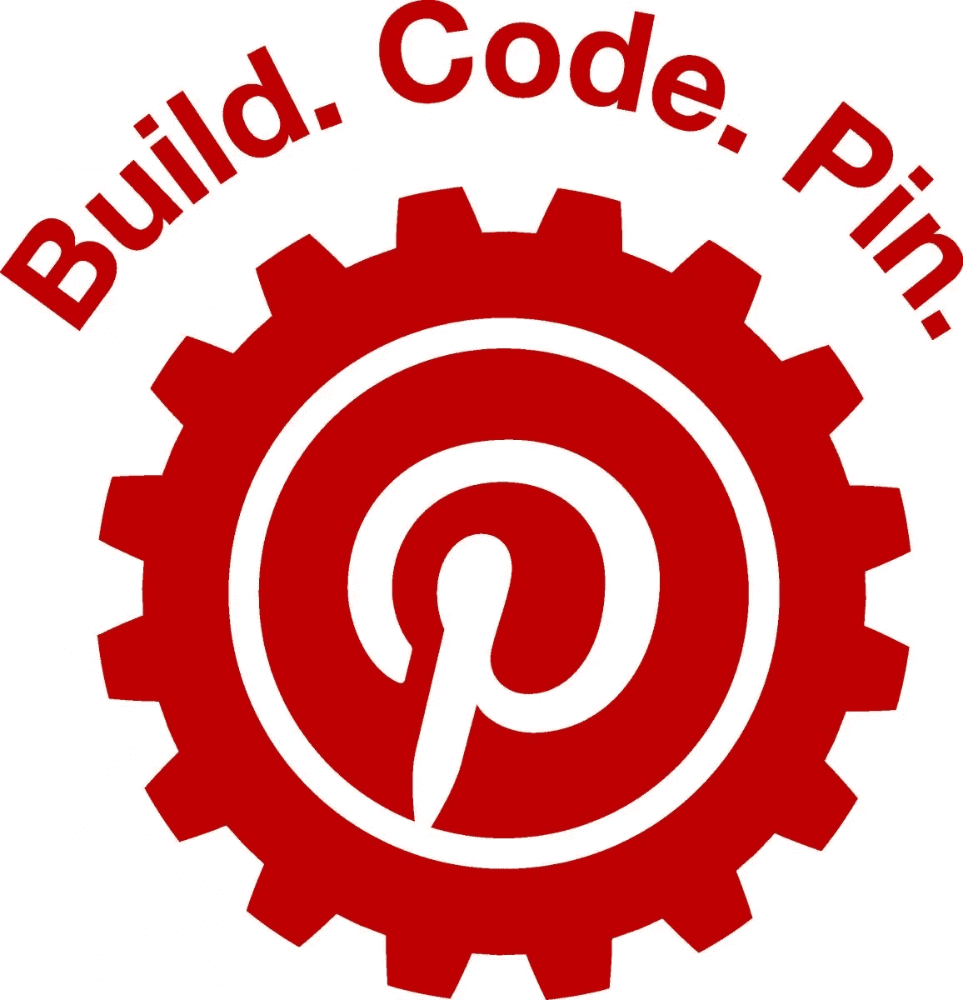

# 格蕾丝·赫柏代码挑战赛遇上 Pinterest API

> 原文：<https://medium.com/pinterest-engineering/grace-hopper-code-challenge-meets-the-pinterest-api-bd5fe86e836e?source=collection_archive---------5----------------------->

Kelsey Stemmler | Pinterest 工程师，合伙人

你会参加今年的格蕾丝·赫柏庆典吗？你喜欢写代码吗？尝试我们的创意和动手代码挑战！

上个月，我们开放了我们的[开发者沙箱](https://engineering.pinterest.com/blog/start-building-pinterest-api)，这样开发者就可以开始构建应用程序和集成，让 pin 变得有生命力。从那以后，成千上万的开发者已经开始为旅行计划、礼物登记等等开发应用程序。现在轮到你了。

我们很乐意让你尝试我们的 [API](https://developers.pinterest.com/docs/api/overview/) ，所以 Pinterest 工程女性的一个小团队组织了一些有趣的挑战！欢迎来到#1014 号展位参加挑战赛，了解您可以利用 Pinterest API 做些什么。完成挑战后，您可以在各种 Pinterest 板上使用您的解决方案代码，或者探索其他 API 端点。一旦您提交了您的解决方案，就可以在展台领取您的特别奖，并分享关于使用 API 的其他方法的想法。

想聊聊代码挑战吗？请在以下时间前往 Pinterest # 1014 展位寻找以下工程师:

2015 年 10 月 14 日星期三

*   下午 5:30—7:00—Kelsey stem ler(合作伙伴和开发人员平台)
*   晚上 7 点— 8 点 30 分—蒂尔德码头(收购)
*   晚上 8:30—10:00—Trisha Quan(约定)

2015 年 10 月 15 日星期四

*   下午 2 点—4 点—伊娃·米洛(收购)

您也可以在 pinterest.com 的 ghc-code-2015 上给我们留言，提出问题。

*鸣谢:非常感谢本文的合著者 Trisha Quan。Trisha 是参与团队的软件工程师。*