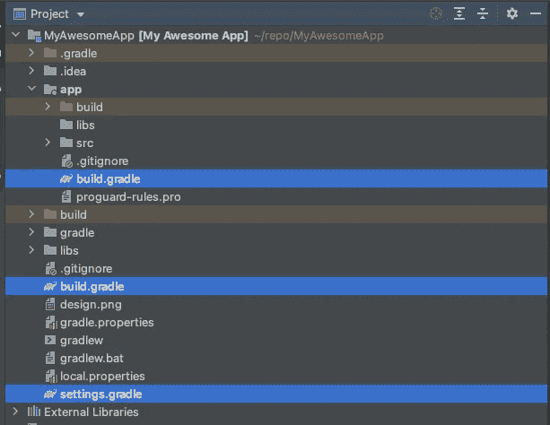
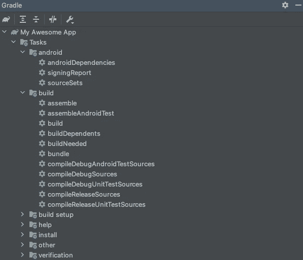
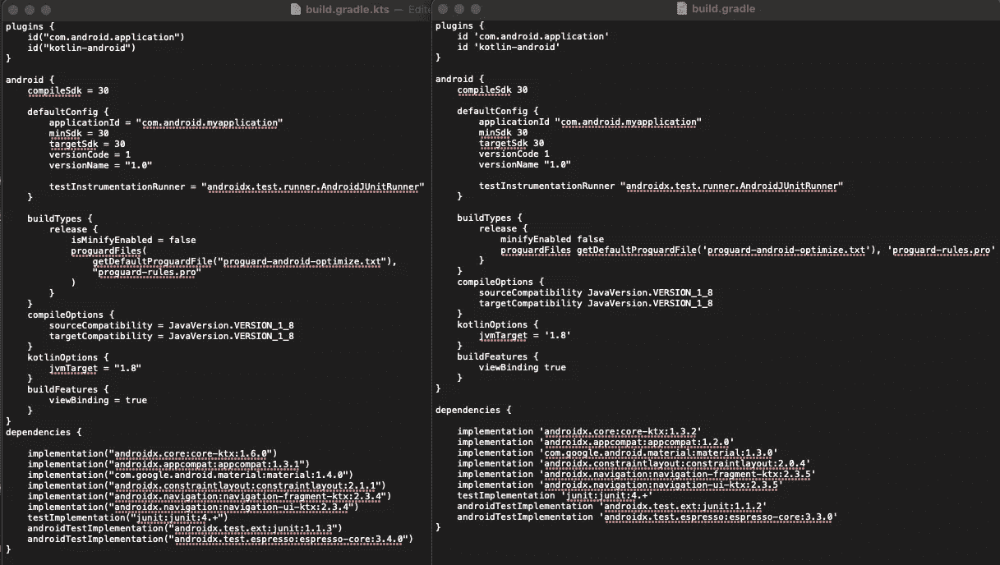

# 格雷德和 AGP 构建 API:配置您的构建

> 原文：<https://medium.com/androiddevelopers/gradle-and-agp-build-apis-configure-your-build-9a10db5b2262?source=collection_archive---------1----------------------->


在关于 [Gradle](https://gradle.org/) 和全新 [Android Gradle 插件 API](https://developer.android.com/reference/tools/gradle-api)的新 MAD 技能系列的第一篇文章中，我们将看看 Android 构建系统是如何工作的，并学习 Gradle 的基础知识。

我们将从 Gradle 的构建阶段开始，讨论 AGP 的配置选项如何帮助定制您的构建，以及如何保持您的构建高效。如果你更喜欢视频形式的内容，可以看看下面的内容:

了解构建阶段如何工作以及如何配置 Android Gradle 插件可以帮助您根据项目需求定制构建。让我们切换到 Android Studio，看看构建系统是如何工作的！

## 格拉德勒简介

Gradle 是一个通用的构建自动化工具。虽然您可以使用 Gradle 来构建 Android 项目，但实际上您可以使用 Gradle 来构建任何类型的软件。

Gradle 支持单个或多个项目构建。要配置一个项目来使用 gradle，您需要在项目文件夹中添加一个`build.gradle`文件。

在多项目层次结构中，根项目由一个`settings.gradle`文件组成，该文件列出了构建中包含的其他项目。Android 使用多项目构建来帮助你模块化你的应用。



Android project structure with build.gradle and settings.gradle files.

由于插件，Gradle 能够处理不同类型的项目，如 Android 或 Java。这些插件带有预定义的功能来配置和构建特定类型的项目。

例如，要构建一个 Android 项目，您需要用 Android Gradle 插件配置您的 Gradle 构建文件。Android Gradle 插件知道如何构建和打包一个 Android 项目，无论是 app 还是库。

## 任务

Gradle 的构建过程围绕着称为任务的工作单元。您可以通过使用终端或在 android studio 的 gradle 窗格中启用任务列表来查看任务列表。



List of Gradle Tasks

这些任务接收输入，采取行动执行某些工作，并作为它们执行的行动的结果产生输出。

Android Gradle 插件定义了自己的任务，并且知道这些任务需要以什么顺序运行来构建一个 Android 项目。

Gradle 构建文件由不同的部分组成。配置语法被称为 [Gradle DSL](https://docs.gradle.org/current/dsl/index.html) ，为开发者定义了一种配置插件的方式。Gradle 解析`build.gradle`文件中的 android DSL 块，创建`ApplicationExtension`、`BuildType`等 AGP DSL 对象。

一个典型的 Android 项目有一个顶级的 Gradle 构建文件。android 项目中的每个模块都有一个单独的 Gradle 构建文件。在这个项目中，我有一个单独的应用程序模块。

在模块级`build.gradle`文件中，我需要声明并应用构建项目所需的插件。为了告诉 Gradle 我正在构建一个 Android 项目，我需要应用`com.android.application`或`com.android.library`插件。这些插件分别定义了如何配置和构建 android 应用程序或库。在这种情况下，我正在构建一个 Android 应用程序项目，所以我需要应用`com.android.application`插件。在这个示例中，还应用了`kotlin.android`插件，因为我将使用 Kotlin。

```
plugins **{** id 'com.android.application'
    id 'org.jetbrains.kotlin.android'
**}**
```

Android Gradle Plugin 提供了自己的 DSL，您可以使用它来配置它，并在构建期间将此配置提供给任务。

要配置 Android Gradle 插件，需要使用`android`块。在这个模块中，您可以为不同的构建类型(如`debug`或`release`)定义 sdk 和工具版本、应用程序细节和其他配置。如果您想了解更多关于 gradle 如何使用这些信息来创建变体，以及您可以使用哪些其他选项，请查看[构建文档](https://developer.android.com/studio/build)。

```
android **{** compileSdk 31

    defaultConfig **{** applicationId "com.example.myapp"
        minSdk 21
        targetSdk 31
        versionCode 1
        versionName "1.0"

        testInstrumentationRunner "androidx.test.runner.AndroidJUnitRunner" **}** buildTypes **{** release **{** minifyEnabled false
            proguardFiles getDefaultProguardFile('proguard-android-optimize.txt'), 'proguard-rules.pro'
        **}
    }** compileOptions **{** sourceCompatibility JavaVersion.*VERSION_1_8* targetCompatibility JavaVersion.*VERSION_1_8* **}** kotlinOptions **{** jvmTarget = '1.8'
    **}
}**
```

在下一节中，您可以定义依赖关系。Gradle 的依赖管理支持与 Maven 和 Ivy 兼容的库，以及来自文件系统的本地二进制文件。

```
dependencies **{** implementation 'androidx.core:core-ktx:1.7.0'
    implementation 'com.google.android.material:material:1.4.0'
    implementation 'androidx.lifecycle:lifecycle-runtime-ktx:2.4.0'
    testImplementation 'junit:junit:4.13.2'
    androidTestImplementation 'androidx.test.ext:junit:1.1.3'
    androidTestImplementation 'androidx.test.espresso:espresso-core:3.4.0'

**}**
```

## 构建阶段

Gradle 分三个阶段评估和运行构建。[初始化、配置和执行](https://docs.gradle.org/current/userguide/build_lifecycle.html)。

在初始化阶段，Gradle 决定构建中包含哪些项目，并为每个项目创建一个`Project`实例。为了决定构建中包含哪些项目，Gradle 首先查找`settings.gradle`文件，以决定是单项目构建还是多项目构建。

在配置阶段，Gradle 评估构建中包含的项目的所有构建脚本，应用插件，使用 DSL 对象配置构建，最后惰性地注册任务及其输入。

请注意，无论请求运行哪个任务，配置阶段都会运行。为了保持您的构建简短高效，请避免在配置阶段执行任何耗时的操作。

最后，在执行阶段，Gradle 执行构建所需的任务集。

在下一篇文章中，我们将在编写我们自己的插件时更仔细地研究这些阶段。

Gradle DSL 支持 Groovy 和 Kotlin 脚本构建文件。到目前为止，我使用 Groovy DSL 脚本来配置这个项目的构建。您可以在下面的 Kotlin 和 Groovy 脚本中看到相同的构建文件。注意 kotlin 脚本的文件名。kts 后缀。



Kotlin and Groovy script side by side.

从 groovy 迁移到 Kotlin 或者相反，都不会改变执行任务的方式。

## 摘要

就这样，至少对于这篇文章来说是这样。Gradle 和 Android Gradle 插件有许多功能，允许你定制你的构建。在本文中，您了解了 Gradle 任务的基础知识、构建阶段、如何配置 AGP 以及如何使用 DSL 定制您的构建。

接下来，你将看到如何使用 AGP 的变体 API 通过编写你自己的插件来扩展你的构建。