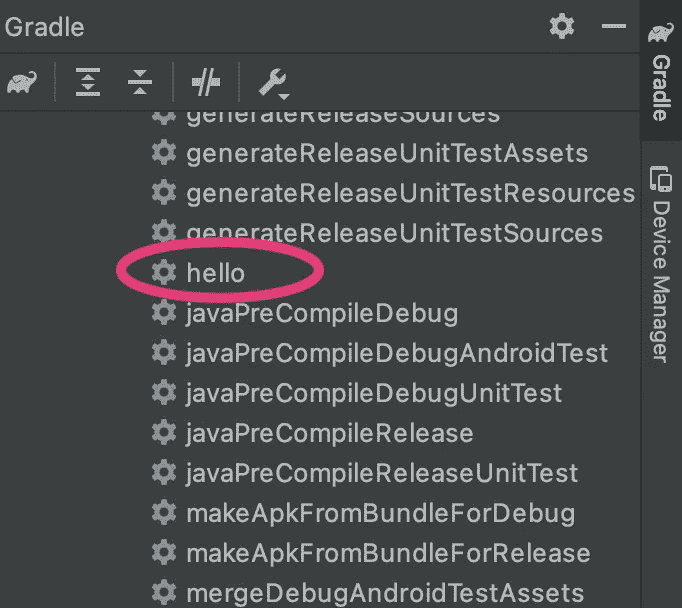
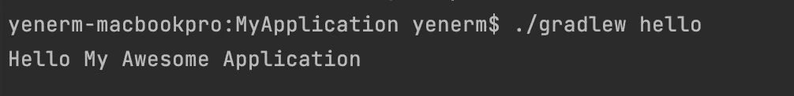
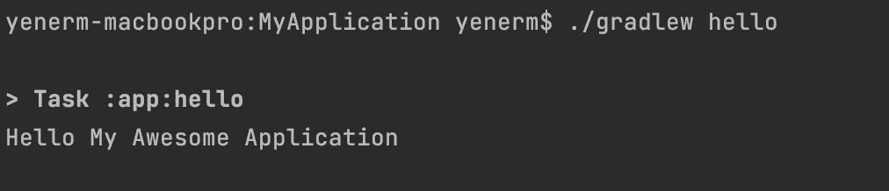

# 格雷尔和 AGP 构建 API:如何编写插件

> 原文：<https://medium.com/androiddevelopers/gradle-and-agp-build-apis-how-to-write-a-plugin-1695b590e4ec?source=collection_archive---------3----------------------->


这是这个 MAD 技能系列的第二篇文章。在[上一篇文章](/androiddevelopers/gradle-and-agp-build-apis-configure-your-build-9a10db5b2262)中，你已经看到了 Gradle 的基础知识以及如何配置 Android Gradle 插件。在本文中，您将学习如何通过编写自己的插件来扩展您的构建。如果你更喜欢看这些内容而不是阅读，看看下面的视频:

从 7.0 版本开始，Android Gradle 插件现在提供了稳定的扩展点来操作变体配置和生成的构建工件。该 API 的某些部分最近才最终确定，所以在本文中我将使用 AGP 的 7.1 版本(在撰写本文时处于测试阶段)。

## 梯度任务

我将开始一个新的清洁项目。如果您想继续，您可以通过选择基本活动模板来创建一个新项目。

让我们先创建一个任务并打印出来，猜猜是什么， *hello world* 。为此，在应用程序级`build.gradle.kts`文件中，我将注册一个新任务，并将该任务命名为“ *hello* ”。

`tasks.register(“hello”){ }`

好了，现在任务已经准备好了，让我们打印出 hello 并添加项目名称。注意这个`build.gradle.kts`文件属于 app 模块，所以`project.name`将返回这个模块的名称，即“ *app* ”。相反，我将使用`project.parent?.name`，它返回项目的名称。

```
tasks.register("hello"){
    **println("Hello " + project.parent?.name)**
}
```

现在是运行任务的时候了。查看任务列表，我可以看到我的新任务列在这里。



The new task is listed in Gradle pane in Android Studio

我可以双击 hello 任务或通过终端执行该任务，并在构建输出中看到 hello 消息。



The task prints hello message in the build output

当我检查日志时，我可以看到这条消息是在配置阶段打印的。配置阶段实际上不是执行任务功能，就像本例中打印 Hello World 一样。配置阶段是配置任务以影响其执行的时间。您可以告诉任务输入、参数和输出的位置。

无论请求运行哪个任务，配置阶段都会运行。在配置阶段运行耗时的代码会导致很长的配置时间。

任务执行应该只发生在执行阶段，所以我们需要将这个打印调用移到执行阶段。为此，我可以添加`doFirst()`或`doLast()`，它们将分别在执行阶段的开始或结束时打印 hello 消息。

```
tasks.register("hello"){
    **doLast {**
        println("Hello " + project.parent?.name)
    **}**
}
```

当我再次运行该任务时，这一次我可以看到在执行阶段打印了 hello 消息。



The task now prints the hello message in execution phase

现在我的定制任务位于`build.gradle.kts`文件中。向`build.gradle`文件添加定制任务是创建定制构建脚本的一种简单方法。然而，随着我的插件代码变得越来越复杂，这并不能很好地扩展。我们建议将自定义任务和插件实现放在一个`buildSrc`文件夹中。

## 在 buildSrc 中实现插件

在编写更多代码之前，让我们将我的 hello 任务移到`buildSrc`。我将创建一个新文件夹，命名为`buildSrc`。接下来，我为插件项目创建一个`build.gradle.kts`文件，这样 Gradle 会自动将这个文件夹添加到构建中。

这是根项目文件夹中的顶级目录。注意，我不需要将它作为一个模块添加到我的项目中。Gradle 会自动编译这个目录中的代码，并将其放入您的构建脚本的类路径中。

接下来，我创建一个新的 src 文件夹和一个名为`HelloTask`的新类。我将这个新类转换成一个`abstract`类并扩展`DefaultTask`。接下来，我将添加一个名为`taskAction`的新函数，用`@TaskAction`注释来注释这个函数，并将我的自定义任务代码从`build.gradle.kts`移到这个函数中。

```
abstract class HelloTask: DefaultTask() {    
    @TaskAction
    fun taskAction() {
        println("Hello \"${project.parent?.name}\" from task!")
    }
}
```

现在我的任务已经准备好了，我将创建一个新的插件类，它需要实现`Plugin`并覆盖`apply()`函数。Gradle 将调用这个函数并传入`Project`对象。为了注册`HelloTask`，我将在`project.tasks`上调用`register()`，并给这个新任务命名。

```
class CustomPlugin: Plugin<Project> {
    override fun apply(project: Project) {
        project.tasks.register<HelloTask>("hello")
    }
}
```

此时，我还可以声明我的任务依赖于另一个任务。

```
class CustomPlugin: Plugin<Project> {
    override fun apply(project: Project) {
        project.tasks.register<HelloTask>("hello"){
            **dependsOn("build")**
        }
    }
}
```

接下来，让我们应用新的插件。注意，如果我的项目有不止一个模块，我可以通过将它添加到其他`build.gradle`文件中来重用这个插件。

```
plugins {
    id ("com.android.application")
    id ("org.jetbrains.kotlin.android")
}**apply<CustomPlugin>()**android {
   ...
}
```

现在我将执行`hello`任务，并观察我的插件像以前一样工作。

`./gradlew hello`

现在我把我的任务转移到了`buildSrc`，让我们更进一步，发现新的 Android Gradle 插件 API。AGP 在构建工件时提供了生命周期的扩展点。

从变体 API 开始，让我们首先讨论什么是[变体](https://developer.android.com/studio/build/build-variants)。变体是您可以构建的应用程序的不同版本。比方说，除了一个全功能的应用程序之外，你还想为你的应用程序构建一个演示版本或者一个内部版本用于调试。您还可以针对不同的 API 级别或设备类型。变体是通过组合构建类型(如`debug`和`release`)和构建脚本中定义的产品风格来创建的。

在构建文件中使用声明性 DSL 来添加构建类型是非常好的。然而，在代码中这样做给了你的插件一种影响构建的方式，这种方式用声明性语法是不可能或难以表达的。

AGP 通过解析构建脚本和在`android`块中设置的属性开始构建。新的变体 API 回调允许我从`androidComponents`扩展添加一个`finalizeDSL()`回调。在这个回调中，我可以在 DSL 对象用于变量创建之前对它们进行更改。我将创建一个新的构建类型并设置它的属性。

```
val extension = project.extensions.getByName(
    "androidComponents"
) as ApplicationAndroidComponentsExtension

extension.**finalizeDsl** { ext->
    ext.buildTypes.create("staging").let { buildType ->
        buildType.initWith(ext.buildTypes.getByName("debug"))
        buildType.manifestPlaceholders["hostName"] = "example.com"
        buildType.applicationIdSuffix = ".debugStaging"
    }
}
```

注意，在这个阶段，我可以创建或注册新的构建类型并设置它们的属性。在这个阶段的最后，AGP 将锁定 DSL 对象，因此它们不能被更改。如果我再次运行构建，我可以看到应用程序的一个临时版本已经构建好了。

现在，假设我的一个测试失败了，我想禁用单元测试来构建一个内部版本来找出问题所在。

要禁用单元测试，我可以使用`beforeVariants()`回调，它允许我通过`VariantBuilder`对象进行这样的更改。这里我将检查当前的变体是否是我为`staging`创建的。接下来，我将禁用单元测试并设置一个不同的`minSdk`版本。

```
extension.**beforeVariants** { variantBuilder ->
    if (variantBuilder.name == "staging") {
        variantBuilder.enableUnitTest = false
        variantBuilder.minSdk = 23
    }
}
```

在这个阶段之后，将要创建的组件和工件的列表现在已经最终确定了！

您可以在下面找到这个示例的完整代码清单。此外，如果你想看到更多这样的样本，请务必查看 Github 上的 [gradle-recipes repo](https://github.com/android/gradle-recipes) 。

## 摘要

编写您自己的插件，让您扩展 Android Gradle 插件，并根据您的项目需求定制您的构建！

在本文中，您已经看到了如何使用新的变体 API 在`AndroidComponentsExtension`中注册回调，使用 DSL 对象来初始化变体，影响哪些变体被创建，以及它们在`beforeVariants()`中的属性。

在下一篇文章中，我们将进一步介绍工件 API，并向您展示如何从您的定制任务中读取和转换工件！